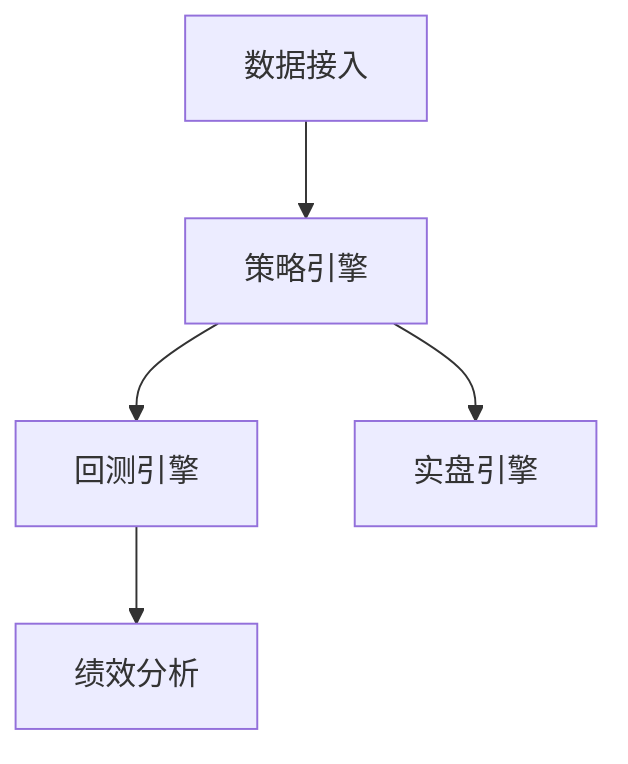

# 7 维度深挖框架

> 所有 position paper 必须按这 7 维度填写（缺一不可）。第 6 维"致命缺陷自述"是反偏见核心设计。

---

## 维度一览

| # | 维度 | 内容 | 强制性 |
|---|------|------|:-----:|
| 1 | 架构总览 | Mermaid 图 + 主目录结构 | ★ |
| 2 | 核心能力清单 | 项目实际做了什么（按功能列举）| ★ |
| 3 | 数据模型 | 关键类 / 表 / 接口 | ★ |
| 4 | 扩展点 | 设计上预留的 hook / 插件位 / 配置入口 | ★ |
| 5 | 改造成本估算 | fork 后改造为目标产品需要动多少代码 | ★ |
| 6 | ⭐ **致命缺陷自述** | 我的项目最大的 3 个缺陷 | ★★ |
| 7 | 与其他候选的集成可行性 | vs Other_1 / Other_2 | ★ |

---

## 维度 1：架构总览

**目的**：让 Lead 法官 5 分钟看懂这个项目的骨架。

**必填内容**：
- Mermaid 架构图（不超过 15 个节点）
- 主目录结构（树形，深度 ≤ 3 层）
- 核心模块的一句话定位

**示例**：
```markdown
### 1. 架构总览



主目录结构：
- `data/` 数据接入层（AKShare 适配器）
- `strategy/` 策略基类与样例
- `engine/` 回测/实盘引擎
- `reporting/` 绩效报告生成
```

**反模式**：贴 50 行的目录树、Mermaid 图超过 30 节点。

---

## 维度 2：核心能力清单

**目的**：让法官知道"这个项目实际做了什么"——不是 README 吹的，是代码里真有的。

**必填内容**：
- 按功能列举（5-10 条）
- 每条标注"成熟度"：稳定 / Beta / 实验

**示例**：
```markdown
### 2. 核心能力清单

- ✅ 稳定：日线级回测（A 股全市场）
- ✅ 稳定：双均线/MACD/Bollinger 等 12 个内置策略
- 🟡 Beta：分钟级回测（仅支持 5min/15min）
- 🟡 Beta：实盘对接（仅雪球模拟盘）
- 🔬 实验：LLM 策略生成（基于 GPT-3.5，效果一般）
- ❌ 未实现：组合优化
- ❌ 未实现：风控模块
```

**反模式**：照搬 README 的 features 列表（README 通常夸大），不给成熟度。

---

## 维度 3：数据模型

**目的**：让法官判断"数据层能不能拉通"——这是多项目复合时的关键卡点。

**必填内容**：
- 关键类 / 表 / 接口（5-10 个）
- 字段层级（如果是数据库表）
- 序列化格式（JSON / Protobuf / 自定义）

**示例**：
```markdown
### 3. 数据模型

核心类：
- `Bar`: 单根 K 线（date, open, high, low, close, volume）
- `Order`: 订单（symbol, direction, qty, price, status, ts）
- `Position`: 持仓（symbol, qty, avg_cost, current_value）
- `Account`: 账户（cash, positions, equity_curve）

数据库表（SQLite）：
- `historical_bars`: 历史行情
- `backtest_results`: 回测结果

序列化：纯 Pickle（⚠️ 不跨语言）
```

**反模式**：只写类名不写字段；不指出 schema 风险。

---

## 维度 4：扩展点

**目的**：让法官判断"加我自己的功能容易吗"。

**必填内容**：
- 设计上预留的扩展机制（继承基类 / 插件 / 配置入口）
- 实际改造时的难度评估
- 隐藏的"反扩展点"（说扩展但实际硬编码的地方）

**示例**：
```markdown
### 4. 扩展点

✅ 良好扩展：
- 策略：继承 `BaseStrategy` 即可
- 数据源：继承 `BaseDataSource` 即可（已有 AKShare、Tushare 示例）

⚠️ 难扩展：
- 撮合规则：硬编码在 `Engine.match_order()` 中，要改得动核心代码
- 时间循环：硬编码"按日循环"，改成 tick 级需要重写引擎

❌ 反扩展点：
- 配置文件用 hardcoded YAML 路径，无环境变量覆盖
- 日志系统硬绑 print()，无 logger 注入
```

**反模式**：只夸"高度可扩展"，不指出反扩展点。

---

## 维度 5：改造成本估算

**目的**：给法官**可量化**的决策依据。

**必填内容**：
- 需改造模块列表
- 估算人日（区间，如 5-8 人日）
- 风险点（哪些改造可能爆雷）

**示例**：
```markdown
### 5. 改造成本估算

fork 此项目改造为目标产品（A 股盯盘 AI 助手）需要：

| 改造项 | 估算人日 | 风险 |
|--------|:-------:|------|
| 加 Tushare 备线数据源 | 2-3 | 低（有扩展基类）|
| 改造分钟级回测 | 5-8 | ⚠️ 高（硬编码"按日循环"）|
| 加飞书推送 | 1-2 | 低 |
| 替换前端为 Next.js | 8-12 | ⚠️ 中（旧前端用 Vue2，重写）|
| 接入 LLM Function Calling | 3-5 | 中（要重新设计 prompt 流）|

**总估算：19-30 人日**

**主要风险**：分钟级回测改造可能比预估更费力——核心引擎硬编码"按日"，
触及面广。如果实际开发遇阻可能需要 +10 人日。
```

**反模式**：估算"3 个月"不拆分；不写风险。

---

## 维度 6：⭐ 致命缺陷自述（强制必填）

**目的**：**反偏见核心设计**。强制 paper 作者自报项目最大问题。

**为什么必须自报**：
- 红队和其他代言人迟早会挖出来
- 自报永远比被对方挖出更好——至少能控制叙事
- 不报会被 Lead 法官视为"失职 / 不诚实"，整份 paper 信用打折

**必填格式**：列出 3 个缺陷，每个带证据。

**示例**：
```markdown
### 6. ⭐ 致命缺陷自述（强制）

我（代言人 A）必须诚实自报项目 daily_stock_analysis 的 3 个最大缺陷：

**缺陷 1**：最后一次 commit 是 2025-08（半年前），社区活跃度低
- 证据：GitHub commits 页面 / Issue 平均响应时间 14 天
- 影响：bug 修复主要靠自己 fork，不能指望上游

**缺陷 2**：撮合引擎硬编码"次日开盘价"，无法切换其他撮合规则
- 证据：`engine.py` line 142
- 影响：如果产品定位要做"高级撮合模拟"，要重写核心

**缺陷 3**：测试覆盖率 18%（实测）
- 证据：`coverage` 工具输出
- 影响：fork 后改造时回归风险高，需要先补测试
```

**反模式**：
- 缺失这一节 → paper 直接失职
- 写"暂未发现明显缺陷" → 等于没报
- 只报无关痛痒的小问题（"文档英文不全"）→ Lead 法官识破

---

## 维度 7：与其他候选项目的集成可行性

**目的**：评估"如果不单 fork，能不能和别人复合"。

**必填内容**：
- 对每个其他候选项目（Other_1 / Other_2 / ...）逐一评估
- 三档结论：能配合 / 互斥 / 部分集成
- 简短理由（≤ 100 字 / 项）

**示例**：
```markdown
### 7. 与其他候选项目的集成可行性

- **vs 项目 vnpy（Other_1）**：
  - 结论：**互斥**
  - 理由：vnpy 用 PyQt 桌面框架，本项目用 Web 架构，前端层完全不兼容；
    数据模型也不同（vnpy 用 BarData 含 exchange 字段，本项目无）

- **vs 项目 Qbot（Other_2）**：
  - 结论：**部分集成**
  - 理由：Qbot 的 Telegram bot 模块可以独立拿来用（设计成 plugin），
    其他模块互斥（Qbot 用 ccxt 偏数字货币）

- **vs 项目 backtrader-cn（Other_3）**：
  - 结论：**能配合**
  - 理由：双方都基于 pandas，数据模型可通过 adapter 层拉通；
    backtrader-cn 的撮合引擎可以替换掉本项目硬编码的撮合
```

**反模式**：所有项目都标"互斥"（说明没认真评估）、不给理由。

---

## paper 完整骨架

把 7 维度组合成完整的 position paper：

```markdown
# Position Paper: {PROJECT_NAME}
代言人：{Teammate Name}
项目：{PROJECT_NAME}（{GitHub URL}）
目标产品：{PROJECT_DEFINITION}

## 1. 架构总览
...

## 2. 核心能力清单
...

## 3. 数据模型
...

## 4. 扩展点
...

## 5. 改造成本估算
...

## 6. ⭐ 致命缺陷自述（强制）
...

## 7. 与其他候选项目的集成可行性
...

## 总结：为什么 fork 这个项目是最优解
（基于上面 7 维度的综合论证，≤ 500 字）
```

---

## Lead 法官如何利用 7 维度判决

Phase 3 综合判决时，Lead 按以下顺序看 7 维度：

1. **维度 5（改造成本）** + **维度 6（致命缺陷）** → 否决线（成本过高或缺陷致命直接淘汰）
2. **维度 2（核心能力）** + **维度 4（扩展点）** → 适配度评分
3. **维度 7（集成可行性）** → 决定是否走多项目复合
4. **维度 1 + 3（架构 + 数据模型）** → 验证前面结论的工程实证

Lead **禁止**只看维度 5（成本）就拍板——必须 7 维度综合。

---

## 关于其他场景（非 fork 选型）的维度调整

7 维度框架默认是为"开源项目 fork 选型"设计的。其他场景需要适配：

| 场景 | 维度 1-7 如何调整 |
|------|-----------------|
| SaaS 选型（如 Vercel vs Netlify）| 维度 1 改"产品功能图"；维度 3 改"API/数据导出"；维度 5 改"迁移成本"；其他类似 |
| 库选型（如 LangChain vs LlamaIndex）| 维度 4 改"插件生态"；维度 5 改"学习曲线 + 集成成本"；维度 7 评估"与其他库的互操作" |
| 技术栈选型（React vs Vue）| 维度 2 改"生态规模"；维度 4 改"工具链丰富度"；维度 5 改"招聘难度"；维度 7 改"与现有技术栈共存可能性" |
| 架构方案选型（Monolith vs Microservices）| 维度 1 改"系统拓扑图"；维度 3 改"通信协议"；维度 5 改"运维复杂度" |

具体调整由 Lead 在 Phase 0 时根据场景类型决定，并在 `00-任务分配.md` 中说明本次的 7 维度具体含义。
