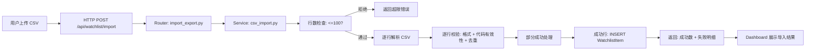
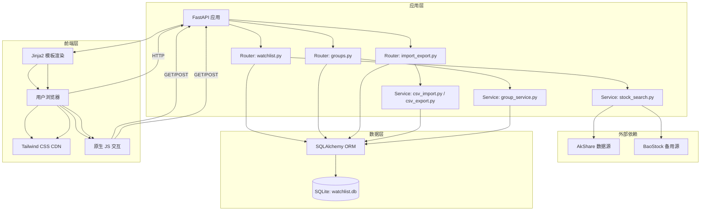

# Implementation Plan: 自选股管理

**Feature**: 001-stock-management | **Date**: 2026-05-26 | **Spec**: [spec.md](spec.md)  
**Input**: Feature specification from `specs/001-stock-management/spec.md`

---

## Summary

自选股管理是系统的数据入口和基础数据层。本计划涵盖：股票搜索与添加、CSV 批量导入/导出、分组 CRUD、持仓成本管理、以及单只股票删除与批量删除。实现一个基于 FastAPI + SQLAlchemy + SQLite 的 Web API 层，配合 Jinja2 服务端渲染 + Tailwind CSS 前端（设计参考：`design-reference/stitch-export/watchlist_management_a_share_ai_monitor/code.html`），支撑 Dashboard 的自选股展示与操作。

---

## Technical Context

**Language/Version**: Python 3.11+  
**Primary Framework**: FastAPI 0.110+（异步 Web 框架，自动 OpenAPI 文档生成）  
**ORM**: SQLAlchemy 2.0+（声明式模型，兼容 SQLite 和后续 PostgreSQL 迁移）  
**Data Validation**: Pydantic 2.0+（请求/响应模型校验）  
**Storage**: SQLite 3.39+（MVP 单用户零配置方案，通过 SQLAlchemy 抽象后续可无缝迁移 PostgreSQL）  
**Template Engine**: Jinja2 3.1+（Dashboard HTML 渲染）  
**CSS Framework**: Tailwind CSS 3.4+（CDN 引入，设计系统参考 `design-reference/DESIGN.md`）  
**Icons**: Material Symbols Outlined（Google Fonts CDN）  
**Fonts**: Hanken Grotesk（标题）、JetBrains Mono（数据/价格）、Inter（正文）  
**Server**: Uvicorn 0.27+（ASGI 服务器）  
**Testing**: pytest 8.0+ + httpx 0.27+（异步测试客户端）  
**Target Platform**: Linux Docker 容器（Alpine 或 slim 基础镜像）  
**Project Type**: Web application（后端 API + 服务端渲染前端，Jinja2 + Tailwind CSS）  
**Performance Goals**: 自选股列表查询 p95 < 200ms，批量导入 20 只 < 10s  
**Constraints**: 单进程单用户架构，自选股上限 100 只，CSV 单次上限 100 行  
**Scale/Scope**: 个人级部署，单用户并发，100 只自选股 × 不限制分组数量

---

## Constitution Check

*本项目暂无 constitution.md，跳过宪法检查。*

---

## Project Structure

### Documentation (this feature)

```text
specs/001-stock-management/
├── spec.md              # 功能规格说明书
├── plan.md              # 本文件（技术方案）
└── checklists/
    └── requirements.md  # 规格质量检查清单
```

### Source Code (repository root)

```text
AlphaProject/
├── app/
│   ├── __init__.py
│   ├── main.py                 # FastAPI 应用入口，注册路由和中间件
│   ├── config.py               # 配置加载（环境变量、路径、上限常量）
│   ├── database.py             # SQLAlchemy 引擎、SessionLocal、表创建
│   ├── dependencies.py         # 依赖注入（DB session、配置等）
│   ├── models/
│   │   ├── __init__.py
│   │   ├── base.py             # 声明式基类 + 公共字段混入
│   │   ├── stock.py            # Stock 模型：代码、名称、市场、板块、状态
│   │   ├── watchlist.py        # WatchlistItem 模型：分组关联、成本、股数、添加时间
│   │   └── group.py            # Group 模型：分组名称、创建时间、默认分组标记
│   ├── routers/
│   │   ├── __init__.py
│   │   ├── watchlist.py        # 自选股 CRUD 路由：添加、列表、删除、编辑、搜索
│   │   ├── groups.py           # 分组管理路由：创建、重命名、删除、列表
│   │   └── import_export.py    # CSV 导入/导出路由：上传解析、下载生成
│   ├── services/
│   │   ├── __init__.py
│   │   ├── stock_search.py     # 股票搜索服务：AkShare 查询、代码验证、名称模糊匹配
│   │   ├── csv_import.py       # CSV 导入服务：解析、校验、部分成功处理
│   │   ├── csv_export.py       # CSV 导出服务：数据查询、CSV 生成
│   │   └── group_service.py    # 分组业务服务：删除时股票归属处理
│   ├── schemas/
│   │   ├── __init__.py
│   │   ├── watchlist.py        # Pydantic 模型：请求/响应/校验规则
│   │   ├── group.py            # Pydantic 模型：分组请求/响应
│   │   └── stock.py            # Pydantic 模型：股票信息/搜索结果
│   ├── static/
│   │   ├── css/
│   │   │   └── watchlist.css   # 自选股页面专用样式（响应式、hover 效果）
│   │   └── js/
│   │       └── watchlist.js    # 批量选择、分组切换、行内编辑交互
│   └── templates/
│       ├── base.html           # 基础布局模板：HTML5 骨架 + Tailwind CDN + Google Fonts + Material Symbols
│       ├── watchlist/
│       │   ├── list.html       # 自选股列表主页面：SideNavBar + TopNavBar + FilterSidebar + StockDataTable + EmptyState
│       │   ├── add_modal.html  # 添加股票弹窗（CommandBar 搜索 + 分组选择）
│       │   └── edit_modal.html # 编辑持仓信息弹窗（成本/股数编辑）
│       ├── groups/
│       │   └── manage.html     # 分组管理页面（CRUD + 删除确认弹窗）
│       └── components/
│           ├── side_nav.html        # SideNavBar 组件（导航菜单 + AI 简报按钮）
│           ├── top_nav.html         # TopNavBar 组件（CommandBar 搜索框 + 通知 + 用户头像）
│           ├── filter_sidebar.html  # FilterSidebar 组件（分组列表 + 新建分组）
│           ├── stock_table.html     # StockDataTable 组件（表头控制 + 数据表格 + 批量操作）
│           ├── stock_table_row.html # StockDataTable 行组件（代码/名称 + 分组标签 + 价格/成本/盈亏 + 迷你趋势图 + 操作按钮）
│           ├── empty_state.html     # EmptyState 组件（空自选股引导页）
│           ├── alert_badge.html     # AlertBadge 组件（触及目标/预警标签）
│           └── metric_tag.html      # MetricCard(Tag) 组件（分组标签样式）
├── data/
│   └── watchlist.db            # SQLite 数据库文件（gitignored）
├── tests/
│   ├── conftest.py             # pytest  fixtures：测试客户端、内存数据库
│   ├── unit/
│   │   ├── test_models.py      # 模型层单元测试
│   │   ├── test_schemas.py     # Pydantic 校验测试
│   │   ├── test_csv_import.py  # CSV 解析/校验测试
│   │   └── test_csv_export.py  # CSV 生成测试
│   └── integration/
│       ├── test_watchlist_api.py   # 自选股 API 端到端测试
│       ├── test_groups_api.py      # 分组 API 端到端测试
│       └── test_import_export.py   # 导入导出 API 端到端测试
├── docker-compose.yml          # 开发环境编排
├── Dockerfile                  # 应用容器镜像
├── requirements.txt            # Python 依赖
├── .env.example                # 环境变量模板
└── alembic/                    # 数据库迁移（预留，MVP 初期可用手动建表）
    └── versions/
```

**结构决策说明**:
- 采用标准三层架构（Router → Service → Model），Service 层承载业务逻辑，便于后续 feature 复用
- models/ 使用 SQLAlchemy 2.0 声明式风格，为后续 SQLAlchemy Async 迁移预留接口
- routers/ 按资源划分（watchlist, groups, import_export），符合 RESTful 设计
- schemas/ 独立存放 Pydantic 模型，与 SQLAlchemy 模型分离，避免循环依赖
- templates/ 使用 Jinja2 服务端渲染 + Tailwind CSS CDN，纯 CSS 交互（hover、transition），无需前端构建工具链
- 组件化模板：每个 UI 组件独立为 Jinja2 macro/ include，便于在 Dashboard 复用
- 设计系统严格遵循 `design-reference/DESIGN.md` 的配色、字体、间距规范

---

## Frontend Design

本章节定义自选股管理模块的前端 UI 设计，基于 `design-reference/DESIGN.md` 设计系统和 `design-reference/stitch-export/watchlist_management_a_share_ai_monitor/code.html` 视觉参考样本。

### 页面布局

自选股列表页采用 **12 列固定网格** 布局（DESIGN.md §Layout & Spacing）：
- **Desktop**: SideNavBar（固定宽 256px）+ Main Content Area（flex-1，1280px 居中）
- **Main Content**: TopNavBar（sticky，高 64px）+ Page Content（可滚动）
- **Page Content**: Header Section（标题 + 操作按钮）+ Main Workspace Grid（12 列）
  - Filter Sidebar：`col-span-12 md:col-span-3 lg:col-span-2`
  - Data Table Area：`col-span-12 md:col-span-9 lg:col-span-10`

### 组件清单

| 组件名 | 类型 | 对应 DESIGN.md 章节 | 视觉参考样本路径 |
|:---|:---|:---|:---|
| SideNavBar | 布局组件 | §Layout & Spacing（导航栏） | `design-reference/stitch-export/watchlist_management_a_share_ai_monitor/code.html` L121-153 |
| TopNavBar | 布局组件 | §Layout & Spacing（顶部栏） | 同上 L157-179 |
| CommandBar | 输入组件 | §Components / Input Forms (Command Bar) | 同上 L159-161 |
| FilterSidebar | 导航组件 | §Layout & Spacing（侧边栏） | 同上 L196-219 |
| StockDataTable | 数据组件 | §Components / Stock Data Tables | 同上 L247-359 |
| MetricTag | 标签组件 | §Components / Metric Cards（标签变体） | 同上 L275-276, L307-308 |
| AlertBadge | 状态组件 | §Components / Alert Badges | 同上 L349 |
| Checkbox | 表单组件 | §Components / Checkboxes | 同上 L251-252, L266-267 |
| EmptyState | 空状态组件 | —（页面级空状态） | 同上 L365-378（注释区） |
| MiniSparkline | 图表组件 | §Components / Stock Data Tables（Mini-Charts） | 同上 L281-286, L313-318 |

### 设计 Token 映射

| Token 类别 | 设计值 | Tailwind 类名 |
|:---|:---|:---|
| Background | `#11131c` | `bg-background` |
| Surface Base | `#0F172A` | `bg-surface-base` |
| Surface Raised | `#1E293B` | `bg-surface-raised` |
| Primary | `#b7c4ff` | `text-primary` / `bg-primary` |
| Primary Container | `#0052ff` | `bg-primary-container` |
| Market Up | `#F43F5E` | `text-market-up` |
| Market Down | `#10B981` | `text-market-down` |
| Market Warning | `#F59E0B` | `text-market-warning` |
| On Surface | `#e1e1ef` | `text-on-surface` |
| On Surface Variant | `#c3c5d9` | `text-on-surface-variant` |
| Outline Variant | `#434656` | `border-outline-variant` |
| Headline Font | Hanken Grotesk | `font-headline-lg` / `font-headline-md` |
| Data Font | JetBrains Mono | `font-data-table` / `font-display-price` |
| Body Font | Inter | `font-body-md` / `font-label-caps` |

### 响应式断点

| 断点 | 布局变化 |
|:---|:---|
| Desktop (>= 1024px) | 12 列网格，SideNav 固定，FilterSidebar 2 列，Table 10 列 |
| Tablet (768-1023px) | FilterSidebar 3 列，Table 9 列 |
| Mobile (< 768px) | FilterSidebar 全宽堆叠，Table 全宽横向滚动，SideNav 收起为 bottom nav |

---

## Data Flow

### 添加单只自选股


### CSV 批量导入



### 系统内部数据流向（完整）



---

## Dependency List

### 运行时依赖

| 依赖 | 版本 | 用途 |
|------|------|------|
| Python | 3.11+ | 运行时语言 |
| FastAPI | 0.110+ | Web 框架，API 路由、依赖注入、自动文档 |
| SQLAlchemy | 2.0+ | ORM，数据模型定义、查询构建 |
| Pydantic | 2.0+ | 请求/响应模型校验、配置管理 |
| Uvicorn | 0.27+ | ASGI 服务器 |
| Jinja2 | 3.1+ | HTML 模板渲染 |
| python-multipart | 0.0.9+ | 文件上传表单解析 |
| akshare | 1.14+ | A 股数据查询、代码验证 |
| python-dotenv | 1.0+ | 环境变量加载 |

### 开发/测试依赖

| 依赖 | 版本 | 用途 |
|------|------|------|
| pytest | 8.0+ | 测试框架 |
| pytest-asyncio | 0.23+ | 异步测试支持 |
| httpx | 0.27+ | FastAPI TestClient 底层 HTTP 客户端 |
| black | 24.0+ | 代码格式化 |
| ruff | 0.4+ | 代码静态检查 |

### 基础设施

| 组件 | 版本 | 用途 |
|------|------|------|
| Docker | 25.0+ | 容器化部署 |
| Docker Compose | 2.24+ | 开发环境编排 |
| SQLite | 3.39+ | 数据持久化 |

---

## Integration Points

### 与现有系统的集成点

当前项目处于 MVP 初期，无已有代码库。**本 feature 为基础设施层，后续 feature 将复用以下模块**：

| 本 feature 新建模块 | 复用方 | 复用方式 |
|--------------------|--------|---------|
| `models/watchlist.py` (WatchlistItem) | F2 实时行情、F3 价格预警、F5 Dashboard | 直接读取自选股列表作为监控目标 |
| `models/group.py` (Group) | F5 Dashboard | 按分组筛选展示自选股 |
| `models/stock.py` (Stock) | F2 实时行情、F6 数据容灾 | 行情模块复用股票基础信息 |
| `services/stock_search.py` | F8 自然语言预警 | 解析自然语言中的股票名称时复用模糊匹配逻辑 |
| `routers/watchlist.py` (列表查询) | F5 Dashboard | Dashboard 首页调用 API 获取自选股列表 |

### 与外部服务的集成点

| 外部服务 | 用途 | 本 feature 使用场景 | 失败降级策略 |
|----------|------|--------------------|-------------|
| AkShare | A 股代码验证、名称补全 | 添加股票时查询代码有效性 | 允许手动输入，标记"待验证" |
| BaoStock | 备用代码验证 | AkShare 失败时切换 | 双源均失败时允许手动输入 |

---

## Risk Register

| ID | 风险描述 | 严重度 | 概率 | 缓解方案 |
|:---|:---|:------:|:----:|:---|
| R-PLAN-01 | AkShare 接口变动或限流导致代码验证失败 | 高 | 中 | ① 封装 stock_search.py 为 facade 层，隐藏数据源细节；② 接入 BaoStock 作为备用验证源；③ 支持"待验证"降级模式，允许用户手动输入 |
| R-PLAN-02 | SQLite 并发写入冲突（用户多标签页同时操作） | 中 | 低 | ① 使用 SQLAlchemy session 的乐观锁；② 单用户场景下冲突概率极低；③ v1.1 迁移 PostgreSQL 时自然解决 |
| R-PLAN-03 | CSV 编码问题（用户上传 GBK/GB2312 文件） | 中 | 中 | ① 明确文档说明仅支持 UTF-8；② 上传界面标注编码要求；③ 错误提示中加入编码检测建议 |
| R-PLAN-04 | 单用户架构假设限制后续扩展 | 中 | 高 | ① 数据模型预留 user_id 字段（可为空/默认值）；② 所有查询默认不筛选 user_id；③ v1.2 引入多用户时只需添加 WHERE 条件 |
| R-PLAN-05 | 股票退市/停牌后仍保留在列表中，占用监控资源 | 低 | 中 | ① 行情模块（F2）在获取数据时检测状态并标记；② 自选股管理模块不主动维护状态；③ Dashboard 展示时根据状态灰度显示 |
| R-PLAN-06 | 分组删除时股票归属策略引发数据不一致 | 低 | 低 | ① 删除分组时强制用户选择"移入默认分组"或"一并删除"；② 使用数据库事务保证原子性；③ 默认分组不可删除 |

---

## Design Decisions

### DD-001: SQLite 而非 PostgreSQL（MVP 阶段）

**决策**: MVP 使用 SQLite 作为数据存储。

**理由**:
- 单用户架构，无并发写入压力
- 零配置、零运维成本，符合"个人可私有部署"定位
- 无需额外 Docker 服务，降低部署复杂度
- SQLAlchemy 抽象层保证后续可无缝迁移 PostgreSQL

**反决策**: PostgreSQL 需要额外容器，增加部署复杂度，MVP 期收益不匹配成本。

### DD-002: Jinja2 + Tailwind CSS CDN 而非 React/Vue SPA

**决策**: 使用 Jinja2 服务端渲染 + Tailwind CSS CDN 实现前端，纯原生 JS 处理交互（批量选择、分组切换、行内编辑）。

**理由**:
- 设计参考 `watchlist_management_a_share_ai_monitor/code.html` 已基于 Tailwind CSS CDN，无需额外构建工具链
- 视觉设计系统（`design-reference/DESIGN.md`）的配色、字体、间距通过 Tailwind Config 直接映射为 utility class
- 本 feature 交互以展示和表单为主（列表筛选、批量选择、弹窗编辑），无需 SPA 状态管理
- Jinja2 macro/component 模板可直接复用到 006-dashboard 模块
- 减少部署包体积，零 npm/node 依赖

**反决策**: React/Vue SPA 引入前端工程化和状态管理，对个人部署者增加学习成本和构建复杂度。HTMX 因设计样本未使用且 Tailwind + 原生 JS 足够覆盖交互需求，不再引入。

### DD-003: CSV 行数前置检查而非流式处理

**决策**: 解析前先行检查 CSV 行数，超过 100 行直接拒绝。

**理由**:
- 与自选股 100 只上限对齐，逻辑一致
- 避免读取大文件导致内存峰值
- 实现简单，无需流式解析器
- 用户收到明确错误后可自行分批

**反决策**: 流式处理支持任意大小文件，但实现复杂，MVP 期无必要。

---

## Next Step

Plan is ready for `/speckit.tasks` to generate the task breakdown.
