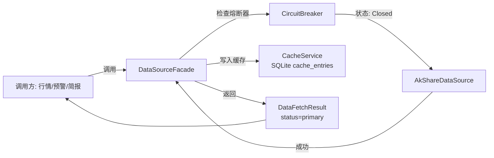
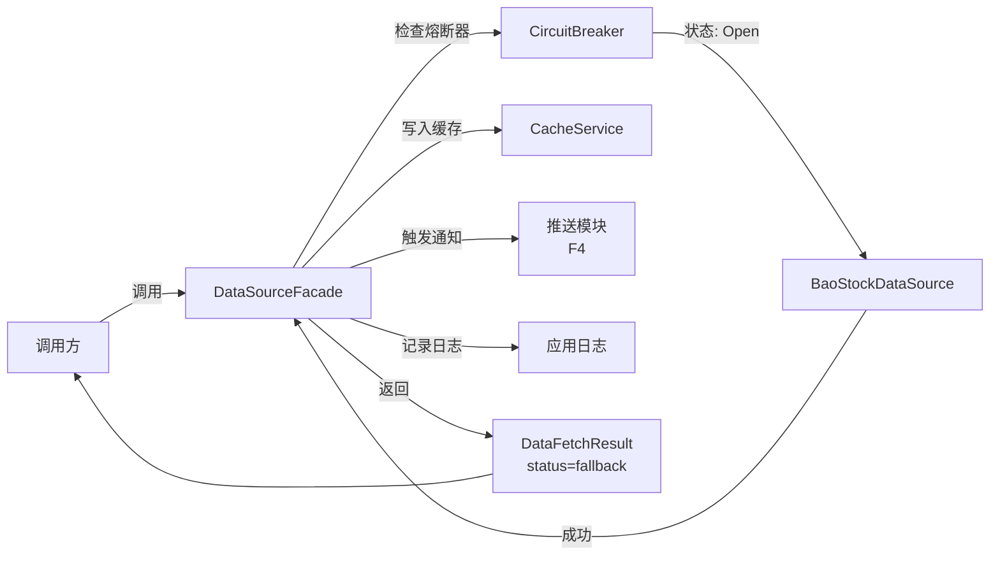
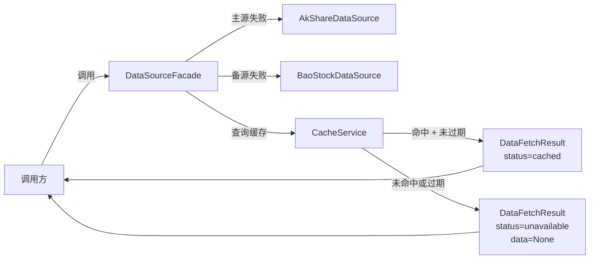
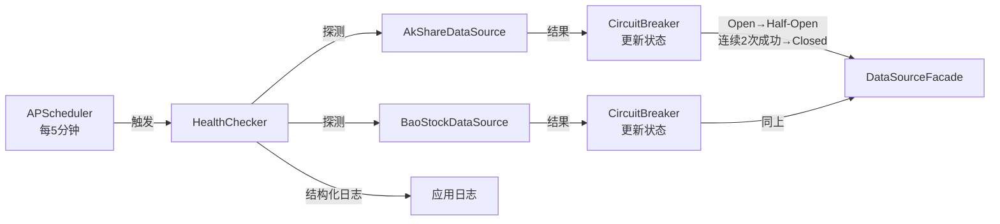

# Implementation Plan: 数据多源容灾

**Feature**: 002-data-failover | **Date**: 2026-05-26 | **Spec**: [spec.md](spec.md)
**Input**: Feature specification from `specs/002-data-failover/spec.md`

---

## Summary

数据多源容灾是系统的数据基础设施层，为所有需要外部数据的功能（行情、预警、简报）提供统一的、带自动降级能力的数据获取入口。核心实现一个数据源 facade 层，封装 AkShare/BaoStock 的切换逻辑、连续失败熔断、SQLite 持久化缓存、定时健康检查四大能力。调用方通过 facade 统一接口获取数据，完全无感知底层数据源状态。

---

## Technical Context

**Language/Version**: Python 3.11+
**Primary Framework**: FastAPI 0.110+（已随 F1 基础设施就绪）
**ORM**: SQLAlchemy 2.0+（复用 F1 配置）
**Data Validation**: Pydantic 2.0+（复用 F1 配置）
**Storage**: SQLite 3.39+（复用 F1 数据库，新增 `cache_entries` 表）
**Scheduler**: APScheduler 3.10+（定时健康检查任务）
**Testing**: pytest 8.0+ + httpx 0.27+ + pytest-asyncio 0.23+（复用 F1 配置）
**Target Platform**: Linux Docker 容器
**Project Type**: Web application — 基础设施服务层
**Performance Goals**: 数据源切换延迟 < 5 分钟，请求成功率 >= 99%
**Constraints**: 单进程架构，缓存有效期 1 小时，健康检查间隔 5 分钟
**Scale/Scope**: 2 个数据源（AkShare/BaoStock），100 只自选股监控，实时行情数据

---

## Constitution Check

*本项目暂无 constitution.md，跳过宪法检查。*

---

## Project Structure

### Documentation (this feature)

```text
specs/002-data-failover/
├── spec.md              # 功能规格说明书
├── plan.md              # 本文件（技术方案）
└── checklists/
    └── requirements.md  # 规格质量检查清单
```

### Source Code (新增与复用)

本 feature 为基础设施层，主要**新建**以下模块，**复用** F1 已建立的项目骨架：

```text
# 复用 F1 基础设施（不修改，仅依赖）
app/config.py                 # 复用 — 新增数据源配置项
app/database.py               # 复用 — 新增 cache_entries 表创建
app/main.py                   # 复用 — 注册 APScheduler 健康检查任务
app/dependencies.py           # 复用 — 注入 DB session
app/schemas/                  # 复用目录结构

# 本 feature 新建模块
app/core/                     # 新增目录：核心基础设施（非业务服务）
│   ├── __init__.py
│   ├── circuit_breaker.py    # 熔断器：连续失败计数、状态机（closed/open/half-open）
│   └── health_checker.py     # 定时健康检查：APScheduler 任务，探测数据源可用性
│
app/models/
│   ├── __init__.py           # 更新：导出 CacheEntry
│   ├── base.py               # 复用 F1
│   ├── stock.py              # 复用 F1
│   ├── group.py              # 复用 F1
│   ├── watchlist.py          # 复用 F1
│   └── cache_entry.py        # 新建：CacheEntry 模型（key, content, cached_at, expires_at）
│
app/schemas/
│   ├── __init__.py           # 更新：导出 DataFetch schemas
│   └── data_fetch.py         # 新建：DataFetchRequest, DataFetchResult Pydantic 模型
│
app/services/
│   ├── __init__.py           # 更新：导出数据源相关服务
│   ├── data_source_facade.py # 新建：核心 facade，对外统一接口，内部管理切换/缓存/熔断
│   ├── data_source.py        # 新建：DataSource 抽象基类 + AkShareDataSource + BaoStockDataSource
│   └── cache_service.py      # 新建：缓存读写服务（SQLite CRUD + 过期清理）
│
app/routers/                  # 本 feature 无新增路由（纯服务层）
│
# 测试（新增）
tests/
│   ├── conftest.py           # 更新：添加数据源 mock fixtures
│   ├── unit/
│   │   ├── test_circuit_breaker.py   # 熔断器状态机测试
│   │   ├── test_cache_service.py     # 缓存读写/过期测试
│   │   ├── test_data_source.py       # AkShare/BaoStock 适配器测试（mock）
│   │   └── test_facade.py            # Facade 层切换逻辑测试
│   └── integration/
│       └── test_failover.py          # 端到端容灾测试：模拟主源故障→切换→恢复
```

**结构决策说明**:
- `app/core/` 为新增目录，存放纯基础设施代码（熔断器、定时任务），与 `app/services/` 的业务逻辑服务区分。core 模块不依赖业务模型，可被任何 feature 复用。
- `data_source_facade.py` 是唯一的对外接口，所有行情/预警/简报模块通过此 facade 获取数据，不直接调用 AkShare/BaoStock。
- `data_source.py` 采用策略模式：抽象基类 `DataSource` 定义统一接口（`fetch_realtime(codes)`），两个具体实现类处理不同库的调用和异常映射。
- `circuit_breaker.py` 实现标准熔断器状态机：Closed（正常）→ Open（连续3次失败）→ Half-Open（健康检查探测）→ Closed（连续2次成功）。

---

## Data Flow

### 正常请求：主数据源可用



### 降级请求：主数据源故障 → 备用源



### 全部故障：返回缓存



### 定时健康检查



---

## Dependency List

### 运行时依赖（新增）

| 依赖 | 版本 | 用途 |
|------|------|------|
| APScheduler | 3.10+ | 定时健康检查任务调度 |

### 运行时依赖（复用 F1）

| 依赖 | 版本 | 用途 |
|------|------|------|
| Python | 3.11+ | 运行时语言 |
| FastAPI | 0.110+ | Web 框架 |
| SQLAlchemy | 2.0+ | ORM（新增 cache_entries 表） |
| Pydantic | 2.0+ | 请求/响应模型校验 |
| Uvicorn | 0.27+ | ASGI 服务器 |
| python-dotenv | 1.0+ | 环境变量加载 |
| akshare | 1.14+ | 主数据源适配 |
| baostock | 0.8+ | 备用数据源适配 |

### 开发/测试依赖（复用 F1）

| 依赖 | 版本 | 用途 |
|------|------|------|
| pytest | 8.0+ | 测试框架 |
| pytest-asyncio | 0.23+ | 异步测试支持 |
| httpx | 0.27+ | HTTP 测试客户端 |
| responses / aioresponses | 0.25+ | HTTP 请求 mock |
| pytest-mock | 3.14+ | mock 工具 |

---

## Integration Points

### 与现有/已规划系统的集成

| 本 feature 新建模块 | 被复用方 | 复用方式 |
|--------------------|---------|---------|
| `services/data_source_facade.py` | F2 实时行情（003）、F3 价格预警（005）、F7 AI 简报 | 统一数据入口：`facade.fetch_realtime(codes)` |
| `services/cache_service.py` | F2 实时行情（003） | 行情模块写入实时数据缓存 |
| `core/circuit_breaker.py` | 所有数据源调用点 | 熔断状态判断 |
| `core/health_checker.py` | F5 Dashboard | Dashboard 展示数据源健康状态 |

### 复用 F1 的模块

| 复用模块 | 本 feature 使用场景 |
|---------|-------------------|
| `database.py` | 新增 `cache_entries` 表，复用 SQLAlchemy 引擎 |
| `config.py` | 新增数据源配置（超时时间、重试次数、健康检查间隔） |
| `main.py` | 注册 APScheduler 定时任务 |
| `models/base.py` | CacheEntry 继承声明式基类 |
| `dependencies.py` | CacheService 注入 DB session |

### 与外部服务的集成

| 外部服务 | 用途 | 失败处理 |
|----------|------|---------|
| AkShare | 主数据源 | 熔断后不再尝试，降级到 BaoStock |
| BaoStock | 备用数据源 | 熔断后返回缓存或 unavailable |
| 飞书 Webhook（F4） | 数据源降级通知 | 通知失败不影响数据返回，仅记录日志 |

---

## Risk Register

| ID | 风险描述 | 严重度 | 概率 | 缓解方案 |
|:---|:---|:------:|:----:|:---|
| R-PLAN-01 | AkShare 和 BaoStock 接口返回格式不一致，facade 层统一映射困难 | 高 | 中 | ① `data_source.py` 中每个适配器负责格式标准化，返回统一数据结构；② facade 层仅依赖标准化后的数据，不感知原始格式；③ 单元测试覆盖两种数据源返回格式的映射 |
| R-PLAN-02 | AkShare 和 BaoStock 同时限流/封 IP（如用户 IP 被平台拉黑） | 高 | 低 | ① 增加本地缓存有效期（1 小时）；② 缓存命中时即使双源故障也能返回数据；③ 非交易时段（收盘后）降低健康检查频率，减少触发限流概率 |
| R-PLAN-03 | 熔断器连续失败计数在进程重启后清零，导致已确认不可用的源被再次尝试 | 中 | 中 | ① 将熔断状态持久化到 SQLite（`data_source_status` 表）；② 启动时从数据库恢复熔断器状态；③ 健康检查记录同时写入日志和数据库 |
| R-PLAN-04 | SQLite 缓存表在高频写入下产生性能瓶颈 | 中 | 低 | ① 缓存写入采用批量模式（单只股票独立写入，批量查询时合并）；② 缓存清理使用后台任务（APScheduler 每小时清理过期条目）；③ 缓存键使用索引加速查询 |
| R-PLAN-05 | APScheduler 定时任务与数据获取请求并发访问 SQLite 导致锁竞争 | 中 | 中 | ① SQLite WAL 模式启用（写 Ahead Logging）；② 健康检查和数据请求使用独立的 DB session；③ 缓存查询优先读缓存，避免每次查库 |
| R-PLAN-06 | 数据源恢复后"抖动"问题（刚恢复又失败） | 低 | 中 | ① Half-Open 状态仅允许探测请求，不承载正式请求；② 连续 2 次成功才恢复 Closed，避免单次成功假象；③ 恢复后前 N 次请求增加超时时间，降低失败概率 |

---

## Design Decisions

### DD-001: 熔断状态持久化到 SQLite

**决策**: 熔断器状态（连续失败计数、当前状态、最后一次失败时间）持久化到 SQLite 的 `data_source_status` 表，进程重启后从数据库恢复。

**理由**:
- 避免进程重启后熔断器清零，导致对已确认故障的数据源重复尝试
- SQLite 零成本，增加一张表的开销可忽略
- 与缓存持久化策略一致（均使用 SQLite）

**反决策**: 内存熔断器实现简单，但重启后清零，在容器化部署中不可接受。

### DD-002: 适配器模式封装数据源差异

**决策**: 每个数据源（AkShare/BaoStock）实现独立的适配器类，统一接口 `fetch_realtime(codes)`，内部处理各自的调用方式和异常映射。

**理由**:
- AkShare 和 BaoStock 的 API 签名、返回格式、异常类型完全不同
- 适配器隔离差异，facade 层仅依赖统一接口
- 新增数据源（如 Tushare）时只需新增适配器类，不修改 facade

**反决策**: 在 facade 中直接调用两个库的 API，会导致大量 if/else 和格式转换代码混杂。

### DD-003: 健康检查使用轻量级探测而非独立心跳

**决策**: 健康检查通过发送与普通请求相同的轻量级查询（单只股票快照）来探测，不维护独立的心跳接口。

**理由**:
- AkShare/BaoStock 均无独立心跳接口，只能通过实际请求探测
- 轻量级探测（单只股票）成本低，不会显著增加数据源负载
- 探测结果与实际请求一致，避免"心跳通但实际请求失败"的假象

**反决策**: 部分数据源可能支持心跳，但 MVP 阶段两个数据源均不支持。

### DD-004: Facade 层不暴露原始异常给调用方

**决策**: 无论底层数据源返回什么异常（超时、限流、格式错误），facade 层统一包装为 `DataFetchResult`，调用方仅看到 `status` 和 `data`，不感知具体异常。

**理由**:
- 调用方（行情、预警、简报）无需处理底层数据源差异
- 统一的返回结构便于前端展示（如 Dashboard 根据 status 显示不同提示）
- 异常细节通过日志记录，供运维排查

**反决策**: 透传原始异常给调用方，会增加每个调用方的错误处理复杂度。

---

## Next Step

Plan is ready for `/speckit.tasks` to generate the task breakdown.
