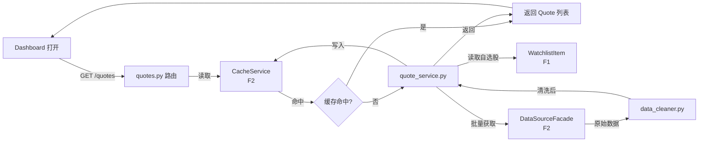
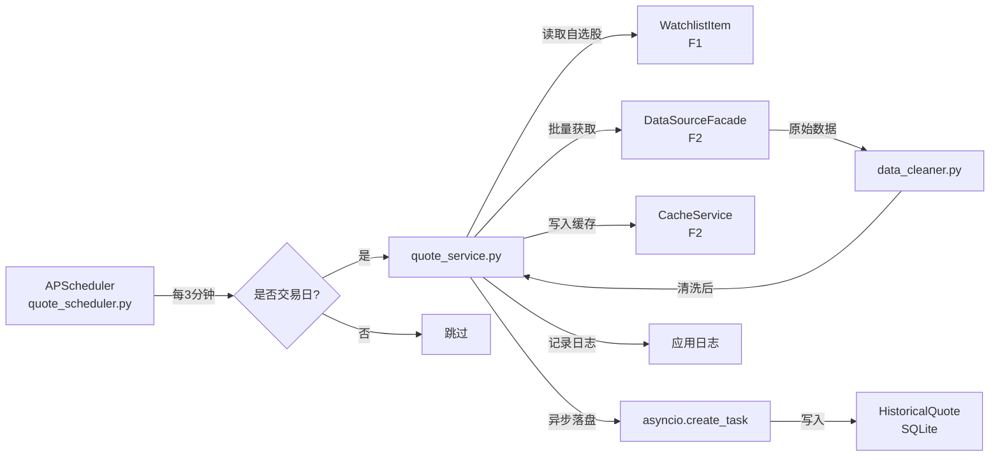
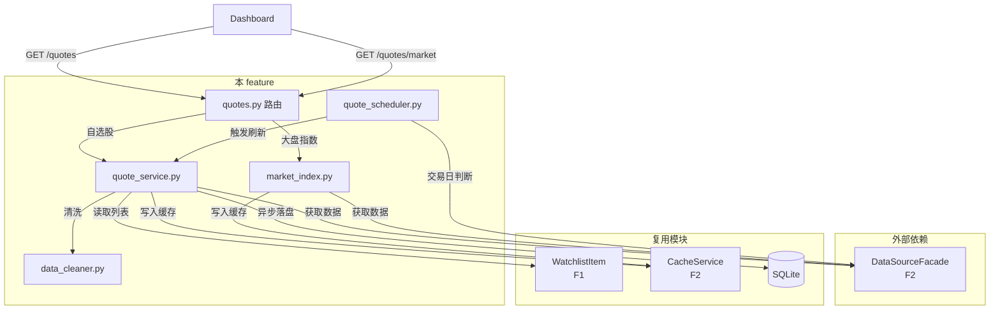

# Implementation Plan: 基础实时行情

**Feature**: 003-realtime-quotes | **Date**: 2026-05-26 | **Spec**: [spec.md](spec.md)
**Input**: Feature specification from `specs/003-realtime-quotes/spec.md`

---

## Summary

基础实时行情是系统的核心业务模块，为 Dashboard 展示和预警检测提供数据燃料。核心实现：定时任务驱动（APScheduler）按 3 分钟周期获取自选股行情 → 调用 F2 数据多源容灾 facade 获取原始数据 → 数据清洗（异常值检测、停牌标记）→ 写入实时缓存（5 分钟过期）→ 异步落盘到历史数据表（90 天滚动保留）。同时提供主动查询 API 供 Dashboard 打开时立即获取最新数据。

---

## Technical Context

**Language/Version**: Python 3.11+
**Primary Framework**: FastAPI 0.110+（复用 F1）
**ORM**: SQLAlchemy 2.0+（复用 F1，新增 HistoricalQuote 表）
**Data Validation**: Pydantic 2.0+（复用 F1）
**Storage**: SQLite 3.39+（复用 F1，历史数据 90 天滚动）
**Scheduler**: APScheduler 3.10+（复用 F2，新增行情刷新任务）
**Testing**: pytest 8.0+ + httpx 0.27+ + pytest-asyncio 0.23+（复用 F1）
**Target Platform**: Linux Docker 容器
**Project Type**: Web application — 业务服务层
**Performance Goals**: Dashboard 首屏 p95 < 3 秒，批量查询 p95 < 10 秒
**Constraints**: 定时刷新 3 分钟周期，行情缓存 5 分钟过期，历史数据 90 天滚动
**Scale/Scope**: 100 只自选股 + 3 个大盘指数，交易时段 9:30-11:30/13:00-15:00

---

## Constitution Check

*本项目暂无 constitution.md，跳过宪法检查。*

---

## Project Structure

### Documentation (this feature)

```text
specs/003-realtime-quotes/
├── spec.md
├── plan.md
└── checklists/
```

### Source Code (新增与复用)

本 feature 为业务服务层，**新建**行情相关模块，**复用** F1/F2 基础设施：

```text
# 复用已有模块（不修改，仅依赖调用）
backend/config.py             # 复用 — 新增行情刷新周期配置
backend/database.py           # 复用 — 新增 HistoricalQuote 表创建
backend/main.py               # 复用 — 注册行情定时任务
backend/models/
│   ├── base.py               # 复用 F1
│   ├── stock.py              # 复用 F1
│   ├── group.py              # 复用 F1
│   ├── watchlist.py          # 复用 F1
│   ├── cache_entry.py        # 复用 F2
│   └── data_source_status.py # 复用 F2
│
backend/services/
│   ├── data_source_facade.py # 复用 F2
│   ├── cache_service.py      # 复用 F2
│   └── __init__.py
│
backend/schemas/
│   ├── __init__.py           # 复用 F1
│   └── data_fetch.py         # 复用 F2
│
# 本 feature 新建模块
backend/models/
│   └── historical_quote.py   # 新建：HistoricalQuote 模型（股票代码/日期/开收高低/量/额）
│
backend/schemas/
│   └── quote.py              # 新建：Quote, MarketIndex, HistoricalQuote Pydantic 模型
│
backend/services/
│   ├── quote_service.py      # 新建：核心行情服务（获取自选股列表 → 批量获取行情 → 返回 Quote 列表）
│   ├── data_cleaner.py       # 新建：数据清洗服务（异常值检测、停牌识别、格式标准化）
│   └── market_index.py       # 新建：大盘指数服务（固定 3 个指数的获取和缓存）
│
backend/core/
│   └── quote_scheduler.py    # 新建：APScheduler 行情刷新定时任务（交易时段判断 → 触发刷新 → 异步落盘）
│
backend/routers/
│   └── quotes.py             # 新建：行情查询路由（GET /quotes 自选股行情, GET /quotes/market 大盘指数）
│
# 测试（新增）
backend/test/
│   ├── conftest.py           # 复用 F1 fixtures
│   ├── unit/
│   │   ├── test_quote_service.py    # 行情获取逻辑测试（mock facade）
│   │   ├── test_data_cleaner.py     # 数据清洗规则测试
│   │   ├── test_market_index.py     # 大盘指数获取测试
│   │   └── test_quote_scheduler.py  # 定时任务逻辑测试（mock 时间/交易日历）
│   └── integration/
│       └── test_quotes_api.py       # 端到端 API 测试：主动查询 + 定时刷新 + 清洗 + 缓存
frontend/__test__/            # 前端测试占位
│   └── .gitkeep
```

**结构决策说明**:
- `quote_service.py` 是本 feature 核心，协调多个依赖：从 F1 读取自选股列表 → 调用 F2 facade 获取原始数据 → 调用 data_cleaner 清洗 → 写入 F2 缓存 → 返回标准化 Quote。
- `data_cleaner.py` 独立为服务，便于单元测试每条清洗规则（价格异常、涨跌幅异常、停牌识别）。
- `quote_scheduler.py` 与 F2 的 `health_checker.py` 并列放在 `core/` 下，统一 APScheduler 任务管理。
- `market_index.py` 独立服务，因为大盘指数与自选股获取逻辑不同（固定列表 vs 动态列表）。
- HistoricalQuote 落盘使用 `asyncio.create_task()` 实现异步，不阻塞主线程。

---

## Data Flow

### 主动查询：Dashboard 打开时



### 定时刷新：后台自动更新



### 系统内部数据流向（完整）



---

## Dependency List

### 运行时依赖（新增）

| 依赖 | 版本 | 用途 |
|------|------|------|
| APScheduler | 3.10+ | 定时刷新任务（复用 F2） |

### 运行时依赖（复用 F1/F2）

| 依赖 | 版本 | 用途 |
|------|------|------|
| Python | 3.11+ | 运行时语言 |
| FastAPI | 0.110+ | Web 框架 |
| SQLAlchemy | 2.0+ | ORM（新增 HistoricalQuote 表） |
| Pydantic | 2.0+ | 请求/响应模型 |
| Uvicorn | 0.27+ | ASGI 服务器 |
| python-dotenv | 1.0+ | 环境变量 |

### 开发/测试依赖（复用 F1）

| 依赖 | 版本 | 用途 |
|------|------|------|
| pytest | 8.0+ | 测试框架 |
| pytest-asyncio | 0.23+ | 异步测试 |
| httpx | 0.27+ | HTTP 测试客户端 |
| freezegun | 1.5+ | 时间冻结（测试非交易时段/停牌场景） |
| pytest-mock | 3.14+ | mock 工具 |

---

## Integration Points

### 与现有/已规划系统的集成

| 本 feature 新建模块 | 被复用方 | 复用方式 |
|--------------------|---------|---------|
| `services/quote_service.py` | F3 价格预警（005） | 预警模块读取缓存中的最新行情 |
| `services/data_cleaner.py` | F7 AI 简报 | 简报生成复用清洗后的标准化数据 |
| `routers/quotes.py` | F5 Dashboard | Dashboard 调用 API 获取行情 |
| `models/historical_quote.py` | F7 AI 简报 | 简报生成读取历史数据 |

### 复用已有模块

| 复用模块 | 本 feature 使用场景 |
|---------|-------------------|
| `services/data_source_facade.py` (F2) | 获取原始行情数据 |
| `services/cache_service.py` (F2) | 写入/读取实时行情缓存 |
| `models/watchlist.py` (F1) | 读取监控股票列表 |
| `core/health_checker.py` (F2) | 复用 APScheduler 配置 |
| `models/cache_entry.py` (F2) | 行情缓存复用，过期时间 5 分钟 |

### 与外部服务的集成

| 外部服务 | 用途 | 失败处理 |
|----------|------|---------|
| DataSourceFacade (F2) | 获取行情原始数据 | facade 内部处理降级/缓存 |
| AkShare 交易日历 | 判断当日是否交易日 | 不可用时降级为"工作日即交易日" |

---

## Risk Register

| ID | 风险描述 | 严重度 | 概率 | 缓解方案 |
|:---|:---|:------:|:----:|:---|
| R-PLAN-01 | 定时任务与主动查询并发访问缓存导致数据不一致 | 高 | 中 | ① SQLite WAL 模式；② 缓存写入使用事务；③ 读取缓存时不阻塞写入 |
| R-PLAN-02 | 批量获取 100 只股票行情超时（AkShare 限流） | 高 | 高 | ① 分批获取（每批 20 只）；② facade 层自动降级到备用源；③ 增加请求间隔 |
| R-PLAN-03 | 异步落盘任务异常退出导致历史数据丢失 | 中 | 低 | ① 使用 `asyncio.create_task()` 的异常回调捕获错误；② 失败时写入日志；③ 定时任务下次刷新时补写 |
| R-PLAN-04 | 数据清洗规则误判正常数据为异常（如科创板 20cm 涨停被标记为异常） | 中 | 中 | ① A-007 已区分科创板/创业板涨跌幅阈值（30%）；② 异常数据标记但不丢弃，仍可展示；③ 异常数据写入日志供排查 |
| R-PLAN-05 | HistoricalQuote 表 90 天数据量过大导致查询缓慢 | 低 | 中 | ① 按股票代码 + 日期建立复合索引；② 每日凌晨清理超期数据（APScheduler 定时任务）；③ v1.1 迁移到按日分表或归档策略 |
| R-PLAN-06 | 交易日历接口延迟导致定时任务错过开盘刷新 | 低 | 低 | ① 交易日判断缓存 1 小时（避免每次查询）；② 数据源不可用时降级为工作日判断，宁可多刷新一次也不少刷新 |

---

## Design Decisions

### DD-001: 行情缓存与 F2 通用缓存分离配置

**决策**: 行情缓存复用 F2 的 CacheEntry 表，但过期时间独立配置为 5 分钟（F2 通用缓存为 1 小时）。在缓存键中增加前缀区分（如 `quote:600519` vs `fallback:600519`）。

**理由**:
- 复用已有缓存基础设施，不重复造轮子
- 行情数据时效性高（5 分钟），通用缓存时效性低（1 小时），需要不同过期策略
- 键前缀区分避免不同模块的缓存冲突

**反决策**: 独立新建缓存表，增加维护成本。

### DD-002: 异步落盘使用 asyncio.create_task 而非任务队列

**决策**: 历史数据落盘使用 `asyncio.create_task()` 在后台执行，不引入 Celery/RQ 等任务队列。

**理由**:
- MVP 单进程架构，asyncio 足够处理后台任务
- 不引入额外依赖（Celery 需要 Redis）
- 历史落盘延迟容忍度高（< 1 分钟），不需要强可靠性保证

**反决策**: 引入 Celery + Redis 增加部署复杂度，对个人项目过度设计。

### DD-003: 主动查询优先读缓存，缓存未命中才触发获取

**决策**: Dashboard 打开时的行情查询优先读取缓存，缓存未命中或过期时才触发实时获取。

**理由**:
- 避免每次打开 Dashboard 都触发外部数据源请求，减少限流风险
- 缓存命中时响应极快（< 200ms），满足 SC-001
- 定时任务已保证缓存新鲜度，主动查询读缓存足够

**反决策**: 每次主动查询都实时获取，会增加数据源负载和响应时间。

### DD-004: 大盘指数与自选股分开获取

**决策**: 大盘指数（3 个）和自选股行情分开获取、分开缓存。

**理由**:
- 大盘指数固定 3 个，自选股动态 0-100 个，获取逻辑不同
- 分开缓存可以独立刷新周期（大盘指数可更频繁）
- 分开 API 便于 Dashboard 独立展示（大盘固定在顶部，自选股在下方）

**反决策**: 合并获取，增加 facade 调用复杂度。

---

## Next Step

Plan is ready for `/speckit.tasks` to generate the task breakdown.
