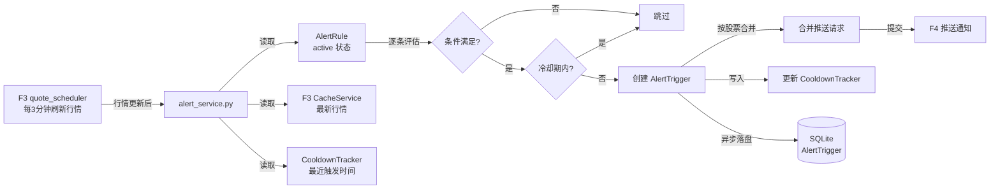
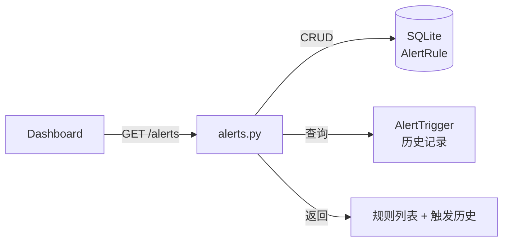
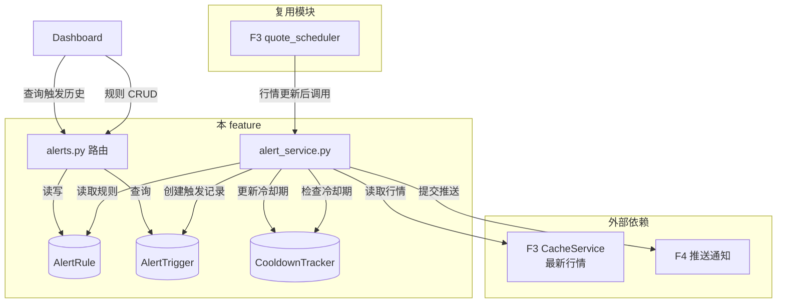

# Implementation Plan: 价格/涨跌幅预警

**Feature**: 004-price-alert | **Date**: 2026-05-26 | **Spec**: [spec.md](spec.md)
**Input**: Feature specification from `specs/004-price-alert/spec.md`

---

## Summary

价格/涨跌幅预警是系统的核心业务模块，为盯盘用户提供主动监控能力。核心实现：每次 F3 行情刷新后，预警引擎遍历所有生效规则，逐条评估最新行情是否满足条件 → 检查冷却期 → 满足条件则生成 AlertTrigger → 合并同一股票的多规则触发 → 提交推送请求给 F4。同时提供完整的规则 CRUD 管理 API 供 Dashboard 使用。

---

## Technical Context

**Language/Version**: Python 3.11+
**Primary Framework**: FastAPI 0.110+（复用 F1）
**ORM**: SQLAlchemy 2.0+（复用 F1，新增 AlertRule/AlertTrigger/CooldownTracker 表）
**Data Validation**: Pydantic 2.0+（复用 F1）
**Storage**: SQLite 3.39+（复用 F1，预警数据持久化）
**Scheduler**: APScheduler 3.10+（复用 F2/F3，随行情刷新触发检测）
**Testing**: pytest 8.0+ + httpx 0.27+ + pytest-asyncio 0.23+ + freezegun 1.5+（复用 F1）
**Target Platform**: Linux Docker 容器
**Project Type**: Web application — 业务服务层
**Performance Goals**: 50 条规则检测 p95 < 5 秒，规则列表加载 p95 < 1 秒
**Constraints**: 单进程架构，50 条规则上限，冷却期跨交易日自动重置
**Scale/Scope**: 50 条规则/用户，5 种条件类型，2 级触达

---

## Constitution Check

*本项目暂无有效 constitution.md，跳过宪法检查。*

---

## Project Structure

### Documentation (this feature)

```text
specs/004-price-alert/
├── spec.md
├── plan.md
└── checklists/
```

### Source Code (新增与复用)

本 feature 为业务服务层，**新建**预警相关模块，**复用** F1/F2/F3 基础设施：

```text
# 复用已有模块（不修改，仅依赖调用）
app/config.py                 # 复用 — 新增预警规则数上限配置
app/database.py               # 复用 — 新增 AlertRule/AlertTrigger/CooldownTracker 表
app/main.py                   # 复用 — 注册 alerts 路由
app/models/
│   ├── base.py               # 复用 F1
│   ├── stock.py              # 复用 F1
│   ├── watchlist.py          # 复用 F1
│   └── historical_quote.py   # 复用 F3
│
app/services/
│   ├── data_source_facade.py # 复用 F2
│   ├── cache_service.py      # 复用 F2
│   └── quote_service.py      # 复用 F3
│
app/schemas/
│   ├── __init__.py           # 复用 F1
│   └── quote.py              # 复用 F3
│
# 本 feature 新建模块
app/models/
│   ├── alert_rule.py         # 新建：AlertRule 模型（规则定义）
│   ├── alert_trigger.py      # 新建：AlertTrigger 模型（触发记录）
│   └── cooldown_tracker.py   # 新建：CooldownTracker 模型（冷却期状态）
│
app/schemas/
│   └── alert.py              # 新建：AlertRuleRequest/AlertRuleResponse/AlertTriggerResponse Pydantic 模型
│
app/services/
│   └── alert_service.py      # 新建：核心预警引擎（规则加载 → 行情匹配 → 冷却期检查 → 触发记录 → 合并推送）
│
app/routers/
│   └── alerts.py             # 新建：预警规则 CRUD 路由 + 触发历史查询
│
# 测试（新增）
tests/
│   ├── conftest.py           # 复用 F1 fixtures
│   ├── unit/
│   │   ├── test_alert_service.py    # 预警检测引擎测试（mock 行情数据）
│   │   ├── test_alert_rules.py      # 规则 CRUD 测试
│   │   └── test_cooldown.py         # 冷却期逻辑测试（freezegun 冻结时间）
│   └── integration/
│       └── test_alerts_api.py       # 端到端 API 测试：创建规则 → 模拟行情 → 触发 → 冷却期 → 再触发
```

**结构决策说明**:
- `alert_service.py` 是本 feature 核心，协调：读取 active 规则 → 获取最新行情（从 F3 缓存）→ 逐条评估 → 冷却期过滤 → 生成触发记录 → 合并同一股票触发 → 提交推送请求给 F4
- `alert_rule.py` / `alert_trigger.py` / `cooldown_tracker.py` 三个独立模型，便于分别测试和独立演进
- 预警检测随 F3 行情刷新同步触发（由 `quote_scheduler.py` 调用 `alert_service.evaluate()`），不单独设置定时任务
- CooldownTracker 独立表实现持久化，进程重启后冷却期继续生效
- 规则删除为硬删除，但 AlertTrigger 历史记录保留供 Dashboard 展示触发历史

---

## Data Flow

### 定时检测：行情刷新后自动触发



### 主动查询：Dashboard 规则管理



### 系统内部数据流向（完整）



---

## Dependency List

### 运行时依赖（新增）

| 依赖 | 版本 | 用途 |
|------|------|------|
| freezegun | 1.5+ | 时间冻结（测试冷却期逻辑） |

### 运行时依赖（复用 F1/F2/F3）

| 依赖 | 版本 | 用途 |
|------|------|------|
| Python | 3.11+ | 运行时语言 |
| FastAPI | 0.110+ | Web 框架 |
| SQLAlchemy | 2.0+ | ORM（新增 AlertRule/AlertTrigger/CooldownTracker 表） |
| Pydantic | 2.0+ | 请求/响应模型校验 |
| Uvicorn | 0.27+ | ASGI 服务器 |
| APScheduler | 3.10+ | 定时任务（复用 F2/F3） |

### 开发/测试依赖（复用 F1）

| 依赖 | 版本 | 用途 |
|------|------|------|
| pytest | 8.0+ | 测试框架 |
| pytest-asyncio | 0.23+ | 异步测试支持 |
| httpx | 0.27+ | HTTP 测试客户端 |
| freezegun | 1.5+ | 时间冻结（测试冷却期跨交易日/边界场景） |
| pytest-mock | 3.14+ | mock 工具 |

---

## Integration Points

### 与现有/已规划系统的集成

| 本 feature 新建模块 | 被复用方 | 复用方式 |
|--------------------|---------|---------|
| `services/alert_service.py` | F5 Dashboard | Dashboard 展示触发历史 |
| `routers/alerts.py` | F5 Dashboard | Dashboard 调用 API 管理规则 |
| `models/alert_trigger.py` | F7 AI 简报 | 简报生成读取触发历史 |

### 复用已有模块

| 复用模块 | 本 feature 使用场景 |
|---------|-------------------|
| `services/quote_service.py` (F3) | 获取最新行情数据用于规则评估 |
| `services/cache_service.py` (F2) | 读取实时行情缓存 |
| `models/watchlist.py` (F1) | 校验股票代码有效性 |
| `core/quote_scheduler.py` (F3) | 行情刷新后调用 alert_service.evaluate() |
| `schemas/quote.py` (F3) | 引用 Quote 模型进行条件评估 |

### 与外部服务的集成

| 外部服务 | 用途 | 失败处理 |
|----------|------|---------|
| F4 推送通知模块 | 触发后提交推送请求 | 推送失败记录状态，不阻塞检测流程 |
| F3 行情缓存 | 获取最新行情进行评估 | 缓存过期时从 facade 获取 |

---

## Risk Register

| ID | 风险描述 | 严重度 | 概率 | 缓解方案 |
|:---|:---|:------:|:----:|:---|
| R-PLAN-01 | 50 条规则 × 100 只股票的逐条评估导致检测延迟超标 | 高 | 中 | ① 规则按股票代码建立索引，批量读取；② 评估逻辑纯内存计算，无外部 IO；③ 实测 50 条规则评估 < 1 秒 |
| R-PLAN-02 | 冷却期跨交易日未正确重置，导致开盘漏报 | 高 | 中 | ① 检测逻辑中增加"交易日变更"判断；② 每日首次检测前重置全部冷却期；③ 单元测试用 freezegun 模拟跨交易日场景 |
| R-PLAN-03 | 规则修改后冷却期未重置，导致旧冷却期干扰新阈值 | 中 | 中 | ① 规则 update 时同步删除 CooldownTracker 记录；② 单元测试验证修改后冷却期重置 |
| R-PLAN-04 | 股票从自选股移除后规则未暂停，导致对无效股票持续检测 | 中 | 低 | ① WatchlistItem 删除时触发事件通知 alert_service；② alert_service 将该股票关联规则标记为 paused；③ 单元测试验证移除事件处理 |
| R-PLAN-05 | 合并推送时级别判断错误，导致 alert 级被降级为 watch | 中 | 低 | ① 合并逻辑显式取 max(level)；② 单元测试覆盖 watch+alert 同时触发的合并场景 |
| R-PLAN-06 | 规则创建时"已满足条件不触发"的状态未正确跟踪，导致创建后立即推送 | 中 | 中 | ① AlertRule 增加 last_evaluated_result 字段记录上次评估结果；② 仅当上次不满足→本次满足时才触发；③ 创建时初始化 last_evaluated_result 为当前行情评估结果 |

---

## Design Decisions

### DD-001: 预警检测随行情刷新同步触发，不设独立定时任务

**决策**: 预警检测不由独立的 APScheduler 任务驱动，而是在 F3 `quote_scheduler.py` 每次刷新行情后同步调用 `alert_service.evaluate()`。

**理由**:
- 减少定时任务数量，降低调度复杂度
- 预警检测依赖最新行情，与行情刷新天然同步
- 避免两个定时任务并发访问缓存导致竞态条件
- 检测逻辑轻量（纯内存比较），不会显著延长刷新周期

**反决策**: 独立定时任务增加复杂度，且可能读到不一致的行情数据。

### DD-002: 冷却期持久化到独立表 CooldownTracker

**决策**: 冷却期状态存储在独立的 `cooldown_trackers` 表中，而非嵌入 AlertRule 表。

**理由**:
- 冷却期是动态运行时状态，规则是静态配置，职责分离
- 独立表便于批量清理（如跨交易日重置）
- 规则修改时只需删除对应 CooldownTracker 记录即可重置冷却期

**反决策**: 嵌入 AlertRule 表（增加字段 last_triggered_at），但规则修改时需要额外处理冷却期重置逻辑。

### DD-003: 规则创建时初始化 last_evaluated_result 防止立即触发

**决策**: AlertRule 表增加 `last_evaluated_result` 字段（bool，记录上次评估是否满足条件），创建时初始化为当前行情评估结果。

**理由**:
- 精确实现"已满足条件不立即触发"的业务规则
- 避免创建后第一次行情刷新误触发
- 字段轻量，不影响性能

**反决策**: 不跟踪状态，创建后跳过第一次检测。但这样无法区分"创建时满足"和"创建后很快满足"的情况。

### DD-004: 触发记录 AlertTrigger 与推送请求解耦

**决策**: `alert_service.py` 生成 AlertTrigger 记录后，异步提交推送请求给 F4，两者解耦。

**理由**:
- 推送可能失败/降级，不影响触发记录的准确性
- 触发记录用于 Dashboard 展示历史，需要可靠持久化
- 推送重试由 F4 负责，本模块不处理推送失败

**反决策**: 同步等待推送结果，会增加检测延迟，且推送失败会导致触发记录状态不一致。

---

## Next Step

Plan is ready for `/speckit.tasks` to generate the task breakdown.
