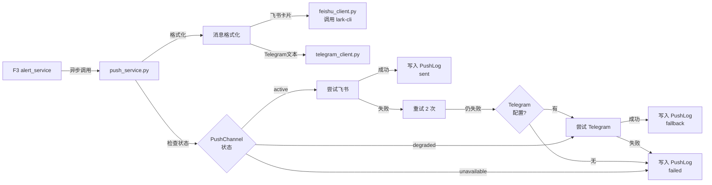
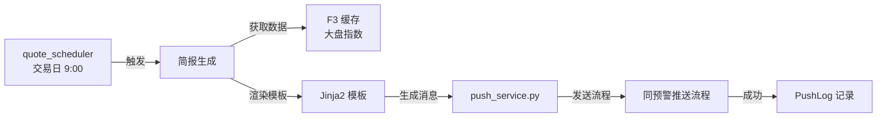
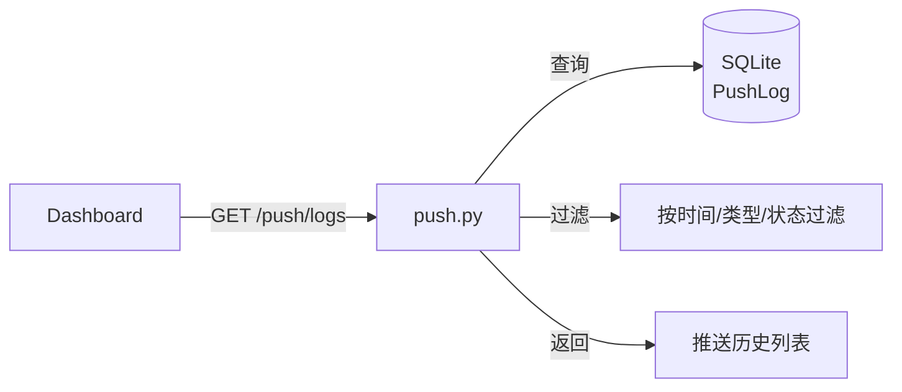

# Implementation Plan: 推送通知

**Feature**: 005-push-notification | **Date**: 2026-05-26 | **Spec**: [spec.md](spec.md)
**Input**: Feature specification from `specs/005-push-notification/spec.md`

---

## Summary

推送通知是系统的触达层，负责将预警、简报、系统异常通知送达用户。核心实现：接收上游模块（F3/F7）生成的推送请求 → 格式化渲染为飞书卡片/Telegram 文本 → 主通道（飞书）尝试发送 → 失败自动降级到备用通道（Telegram）→ 双失败则本地记录 → 写入推送日志。同时提供推送历史查询 API 和 9:00 固定模板简报定时触发。

---

## Technical Context

**Language/Version**: Python 3.11+
**Primary Framework**: FastAPI 0.110+（复用 F1）
**ORM**: SQLAlchemy 2.0+（复用 F1，新增 PushLog/PushChannel 表）
**Data Validation**: Pydantic 2.0+（复用 F1）
**Storage**: SQLite 3.39+（复用 F1，推送日志 30 天滚动）
**Scheduler**: APScheduler 3.10+（复用 F2/F3，新增 9:00 简报定时任务）
**Testing**: pytest 8.0+ + httpx 0.27+ + pytest-asyncio 0.23+ + responses 0.25+（复用 F1）
**Target Platform**: Linux Docker 容器
**Project Type**: Web application — 触达服务层
**Performance Goals**: 推送延迟 p95 < 5 分钟（alert），p95 < 10 分钟（briefing）
**Constraints**: 飞书 Open API 受 QPS 限流约束（企业自建应用约 20 次/秒），推送日志保留 30 天，Telegram 为可选通道
**Scale/Scope**: 2 个推送通道（飞书 + Telegram），3 种消息类型，30 天日志保留

---

## Constitution Check

*本项目暂无有效 constitution.md，跳过宪法检查。*

---

## Project Structure

### Documentation (this feature)

```text
specs/005-push-notification/
├── spec.md
├── plan.md
└── checklists/
```

### Source Code (新增与复用)

本 feature 为触达服务层，**新建**推送相关模块，**复用** F1/F2/F3 基础设施：

```text
# 复用已有模块（不修改，仅依赖调用）
app/config.py                 # 复用 — 基础配置（数据库连接、日志级别等系统级配置）
app/database.py               # 复用 — 新增 PushLog/PushChannel 表
app/services/
│   └── settings_service.py   # 复用 — 读取用户配置的飞书 app_id/app_secret/brand/chat_id、Telegram Token、代理配置（敏感字段加密存储）
app/main.py                   # 复用 — 注册 push 路由
app/models/
│   ├── base.py               # 复用 F1
│   └── stock.py              # 复用 F1
│
app/services/
│   ├── data_source_facade.py # 复用 F2
│   └── quote_service.py      # 复用 F3
│
app/schemas/
│   └── __init__.py           # 复用 F1
│
app/core/
│   └── quote_scheduler.py    # 复用 F3 — 新增 9:00 简报触发任务
│
# 本 feature 新建模块
app/models/
│   ├── push_log.py           # 新建：PushLog 模型（推送记录）
│   └── push_channel.py       # 新建：PushChannel 模型（通道状态与配置）
│
app/schemas/
│   └── push.py               # 新建：PushMessageRequest, PushLogResponse, PushChannelStatus Pydantic 模型
│
app/services/
│   ├── push_service.py       # 新建：核心推送服务（格式化 → 通道选择 → 降级逻辑 → 日志）
│   ├── feishu_client.py      # 新建：飞书 lark-cli 客户端（卡片渲染 + 调用 lark-cli Open API 发送）
│   └── telegram_client.py    # 新建：Telegram Bot API 客户端（文本格式化 + HTTP 发送）
│
app/routers/
│   └── push.py               # 新建：推送历史查询 API（GET /push/logs，支持过滤）
│
# 测试（新增）
tests/
│   ├── conftest.py           # 复用 F1 fixtures
│   ├── unit/
│   │   ├── test_push_service.py     # 推送服务测试（通道降级、重试、日志）
│   │   ├── test_feishu_client.py    # 飞书客户端测试（mock lark-cli 命令执行）
│   │   └── test_telegram_client.py  # Telegram 客户端测试（mock Bot API）
│   └── integration/
│       └── test_push_api.py         # 端到端 API 测试：发送 → 降级 → 历史查询
```

**结构决策说明**:
- `push_service.py` 是本 feature 核心，协调：格式化 → 通道状态检查 → 主通道尝试 → 重试 → 降级 → 日志记录
- `feishu_client.py` / `telegram_client.py` 独立为客户端，便于分别 mock 测试
- 推送发送使用 `asyncio.create_task()` 异步执行，不阻塞上游检测引擎
- PushChannel 表持久化通道状态（active/degraded/unavailable），进程重启后状态保留
- 简报模板由 `push_service.py` 渲染（Jinja2），上游只提供原始数据
- 9:00 简报触发集成到 F3 `quote_scheduler.py`，复用已有 APScheduler 配置

---

## Data Flow

### 预警推送：F3 触发后异步发送



### 简报推送：定时触发



### 推送历史查询



---

## Dependency List

### 运行时依赖（新增）

| 依赖 | 版本 | 用途 |
|------|------|------|
| @larksuite/cli | latest | 飞书 Open API CLI 工具（通过 subprocess 调用） |
| httpx | 0.27+ | 异步 HTTP 客户端（Telegram API 调用） |
| Jinja2 | 3.1+ | 简报模板渲染 |

### 运行时依赖（复用 F1/F2/F3）

| 依赖 | 版本 | 用途 |
|------|------|------|
| Python | 3.11+ | 运行时语言 |
| FastAPI | 0.110+ | Web 框架 |
| SQLAlchemy | 2.0+ | ORM（新增 PushLog/PushChannel 表） |
| Pydantic | 2.0+ | 请求/响应模型校验 |
| Uvicorn | 0.27+ | ASGI 服务器 |
| APScheduler | 3.10+ | 定时任务（复用 F2/F3，新增 9:00 简报） |
| python-dotenv | 1.0+ | 环境变量加载 |

### 开发/测试依赖（复用 F1）

| 依赖 | 版本 | 用途 |
|------|------|------|
| pytest | 8.0+ | 测试框架 |
| pytest-asyncio | 0.23+ | 异步测试支持 |
| httpx | 0.27+ | HTTP 测试客户端 |
| responses / respx | 0.25+ | HTTP 请求 mock |
| pytest-mock | 3.14+ | mock 工具 |

---

## Integration Points

### 与现有/已规划系统的集成

| 本 feature 新建模块 | 被复用方 | 复用方式 |
|--------------------|---------|---------|
| `services/push_service.py` | F3 价格预警 | 预警触发后调用 `push_service.send(PushMessage)` |
| `services/push_service.py` | F7 AI 简报（v1.1） | 简报生成后调用推送 |
| `routers/push.py` | F5 Dashboard | Dashboard 查询推送历史 |
| `models/push_log.py` | F5 Dashboard | Dashboard 展示推送状态 |
| `services/settings_service.py` | 本 feature & F5/F6 | 读取用户配置的推送通道参数（app_id/app_secret/chat_id 等） |

### 复用已有模块

| 复用模块 | 本 feature 使用场景 |
|---------|-------------------|
| `services/alert_service.py` (F3) | 预警触发后提交推送请求 |
| `services/cache_service.py` (F2) | 简报内容读取行情缓存 |
| `services/settings_service.py` (F6 配置管理) | 读取飞书/Telegram 推送通道配置（敏感字段加密解密） |
| `core/quote_scheduler.py` (F3) | 复用 APScheduler 配置，新增 9:00 简报任务 |
| `models/watchlist.py` (F1) | 简报模板中获取自选股列表 |

### 与外部服务的集成

| 外部服务 | 用途 | 失败处理 |
|----------|------|---------|
| 飞书 Open API（lark-cli） | 主推送通道，调用 `lark-cli api POST` 发送卡片消息 | 重试 2 次 → 降级 Telegram → 记录失败 |
| Telegram Bot API | 备用推送通道，发送文本消息 | 记录失败，不进一步降级 |
| Telegram 代理（可选） | 国内访问 Telegram | 代理不可用时记录失败 |

---

## Risk Register

| ID | 风险描述 | 严重度 | 概率 | 缓解方案 |
|:---|:---|:------:|:----:|:---|
| R-PLAN-01 | 飞书 Open API QPS 限流导致大量推送失败 | 高 | 中 | ① 重试 2 次（指数退避）；② 降级到 Telegram；③ 单元测试 mock lark-cli 限流返回码 |
| R-PLAN-02 | Telegram 代理配置错误导致备用通道不可用 | 中 | 中 | ① Telegram 标记为可选通道；② 代理配置校验（启动时测试连通性）；③ 代理失败记录明确日志 |
| R-PLAN-03 | 异步推送任务异常退出导致推送丢失 | 中 | 低 | ① 使用 `asyncio.create_task()` 的异常回调捕获；② 异常时写入 PushLog 状态 failed；③ 定时任务下次触发时补发简报 |
| R-PLAN-04 | 飞书卡片格式错误导致 lark-cli 调用失败 | 中 | 低 | ① 卡片 JSON 使用 Pydantic 模型校验；② 发送前格式预检；③ 格式错误降级为纯文本发送 |
| R-PLAN-05 | 推送日志 30 天数据量过大导致查询缓慢 | 低 | 中 | ① 按时间建立索引；② 每日凌晨清理超期数据；③ 查询限制最近 100 条 |
| R-PLAN-06 | 简报定时任务与预警推送并发导致通道竞争 | 低 | 低 | ① 推送使用独立异步任务，不阻塞；② 飞书/Telegram API 调用使用 httpx 异步客户端；③ 通道状态使用 SQLite WAL 模式 |

---

## Design Decisions

### DD-001: 推送通道抽象为统一 send() 接口

**决策**: `push_service.py` 对外暴露统一接口 `send(PushMessage)`，内部处理通道选择、降级、重试、日志。调用方（F3/F7）无感知底层通道差异。

**理由**:
- 调用方无需处理通道状态判断和降级逻辑
- 统一的日志记录和状态跟踪
- 新增通道（如企业微信）只需新增客户端，不修改调用方

**反决策**: 调用方直接调用 feishu_client/telegram_client，会增加每个调用方的错误处理复杂度。

### DD-002: 推送异步发送，不阻塞上游

**决策**: `push_service.send()` 内部使用 `asyncio.create_task()` 异步执行实际发送，立即返回 PushLog ID。

**理由**:
- 预警检测引擎不应等待推送完成（网络 IO 可能耗时数秒）
- 批量预警同时触发时，并行发送提升吞吐量
- 调用方只需提交推送请求，发送结果通过 PushLog 查询

**反决策**: 同步等待推送完成，会显著增加检测延迟。

### DD-003: 简报模板由本模块渲染，上游只提供数据

**决策**: F3/F7 上游模块提供结构化数据（大盘指数、自选股列表、预警信息），`push_service.py` 使用 Jinja2 模板渲染为最终卡片/文本格式。

**理由**:
- 格式控制集中在推送层，便于统一调整卡片样式
- 不同通道（飞书卡片 vs Telegram 文本）的格式差异由推送层处理
- 上游模块不感知推送格式细节

**反决策**: 上游模块生成完整卡片 JSON，推送层仅转发。但这样上游需感知飞书卡片格式，耦合度高。

### DD-004: PushChannel 状态持久化到 SQLite

**决策**: 通道状态（active/degraded/unavailable）持久化到 `push_channels` 表，进程重启后保留。

**理由**:
- 避免进程重启后重复尝试已确认不可用的通道
- 通道降级后其他模块（如 Dashboard）可查询状态
- 限流/错误等状态需要持久化

**反决策**: 内存状态实现简单，但重启后清零，容器化部署中不可接受。

### DD-005: 推送通道配置由 settings_service 统一管理

**决策**: 飞书 app_id/app_secret/brand/chat_id、Telegram Bot Token、代理配置等用户级配置不写入 `.env` 或 `config.py`，而是通过 `settings_service`（F6 配置管理模块）从数据库 `app_settings` 表中读取。`settings_service` 负责敏感字段的加密/解密。

**理由**:
- PRD 明确要求配置加密存储（API Key / Token 加密）
- 用户通过 Dashboard 设置页修改配置后需要持久化，`.env` 文件在容器化部署中不可写
- 集中管理避免各 feature 重复实现配置读取和加密逻辑
- `config.py` 仅保留系统级配置（数据库连接、日志级别等），用户级配置通过 `settings_service` 解耦

**反决策**: 各 feature 直接读取 `.env` 或写入本地文件，会导致敏感信息明文存储，且容器重启后用户配置丢失。

---

## Next Step

Plan is ready for `/speckit.tasks` to generate the task breakdown.
