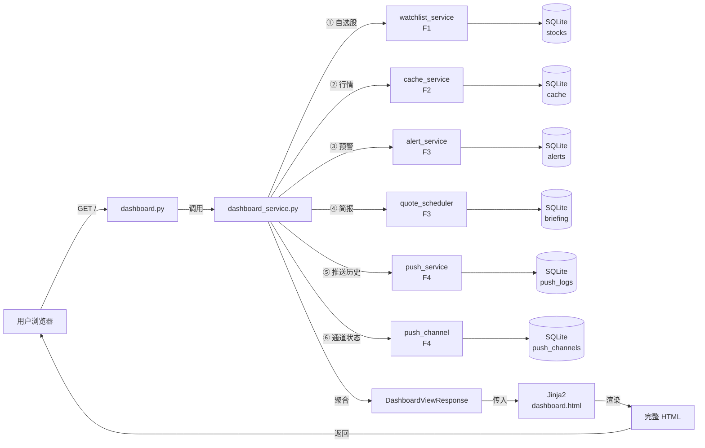
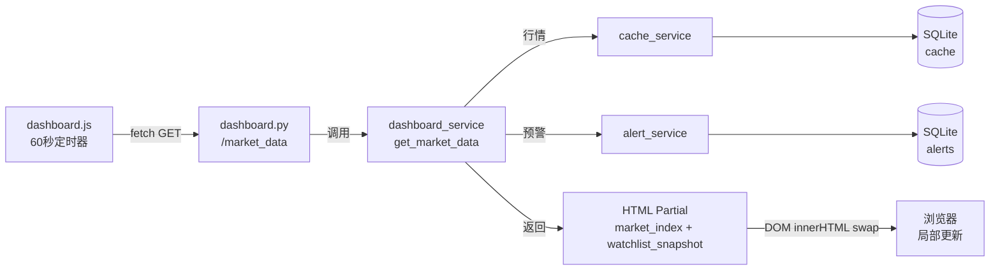
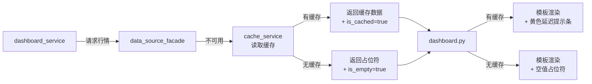

# Implementation Plan: 基础 Dashboard

**Feature**: 006-dashboard | **Date**: 2026-05-26 | **Spec**: [spec.md](spec.md)
**Input**: Feature specification from `specs/006-dashboard/spec.md`

---

## Summary

基础 Dashboard 是系统的用户主界面，负责将所有后台数据（自选股、行情、预警、简报、推送历史、通道状态）整合为一个低密度、易读的首页。核心实现：用户打开页面 → 后端聚合多个上游模块数据 → Jinja2 模板渲染 → Tailwind CSS 样式 → 浏览器展示。设计参考：`design-reference/stitch-export/dashboard_a_share_ai_monitor/code.html`。同时支持移动端自适应、首次使用引导、数据源降级提示。

---

## Technical Context

**Language/Version**: Python 3.11+
**Primary Framework**: FastAPI 0.110+（复用 F1）
**ORM**: SQLAlchemy 2.0+（复用 F1）
**Data Validation**: Pydantic 2.0+（复用 F1）
**Storage**: SQLite 3.39+（复用 F1）
**Template Engine**: Jinja2 3.1+（复用 F1/F4，新增 Dashboard 模板）
**CSS Framework**: Tailwind CSS 3.4+（CDN 引入，设计系统参考 `design-reference/DESIGN.md`）
**Icons**: Material Symbols Outlined（Google Fonts CDN）
**Fonts**: Hanken Grotesk（标题）、JetBrains Mono（数据/价格）、Inter（正文）
**Frontend Interaction**: 原生 JS（60 秒轮询刷新、数据源恢复检测）
**Testing**: pytest 8.0+ + httpx 0.27+ + pytest-asyncio 0.23+（复用 F1）
**Target Platform**: Linux Docker 容器
**Project Type**: Web application — 数据展示层（Jinja2 + Tailwind CSS）
**Performance Goals**: 首屏加载 < 3 秒，缓存渲染 < 1 秒，行情刷新不闪屏
**Constraints**: 单用户系统（MVP 无认证），移动端 viewport < 768px 自适应，自选股上限 50 只
**Scale/Scope**: 1 个首页 + 8 个模板组件 + 2 个路由 + 1 个聚合服务 + 1 个配置服务

---

## Constitution Check

*本项目暂无有效 constitution.md，跳过宪法检查。*

---

## Project Structure

### Documentation (this feature)

```text
specs/006-dashboard/
├── spec.md
├── plan.md
└── checklists/
```

### Source Code (新增与复用)

本 feature 为数据展示层，**新建**前端模板和 Dashboard 聚合模块，**复用** F1-F4 基础设施：

```text
# 复用已有模块（不修改，仅依赖调用）
backend/app/config.py                 # 复用 — Dashboard 配置项（刷新间隔、自选股上限）
backend/app/database.py               # 复用 — SQLite 连接（读取 PushLog、Stock 等已有表）
backend/app/main.py                   # 复用 — 注册 dashboard 路由
backend/app/models/
│   ├── base.py               # 复用 F1
│   ├── stock.py              # 复用 F1 — 自选股数据
│   ├── alert_rule.py         # 复用 F3 — 预警规则状态
│   ├── price_history.py      # 复用 F3 — 历史行情（用于迷你趋势图）
│   ├── push_log.py           # 复用 F4 — 推送日志
│   ├── push_channel.py       # 复用 F4 — 通道状态
│   └── app_setting.py        # 新建：AppSetting 模型（运行时 KV 配置表，key/value/category/is_encrypted）
│
backend/app/schemas/
│   ├── __init__.py           # 复用 F1
│   └── stock.py              # 复用 F1 — 自选股 schema
│
backend/app/services/
│   ├── watchlist_service.py  # 复用 F1 — 自选股列表和分组
│   ├── data_source_facade.py # 复用 F2 — 数据源健康状态
│   ├── cache_service.py      # 复用 F2 — 行情缓存读取
│   ├── quote_service.py      # 复用 F3 — 大盘指数和个股行情
│   ├── alert_service.py      # 复用 F3 — 今日预警触发记录
│   └── push_service.py       # 复用 F4 — 推送历史和通道状态
│
backend/app/routers/
│   ├── watchlist.py          # 复用 F1 — 自选股管理 API
│   ├── push.py               # 复用 F4 — 推送历史查询 API
│   └── alert.py              # 复用 F3 — 预警相关 API
│
backend/app/core/
│   └── quote_scheduler.py    # 复用 F3 — 定时任务状态（判断简报是否生成）
│
# 本 feature 新建模块
backend/app/routers/
│   ├── dashboard.py          # 新建：Dashboard 首页路由（GET /，聚合所有数据）
│   └── settings.py           # 新建：设置页路由（GET/POST /settings，读写推送通道/数据源/偏好配置）
│
backend/app/services/
│   ├── dashboard_service.py  # 新建：Dashboard 数据聚合服务（协调多个上游服务）
│   └── settings_service.py   # 新建：配置管理服务（读写 app_settings 表，敏感字段加密/解密）
│
backend/app/schemas/
│   ├── dashboard.py          # 新建：DashboardViewResponse Pydantic 模型
│   └── settings.py           # 新建：SettingRequest, SettingResponse Pydantic 模型
│
frontend/src/templates/
│   ├── dashboard.html           # 新建：Dashboard 主页面模板（12 列网格布局）
│   ├── settings.html            # 新建：设置页模板（推送通道/数据源/偏好配置表单）
│   ├── components/
│   │   ├── side_nav.html           # 新建：SideNavBar 组件（Logo + 导航菜单 + AI 简报按钮）
│   │   ├── top_nav.html            # 新建：TopNavBar 组件（CommandBar 搜索框 + 通知 + 用户头像）
│   │   ├── market_index.html       # 新建：大盘指数组件（3 列 MetricCard：上证/深证/创业）
│   │   ├── watchlist_snapshot.html # 新建：自选股快照表格（Stock Data Table 简化版）
│   │   ├── briefing_card.html      # 新建：AI 简报卡片组件（右侧栏，含 insight 列表）
│   │   ├── alert_banner.html       # 新建：今日预警汇总横幅（可折叠）
│   │   ├── push_history.html       # 新建：推送历史组件（最近推送记录列表）
│   │   ├── channel_status.html     # 新建：通道状态组件（飞书/Telegram 健康状态）
│   │   ├── quick_actions.html      # 新建：快捷入口组件（2x2/4 网格按钮组）
│   │   └── onboarding.html         # 新建：首次使用引导组件（空状态引导页）
│   └── base.html                # 新建：基础布局模板（Tailwind CDN + Google Fonts + Material Symbols）
│
frontend/public/
│   ├── css/
│   │   └── dashboard.css     # 新建：Dashboard 专用样式（响应式布局）
│   └── js/
│       └── dashboard.js      # 新建：定时刷新逻辑（60 秒轮询）和数据源恢复检测
│
# 测试（新增）
backend/tests/
│   ├── conftest.py           # 复用 F1 fixtures
│   ├── unit/
│   │   └── test_dashboard_service.py  # Dashboard 聚合服务测试（mock 上游）
│   └── integration/
│       └── test_dashboard.py          # 端到端测试：页面渲染 + 刷新 + 降级
frontend/src/__tests__/
│   └── test_responsive.py             # 响应式布局测试（多 viewport）
```

**结构决策说明**:
- `dashboard_service.py` 是本 feature 核心，负责聚合所有上游数据（F1 自选股、F2 行情缓存、F3 预警/简报、F4 推送历史/通道状态），对外提供统一的 `get_dashboard_data()` 接口
- `dashboard.py` 路由只负责：接收请求 → 调用聚合服务 → 渲染模板，不直接访问任何上游模块
- 前端采用 Jinja2 服务端渲染 + Tailwind CSS CDN，纯原生 JS 处理交互（60 秒轮询、数据源恢复检测）
- 设计系统严格遵循 `design-reference/DESIGN.md` 的配色、字体、间距规范，通过 Tailwind Config 映射为 utility class
- 行情刷新采用服务端渲染 Partial HTML（非 JSON API），`dashboard.js` 定时请求后 DOM 替换
- 首次使用引导通过检查自选股数量判断，无独立状态表
- 移动端自适应通过 CSS 媒体查询 + Tailwind 响应式类实现，后端只返回同一套数据
- 快捷入口固定 4 个，前端硬编码，不做配置表
- `settings_service.py` 是独立的横向模块，被 F4/F5/F6 复用，负责所有用户级配置的持久化（`app_settings` 表）和敏感字段加解密

---

## Frontend Design

本章节定义 Dashboard 模块的前端 UI 设计，基于 `design-reference/DESIGN.md` 设计系统和 `design-reference/stitch-export/dashboard_a_share_ai_monitor/code.html` 视觉参考样本。

### 页面布局

Dashboard 首页采用 **12 列固定网格** 布局（DESIGN.md §Layout & Spacing），max-width 1280px 居中：
- **Desktop**: SideNavBar（固定宽 256px，hidden on mobile）+ Main Content Area（flex-1，md:ml-64）
- **Main Content**: TopNavBar（sticky，高 64px，backdrop-blur-md）+ Dashboard Content（可滚动）
- **Dashboard Content**: 12 列网格
  - Market Indices Row: `col-span-12 grid grid-cols-1 md:grid-cols-3 gap-container-gap`
  - Left Column: `col-span-12 lg:col-span-8`（Watchlist Snapshot + Quick Access Grid）
  - Right Column: `col-span-12 lg:col-span-4`（AI Briefing Card）

### 组件清单

| 组件名 | 类型 | 对应 DESIGN.md 章节 | 视觉参考样本路径 |
|:---|:---|:---|:---|
| SideNavBar | 布局组件 | §Layout & Spacing（导航栏） | `design-reference/stitch-export/dashboard_a_share_ai_monitor/code.html` L108-144 |
| TopNavBar | 布局组件 | §Layout & Spacing（顶部栏） | 同上 L146-170 |
| CommandBar | 输入组件 | §Components / Input Forms (Command Bar) | 同上 L149-153 |
| MarketIndexCard | 数据组件 | §Components / Metric Cards | 同上 L176-207 |
| WatchlistSnapshot | 数据组件 | §Components / Stock Data Tables | 同上 L212-286 |
| QuickActions | 交互组件 | —（快捷入口） | 同上 L288-305 |
| AIBriefingCard | 展示组件 | —（AI 简报区域） | 同上 L307-336 |
| AlertBanner | 状态组件 | §Components / Alert Badges | 设计样本未直接展示，由 DESIGN.md §Alert Badges 规范推导 |
| PushHistory | 数据组件 | — | 设计样本未直接展示，由 spec 需求推导 |
| ChannelStatus | 状态组件 | — | 设计样本未直接展示，由 spec 需求推导 |
| Onboarding | 引导组件 | — | 设计样本未直接展示，由 spec 需求推导 |

### 设计 Token 映射

| Token 类别 | 设计值 | Tailwind 类名 |
|:---|:---|:---|
| Background | `#11131c` | `bg-background` |
| Surface Base | `#0F172A` | `bg-surface-base` |
| Surface Raised | `#1E293B` | `bg-surface-raised` |
| Primary | `#b7c4ff` | `text-primary` |
| Primary Container | `#0052ff` | `bg-primary-container` |
| Market Up | `#F43F5E` | `text-market-up` |
| Market Down | `#10B981` | `text-market-down` |
| Market Warning | `#F59E0B` | `text-market-warning` |
| On Surface | `#e1e1ef` | `text-on-surface` |
| On Surface Variant | `#c3c5d9` | `text-on-surface-variant` |
| Outline Variant | `#434656` | `border-outline-variant` |
| Headline Font | Hanken Grotesk | `font-headline-lg` / `font-headline-md` |
| Data Font | JetBrains Mono | `font-data-table` / `font-display-price` |
| Body Font | Inter | `font-body-md` / `font-label-caps` |

### 响应式断点

| 断点 | 布局变化 |
|:---|:---|
| Desktop (>= 1024px) | 12 列网格，SideNav 固定显示，Left Column 8 列 + Right Column 4 列 |
| Tablet (768-1023px) | SideNav 隐藏，Market Indices 3 列，Left/Right Column 全宽堆叠 |
| Mobile (< 768px) | SideNav 收起，Market Indices 单列，Quick Actions 2x2 网格，表格横向滚动 |

---

## Data Flow

### Dashboard 首页加载



### 行情自动刷新



### 数据源异常降级



---

## Dependency List

### 运行时依赖（新增）

| 依赖 | 版本 | 用途 |
|------|------|------|
| Jinja2 | 3.1+ | 模板渲染（Dashboard 页面） |
| python-multipart | 0.0.9+ | FastAPI 表单解析 |
| cryptography | 42.0+ | 敏感配置字段加密（Fernet 对称加密） |

### 运行时依赖（复用 F1-F4）

| 依赖 | 版本 | 用途 |
|------|------|------|
| Python | 3.11+ | 运行时语言 |
| FastAPI | 0.110+ | Web 框架（路由、请求处理） |
| SQLAlchemy | 2.0+ | ORM（读取已有表） |
| Pydantic | 2.0+ | 响应模型校验 |
| Uvicorn | 0.27+ | ASGI 服务器 |
| APScheduler | 3.10+ | 定时任务状态读取 |
| python-dotenv | 1.0+ | 环境变量加载 |
| Tailwind CSS | 3.4+ | 响应式样式（CDN 引入） |
| Material Symbols | — | Google Fonts CDN 图标 |
| Native JS | — | 60 秒轮询定时器 + DOM 局部更新 |

### 开发/测试依赖（复用 F1）

| 依赖 | 版本 | 用途 |
|------|------|------|
| pytest | 8.0+ | 测试框架 |
| pytest-asyncio | 0.23+ | 异步测试支持 |
| httpx | 0.27+ | HTTP 测试客户端 |
| pytest-mock | 3.14+ | mock 工具 |
| beautifulsoup4 | 4.12+ | 测试 HTML 解析 |

---

## Integration Points

### 与现有/已规划系统的集成

| 本 feature 新建模块 | 被复用方 | 复用方式 |
|--------------------|---------|---------|
| `services/dashboard_service.py` | F1 自选股管理 | 调用 `watchlist_service.get_watchlists()` 获取自选股列表和分组 |
| `services/dashboard_service.py` | F2 数据源容灾 | 调用 `cache_service.get_latest_quotes()` 获取行情缓存；调用 `data_source_facade.get_health()` 获取数据源健康状态 |
| `services/dashboard_service.py` | F3 实时行情/预警 | 调用 `quote_service.get_market_indices()` 获取大盘指数；调用 `alert_service.get_today_alerts()` 获取今日预警；读取 quote_scheduler 简报状态 |
| `services/dashboard_service.py` | F4 推送通知 | 调用 `push_service.get_recent_logs()` 获取推送历史；调用 `push_service.get_channel_status()` 获取通道健康状态 |
| `services/settings_service.py` | F4/F5/F6 | 提供统一的配置读写接口（`get_setting()`, `set_setting()`, `get_all_by_category()`），敏感字段自动加解密 |
| `routers/dashboard.py` | F5 Dashboard | 本模块，注册路由到 FastAPI app |
| `routers/settings.py` | F5 Dashboard | 设置页路由，注册到 FastAPI app |

### 复用已有模块

| 复用模块 | 本 feature 使用场景 |
|---------|-------------------|
| `services/watchlist_service.py` (F1) | 获取用户自选股列表和分组 |
| `services/cache_service.py` (F2) | 读取最新行情缓存数据 |
| `services/data_source_facade.py` (F2) | 检测数据源是否可用 |
| `services/quote_service.py` (F3) | 获取大盘指数（上证/深证/创业） |
| `services/alert_service.py` (F3) | 获取今日已触发预警记录 |
| `services/push_service.py` (F4) | 获取最近推送历史和通道状态 |
| `core/quote_scheduler.py` (F3) | 读取今日简报生成状态 |
| `models/push_log.py` (F4) | 查询推送日志 |
| `models/push_channel.py` (F4) | 查询通道健康状态 |
| `services/settings_service.py` (本模块新建) | 读写用户配置（推送通道、数据源、偏好），敏感字段加密 |

---

## Risk Register

| ID | 风险描述 | 严重度 | 概率 | 缓解方案 |
|:---|:---|:------:|:----:|:---|
| R-PLAN-01 | 聚合多个上游服务导致页面加载缓慢（串行调用） | 高 | 中 | ① 使用 `asyncio.gather()` 并行调用独立的上游服务；② 对不经常变化的数据（分组、通道状态）做短时内存缓存；③ 设置各上游调用超时（2 秒），超时返回降级数据 |
| R-PLAN-02 | JS 局部刷新与全局状态不一致 | 中 | 中 | ① 每个刷新请求返回完整的 Partial HTML（含当前状态标记）；② `dashboard.js` 使用 `innerHTML` 替换时保留状态标记；③ 服务端状态变更时通过自定义事件通知 JS 重刷 |
| R-PLAN-03 | 表格渲染性能差（50 只股票大数据量） | 中 | 低 | ① 后端只返回必要字段（代码/名称/价格/涨跌幅/趋势方向）；② 使用纯 CSS 趋势箭头（Material Symbols）替代 SVG 迷你图；③ 自选股超过 20 只时表格启用虚拟滚动或分页 |
| R-PLAN-04 | 移动端自适应 CSS 覆盖不完整，部分元素溢出 | 低 | 中 | ① 使用 Tailwind 响应式前缀（md:、lg:）系统化处理；② 测试矩阵覆盖 320px/375px/414px/768px 四种宽度；③ 大盘指数区域在移动端允许横向滚动 |
| R-PLAN-05 | 上游模块（F1-F4）未就绪导致 Dashboard 无法开发 | 高 | 低 | ① Dashboard 开发使用 mock 服务层；② 定义 DashboardService 接口契约，上游只需满足接口即可集成；③ 并行开发，接口先行 |
| R-PLAN-06 | 定时刷新导致服务器负载过高 | 低 | 低 | ① 刷新只返回变化的数据（JS `innerHTML` 局部替换）；② 行情数据走缓存不直接查数据源；③ 刷新接口返回 ETag，无变化返回 304 |

---

## Design Decisions

### DD-001: Dashboard 采用服务端渲染（SSR）而非 SPA

**决策**: Dashboard 使用 Jinja2 模板 + Tailwind CSS CDN 实现服务器端渲染，不做 React/Vue SPA。原生 JS 处理 60 秒轮询刷新和数据源恢复检测。

**理由**:
- 设计参考 `dashboard_a_share_ai_monitor/code.html` 已基于 Tailwind CSS CDN，无需额外构建工具链
- Dashboard 是信息展示页，交互以读取为主，SSR 加载更快
- SPA 需要额外构建步骤（npm/bundler），增加部署复杂度
- Tailwind CSS utility class 足够表达设计系统的所有样式需求

**反决策**: React/Vue SPA 能提供更丰富的客户端交互，但 MVP 阶段收益不足以抵消复杂度。

### DD-002: 迷你趋势图采用 SVG 内联而非图表库

**决策**: 自选股卡片的迷你趋势图使用 SVG `<path>` 内联渲染，不引入 Chart.js/ECharts。

**理由**:
- 避免引入额外的 JS/CSS 资源，降低首屏加载时间
- 趋势图只需展示当日走势轮廓，SVG path 足够表达
- 后端只需返回一组价格点，前端 SVG 是静态渲染，无运行时开销
- 移动端性能和包大小更可控

**反决策**: 图表库功能更丰富（tooltip、缩放），但 Dashboard 迷你图不需要交互。

### DD-003: Dashboard 数据聚合使用并行异步调用

**决策**: `dashboard_service.py` 使用 `asyncio.gather()` 并行获取自选股、行情、预警、简报、推送历史等数据。

**理由**:
- 各上游数据之间无依赖关系，串行调用会显著增加页面加载时间
- 并行调用将加载时间从 `sum(各服务耗时)` 降低到 `max(各服务耗时)`
- FastAPI 原生支持 async，实现成本低
- 单个服务超时不会阻塞其他数据返回

**反决策**: 串行调用实现简单，但 3-5 个上游服务各 200ms 就会累积到 1 秒以上。

### DD-004: 行情刷新采用原生 JS fetch + Partial HTML 而非 JSON API

**决策**: 60 秒定时刷新通过原生 JS `fetch()` 请求返回 HTML Partial（大盘指数 + 自选股快照），`dashboard.js` 使用 `innerHTML` 替换对应容器内容。

**理由**:
- 设计参考 `dashboard_a_share_ai_monitor/code.html` 未使用 HTMX，使用原生 JS 更轻量
- 服务端渲染 Partial 比 JSON + 客户端模板渲染更简单，前后端只用一种模板语言（Jinja2）
- 无需维护两套渲染逻辑（SSR 初始加载 + CSR 刷新）
- 失败降级时服务端可以直接在 Partial 中嵌入错误提示 HTML
- `dashboard.js` 可自主控制刷新频率、暂停/恢复逻辑、数据源恢复检测

**反决策**: JSON API 更通用（便于未来移动端 App 复用），但 MVP 阶段无此需求。HTMX 因设计样本未使用，不再引入。

### DD-005: 用户配置由 settings_service 统一持久化

**决策**: Dashboard 设置页（/settings）的后端通过独立的 `settings_service.py` 管理所有用户级配置。配置数据持久化到数据库 `app_settings` 表（key-value 结构），敏感字段（app_secret、Telegram Bot Token）使用 Fernet 对称加密存储。加密密钥通过环境变量 `SETTINGS_ENCRYPTION_KEY` 注入。

**理由**:
- PRD 明确要求配置加密存储，满足安全合规
- 用户通过 UI 修改配置后需要持久化，容器化部署中 `.env` 文件不可写
- `app_settings` 表的 key-value 结构灵活，新增配置项无需修改表结构
- 各 feature（F4 推送、F5 Dashboard、F6 设置页）统一通过 `settings_service` 读写配置，避免重复实现加密逻辑
- 系统级配置（数据库连接、日志级别）仍保留在 `config.py` / `.env`，与用户级配置职责分离

**反决策**: 配置直接写入 `.env` 或本地 JSON 文件，会导致敏感信息明文存储，且容器重启后配置丢失。

---

## Next Step

Plan is ready for `/speckit.tasks` to generate the task breakdown.
