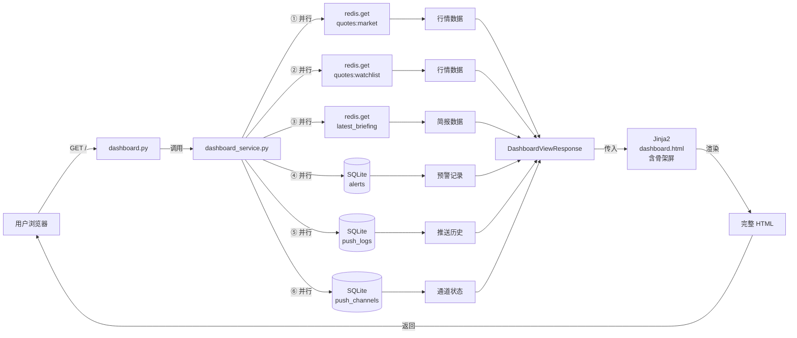
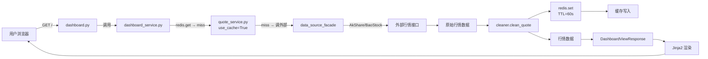
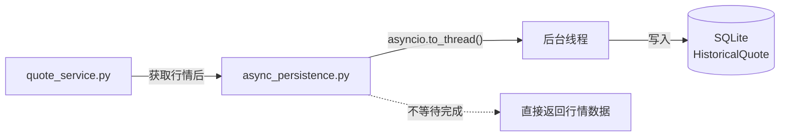

# Implementation Plan: Dashboard 性能优化

**Feature**: 008-redis-adjust | **Date**: 2026-06-10 | **Spec**: [spec.md](spec.md)  
**Input**: Feature specification from `specs/008-redis-adjust/spec.md` + `brainstorming.md`  
**Related**: `specs/006-dashboard/`（本优化为 Dashboard 性能增强）

---

## Summary

本优化在保持 Dashboard 现有 UI 和交互不变的前提下，通过引入 Redis 内存缓存、并行化数据聚合、裁剪刷新端点、异步化历史落盘、ETag/304 机制和骨架屏六大手段，将 Dashboard 首响应从 2-4s 降低到 **有缓存时 < 1s、冷启动 < 2s**。核心改动：新增 2 个核心模块（Redis 封装、异步持久化），改造 3 个后端模块（quote_service、dashboard_service、dashboard 路由）和 2 个前端文件（模板 + JS）。

---

## Constitution Check

✅ **I. 信息展示边界** — 本优化不涉及任何交易功能，纯性能优化。  
✅ **II. 单用户架构** — 缓存 key 不带用户隔离，符合单用户假设。  
✅ **III. 零成本数据源** — 缓存服务于零成本数据源的高延迟，不为付费源预留逻辑。  
✅ **V. 视觉规范** — 骨架屏使用 DESIGN.md 的 design tokens。  
✅ **X. 暗色模式唯一** — 骨架屏 CSS 动画使用暗色模式配色。  
✅ **XI. 界面语言中文** — 无新增 UI 文案。  
✅ **XII. MVP 桌面端** — 骨架屏和 ETag 仅在桌面端验证。  
✅ **XIII. 年运营成本** — Redis 作为 Docker 容器运行，无额外云服务费用。

---

## Project Structure

### 新增模块

```text
backend/app/core/redis_cache.py
    # Redis 客户端封装
    # 职责：连接管理、get/set/delete/expire、JSON 序列化/反序列化、连接异常降级
    # 对外接口：RedisCache.get(key), RedisCache.set(key, value, ttl), RedisCache.delete(key)
    # 关键行为：Redis 不可用时自动降级（不抛异常，返回 None），调用方可据此回源

backend/app/core/async_persistence.py
    # 异步历史数据落盘工具
    # 职责：将同步的数据库写入操作包装为后台异步执行
    # 对外接口：async_persist(quotes, db_session_factory)
    # 关键行为：使用 asyncio.to_thread() 将同步 SQLite 写入移出事件循环；异常时记录日志
```

### 改造模块

```text
backend/app/services/quote_service.py
    # 改造点 1：新增 use_cache: bool = False 参数
    # 改造点 2：get_watchlist_quotes() / get_market_indices() 增加缓存优先逻辑
    # 缓存 miss 时：调外部接口 → 清洗 → 写入 Redis TTL=60s → 返回
    # 缓存 hit 时：直接返回 Redis 数据，不调外部接口
    # 对现有调用方透明：F3 预警检测不传 use_cache，行为不变

backend/app/services/dashboard_service.py
    # 改造点 1：数据库查询并行化
    #   - 原：同一个 session 内串行查 alerts → push_history → channel_status
    #   - 新：使用独立 session + asyncio.gather() 并行执行
    # 改造点 2：行情数据读取改为缓存优先
    #   - 调用 quote_service.get_market_indices(use_cache=True)
    #   - 调用 quote_service.get_watchlist_quotes(use_cache=True)
    # 改造点 3：简报数据使用 Redis 缓存（如已存在缓存 key）

backend/app/routers/dashboard.py
    # 改造点 1：GET / 路由骨架屏支持
    #   - 模板渲染时包含骨架屏 HTML 结构
    # 改造点 2：GET /market_data 路由 ETag 支持 + Partial 裁剪
    #   - 只调用 dashboard_service.get_market_data()（不含 alerts/push/channel）
    #   - 基于行情数据核心字段计算 ETag
    #   - If-None-Match 匹配 → 304；不匹配 → 200 + HTML + ETag
    # 改造点 3：_get_dashboard_service() 优化（消除重复动态导入开销）

frontend/src/templates/dashboard.html
    # 改造点：在大盘指数、自选股表格、简报卡片区域插入骨架屏占位
    # 骨架屏使用 Tailwind CSS animate-pulse + 暗色模式配色
    # 数据渲染后通过 Jinja2 条件替换骨架屏（服务端渲染场景下骨架屏只在首屏无数据时可见）

frontend/public/js/dashboard.js
    # 改造点 1：fetch /market_data 时携带 If-None-Match 头
    # 改造点 2：304 响应时不更新 DOM，不触发 innerHTML 替换
    # 改造点 3：保留现有降级检测逻辑（data-degraded 暂停轮询）
```

### 复用模块（不修改，仅依赖）

```text
backend/app/services/watchlist_service.py      # F1 自选股列表
backend/app/services/data_source_facade.py     # F2 数据源容灾
backend/app/services/cache_service.py          # F2 SQLite 缓存（降级时复用）ackend/app/services/alert_service.py          # F3 今日预警
backend/app/services/push_service.py           # F4 推送历史/通道状态
backend/app/models/                            # 所有现有模型
backend/app/database.py                        # SQLite 连接
backend/app/main.py                            # 路由注册（可能需挂载 Redis 客户端）
frontend/src/templates/base.html               # 基础布局
frontend/src/templates/components/             # 所有现有组件
```

---

## Data Flow

### 1. 首页加载（有缓存时）



### 2. 首页加载（冷启动，Redis miss）



### 3. 行情自动刷新（ETag/304 机制）

```mermaid
graph LR
    JS[dashboard.js<br/>60s 定时器] --"fetch GET /market_data<br/>If-None-Match: etag"--> Router[dashboard.py<br/>/market_data]
    Router --"调用"--> Service2[dashboard_service<br/>.get_market_data]
    Service2 --"只查行情"--> Redis[redis.get]
    Redis --> Data[行情数据]
    Data --> ETag[计算 ETag<br/>MD5(price+change_pct)]
    ETag --"比对 If-None-Match"--> Match{匹配?}
    Match --"是"--> R304[304<br/>无 body]
    Match --"否"--> Render[渲染 Partial HTML]
    Render --> R200[200 + HTML + 新 ETag]
    R304 --> JS2[JS: 不更新 DOM]
    R200 --> JS3[JS: innerHTML 替换]
```

### 4. 历史数据异步落盘



---

## Dependency List

### 运行时依赖（新增）

| 依赖 | 版本 | 用途 |
|------|------|------|
| redis-py | 5.0+ | Python Redis 客户端 |

### 运行时依赖（复用现有）

| 依赖 | 版本 | 用途 |
|------|------|------|
| Python | 3.11+ | 运行时语言 |
| FastAPI | 0.110+ | Web 框架 |
| SQLAlchemy | 2.0+ | ORM |
| Pydantic | 2.0+ | 数据校验 |
| Uvicorn | 0.27+ | ASGI 服务器 |
| APScheduler | 3.10+ | 定时任务（F3） |
| Jinja2 | 3.1+ | 模板渲染 |
| Tailwind CSS | 3.4+（CDN）| 样式 |
| Redis Server | 7.0+ | 内存缓存（Docker 容器） |

### 开发/测试依赖（复用现有）

| 依赖 | 版本 | 用途 |
|------|------|------|
| pytest | 8.0+ | 测试框架 |
| pytest-asyncio | 0.23+ | 异步测试 |
| httpx | 0.27+ | HTTP 测试客户端 |
| pytest-mock | 3.14+ | mock 工具 |
| beautifulsoup4 | 4.12+ | HTML 解析测试 |
| fakeredis | 2.20+ | **新增**：Redis 测试 mock |

---

## Integration Points

### 与现有系统的集成

| 本优化改造模块 | 集成对象 | 集成方式 | 兼容性保证 |
|:---|:---|:---|:---|
| `core/redis_cache.py` | Docker Compose | 新增 Redis 容器，通过环境变量 `REDIS_URL` 连接 | Redis 不可用时自动降级 |
| `services/quote_service.py` | F3 预警检测 | `get_watchlist_quotes()` 新增 `use_cache: bool = False` 参数；F3 调用时不传参，默认实时读取 | 默认参数保证现有调用方行为不变 |
| `services/quote_service.py` | F2 data_source_facade | 缓存 miss 时仍调 facade，接口契约不变 | 无变化 |
| `services/dashboard_service.py` | F1 watchlist_service | 调用方式不变 | 无变化 |
| `services/dashboard_service.py` | F3 alert_service | 调用方式不变，但并行化执行 | 返回格式不变 |
| `services/dashboard_service.py` | F4 push_service | 调用方式不变，但并行化执行 | 返回格式不变 |
| `routers/dashboard.py` | 006-dashboard 模板 | 骨架屏作为新增 HTML 结构嵌入，不替换现有组件 | 视觉回归测试验证 |
| `public/js/dashboard.js` | 浏览器 | 新增 If-None-Match 头，服务端不支持时正常返回 200 |  graceful degradation |

### 复用已有模块

| 复用模块 | 本优化使用场景 |
|---------|---------------|
| `services/watchlist_service.py` (F1) | 获取自选股列表（不变） |
| `services/data_source_facade.py` (F2) | 缓存 miss 时回源获取行情（不变） |
| `services/cache_service.py` (F2) | Redis 不可用时降级到 SQLite 缓存（新增降级路径） |
| `services/alert_service.py` (F3) | 获取今日预警（不变，并行化执行） |
| `services/push_service.py` (F4) | 获取推送历史和通道状态（不变，并行化执行） |
| `models/` (F1-F4) | 所有数据模型不变 |
| `database.py` | SQLite 连接不变；dashboard_service 使用独立 session |

---

## Risk Register

| ID | 风险描述 | 严重度 | 概率 | 缓解方案 |
|:---|:---|:------:|:----:|:---|
| R-PLAN-01 | Redis 未部署或服务不可用导致功能异常 | 高 | 低 | ① `redis_cache.py` 封装连接异常捕获，Redis 不可用时所有操作返回 None；② 调用方（quote_service/dashboard_service）检测到 None 后自动回源；③ 回源失败时降级到 SQLite cache_service |
| R-PLAN-02 | 缓存数据与实时数据不一致（行情延迟最大 60s） | 中 | 低 | ① TTL 60s 与现有刷新间隔一致，用户可接受分钟级延迟；② 页面显示"数据更新时间"戳，用户可判断新鲜度；③ 手动刷新（如用户点击刷新按钮）可强制跳过缓存 |
| R-PLAN-03 | 并行化 DB 查询导致 SQLite 锁竞争 | 中 | 低 | ① 使用独立 session（非共享 session），每个并行查询有自己的连接；② SQLite 读操作互不阻塞（WAL 模式）；③ 并行查询数限制为 3 个（alerts + push_history + channel_status） |
| R-PLAN-04 | 异步落盘失败导致历史数据丢失 | 中 | 低 | ① 异常时记录 error 日志，不抛异常到用户层；② 后台线程带 try/except + 重试 1 次；③ 下次行情获取时检测到未落盘数据可补写（通过缓存标记） |
| R-PLAN-05 | ETag 误判（数据实际变化但 ETag 相同） | 低 | 低 | ① ETag 基于所有行情核心字段（price, change_pct, change_amount）的联合 hash；② 单字段变化即可触发 ETag 变化；③ 即使误判（304 当数据已变），最多延迟 60s 到下次刷新 |
| R-PLAN-06 | 骨架屏与真实内容布局不一致导致替换跳动 | 低 | 低 | ① 骨架屏尺寸严格按照真实内容布局（表格行高、卡片 padding、字体大小）；② 使用 CSS grid/flex 固定尺寸，不依赖内容撑开；③ 视觉回归测试覆盖骨架屏 → 真实内容切换 |
| R-PLAN-07 | quote_service 的 `use_cache` 参数被错误调用方误用 | 中 | 低 | ① 参数默认 False，不传参即保持原行为；② 代码审查确保只有 Dashboard 层传 True；③ 单元测试验证 F3 调用时不传参，行为不变 |
| R-PLAN-08 | Redis 引入增加部署复杂度，用户不接受 | 低 | 低 | ① Redis 通过 Docker Compose 一键启动，对用户透明；② 提供 `docker-compose.yml` 更新；③ 文档说明 Redis 内存占用 < 100MB |

---

## Design Decisions

### DD-001: Redis 作为独立缓存层，不改 SQLite cache_service

**决策**: 新增 `core/redis_cache.py` 封装 Redis 操作，现有 `cache_service.py` 的 SQLite 缓存逻辑保持不动。Redis 不可用时降级到 SQLite 缓存或直接调外部接口。

**理由**:
- SQLite 缓存仍有价值（持久化、Redis 不可用时兜底）
- 不破坏现有代码的稳定性和测试覆盖率
- 分层清晰：Redis 负责高频内存缓存，SQLite 负责持久化缓存

**反决策**: 替换 SQLite 缓存为 Redis，会导致 Redis 不可用时完全无缓存可用，降级链路更脆弱。

### DD-002: quote_service 通过参数控制缓存行为

**决策**: `get_watchlist_quotes()` 和 `get_market_indices()` 新增 `use_cache: bool = False` 参数。Dashboard 调用传 `True`，其他调用方（F3 预警检测）不传参（默认 `False`）。

**理由**:
- 对现有调用方完全透明，零侵入
- F3 预警检测需要实时数据，不能读缓存（避免延迟导致漏报）
- Dashboard 读缓存可接受分钟级延迟

**反决策**: 全局启用缓存优先，F3 会读到延迟数据，预警实时性受损。

### DD-003: 异步落盘使用 asyncio.to_thread() 而非 threading.Thread

**决策**: 历史数据落盘使用 `asyncio.to_thread()` 将同步 SQLite 写入移出事件循环，而非直接创建 `threading.Thread`。

**理由**:
- `asyncio.to_thread()` 与 FastAPI 的异步事件循环兼容更好
- 线程生命周期由事件循环管理，避免孤儿线程
- 异常可自然传播到协程上下文，便于日志记录

**反决策**: `threading.Thread` 更轻量，但需要手动管理线程生命周期和异常捕获。

### DD-004: ETag 基于行情数据 hash，不包含模板结构

**决策**: ETag 仅基于行情数据核心字段（price, change_pct）的 MD5 hash，不包含 HTML 模板结构、CSS class、时间戳。

**理由**:
- 只有真实行情变化才需要重新渲染，模板微调不应触发刷新
- hash 计算轻量（数据量小，MD5 足够）
- 即使模板更新（如样式调整），下次真实行情变化时自然刷新

**反决策**: 基于完整 HTML 内容 hash，模板任何微调都会触发全量刷新，过于敏感。

---

## Next Step

Plan is ready for `/speckit.tasks` to generate the task breakdown.
