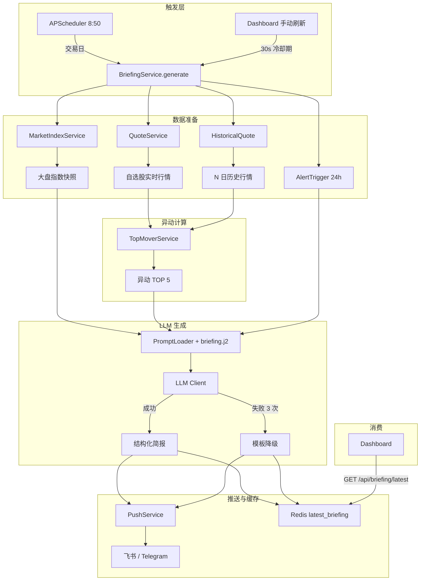

# Implementation Plan: F7 AI 早盘简报

**Branch**: `009-ai-briefing` | **Date**: 2026-06-17 | **Spec**: [spec.md](spec.md)  
**Input**: Feature specification from `/specs/009-ai-briefing/spec.md`

---

## Summary

F7 AI 早盘简报在交易日 8:50 自动聚合大盘指数、自选股行情、历史行情和预警记录，计算异动 TOP 5，调用 LLM 生成自然语言解读，最终通过现有推送通道发送结构化简报。核心设计原则：**复用优先**——尽可能复用 MVP 已落地的行情、推送、缓存和调度基础设施，仅新增必要的简报生成服务、LLM 客户端和 Prompt 模板。

---

## Technical Context

| 项 | 取值 |
|---|---|
| **Language/Version** | Python 3.11+ |
| **Primary Dependencies** | FastAPI, APScheduler, Jinja2, httpx, pandas, SQLAlchemy 2.0 |
| **Storage** | SQLite（持久化）+ Redis（缓存，可选降级） |
| **Testing** | pytest + pytest-playwright |
| **Target Platform** | Linux/macOS/Docker Compose（桌面端 1280px+） |
| **Project Type** | Web service (FastAPI + Jinja2 SSR) |
| **Performance Goals** | 简报生成到推送完成 p95 < 60 秒 |
| **Constraints** | 年运营成本 <= 1000 元；单用户；零成本数据源优先；9:00 前完成推送 |
| **Scale/Scope** | 50-100 只自选股；TOP 5 异动；每日 1 次早盘简报 |

---

## Constitution Check

| 原则 | 影响 | 是否合规 |
|---|---|---|
| I. 信息展示边界 | 简报仅做信息展示，不给出买卖点建议；加免责声明 | ✅ |
| II. 单用户架构 | 不复用 user_id，所有查询按单用户默认处理 | ✅ |
| III. 零成本数据源 | 继续使用 AkShare + BaoStock，不引入付费数据源 | ✅ |
| IV. 推送即核心体验 | 复用飞书 + Telegram 双通道冗余 | ✅ |
| V. 视觉规范 | Dashboard 简报卡片使用 DESIGN.md tokens | ✅ |
| VIII. Tailwind + shadcn/ui | 简报卡片样式复用现有组件 | ✅ |
| XI. 中文界面 | 简报所有文案使用中文 | ✅ |
| XII. 桌面端优先 | 手动刷新入口仅在桌面端 Dashboard 提供 | ✅ |
| XIII. 年运营成本 | LLM 选用 GPT-4o-mini / DeepSeek 低成本模型 | ✅ |

---

## 1. 项目文件结构

### 1.1 Feature 文档

```text
specs/009-ai-briefing/
├── spec.md              # 功能规格（What & Why）
├── plan.md              # 本文件（How）
├── research.md          # 技术选型依据
├── data-model.md        # 数据模型说明
├── quickstart.md        # 配置与验证指南
├── contracts/
│   └── api.md           # 手动触发 / 获取最新简报 API 契约
├── tasks.md             # 任务拆分（下一步生成）
└── checklists/
    └── requirements.md  # Spec 质量检查清单
```

### 1.2 后端源码新增文件

```text
backend/
├── app/
│   ├── services/
│   │   ├── briefing_service.py      # 简报生成编排：数据准备 → 异动计算 → LLM → 推送
│   │   ├── briefing_llm_client.py   # LLM 客户端封装：超时、重试、降级、结构化输出
│   │   ├── top_mover_service.py     # 异动 TOP 5 计算：涨速、成交量突增
│   │   └── prompt_loader.py         # Jinja2 Prompt 模板加载器
│   ├── routers/
│   │   └── briefing.py              # /api/briefing/generate + /api/briefing/latest
│   ├── templates/
│   │   └── prompts/
│   │       └── briefing.j2          # LLM Prompt 模板
│   └── schemas/
│       └── briefing.py              # BriefingRequest / BriefingResponse / TopMover schemas
└── tests/
    ├── unit/
    │   ├── test_briefing_service.py
    │   ├── test_briefing_llm_client.py
    │   ├── test_top_mover_service.py
    │   └── test_prompt_loader.py
    ├── integration/
    │   ├── test_briefing_api.py
    │   └── test_briefing_scheduler.py
    └── e2e/
        └── test_briefing_dashboard.py
```

### 1.3 前端源码变更

```text
frontend/
└── src/
    └── templates/
        ├── components/
        │   └── briefing_card.html     # 现有，更新为展示 AI 解读 + 异动 TOP 5
        └── dashboard.html             # 现有，添加「重新生成简报」按钮
```

### 1.4 后端源码修改文件

```text
backend/app/
├── main.py                          # 注册 briefing 路由
├── core/
│   └── quote_scheduler.py           # 扩展 register_briefing_job 调用 BriefingService
└── services/
    └── push_service.py              # 已有 briefing 格式化，无需改动
```

---

## 2. 数据流向



---

## 3. 依赖清单

### 3.1 现有依赖（无需新增）

| 依赖 | 版本 | 用途 |
|---|---|---|
| Python | 3.11+ | 运行时 |
| FastAPI | 0.110+ | Web 框架 |
| SQLAlchemy | 2.0 | ORM |
| Pydantic | v2 | 数据校验 |
| APScheduler | 最新 | 定时任务 |
| Jinja2 | 最新 | 模板渲染 |
| pandas | 最新 | 历史行情计算 |
| Redis | 可选 | 简报缓存 |

### 3.2 新增依赖

| 依赖 | 版本 | 用途 | 来源 |
|---|---|---|---|
| httpx | 0.27+ | 同步 HTTP 调用 LLM API | PyPI |
| openai | 1.30+ | OpenAI SDK（可选，也可用 httpx 直接调用） | PyPI |

### 3.3 外部服务

| 服务 | 用途 | 成本 |
|---|---|---|
| OpenAI GPT-4o-mini | LLM 生成解读 | 按 token 计费，预计月均 < 10 元 |
| DeepSeek-V3 | 降级 / 备选 LLM | 按 token 计费，成本更低 |

---

## 4. 与现有系统的集成点

### 4.1 复用的现有模块

| 现有模块 | 文件路径 | 复用方式 |
|---|---|---|
| `MarketIndexService` | `backend/app/services/market_index.py` | 获取大盘指数快照 |
| `QuoteService` | `backend/app/services/quote_service.py` | 获取自选股实时行情 |
| `DataSourceFacade` | `backend/app/services/data_source_facade.py` | 获取历史行情 / 全市场数据 |
| `PushService` | `backend/app/services/push_service.py` | 发送 briefing 消息 |
| `QuoteScheduler` | `backend/app/core/quote_scheduler.py` | 注册 8:50 定时任务 |
| `trading_calendar.is_trading_day()` | `backend/app/core/trading_calendar.py` | 交易日判断 |
| `HistoricalQuote` | `backend/app/models/historical_quote.py` | 读取 N 日历史行情 |
| `AlertTrigger` | `backend/app/models/alert_trigger.py` | 读取 24h 预警记录 |
| `RedisCache` / `CacheService` | `backend/app/core/redis_cache.py` / `services/cache_service.py` | 缓存最新简报 |
| `FeishuClient` / `TelegramClient` | `backend/app/services/feishu_client.py` / `telegram_client.py` | 由 PushService 间接复用 |

### 4.2 新建模块

| 新建模块 | 文件路径 | 职责 |
|---|---|---|
| `BriefingService` | `backend/app/services/briefing_service.py` | 编排整个简报生成流程 |
| `BriefingLLMClient` | `backend/app/services/briefing_llm_client.py` | LLM 调用、超时、重试、降级 |
| `TopMoverService` | `backend/app/services/top_mover_service.py` | 异动 TOP 5 计算 |
| `PromptLoader` | `backend/app/services/prompt_loader.py` | 加载 Jinja2 Prompt 模板 |
| `briefing router` | `backend/app/routers/briefing.py` | 手动触发 / 获取最新简报 API |
| `Briefing schemas` | `backend/app/schemas/briefing.py` | Pydantic 请求/响应模型 |
| `briefing.j2` | `backend/app/templates/prompts/briefing.j2` | LLM Prompt 模板 |

### 4.3 修改点

| 修改文件 | 修改内容 |
|---|---|
| `backend/app/main.py` | `include_router(briefing_router)` |
| `backend/app/core/quote_scheduler.py` | `send_briefing_if_trading_day()` 改为调用 `BriefingService.generate()` |
| `frontend/src/templates/components/briefing_card.html` | 展示 `insights` 和 `top_movers` |
| `frontend/src/templates/dashboard.html` | 添加手动刷新按钮与冷却期提示 |

---

## 5. 风险点清单

### 5.1 技术风险

| 风险 | 可能性 | 影响 | 缓解方案 |
|---|---|---|---|
| LLM API 响应慢或超时 | 中 | 简报无法在 9:00 前完成 | 单次 30s 超时 + 5s 重试 + 60s 总上限，超时降级模板简报 |
| LLM 输出格式不可解析 | 中 | 简报结构损坏 | JSON mode / structured output + 异常时降级 |
| LLM 生成投资建议 | 低 | 合规风险 | Prompt 明确禁止投资建议 + 输出后关键词过滤 + 人工兜底免责声明 |
| 全市场数据拉取慢/被封 | 中 | 简报生成延迟 | 自选股优先；全市场补充时限制数量；复用 DataSourceFacade 的熔断降级 |
| 历史行情数据不足 | 中 | 异动计算不准确 | 新股用可用天数 + 标记数据不足 + 降低权重 |
| 简报生成与行情刷新并发 | 中 | 资源竞争 | 简报启动前等待行情刷新最多 15s |
| Redis 不可用时缓存降级 | 低 | 性能下降 | 降级到 SQLite CacheService，功能仍可用 |

### 5.2 运营风险

| 风险 | 可能性 | 影响 | 缓解方案 |
|---|---|---|---|
| LLM 成本超预期 | 低 | 年运营成本 > 1000 元 | 使用 GPT-4o-mini / DeepSeek；非交易日不调用；失败降级 |
| 用户感知简报质量差 | 中 | 产品价值未验证 | Prompt 迭代；收集推送点击率；模板降级兜底 |
| 9:00 前未送达 | 低 | 核心 AC 不满足 | 8:50 提前触发；60s 总超时；异步生成不阻塞 |

### 5.3 集成风险

| 风险 | 可能性 | 影响 | 缓解方案 |
|---|---|---|---|
| Prompt 模板与现有 Jinja2 模板冲突 | 低 | 渲染错误 | Prompt 文件独立目录，命名空间隔离 |
| 新增 router 与现有路由命名冲突 | 低 | 404/500 | 使用 `/api/briefing/*` 前缀 |
| Dashboard 前端状态更新不及时 | 中 | 用户看到旧简报 | 手动刷新后前端轮询 `/api/briefing/latest` |

---

## Complexity Tracking

本 feature 未违反 Constitution 任何原则，无需复杂度豁免。

---

## Next Step

进入 `/speckit.tasks` 生成 `specs/009-ai-briefing/tasks.md`。
