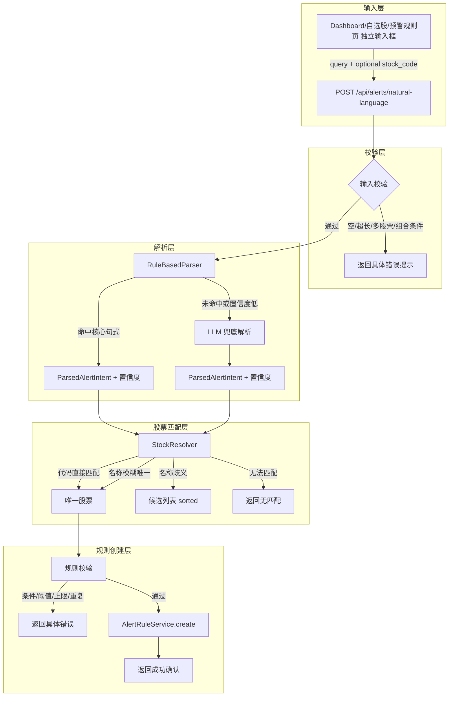

# Implementation Plan: F8 自然语言设预警

**Branch**: `010-natural-language-alert` | **Date**: 2026-06-17 | **Spec**: [spec.md](spec.md)  
**Input**: Feature specification from `/specs/010-natural-language-alert/spec.md`

---

## Summary

F8 自然语言设预警允许用户在 Dashboard/自选股页/预警规则页通过独立的「一句话设预警」输入框，用中文自然语言创建价格/涨跌幅预警规则。系统采用「规则/正则优先解析 + F7 LLM 客户端兜底」的混合解析策略，复用 MVP 的 `stock_search.py`、`alerts.py` router 和 `AlertRule` 模型，歧义时返回排序后的候选列表，由前端携带原 query 与选定股票代码重新提交完成创建。

---

## Technical Context

| 项 | 取值 |
|---|---|
| **Language/Version** | Python 3.11+ |
| **Primary Dependencies** | FastAPI, APScheduler, Jinja2, SQLAlchemy 2.0, Pydantic v2, pandas, httpx |
| **Storage** | SQLite（持久化）+ Redis（缓存，可选降级） |
| **Testing** | pytest + pytest-playwright |
| **Target Platform** | Linux/macOS/Docker Compose（桌面端 1280px+） |
| **Project Type** | Web service (FastAPI + Jinja2 SSR) |
| **Performance Goals** | 自然语言解析到创建完成 p95 < 3 秒 |
| **Constraints** | 年运营成本 <= 1000 元；单用户；零成本数据源优先 |
| **Scale/Scope** | 单用户；4 种条件类型；输入 <= 200 字符；候选 <= 10 只股票 |

---

## Constitution Check

| 原则 | 影响 | 是否合规 |
|---|---|---|
| I. 信息展示边界 | 仅创建预警规则，不涉及交易；提示信息符合合规要求 | ✅ |
| II. 单用户架构 | 单用户默认处理，无多用户扩展 | ✅ |
| III. 零成本数据源 | 股票匹配复用现有数据源，解析不引入付费数据源 | ✅ |
| IV. 推送即核心体验 | 规则创建后由现有预警/推送系统触发，不改动推送架构 | ✅ |
| V. 视觉规范 | 新增输入入口使用 DESIGN.md tokens | ✅ |
| VIII. Tailwind + shadcn/ui | 输入框与候选弹窗复用现有组件 | ✅ |
| XI. 中文界面 | 所有用户-facing 提示文案使用中文 | ✅ |
| XII. 桌面端优先 | 输入入口仅在桌面端 1280px+ 布局中提供 | ✅ |
| XIII. 年运营成本 | LLM 兜底调用量极低，统一使用 DeepSeek-V4-Flash 低成本模型 | ✅ |

---

## Project Structure

### Documentation (this feature)

```text
specs/010-natural-language-alert/
├── spec.md              # 功能规格（What & Why）
├── plan.md              # 本文件（How）
├── research.md          # 解析引擎与集成选型依据
├── data-model.md        # 运行时对象说明
├── quickstart.md        # 配置与验证指南
├── contracts/
│   └── api.md           # 自然语言创建预警 API 契约
├── tasks.md             # 任务拆分（下一步生成）
└── checklists/
    └── requirements.md  # Spec 质量检查清单
```

### 后端源码新增文件

```text
backend/
├── app/
│   ├── services/
│   │   ├── nl_alert_parser.py        # 自然语言解析 orchestrator：规则解析 → LLM 兜底
│   │   ├── rule_based_parser.py      # 规则/正则解析器：提取股票、条件、阈值、置信度
│   │   └── stock_resolver.py         # 股票名称/代码匹配与歧义候选排序
│   ├── routers/
│   │   └── alerts_nl.py              # POST /api/alerts/natural-language
│   ├── schemas/
│   │   └── nl_alert.py               # NaturalLanguageAlertRequest / Response / Candidate schemas
│   └── templates/
│       └── prompts/
│           └── nl_alert.j2           # LLM 兜底 Prompt 模板
└── tests/
    ├── unit/
    │   ├── test_rule_based_parser.py
    │   ├── test_stock_resolver.py
    │   └── test_nl_alert_parser.py
    ├── integration/
    │   └── test_alerts_nl_api.py
    └── e2e/
        └── test_nl_alert_dashboard.py
```

### 前端源码变更

```text
frontend/
└── src/
    └── templates/
        ├── components/
        │   └── nl_alert_input.html     # 「一句话设预警」输入框组件（含候选弹窗）
        ├── dashboard.html              # 引入 nl_alert_input 组件
        ├── watchlist.html              # 引入 nl_alert_input 组件
        └── alert_rules.html            # 引入 nl_alert_input 组件
```

### 后端源码修改文件

```text
backend/app/
├── main.py                          # include_router(alerts_nl_router)
├── routers/
│   └── alerts.py                    # 无改动，复用已有创建逻辑
├── services/
│   ├── stock_search.py              # 扩展候选排序与模糊匹配能力
│   └── push_service.py              # 无改动
└── services/prompt_loader.py        # 复用 F7 PromptLoader 渲染 nl_alert.j2
```

---

## Data Flow



---

## Dependency List

### 现有依赖（无需新增）

| 依赖 | 版本 | 用途 |
|---|---|---|
| Python | 3.11+ | 运行时 |
| FastAPI | 0.110+ | Web 框架 |
| SQLAlchemy | 2.0 | ORM |
| Pydantic | v2 | 数据校验 |
| Jinja2 | 最新 | Prompt 模板渲染 |
| Redis | 可选 | 缓存 |

### 新增依赖

| 依赖 | 版本 | 用途 | 来源 |
|---|---|---|---|
| httpx | 0.27+ | DeepSeek API HTTP 调用（F7 已引入） | PyPI |

**说明**：v1.1 不额外引入 `openai` SDK，复用 F7 的 `httpx` 调用方式。

### 外部服务

| 服务 | 用途 | 成本 |
|---|---|---|
| DeepSeek-V4-Flash | LLM 兜底解析复杂/同义表达 | 按 token 计费，预计月均 < 5 元 |

**说明**：v1.1 统一使用 DeepSeek，不引入 OpenAI 备选；规则解析优先，LLM 兜底调用量极低。

---

## Integration Points

### 复用的现有模块

| 现有模块 | 文件路径 | 复用方式 |
|---|---|---|
| `AlertRule` 模型 | `backend/app/models/alert_rule.py` | 写入最终规则 |
| `alerts.py` router | `backend/app/routers/alerts.py` | 复用已有规则创建校验逻辑 |
| `alerts` schema | `backend/app/schemas/alert.py` | 复用规则校验字段 |
| `stock_search.py` | `backend/app/services/stock_search.py` | 股票代码/名称匹配 |
| `PromptLoader` | `backend/app/services/prompt_loader.py` | 渲染 LLM Prompt（F7 引入） |
| `BriefingLLMClient` | `backend/app/services/briefing_llm_client.py` | 复用 LLM 调用/超时/重试（F7 引入） |
| `trading_calendar` | `backend/app/core/trading_calendar.py` | 无需使用 |

### 新建模块

| 新建模块 | 文件路径 | 职责 |
|---|---|---|
| `RuleBasedParser` | `backend/app/services/rule_based_parser.py` | 规则/正则提取股票、条件类型、阈值、置信度 |
| `StockResolver` | `backend/app/services/stock_resolver.py` | 股票匹配、歧义候选排序、候选字段构建 |
| `NLAlertParser` | `backend/app/services/nl_alert_parser.py` | 编排规则解析 → LLM 兜底 → 返回意图 |
| `alerts_nl router` | `backend/app/routers/alerts_nl.py` | POST /api/alerts/natural-language |
| `nl_alert schemas` | `backend/app/schemas/nl_alert.py` | Pydantic 请求/响应/候选模型 |
| `nl_alert.j2` | `backend/app/templates/prompts/nl_alert.j2` | LLM 兜底 Prompt 模板 |

### 修改点

| 修改文件 | 修改内容 |
|---|---|
| `backend/app/main.py` | `include_router(alerts_nl_router)` |
| `backend/app/services/stock_search.py` | 扩展候选排序（相似度+总市值）、返回行业/市值字段 |
| `frontend/src/templates/dashboard.html` | 引入「一句话设预警」输入框组件 |
| `frontend/src/templates/watchlist.html` | 引入「一句话设预警」输入框组件 |
| `frontend/src/templates/alert_rules.html` | 引入「一句话设预警」输入框组件 |

---

## Risk List

### 技术风险

| 风险 | 可能性 | 影响 | 缓解方案 |
|---|---|---|---|
| 规则解析覆盖不足 | 中 | 用户常用句式无法命中 | LLM 兜底 + Prompt 持续迭代 + 用户反馈收集 |
| LLM 解析输出格式不可解析 | 中 | 创建失败或错误规则 | JSON mode + structured output + 异常降级 |
| LLM 响应慢导致超时 | 低 | 超过 3 秒目标 | 规则优先命中大多数场景，LLM 兜底仅用于复杂句式 |
| 股票名称歧义排序不符合预期 | 中 | 用户需滚动查找 | 相似度优先 + 总市值辅助 + 允许前端搜索过滤 |
| 阈值单位歧义（价格 vs 百分比） | 中 | 创建错误条件 | 规则中按条件类型明确单位；LLM Prompt 强调单位 |

### 运营风险

| 风险 | 可能性 | 影响 | 缓解方案 |
|---|---|---|---|
| LLM 成本超预期 | 低 | 年运营成本 > 1000 元 | 规则优先减少 LLM 调用量；使用 GPT-4o-mini / DeepSeek |
| 用户首次成功率未达 70% | 中 | 产品价值未验证 | 埋点统计 + Prompt/规则迭代 + 明确错误引导 |
| 低置信度误判导致体验差 | 中 | 合法输入被拒绝 | 置信度阈值可配置；根据上线反馈调整 |

### 集成风险

| 风险 | 可能性 | 影响 | 缓解方案 |
|---|---|---|---|
| 新增 router 与现有路由命名冲突 | 低 | 404/500 | 使用 `/api/alerts/natural-language` 前缀 |
| 前端组件与现有搜索框样式冲突 | 低 | 视觉不一致 | 独立组件命名空间；使用 DESIGN.md tokens |
| LLM Prompt 与 F7 模板冲突 | 低 | 渲染错误 | Prompt 文件独立命名 `nl_alert.j2` |

---

## Complexity Tracking

本 feature 未违反 Constitution 任何原则，无需复杂度豁免。

---

## Next Step

进入 `/speckit.tasks` 生成 `specs/010-natural-language-alert/tasks.md`。
