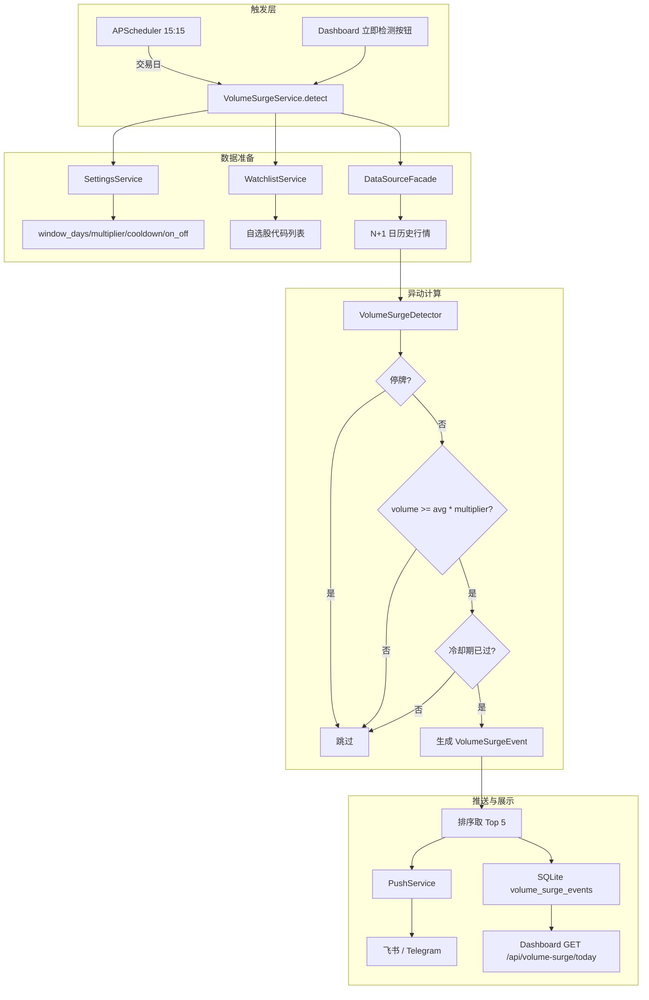

# Implementation Plan: F9 成交量异动检测

**Branch**: `011-volume-surge-alert` | **Date**: 2026-06-17 | **Spec**: [spec.md](spec.md)  
**Input**: Feature specification from `/specs/011-volume-surge-alert/spec.md`

---

## Summary

F9 成交量异动检测在每个 A 股交易日收盘后 15 分钟（15:15）自动扫描用户自选股，当某只股票当日成交量相对 N 日均量突破 M 倍时生成 `VolumeSurgeEvent`，通过现有推送通道发送 Top 5 汇总通知，并在 Dashboard 卡片展示。用户可在预警规则页开启/关闭检测并调整窗口、倍数、冷却期参数，也可在 Dashboard 卡片手动触发即时检测。

---

## Technical Context

| 项 | 取值 |
|---|---|
| **Language/Version** | Python 3.11+ |
| **Primary Dependencies** | FastAPI, APScheduler, SQLAlchemy 2.0, Pydantic v2, pandas |
| **Storage** | SQLite（持久化）+ Redis（缓存，可选降级） |
| **Testing** | pytest + pytest-playwright |
| **Target Platform** | Linux/macOS/Docker Compose（桌面端 1280px+） |
| **Project Type** | Web service (FastAPI + Jinja2 SSR) |
| **Performance Goals** | 50 只自选股检测 p95 < 30 秒 |
| **Constraints** | 年运营成本 <= 1000 元；单用户；零成本数据源优先 |
| **Scale/Scope** | 单用户；仅自选股；日频检测；Top 5 推送 |

---

## Constitution Check

| 原则 | 影响 | 是否合规 |
|---|---|---|
| I. 信息展示边界 | 仅展示成交量异动信息，不给出交易建议 | ✅ |
| II. 单用户架构 | 单用户默认处理，无多用户扩展 | ✅ |
| III. 零成本数据源 | 复用现有 A 股数据源，不引入付费数据源 | ✅ |
| IV. 推送即核心体验 | 异动触发后通过飞书/Telegram 双通道推送 | ✅ |
| V. 视觉规范 | Dashboard 卡片使用 DESIGN.md tokens | ✅ |
| VIII. Tailwind + shadcn/ui | 卡片与设置控件复用现有组件 | ✅ |
| XI. 中文界面 | 所有用户-facing 文案使用中文 | ✅ |
| XII. 桌面端优先 | 卡片与设置页仅在桌面端布局中提供 | ✅ |
| XIII. 年运营成本 | 不引入外部付费服务 | ✅ |

---

## Project Structure

### Documentation (this feature)

```text
specs/011-volume-surge-alert/
├── spec.md              # 功能规格（What & Why）
├── plan.md              # 本文件（How）
├── research.md          # 数据模型与检测算法选型依据
├── data-model.md        # 数据模型说明
├── quickstart.md        # 配置与验证指南
├── contracts/
│   └── api.md           # 手动触发 / 获取异动列表 API 契约
├── tasks.md             # 任务拆分（下一步生成）
└── checklists/
    └── requirements.md  # Spec 质量检查清单
```

### 后端源码新增文件

```text
backend/
├── app/
│   ├── models/
│   │   └── volume_surge_event.py     # VolumeSurgeEvent SQLAlchemy 模型
│   ├── services/
│   │   ├── volume_surge_service.py   # 检测 orchestrator：数据拉取 → 计算 → 持久化 → 推送
│   │   └── volume_surge_detector.py  # 单只股票异动判断逻辑
│   ├── routers/
│   │   └── volume_surge.py           # POST /api/volume-surge/detect + GET /api/volume-surge/today
│   └── schemas/
│       └── volume_surge.py           # VolumeSurgeEvent / DetectRequest / TodayResponse schemas
└── tests/
    ├── unit/
    │   ├── test_volume_surge_detector.py
    │   └── test_volume_surge_service.py
    ├── integration/
    │   └── test_volume_surge_api.py
    └── e2e/
        └── test_volume_surge_dashboard.py
```

### 前端源码变更

```text
frontend/
└── src/
    └── templates/
        ├── components/
        │   └── volume_surge_card.html    # Dashboard 成交量异动卡片（含 Top 5 + 查看全部 + 立即检测）
        └── alert_rules.html              # 新增成交量异动检测开关与阈值设置
```

### 后端源码修改文件

```text
backend/app/
├── main.py                          # 注册 volume_surge router
├── core/
│   └── quote_scheduler.py           # 注册 15:15 定时检测任务
├── services/
│   ├── push_service.py              # 新增 volume_surge 消息格式化
│   └── settings_service.py          # 新增 volume_surge 配置读写
└── models/
    └── __init__.py                  # 导出 VolumeSurgeEvent
```

---

## Data Flow



---

## Dependency List

### 现有依赖（无需新增）

| 依赖 | 版本 | 用途 |
|---|---|---|
| Python | 3.11+ | 运行时 |
| FastAPI | 0.110+ | Web 框架 |
| SQLAlchemy | 2.0 | ORM |
| Pydantic | v2 | 数据校验 |
| APScheduler | 最新 | 定时任务 |
| pandas | 最新 | 历史行情计算 |

### 新增依赖

无新增外部依赖。

### 外部服务

无新增外部服务。

---

## Integration Points

### 复用的现有模块

| 现有模块 | 文件路径 | 复用方式 |
|---|---|---|
| `WatchlistService` | `backend/app/services/watchlist_service.py` | 获取自选股列表 |
| `DataSourceFacade` | `backend/app/services/data_source_facade.py` | 获取历史行情 |
| `HistoricalQuote` | `backend/app/models/historical_quote.py` | 读取历史成交量 |
| `PushService` | `backend/app/services/push_service.py` | 发送异动通知 |
| `QuoteScheduler` | `backend/app/core/quote_scheduler.py` | 注册 15:15 定时任务 |
| `trading_calendar.is_trading_day()` | `backend/app/core/trading_calendar.py` | 交易日判断 |
| `SettingsService` | `backend/app/services/settings_service.py` | 持久化用户配置 |
| `FeishuClient` / `TelegramClient` | 由 PushService 间接复用 | 推送通道 |

### 新建模块

| 新建模块 | 文件路径 | 职责 |
|---|---|---|
| `VolumeSurgeEvent` 模型 | `backend/app/models/volume_surge_event.py` | 异动事件持久化 |
| `VolumeSurgeDetector` | `backend/app/services/volume_surge_detector.py` | 单只股票异动判断 |
| `VolumeSurgeService` | `backend/app/services/volume_surge_service.py` | 检测流程编排 |
| `volume_surge router` | `backend/app/routers/volume_surge.py` | 手动触发 / 今日列表 API |
| `volume_surge schemas` | `backend/app/schemas/volume_surge.py` | Pydantic 请求/响应模型 |

### 修改点

| 修改文件 | 修改内容 |
|---|---|
| `backend/app/main.py` | `include_router(volume_surge_router)` |
| `backend/app/core/quote_scheduler.py` | 注册 `detect_volume_surge_if_trading_day()` 15:15 任务 |
| `backend/app/services/push_service.py` | 新增 `volume_surge` 消息格式化 |
| `backend/app/services/settings_service.py` | 新增 volume_surge 配置读写 |
| `frontend/src/templates/dashboard.html` | 引入 volume_surge_card 组件 |
| `frontend/src/templates/alert_rules.html` | 新增成交量异动设置区域 |

---

## Risk List

### 技术风险

| 风险 | 可能性 | 影响 | 缓解方案 |
|---|---|---|---|
| 数据源 15:15 未更新日 K | 中 | 检测时当日成交量缺失 | 检测前等待 15 分钟；数据缺失时跳过并记录日志 |
| 历史行情拉取被限流 | 中 | 检测超时 | 批量拉取 + 限制单次请求股票数；异常时部分检测 |
| 新股/次新股数据不足 | 中 | 均量计算偏差 | 使用可用天数 + 标记 `limited` 数据质量 |
| 停牌判断误判 | 低 | 漏检或误检 | 成交量为 0 且收盘价等于昨收双重判断 |
| 检测与行情刷新并发 | 中 | 资源竞争 | 检测任务启动前等待行情刷新完成 |

### 运营风险

| 风险 | 可能性 | 影响 | 缓解方案 |
|---|---|---|---|
| 阈值设置过敏感导致推送骚扰 | 中 | 用户关闭功能 | 默认 2.0 倍/20 日窗口；提供阈值调整 |
| 用户感知异动质量差 | 中 | 产品价值未验证 | 收集推送点击率；默认仅自选股降低噪声 |
| 15:15 后数据源异常未检测 | 低 | 当日无推送 | 提供手动检测入口；记录失败日志 |

### 集成风险

| 风险 | 可能性 | 影响 | 缓解方案 |
|---|---|---|---|
| 新增表与现有模型迁移冲突 | 低 | 启动失败 | 使用 Alembic 迁移；SQLite 开发环境自动创建 |
| Dashboard 卡片与现有布局冲突 | 低 | 视觉错乱 | 复用现有卡片组件；1280px 桌面布局验证 |
| 新增 router 与现有路由命名冲突 | 低 | 404/500 | 使用 `/api/volume-surge/*` 前缀 |

---

## Complexity Tracking

本 feature 未违反 Constitution 任何原则，无需复杂度豁免。

---

## Next Step

进入 `/speckit.tasks` 生成 `specs/011-volume-surge-alert/tasks.md`。
