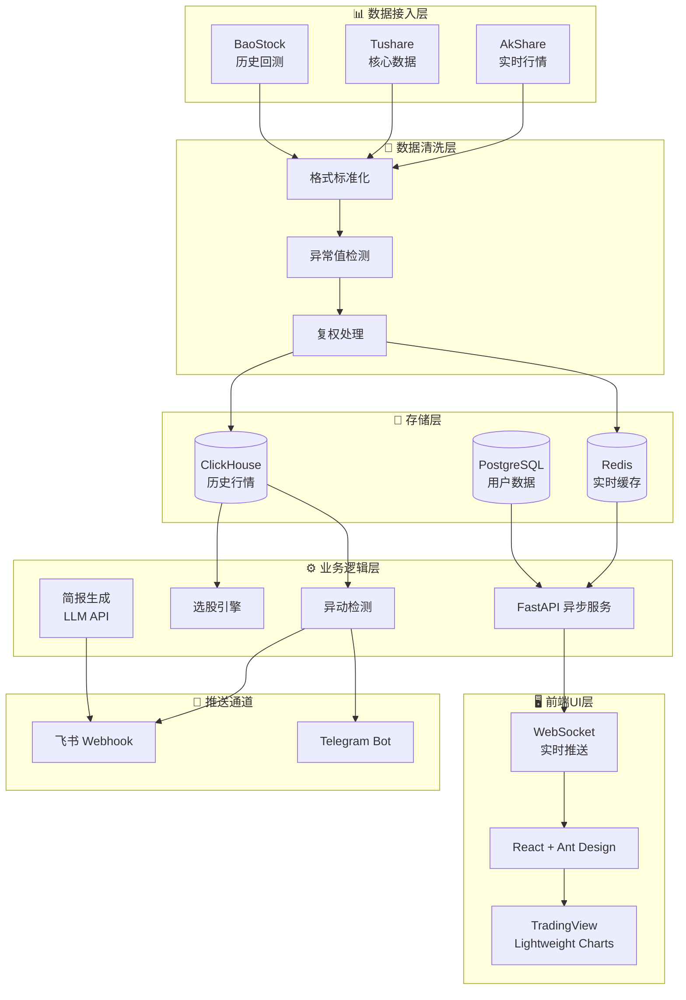

# 调研主题4：A股自动盯盘AI助手——技术实现方案

> 调研日期：2026-05-25
> 调研方法：WebSearch/WebFetch + muyu-search-mcp 双路交叉验证
> 调研范围：数据接入、存储层、业务逻辑、前端UI、推送通道、部署运维

---

## 一、总体推荐技术栈

| 模块 | 推荐方案 | 核心组件 |
|------|---------|---------|
| 数据接入 | 多源聚合 | AkShare（主）+ Tushare免费版（补）+ BaoStock（备） |
| 存储层 | 分层存储 | ClickHouse（历史行情）+ Redis（实时缓存）+ PostgreSQL（用户数据） |
| 业务逻辑 | Python异步服务 | FastAPI + pandas/numpy + LLM API |
| 前端UI | React + WebSocket | React + TradingView Lightweight Charts |
| 推送通道 | 双通道冗余 | 飞书Webhook（主）+ Telegram Bot（备） |
| 部署运维 | 云服务器 + Docker | 阿里云/腾讯云轻量服务器 + Docker Compose |

---

## 二、模块1：数据接入

### 2.1 数据源选型对比

#### 方案A：AkShare（推荐主数据源）

| 维度 | 详情 |
|------|------|
| 费用 | 完全免费开源 |
| 认证 | 无需注册，即装即用 |
| 实时性 | 1-5分钟延迟（新浪财经/东方财富源） |
| 频率限制 | 无显式限制，实际受反爬约束，建议 <1次/秒 |
| 稳定性 | ~95%，接口可能随源站变动 |
| A股覆盖 | 完整（行情、财务、板块、概念） |

**优势**：零门槛、接口丰富、社区活跃、无需积分焦虑。
**劣势**：无SLA保障，生产环境需异常处理；高频调用有被封IP风险。

#### 方案B：Tushare（推荐补充数据源）

| 维度 | 详情 |
|------|------|
| 费用 | 积分制，免费版每日约200次调用 |
| 认证 | 需注册Token，实名认证 |
| 实时性 | 秒级延迟（Pro版） |
| 频率限制 | 免费版50次/分钟，日约200-500次 |
| 稳定性 | >99%，专业级数据质量 |
| A股覆盖 | 完整，分钟级数据需额外付费¥1000/月 |

**优势**：数据质量最高，有SLA保障，适合生产环境核心数据。
**劣势**：免费版额度极低，全市场扫描需分多日完成；分钟级数据强制付费。

#### 方案C：BaoStock（推荐历史回测备用）

| 维度 | 详情 |
|------|------|
| 费用 | 完全免费 |
| 认证 | 无需注册，需 `bs.login()` |
| 实时性 | 仅T+1历史数据，不支持实时 |
| 频率限制 | 基本无限制 |
| 稳定性 | ~90-98% |
| A股覆盖 | 完整，仅限A股 |

**优势**：调用最宽松，适合批量下载历史数据做回测。
**劣势**：无实时行情，无法满足盯盘需求。

### 2.2 数据清洗方案

| 清洗环节 | 方法 | 工具 |
|---------|------|------|
| 格式标准化 | 统一字段命名、类型转换 | pandas dtype + 映射表 |
| 缺失值处理 | 前向填充/线性插值/标记删除 | pandas fillna/interpolate |
| 异常值检测 | Z-Score > 3 或 MAD（中位数绝对偏差） | scipy.stats |
| 时间对齐 | 交易日历对齐、去除非交易时段数据 | pandas reindex + 交易日历 |
| 去重 | 按 (code, timestamp) 联合去重 | pandas drop_duplicates |
| 复权处理 | 前复权/后复权价格计算 | 自行实现或复用 akshare 复权数据 |

### 2.3 数据接入架构

```
┌─────────────┐    ┌─────────────┐    ┌─────────────┐
│  AkShare    │    │ Tushare(免费)│    │  BaoStock   │
│  (实时行情)  │    │  (核心数据)  │    │ (历史回测)  │
└──────┬──────┘    └──────┬──────┘    └──────┬──────┘
       │                  │                  │
       └──────────────────┼──────────────────┘
                          ▼
              ┌─────────────────────┐
              │   Python 清洗层      │
              │  (pandas/异步队列)   │
              └──────────┬──────────┘
                         ▼
              ┌─────────────────────┐
              │   数据分发器         │
              │  (Redis Pub/Sub)    │
              └──────────┬──────────┘
                         ▼
       ┌─────────────────┼─────────────────┐
       ▼                 ▼                 ▼
  ┌─────────┐      ┌─────────┐      ┌─────────┐
  │ClickHouse│      │  Redis  │      │PostgreSQL│
  │(历史落盘) │      │(实时缓存)│      │(用户数据) │
  └─────────┘      └─────────┘      └─────────┘
```

### 2.4 推荐与理由

**推荐**：AkShare 为主 + Tushare 免费版补充 + BaoStock 容灾备份。

- **为什么不用 Tushare 作为主数据源**：免费版日调用仅约200次，获取全市场5000+只股票的日线数据需要分批多日，无法满足日常扫描需求。
- **为什么不用单一数据源**：AkShare 接口可能随源站变动，多源聚合可提高可用性。
- **为什么不用付费数据商**（如 AllTick、TickDB）：个人盯盘场景下免费数据源已足够，付费数据商 Level-2 行情月费数百至数千元，成本过高。

### 2.5 工作量预估

| 任务 | 人天 |
|------|------|
| AkShare/Tushare/BaoStock 接入封装 | 3 |
| 数据清洗 pipeline（标准化+异常检测+复权） | 5 |
| 多源容灾与自动切换逻辑 | 2 |
| 交易日历与调度系统 | 2 |
| **小计** | **12** |

---

## 三、模块2：存储层

### 3.1 历史行情存储对比

#### 方案A：ClickHouse（推荐）

| 维度 | 详情 |
|------|------|
| 许可证 | Apache 2.0，商用友好 |
| 写入性能 | 单节点每秒百万级行写入 |
| 压缩率 | >5:1（金融tick数据） |
| 查询性能 | 数十亿行毫秒级聚合查询 |
| SQL支持 | 完整，支持窗口函数、物化视图 |
| 部署难度 | Docker 一键启动，单机即可 |
| 金融案例 | Longbridge（长桥证券）获10倍性能提升 |

**优势**：金融场景适配强、开源免费、SQL功能全面、单机性能足够个人使用。
**劣势**：非原生时序数据库，缺少连续聚合等专用功能；学习曲线略高于关系型数据库。

#### 方案B：TDengine

| 维度 | 详情 |
|------|------|
| 许可证 | AGPL 3.0（网络服务需开源） |
| 写入性能 | 单节点每秒3万行+ |
| 压缩率 | ~16-23%（82亿条数据92GB→20GB） |
| 查询性能 | 毫秒级（同花顺、弘源泰平等真实案例） |
| 金融案例 | 同花顺、弘源泰平、同心源基金 |

**优势**：时序专用设计（超级表+子表），IoT benchmark 中全面领先 InfluxDB。
**劣势**：AGPL 许可证对个人闭源项目不友好；金融场景案例虽多但学习成本较高。

#### 方案C：InfluxDB

| 维度 | 详情 |
|------|------|
| 许可证 | MIT（v1/v2）/ 功能受限（v3 OSS） |
| 写入性能 | 中等，benchmark 中落后于 ClickHouse/TDengine |
| 生态 | 时序数据库老牌，监控场景成熟 |
| 金融场景 | 性能不足，非首选 |

**劣势**：v3 开源版功能被大幅限制；金融tick数据场景 benchmark 表现落后；存储效率低于 ClickHouse 和 TDengine。

### 3.2 实时数据缓存

| 方案 | 用途 | 推荐度 |
|------|------|--------|
| **Redis** | 最新行情快照、Pub/Sub实时推送、热点数据缓存 | ⭐⭐⭐ 强烈推荐 |
| 本地内存（Python dict） | 单进程原型快速验证 | ⭐⭐ 仅原型 |

Redis 是实时缓存的唯一推荐：支持 Pub/Sub 实现跨进程/跨服务器广播，配合 FastAPI WebSocket 可实现低延迟（~100ms）实时推送。

### 3.3 用户数据存储

| 方案 | 用途 | 推荐度 |
|------|------|--------|
| **PostgreSQL** | 用户账户、自选股、策略配置、告警规则 | ⭐⭐⭐ 推荐 |
| SQLite | 单用户本地部署，零配置 | ⭐⭐ 个人版可选 |
| MySQL | 团队版备选，生态成熟 | ⭐⭐ 备选 |

### 3.4 推荐与理由

**推荐**：ClickHouse（历史行情）+ Redis（实时缓存）+ PostgreSQL（用户数据）。

- **为什么不用 TDengine**：AGPL 3.0 许可证要求网络服务开源，对闭源商业项目有风险；个人学习成本高。
- **为什么不用 InfluxDB**：v3 OSS 功能受限，金融场景 benchmark 落后，存储效率低。
- **为什么不用纯 PostgreSQL 存历史行情**：PostgreSQL 是行式存储，面对数十亿行时序数据的聚合查询性能远不如 ClickHouse 的列式存储。

### 3.5 工作量预估

| 任务 | 人天 |
|------|------|
| ClickHouse 表结构设计（分区、MergeTree引擎） | 3 |
| Redis 缓存层与 Pub/Sub 封装 | 2 |
| PostgreSQL 用户/策略/告警表设计 | 2 |
| 数据写入与查询接口封装 | 3 |
| **小计** | **10** |

---

## 四、模块3：业务逻辑

### 4.1 自选股管理

| 实现方式 | 技术要点 |
|---------|---------|
| 数据模型 | user_id + stock_code + group_name + alert_rules（JSON） |
| API设计 | CRUD REST API，支持批量导入/导出 |
| 实时关联 | 用户订阅股票列表 → Redis Set 维护 → 数据接入层按需推送 |
| 持久化 | PostgreSQL 主存 + Redis 热点缓存 |

### 4.2 选股引擎

| 实现层次 | 技术方案 |
|---------|---------|
| 基础层 | pandas/numpy 批量计算全市场技术指标 |
| 指标库 | ta-lib 或 pandas-ta（MA、MACD、BOLL、KDJ、RSI、CCI） |
| 筛选器 | 多条件组合过滤：涨幅、成交量、市盈率、市值、板块 |
| 排序 | 多因子加权排序，支持自定义权重 |
| 调度 | APScheduler / Celery 定时扫描（盘前/盘中/盘后） |

**为什么不从头实现指标计算**：ta-lib 是金融指标计算的事实标准，C底层实现，性能远超纯 Python 手写；pandas-ta 纯 Python 但接口更友好，适合快速迭代。

### 4.3 异动检测

| 检测类型 | 算法/方法 | 实现工具 |
|---------|----------|---------|
| 价格异动 | 涨跌幅阈值 + 涨速（N分钟内涨幅） | pandas rolling + 阈值判断 |
| 成交量异动 | 成交量突增（对比N日均量倍数） | pandas rolling mean + ratio |
| 量价背离 | 价升量缩 / 价跌量增检测 | 相关系数 + 阈值 |
| 异常波动 | Z-Score > 3 或 MAD（中位数绝对偏差） | scipy.stats |
| 时间序列异常 | MSET-SPRT 组合方法 | 自研或 statsmodels |
| 板块/概念异动 | 板块内多股同时触发异动 | 聚类 + 计数 |

**推荐实现**：以规则引擎为主（阈值+统计方法），辅以简单的机器学习异常检测（可选）。

- **为什么不用深度学习做异动检测**：深度学习需要大量标注数据，且模型解释性差；规则引擎透明可控，适合盯盘场景的可解释性要求。
- **什么时候用深度学习**：仅在积累足够历史标注数据后，作为规则引擎的补充，而非替代。

### 4.4 简报生成

| 实现方式 | 技术要点 |
|---------|---------|
| 模板引擎 | Jinja2 生成结构化文本 |
| LLM增强 | 调用 OpenAI/Claude/国产大模型 API，将结构化数据转化为自然语言简报 |
| 上下文构建 | 提取当日异动股票列表 + 关键指标 + 板块热力图 → 构造 Prompt |
| 成本控制 | 使用 GPT-4o-mini / 国产便宜模型（如 DeepSeek-V2 / 文心一言） |
| 缓存 | 同一交易日简报生成后缓存，避免重复调用 LLM |

### 4.5 后端框架选型

| 框架 | 适用性 | 推荐度 |
|------|--------|--------|
| **FastAPI** | 异步原生、WebSocket支持、自动生成API文档、性能接近Go/Node | ⭐⭐⭐ 强烈推荐 |
| Flask | 简单灵活，但同步模型，高并发需Gunicorn+gevent | ⭐⭐ 备选 |
| Django | 功能全但重型，ORM绑定深，不适合纯API服务 | ⭐ 不推荐 |
| Spring Boot | Java生态强，但开发效率低于Python，个人项目过重 | ⭐ 不推荐 |

**推荐 FastAPI 的理由**：
- 原生异步支持，单进程可处理数千并发连接
- 内置 WebSocket，无需额外框架
- Pydantic 自动校验，开发效率高
- 自动生成交互式 API 文档（Swagger UI）
- 量化社区普遍采用 Python，生态一致

### 4.6 工作量预估

| 任务 | 人天 |
|------|------|
| FastAPI 项目脚手架与中间件 | 2 |
| 自选股管理 CRUD API | 3 |
| 选股引擎（指标计算+多条件筛选） | 5 |
| 异动检测引擎（规则+统计方法） | 5 |
| 简报生成（模板+LLM接入） | 3 |
| 告警规则引擎 | 3 |
| **小计** | **21** |

---

## 五、模块4：前端UI

### 5.1 Web框架

| 框架 | 优势 | 劣势 | 推荐度 |
|------|------|------|--------|
| **React** | 生态最丰富，组件库成熟，招聘容易 | 学习曲线略陡 | ⭐⭐⭐ 推荐 |
| Vue 3 | 上手快，国内社区活跃 | 大型项目生态略逊于React | ⭐⭐⭐ 推荐 |
| Next.js | SSR+SSG，SEO友好 | 对个人工具类项目非必需 | ⭐⭐ 可选 |

**推荐 React**：量化/金融前端生态更偏向 React；TradingView 官方示例以 React 为主。

### 5.2 组件库

| 组件库 | 特点 | 推荐度 |
|--------|------|--------|
| **Ant Design** | 企业级设计规范，表格/表单/弹窗丰富，国内最流行 | ⭐⭐⭐ 推荐 |
| MUI (Material-UI) | 国际化强，设计现代 | ⭐⭐ 备选 |
| shadcn/ui | 2024热门，基于 Tailwind，可定制性强 | ⭐⭐ 新兴备选 |

### 5.3 实时行情图表库

| 图表库 | 许可证 | 特点 | 推荐度 |
|--------|--------|------|--------|
| **TradingView Lightweight Charts** | Apache 2.0 | 金融专用，K线/均线/十字光标/缩放拖拽原生支持，~14.9K Stars，压缩后仅几百KB | ⭐⭐⭐ 强烈推荐 |
| ECharts | Apache 2.0 | 通用图表库，K线只是其中一种，社区庞大 | ⭐⭐⭐ 备选 |
| kline-charts-react | 开源 | 2025新品，React专用，内置stock-sdk，5行代码出图 | ⭐⭐ 快速原型可选 |
| TradingVue.js | MIT | 专为交易设计，支持自定义指标和画线 | ⭐⭐ 专业交易界面可选 |

**推荐 TradingView Lightweight Charts**：
- 专为金融时序数据优化，性能碾压通用图表库
- Apache 2.0 完全开源免费商用
- 社区庞大，文档完善
- 与 React/Vue 集成成熟

**为什么不用 ECharts 作为主图表**：ECharts 是通用图表库，K线交互体验（缩放、十字光标、时间轴）不如 TradingView Lightweight Charts 专业；但在仪表盘、板块热力图等场景可作为补充。

### 5.4 实时数据通信

| 方案 | 延迟 | 方向 | 推荐度 |
|------|------|------|--------|
| **WebSocket** | ~100ms | 全双工 | ⭐⭐⭐ 强烈推荐 |
| Server-Sent Events (SSE) | ~100ms | 服务端→客户端单向 | ⭐⭐ 简单场景可选 |
| 长轮询 | 数百ms~秒级 | 伪实时 | ⭐ 不推荐 |

**架构**：FastAPI WebSocket Endpoint ←→ Redis Pub/Sub ←→ 数据接入层推送。

### 5.5 工作量预估

| 任务 | 人天 |
|------|------|
| React 项目脚手架 + Ant Design 集成 | 2 |
| TradingView Lightweight Charts 集成 | 3 |
| WebSocket 实时行情推送对接 | 3 |
| 自选股管理页面 | 3 |
| 选股结果/异动告警页面 | 2 |
| 简报展示页面 | 2 |
| 移动端适配（响应式/PWA） | 3 |
| **小计** | **18** |

---

## 六、模块5：推送通道

### 6.1 方案对比

| 维度 | 飞书 | 企业微信 | 钉钉 | Telegram |
|------|------|---------|------|----------|
| **免费API额度** | 10,000次/月 | 每API 1万次/分 | 5,000次/月 | 完全免费 |
| **付费门槛** | 标准版 600元/年（无限制） | 认证300元/年+接口阶梯费 | 专业版 9,800元/年 | 无 |
| **Webhook机器人** | ✅ 支持 | ✅ 支持 | ✅ 支持 | ✅ 支持 |
| **Stream/WebSocket** | ✅ 官方支持 | ✅ 支持 | ✅ 官方支持 | ✅ 支持 |
| **消息丰富度** | 富文本、卡片、交互组件 | 文本、图文、卡片 | Markdown、卡片 | Markdown、富文本 |
| **国内访问** | ✅ 稳定 | ✅ 最稳定 | ✅ 稳定 | ⚠️ 需代理 |
| **开发者体验** | ⭐⭐⭐⭐⭐ 文档清晰 | ⭐⭐⭐⭐ 生态庞大 | ⭐⭐⭐⭐ 应用市场大 | ⭐⭐⭐⭐⭐ Bot API极简 |
| **微信生态** | ❌ 弱 | ✅ 最强 | ⚠️ 一般 | ❌ 无 |

### 6.2 各方案深入分析

#### 飞书（推荐主推送通道）

- **成本**：个人/小团队免费额度 10,000次/月足够；如需无限制，标准版仅 600元/年，性价比最高
- **接入难度**：Webhook 机器人 10分钟可接入；Stream 模式需申请权限但文档清晰
- **消息体验**：交互式卡片最丰富，支持按钮、下拉菜单等交互组件
- **适合场景**：内部团队盯盘、AI简报推送、异动告警

#### 企业微信

- **成本**：认证费 300元/年 mandatory；API 接口按规模阶梯收费，深度集成可达数万元/年
- **优势**：无缝对接微信 12亿用户，可直接推送到个人微信
- **劣势**：API 成本不透明，深度集成费用高；免费版按频率限制但无次数上限

#### 钉钉

- **成本**：专业版固定 9,800元/年，不限人数；AI功能额外 +1万元/年
- **优势**：生态最庞大，通义千问集成
- **劣势**：对个人/小团队成本过高；固定费用模式对小团队不划算

#### Telegram

- **成本**：Bot API 完全免费，无调用限制
- **优势**：API 极简，5分钟可接入；消息格式灵活
- **劣势**：国内访问不稳定，需配置代理或海外服务器；用户基数在国内远小于微信

### 6.3 推荐与理由

**推荐**：飞书 Webhook 机器人（主通道）+ Telegram Bot（备用通道）。

- **为什么不用企业微信**：虽然微信生态最强，但 API 接口费不透明，深度集成成本可达数万元/年；且个人开发者难以完成企业认证流程。
- **为什么不用钉钉**：9800元/年专业版对个人盯盘项目成本过高，固定费用模式不适合轻量使用。
- **为什么保留 Telegram 作为备用**：完全免费、API极简，在飞书服务异常时可兜底；适合技术用户自用。

### 6.4 工作量预估

| 任务 | 人天 |
|------|------|
| 飞书 Webhook 机器人接入 | 1 |
| Telegram Bot 接入 | 1 |
| 消息模板设计（富文本卡片） | 2 |
| 多通道 failover 逻辑 | 1 |
| **小计** | **5** |

---

## 七、模块6：部署运维

### 7.1 部署方案对比

#### 方案A：云服务器（推荐）

| 云厂商 | 配置 | 年付价格 | 折算月费 |
|--------|------|---------|---------|
| **阿里云轻量** | 2核4G / 4M带宽 / 60G盘 | 298元/年 | ~25元/月 |
| **阿里云ECS** | 2核4G u1 / 5M带宽 | 199元/年（活动） | ~17元/月 |
| **腾讯云轻量** | 2核2G / 3M带宽 / 40G盘 | 38-68元/年 | ~3-6元/月 |
| **腾讯云轻量** | 4核4G / 3M带宽 / 40G盘 | 38-79元/年（新用户） | ~3-7元/月 |

**优势**：7×24稳定运行，固定IP，可部署Docker，适合定时任务和实时推送。
**劣势**：需基础Linux运维知识；长期运行有固定成本。

#### 方案B：本地部署

| 场景 | 成本 | 推荐度 |
|------|------|--------|
| 个人电脑/树莓派 | 电费+网络费 | ⭐⭐ 仅开发测试 |
| NAS | 已有设备复用 | ⭐⭐ 轻度使用可选 |

**劣势**：无公网IP需内网穿透；无法保证7×24稳定运行；断电断网即失联。

#### 方案C：Serverless

| 平台 | 计费方式 | 适用场景 |
|------|---------|---------|
| 阿里云函数计算 FC | 按调用次数+执行时间 | 低频定时扫描、简报生成 |
| 腾讯云云函数 SCF | 按调用次数+执行时间 | 同上 |
| Vercel/Netlify | 前端托管免费额度 | 前端部署 |

**优势**：按量计费，低频场景成本极低；无需运维服务器。
**劣势**：不适合长连接（WebSocket实时推送）；冷启动延迟数百ms~数秒；执行时间有限制（通常最大5-15分钟）。

### 7.2 每月预算估算

| 部署模式 | 配置 | 月费用 | 适用阶段 |
|----------|------|--------|---------|
| **极简版** | 腾讯云轻量 2核2G + 免费数据源 | **~5元/月** | 个人试用 |
| **标准版** | 阿里云轻量 2核4G + Redis + PostgreSQL + 域名 | **~30-50元/月** | 个人日常使用 |
| **进阶版** | 阿里云ECS 4核8G + 按量带宽 + 对象存储 | **~100-150元/月** | 多用户/高频策略 |
| **Serverless混合** | FC定时任务 + 轻量服务器WebSocket | **~20-40元/月** | 弹性场景 |

> 注：年付活动价比月付标准价低 80% 以上，长期运行强烈建议包年。

### 7.3 Docker 部署架构

```yaml
# docker-compose.yml 示意
version: '3.8'
services:
  backend:
    build: ./backend
    ports: ["8000:8000"]
    depends_on: [redis, postgres, clickhouse]
  frontend:
    build: ./frontend
    ports: ["80:80"]
  redis:
    image: redis:7-alpine
  postgres:
    image: postgres:16-alpine
  clickhouse:
    image: clickhouse/clickhouse-server
```

### 7.4 推荐与理由

**推荐**：阿里云/腾讯云轻量应用服务器（包年）+ Docker Compose 部署。

- **为什么不用本地部署**：盯盘需要7×24运行，本地电脑无法保证稳定性；无公网IP导致推送通道配置复杂。
- **为什么不用纯 Serverless**：Serverless 不支持 WebSocket 长连接，无法满足实时行情推送需求；冷启动延迟影响用户体验。
- **为什么选轻量而非 ECS**：轻量服务器打包了CPU/内存/带宽/磁盘，价格透明且更便宜；个人项目不需要ECS的弹性扩展能力。

### 7.5 工作量预估

| 任务 | 人天 |
|------|------|
| Docker + Docker Compose 配置 | 2 |
| 阿里云/腾讯云服务器购买与初始化 | 1 |
| Nginx 反向代理 + SSL 证书 | 2 |
| CI/CD 脚本（GitHub Actions） | 2 |
| 监控告警（服务健康检查） | 2 |
| **小计** | **9** |

---

## 八、总体架构图



---

## 九、总体工作量预估

| 模块 | 人天 | 备注 |
|------|------|------|
| 数据接入 | 12 | 含多源容灾与清洗pipeline |
| 存储层 | 10 | 含三库集成与ORM封装 |
| 业务逻辑 | 21 | 含选股、异动检测、简报生成 |
| 前端UI | 18 | 含图表集成与移动端适配 |
| 推送通道 | 5 | 含双通道failover |
| 部署运维 | 9 | 含Docker与CI/CD |
| **合计** | **75** | **约 3-4 个月（1人全职）** |

---

## 十、风险与备选方案

| 风险点 | 影响 | 备选方案 |
|--------|------|---------|
| AkShare 接口变动 | 数据获取中断 | 快速切换至 Tushare 或 BaoStock |
| ClickHouse 单机性能瓶颈 | 数据量过大时查询变慢 | 迁移至 TDengine（需评估AGPL影响）或升级云服务器配置 |
| 飞书API限制 | 推送失败 | 自动降级至 Telegram Bot |
| LLM API 成本上涨 | 简报生成费用增加 | 切换至更便宜的国产模型（DeepSeek/文心一言） |
| 云服务器到期涨价 | 运维成本上升 | 迁移至另一家云厂商（阿里云↔腾讯云价格竞争） |

---

## 参考来源

- [时序数据库选型：TDengine 金融案例](https://www.taosdata.com/tdengine-engineering/14521.html)
- [ClickHouse 金融数据场景](https://clickhouse.com/blog/longbridge-technology-simplifies-their-architecture-and-achieves-10x-performance-boost-with-clickhouse)
- [Tushare、AkShare、BaoStock 深度对比](https://blog.gitcode.com/3cff6fe0e9e41d4ada641ce84a6352fd.html)
- [飞书、钉钉、企业微信成本对比](https://www.king-v.com/news/technology-center/14065.html)
- [阿里云 2025 服务器价格](https://www.tengxunyun8.com/15857.html)
- [TradingView Lightweight Charts 开源指南](https://txtmix.com/posts/tech/lightweight-charts-tradingview-financial-charts-guide/)
- [FastAPI + Redis + WebSocket 实时架构](https://oneuptime.com/blog/post/2026-01-25-websocket-servers-fastapi-redis/view)
- [量化交易数据源选型指南](https://blog.gitcode.com/b6a1f8da8952c6d1f28a3ce6381d0c65.html)
- [股票异动检测 Python 实现](https://watermelonwater.tech/insights/python%E6%8D%95%E6%8D%89%E8%82%A1%E7%A5%A8%E6%8B%89%E5%8D%87%E8%A1%8C%E6%83%85/)
