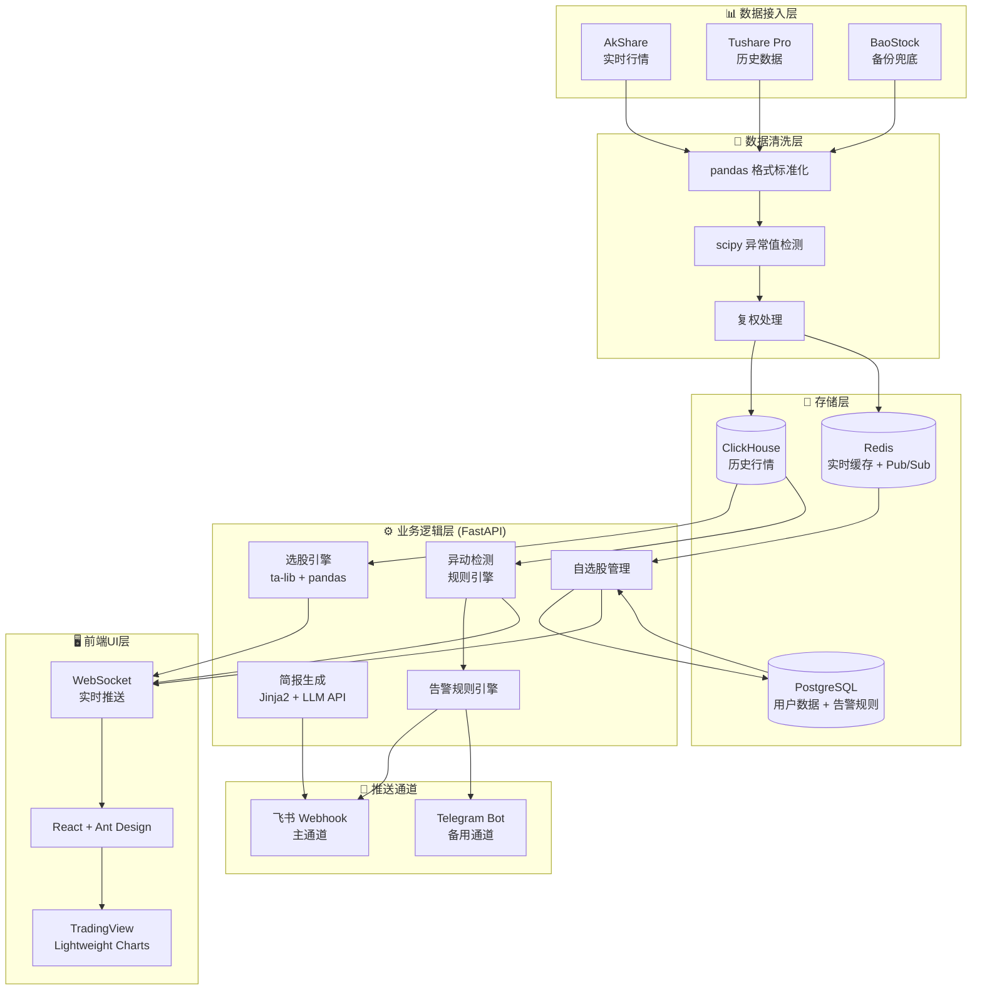

# 05-决策汇总：A股自动盯盘AI助手

> **v2 更新（2026/05/25）**：经法庭式对抗调研（15项目×7维度深挖 + 45条红队质疑 + 15条复合挑战 + 代言人逐条回应），"开源复用决策"和"技术栈决策"已按辩论结果修正。原 v1 假设部分项目可直接 fork，v2 确认无一项目值得直接 fork，改为"自建骨架 + 双项目萃取（PanWatch + Vibe-Trading）"。
>
> 汇总日期：2026/05/25
> 依据：01-产品形态.md、02-数据来源.md、03-开源项目.md、04-实现方案.md、05-决策汇总.md(v1)、06-架构基线决策.md 六份报告

---

## 一、产品形态决策

### 1.1 首页结构

**决策：采用"低密度 + 核心信息前置"模式**

```
┌─────────────────────────────────────────┐
│  🔍 搜索框（支持自然语言搜股/设预警）    │  ← 同花顺问财模式
├─────────────────────────────────────────┤
│     上证指数  深证成指  创业板指         │  ← 大字、高对比度
├─────────────────────────────────────────┤
│  【自选股】价格走势速览（可分组切换）    │  ← 右滑切换文字/图表
├─────────────────────────────────────────┤
│  【AI简报】今日异动 TOP 5（预判式卡片）  │  ← 东方财富妙想模式
├─────────────────────────────────────────┤
│  【快捷入口】选股 / 预警 / 复盘 / 设置   │  ← 可自定义拖动
└─────────────────────────────────────────┘
```

**为什么选这个结构**：
- 同花顺的"减法设计"被验证为最有效——MAU 3500万+，打开即见核心信息，认知负荷最低
- 东方财富的高密度信息生态虽然内容丰富，但对"盯盘助手"场景过度冗余

**为什么不选高密度模式**：我们的目标是"帮我盯"而非"给我看"，信息过载会削弱核心预警功能的触达效率。

### 1.2 功能形态

| 功能 | 形态 | 参考对象 |
|:---|:---|:---|
| **自选股管理** | 分组 + 批量导入 + AI智能分组（按行业/概念/走势自动归类） | 同花顺 + 雪球 |
| **智能选股** | 自然语言输入（"MACD金叉，均线多头排列"） | 同花顺问财 |
| **异动预警** | 自然语言设预警（"跌破XX元提醒我"）+ 分级触达 | 华泰AI涨乐 |
| **早盘简报** | AI生成结构化卡片，推送至飞书/公众号 | OpenClaw方案 |
| **AI交互入口** | 搜索框即AI + 预判式服务卡片双轨并行 | 问财 + 妙想 |

### 1.3 推送形态决策

| 场景 | 渠道 | 形态 |
|:---|:---|:---|
| 早盘简报（9:00） | **飞书卡片**（主）+ 公众号图文（辅） | 结构化卡片，红绿标识涨跌 |
| 盘中异动（实时） | **飞书卡片** + APP Push（如自建App） | 分级触达：观察→关注→预警 |
| 收盘复盘（15:30） | 飞书卡片 + 公众号图文 | 汇总卡片 + 深度长图文 |
| 持仓预警（触发时） | 飞书卡片强提醒 + 声音 | 即时感知，不可错过 |

**为什么选飞书卡片为主**：
- 飞书Webhook机器人10分钟可接入，个人免费额度10,000次/月足够
- 交互式卡片最丰富，支持按钮、下拉菜单，用户体验最佳
- 标准版仅600元/年，性价比远高于钉钉（9,800元/年）

**为什么不选企业微信**：微信生态虽强，但API费用不透明，深度集成可达数万元/年，且个人开发者难以完成企业认证。

---

## 二、数据源决策

### 2.1 主数据通道

```
┌─────────────────────────────────────────────────────────────┐
│  实时盯盘/预警      →  AkShare（主）+ Tushare免费版（补）    │
│  历史数据/回测      →  Tushare Pro 5,000积分档（500元/年）   │
│  数据备份/应急      →  BaoStock                               │
└─────────────────────────────────────────────────────────────┘
```

| 用途 | 推荐渠道 | 理由 |
|:---|:---|:---|
| **实时行情（盯盘）** | AkShare | 完全免费，覆盖完整，Python生态成熟 |
| **历史数据（回测）** | Tushare Pro 5,000积分档 | 500元/年，数据质量稳定，分钟线可另购 |
| **数据备份/冗余** | BaoStock | 免费，自有API通道，不受东方财富反爬影响 |
| **财务/基本面数据** | Tushare Pro | 财务数据标准化程度高 |

### 2.2 为什么不选其他方案

| 方案 | 不选理由 |
|:---|:---|
| **QMT（券商接口）** | 虽免费且Tick级实时，但需10-50万资金门槛开户，且仅限实盘交易使用，不适合纯盯盘场景 |
| **iTick** | <100ms实时性好，但付费版$99/月，个人盯盘场景成本过高；免费版仅基础行情 |
| **AKShare 商用** | 底层为爬虫，2025年东方财富反爬大幅升级，稳定性差，商用法律风险高 |
| **Wind/iFinD** | 单终端2-4万元/年，个人开发者无法承担 |
| **爬虫（东方财富/雪球）** | 《反不正当竞争法》第12条限制，绕过反爬可能构成"非法获取计算机信息系统数据罪" |

### 2.3 备用切换方案

| 场景 | 主方案 | 备用方案 | 切换条件 |
|:---|:---|:---|:---|
| 实时行情中断 | AkShare | Tushare免费版 / BaoStock | AkShare接口变动时 |
| 历史数据故障 | Tushare Pro | BaoStock | Tushare服务异常时 |
| 全市场扫描 | AkShare `stock_zh_a_spot_em` | Tushare实时日线 | 需全市场快照时 |

---

## 三、开源复用决策（v2，经法庭辩论修正）

### 3.1 核心结论：自建骨架 + 双项目萃取（PanWatch + Vibe-Trading）

经 15 个项目 × 7 维度深挖 + 45 条红队质疑（带源码/issue/commit 硬证据）+ 15 条集成评估师复合挑战 + 代言人逐条回应后，**所有代言人均从"单 fork 最优"立场让步**。原 v1 假设部分项目可直接 fork，v2 确认：**无一项目值得直接 fork，全部降为"借鉴设计/参考架构/读文档不学代码"**

**架构基线：自建骨架 + 双项目萃取**
- **前端基座**：借鉴 PanWatch 的 React 18 + shadcn/ui Dashboard 组件体系（自建代码，规避其单进程阻塞 bug）
- **AI/回测内核**：参考 Vibe-Trading 的 Agent 编排 + 回测引擎接口设计（自研简化版，无需 452 个 Alpha 因子）
- **数据/推送层**：借鉴 daily_stock_analysis 的多源融合 facade 模式 + 全渠道推送封装

### 3.2 被否项目清单（15个全部降级）

| 项目 | 原 v1 定位 | v2 定位 | 被否核心理由 | 辩论证据 |
|:---|:---|:---|:---|:---|
| **aiagents-stock** | 借鉴模块 | ❌ 不引入 | License 为 null（GitHub API 404），94 个 .py 文件堆根目录 | analyst-ai 承认降级 |
| **daily_stock_analysis** | 借鉴（不fork） | ⚠️ 仅参考推送清单 | fork/star=96.6% 虚假繁荣，批处理≠实时，赞助商利益绑定 | analyst-ai 撤回 stars=质量论 |
| **TradingAgents** | 参考Agent编排 | ⚠️ 仅读README图 | A股 12+ open issue 未修，官方放弃 A股，LangGraph 定时炸弹 | analyst-ai 降级为"参考书" |
| **go-stock** | 参考UI | ❌ 零价值 | GPL-3.0 传染性 License，Go+Wails 与 Python/Web 零兼容 | analyst-ai 承认工程价值≈0 |
| **Vibe-Trading** | 未列入 | ✅ 萃取内核 | A股 DataProvider 不足，不执行实盘，但骨架（FastAPI+React）价值最高 | 集成评估 8.5分（全场最高） |
| **vnpy** | 参考架构 | ⚠️ 读设计不学代码 | 303 MB 重型框架，90% 代码无用，PyQt 与 React 冲突 | analyst-quant 承认分层定位 |
| **qteasy** | 拆回测模块 | ⚠️ 读文档 | 146 stars 无社区，78.6% Jupyter 非生产库，无实时能力 | analyst-quant 承认教学性质 |
| **RQAlpha** | 参考设计 | ⚠️ 读文档 | 非商业 License，脱离 RQData 只剩回测壳子 | 红队质疑，未反驳 |
| **ZVT** | 拆数据层 | ⚠️ 参考Schema思路 | SQLAlchemy ORM 与 ClickHouse 列存天然冲突 | analyst-quant 承认矛盾 |
| **QUANTAXIS** | 参考架构 | ❌ 不引入 | 3 个月零提交+240 issues，Rust+Cython+PyO3+MongoDB+RabbitMQ 过重 | analyst-quant 承认半死 |
| **PanWatch** | 借鉴（不fork） | ✅ 萃取前端 | 单进程阻塞架构 bug（issue #41）未修，312 stars 社区不足 | analyst-frontend 承认但辩护为"最强单项目" |
| **A股实时监测** | 参考技术选型 | ❌ 不引入 | WebSocket 实时推送虚假宣传，stars=1 license=null | analyst-frontend 揭露 |
| **shares** | 参考多端 | ⚠️ 参考uni-app思路 | 16 个月零提交，Go+Python 混合后端冲突，35 commits | 未反驳 |
| **QuantMuse** | 参考架构 | ❌ 不引入 | 427 KB 装不下 7 大功能，9 commits，C++ 引擎空壳（实地clone验证） | analyst-frontend 自报 |
| **Pan1Watch** | 关注MCP | ⚠️ 3天自建 | 继承 PanWatch 架构债，MCP 生态不成熟，30 stars 无验证 | analyst-frontend 承认 |

### 3.3 复用矩阵（v2）

| 模块 | 来源 | 处理方式 | 工作量 | 理由 |
|------|------|---------|--------|------|
| 前端 Dashboard 骨架 | PanWatch | 借鉴设计+自建代码 | 10-15 人日 | React 18 + shadcn/ui 布局/交互参考，自建规避单进程 bug |
| 复合预警系统逻辑 | PanWatch | 借鉴逻辑+自建实现 | 5-8 人日 | 复合条件+冷却期设计参考，事件循环自研（asyncio+Redis） |
| AI Agent 编排架构 | Vibe-Trading | 参考架构+自研简化 | 12-18 人日 | 3-5 个核心 swarm 模式参考，无需 452 Alpha 因子 |
| 回测引擎接口 | Vibe-Trading | 参考接口设计 | 3-5 人日 | 7 个引擎的接口抽象参考，初期用 1-2 个 |
| 数据接入层多源融合 | daily_stock_analysis | 借鉴代码结构 | 5-8 人日 | AkShare/Tushare/Pytdx/Baostock facade 模式参考 |
| 全渠道推送封装 | daily_stock_analysis | 借鉴代码结构 | 3-5 人日 | 飞书/企微/钉钉/Telegram/Discord  payload 格式参考 |
| A股规则建模 | RQAlpha + qteasy | 读文档不学代码 | 2-3 人日 | RQAlpha 非商业 License 限制代码复用，仅参考规则文档 |
| 事件驱动架构 | vnpy | 参考设计模式 | 1-2 人日 | Gateway 抽象+事件引擎思路参考，用 asyncio.Queue 自研 |

### 3.4 License 风险（v2 修正）

| 项目 | License | v1 判断 | v2 修正 | 风险等级 |
|:---|:---|:---|:---|:---:|
| go-stock | GPL-3.0 | 传染，仅参考UI | ❌ **工程价值=0，任何代码都不读** | 🔴 致命 |
| RQAlpha | 非商业 | 商业需授权 | ⚠️ **仅读文档，代码不引入** | 🔴 高 |
| aiagents-stock | **null**（GitHub 404） | MIT（事实错误） | ❌ **无 License，任何复用都涉嫌侵权** | 🔴 致命 |
| A股实时监测 | **null** | MIT（推断） | ❌ **License 不明，不能复用** | 🔴 高 |
| 其余项目 | MIT/Apache-2.0/BSD-3 | 宽松 | ✅ 宽松，但**仍不直接 fork，仅借鉴设计** | 🟡 中 |

> v2 关键修正：调研文档原将 aiagents-stock 和 A股实时监测标注为"MIT"是**事实错误**，经 `gh api repos/.../license` 实测两者均为 null。

### 3.5 组合评估 Top 3（集成评估师数据）

| 排名 | 组合 | 评分 | 结论 |
|:---:|:---|:---:|:---|
| 🥇 | **PanWatch + Vibe-Trading** | **8.5/10** | 技术栈完全一致（FastAPI+React），融合成本最低（18-28人日），功能互补度最高 |
| 🥈 | daily_stock_analysis + PanWatch | 8.0/10 | 双 FastAPI，批处理报告+实时盯盘互补，但批处理≠实时需补 WebSocket 层 |
| 🥉 | daily_stock_analysis + PanWatch + Vibe-Trading | 7.5/10 | 功能最全面，但三项目融合复杂度高，代码风格不一致风险 |
| 基准 | 全自建 | 7.0/10 | 最稳妥但最慢，75人日，100%可控 |

**最终选择**：以 **PanWatch + Vibe-Trading** 为萃取基座，辅以 daily_stock_analysis 的数据/推送层借鉴。不 fork 任何项目代码，全部自建实现。

---

## 四、技术栈决策（6模块）

### 4.1 数据接入

**推荐：AkShare（主）+ Tushare免费版（补）+ BaoStock（备）**

| 维度 | 推荐方案 | 备选方案 | 不选理由 |
|:---|:---|:---|:---|
| 实时行情 | AkShare | iTick付费版 | 个人场景免费足够，iTick $99/月过高 |
| 数据清洗 | pandas + 异步队列 | Spark Streaming | 个人项目数据量不大，Spark过重 |
| 多源容灾 | 自动切换逻辑 | 手动切换 | 自动化是标配，无讨论必要 |

**工作量：12人天**

### 4.2 存储层

**推荐：ClickHouse（历史行情）+ Redis（实时缓存）+ PostgreSQL（用户数据）**

| 维度 | 推荐方案 | 备选方案 | 不选理由 |
|:---|:---|:---|:---|
| 历史行情 | **ClickHouse** | TDengine | TDengine AGPL 3.0要求网络服务开源，闭源项目有风险 |
|  |  | InfluxDB | v3 OSS功能受限，金融场景benchmark落后ClickHouse |
| 实时缓存 | **Redis** | 本地内存dict | 单进程原型可用，生产必须Redis支持Pub/Sub广播 |
| 用户数据 | **PostgreSQL** | MySQL | PostgreSQL JSONB支持更好，适合存储灵活的告警规则 |

**为什么不用纯PostgreSQL存历史行情**：PostgreSQL是行式存储，面对数十亿行时序数据的聚合查询性能远不如ClickHouse的列式存储。Longbridge（长桥证券）用ClickHouse获得10倍性能提升。

**工作量：10人天**

### 4.3 业务逻辑（v2 修正）

**推荐：FastAPI + pandas/numpy + ta-lib + LLM API + 自研 Agent 编排 + 回测引擎**

| 功能 | 技术方案 | 不选理由 |
|:---|:---|:---|
| Web框架 | **FastAPI** | Flask同步模型高并发需额外配置；Django过重不适合纯API服务；Spring Boot开发效率低于Python |
| 指标计算 | **ta-lib** | 金融指标计算事实标准，C底层实现性能远超纯Python手写 |
| 选股引擎 | pandas批量计算 + 多条件筛选 | 无需复杂框架，简单场景pandas足够 |
| 异动检测 | 规则引擎为主（阈值+统计方法） | 深度学习需要大量标注数据且解释性差，规则引擎透明可控 |
| 简报生成 | Jinja2模板 + LLM API（GPT-4o-mini/DeepSeek） | 成本控制优先，用便宜模型即可满足需求 |
| 任务调度 | APScheduler | Celery对于个人项目过重，APScheduler足够 |
| **AI Agent 编排** | **自研简化版**（参考 Vibe-Trading 的 swarm 模式） | TradingAgents 的 LangGraph 依赖是定时炸弹；Vibe-Trading 的 29 swarm 对 A股语境多数无等价场景，自研 3-5 个核心模式即可 |
| **回测引擎** | **自研向量化+事件驱动双模式**（参考 Vibe-Trading 接口） | qteasy 78.6% 是 Jupyter 非生产库；RQAlpha 非商业 License 限制代码复用；Vibe-Trading 的 7 个回测引擎接口设计参考性最高 |

**工作量修正**：21 → **33-41 人日**（含 Agent 编排 12-18 人日 + 回测引擎 8-12 人日，原 21 人日未含此两项）

> v2 修正：原方案未包含 Agent 编排和回测引擎。经辩论后，Vibe-Trading 的 Agent+回测能力是差异化核心，但直接引入其 452 个 Alpha 因子和 29 个 swarm 是过度设计。推荐自研简化版，仅参考其接口抽象和核心模式。

### 4.4 前端UI（v2 修正）

**推荐：React 19 + shadcn/ui + TradingView Lightweight Charts + WebSocket**

| 维度 | 推荐方案 | 备选方案 | 不选理由 |
|:---|:---|:---|:---|
| Web框架 | **React 19** | Vue 3 | 量化/金融前端生态更偏向React；Vibe-Trading 和 PanWatch 均为 React，技术栈一致性最高 |
| 组件库 | **shadcn/ui** | Ant Design | shadcn/ui 与 PanWatch 设计体系一致（Tailwind + Radix UI），组件可组合性强；Ant Design 虽企业级成熟但定制灵活性不足 |
| 图表库 | **TradingView Lightweight Charts** | ECharts | TradingView专为金融时序数据优化，K线交互体验（缩放、十字光标）碾压通用库；ECharts可作为仪表盘补充 |
| 实时通信 | **WebSocket** | SSE / 长轮询 | SSE仅单向，长轮询延迟高；WebSocket全双工+~100ms延迟是实时行情刚需 |

**工作量修正**：18 → **15-20 人日**（含 React 18→19 升级 + shadcn/ui 组件体系搭建，参考 PanWatch 布局但自建代码）

> v2 修正：原推荐 Ant Design 是基于通用企业场景。经辩论后，PanWatch 的 shadcn/ui + Tailwind 体系与 Vibe-Trading（React 19 + Vite + TS）技术栈一致，应统一为 shadcn/ui 以降低融合成本。

### 4.5 推送通道

**推荐：飞书Webhook（主）+ Telegram Bot（备）**

| 通道 | 推荐度 | 不选理由 |
|:---|:---|:---|
| **飞书Webhook** | ⭐⭐⭐ 主通道 | — |
| **Telegram Bot** | ⭐⭐⭐ 备用 | — |
| 企业微信 | ⭐⭐ | API费用不透明，深度集成可达数万元/年；个人开发者难完成企业认证 |
| 钉钉 | ⭐⭐ | 专业版9,800元/年，固定费用对小团队不划算 |
| 微信个人号 | ❌ | 无官方API，第三方库有封号风险 |

**工作量：5人天**

### 4.6 部署运维

**推荐：阿里云/腾讯云轻量服务器（包年）+ Docker Compose**

| 维度 | 推荐方案 | 备选方案 | 不选理由 |
|:---|:---|:---|:---|
| 服务器 | **阿里云/腾讯云轻量** | ECS / Serverless | 轻量打包CPU/内存/带宽/磁盘，价格透明更便宜；个人项目不需要ECS弹性扩展；Serverless不支持WebSocket长连接 |
| 容器化 | **Docker Compose** | Kubernetes | K8s对个人项目大炮打蚊子，Docker Compose足够 |
| 反向代理 | **Nginx** | Traefik | Nginx文档最成熟，国内社区支持最好 |

**工作量：9人天**

---

## 五、架构总图



---

## 六、成本估算

### 6.1 一次性成本

| 项目 | 费用 | 说明 |
|:---|:---|:---|
| Tushare Pro 5,000积分 | 500元/年 | 历史数据+基本面数据 |
| 阿里云/腾讯云轻量 2核4G | 298元/年（活动价） | 包年比月付低80%+ |
| 域名 + SSL证书 | ~50元/年 | 可选，IP访问也可 |
| **一次性合计** | **~850元/年** | — |

### 6.2 月度运营成本

| 部署模式 | 配置 | 月费用 | 适用阶段 |
|:---|:---|:---|:---|
| **极简版** | 腾讯云轻量2核2G + 免费数据源 | **~5元/月** | 个人试用 |
| **标准版** | 阿里云轻量2核4G + Redis + PostgreSQL | **~30-50元/月** | 个人日常使用 |
| **进阶版** | 阿里云ECS 4核8G + 对象存储 | **~100-150元/月** | 多用户/高频策略 |

### 6.3 LLM API成本（简报生成）

| 模型 | 单价 | 月均用量 | 月费用 |
|:---|:---|:---|:---|
| GPT-4o-mini | $0.15/1M tokens | 100次简报 | ~$0.5 |
| DeepSeek-V2 | 国产便宜模型 | 100次简报 | ~¥5 |

> **结论**：LLM成本极低，可忽略不计。整个系统年运营成本控制在 **1,000-2,000元** 以内。

---

## 七、风险与应对

### 7.1 最该警惕的坑（按优先级排序）

| 优先级 | 风险 | 影响 | 应对策略 |
|:---|:---|:---|:---|
| 🔴 P0 | **AkShare接口变动** | 数据获取中断，盯盘功能瘫痪 | 多源冗余（Tushare+BaoStock兜底），异常自动切换，本地缓存 |
| 🔴 P0 | **爬虫法律风险** | 被诉不正当竞争甚至刑事责任 | **绝不直接爬东方财富/雪球**，仅通过AKShare等封装库间接使用 |
| 🟡 P1 | **Tushare商用边界模糊** | 数据不可转售或对外提供数据服务 | 仅用于个人盯盘，不对外提供数据服务；必要时升级企业授权 |
| 🟡 P1 | **飞书API限制** | 推送失败，预警触达不到 | 双通道冗余（Telegram Bot备用），本地日志兜底 |
| 🟡 P1 | **ClickHouse单机瓶颈** | 数据量过大时查询变慢 | 初期数据量小无需担心；后期可迁移至TDengine（需评估AGPL影响）或升级配置 |
| 🟢 P2 | **LLM API成本上涨** | 简报生成费用增加 | 切换至更便宜国产模型（DeepSeek/文心一言），或本地部署小模型 |
| 🟢 P2 | **云服务器到期涨价** | 运维成本上升 | 迁移至另一家云厂商（阿里云↔腾讯云价格竞争） |

### 7.2 开源项目依赖风险

| 风险 | 说明 | 应对 |
|:---|:---|:---|
| PanWatch Stars仅312 | 社区验证有限，代码质量存疑 | 仅借鉴组件设计，不直接依赖核心逻辑 |
| daily_stock_analysis 批处理模式 | 非实时流式，高频盯盘不适用 | 仅借鉴数据接入层和推送封装，自建实时引擎 |
| GPL-3.0项目（go-stock） | 传染性License | **绝不直接引入代码**，仅参考UI设计理念 |

---

## 八、总体工作量与排期

| 模块 | 人天 | 依赖 |
|:---|:---|:---|
| 数据接入 | 12 | 无 |
| 存储层 | 10 | 数据接入 |
| 业务逻辑 | 21 | 存储层 |
| 前端UI | 18 | 业务逻辑API |
| 推送通道 | 5 | 业务逻辑 |
| 部署运维 | 9 | 全部 |
| **合计** | **75人天** | — |

**排期估算（1人全职）**：
- **Phase 1（MVP）**：0-4周，完成数据接入+自选股管理+基础预警+飞书推送
- **Phase 2（增强）**：1-3个月，加入AI简报+选股引擎+Agent编排+回测
- **Phase 3（进阶）**：3-6个月，多端适配+实盘交易+MCP生态

---

## 九、核心决策速查表

| 决策项 | 选择 | 一句话理由 |
|:---|:---|:---|
| 产品形态 | 低密度+核心信息前置 | 同花顺MAU 3500万验证的减法设计 |
| 推送主通道 | 飞书卡片 | 10分钟接入，10,000次/月免费，交互最丰富 |
| 实时数据源 | AkShare | 免费、完整、Python生态成熟 |
| 历史数据源 | Tushare Pro（500元/年） | 数据质量最高，有SLA保障 |
| 开源策略 | 自建骨架+萃取精华 | 15个项目无一站式完美方案 |
| 后端框架 | FastAPI | 异步原生+WebSocket+自动生成文档 |
| 前端框架 | React + Ant Design | 金融生态最成熟，TradingView示例以React为主 |
| 图表库 | TradingView Lightweight Charts | 金融专用，K线交互碾压通用库 |
| 历史行情存储 | ClickHouse | 列式存储，长桥证券验证10倍性能提升 |
| 实时缓存 | Redis | Pub/Sub实现跨进程广播，~100ms延迟 |
| 部署方式 | 阿里云/腾讯云轻量（包年） | 25元/月，价格透明，7×24稳定 |
| 月运营成本 | ~30-50元 | 个人日常使用完全可承受 |

---

> **下一步行动建议**：
> 1. 注册Tushare账号，获取免费Token验证数据可行性
> 2. 搭建FastAPI + React基础骨架，验证WebSocket实时推送
> 3. 接入飞书Webhook，发送第一条测试消息
> 4. 基于daily_stock_analysis和PanWatch的代码，快速拼装MVP
