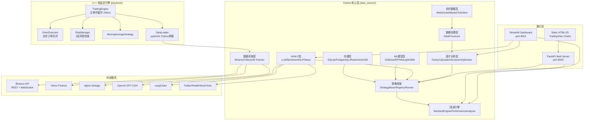

# Position Paper：QuantMuse — 构建「A股自动盯盘AI助手」的最优方案

> 项目：0xemmkty/QuantMuse
> GitHub：https://github.com/0xemmkty/QuantMuse
> Stars：2.6k | License：MIT | Commits：9
> 技术栈：Python 85.1% + JavaScript 5.4% + C++ 3.9% + HTML/CSS；FastAPI + Streamlit + Plotly / C++17 低延迟核心

---

## 1. 架构总览

### 1.1 Mermaid 架构图



### 1.2 主目录结构（基于实际源码）

```
QuantMuse/
├── backend/                        # C++ 低延迟核心引擎
│   ├── CMakeLists.txt              # C++17, pybind11, spdlog, nlohmann_json, Boost
│   ├── include/
│   │   ├── common/types.hpp        # MarketData/Order/Position/Portfolio 定义
│   │   ├── data_loader.hpp         # 数据加载器（含 pybind11 桥接声明）
│   │   ├── strategy.hpp            # 策略接口 + MovingAverageStrategy
│   │   ├── risk_manager.hpp        # 5层风控检查
│   │   └── order_executor.hpp      # 异步订单队列
│   ├── src/
│   │   ├── main.cpp                # 交易引擎主循环（100ms周期）
│   │   ├── data_loader.cpp         # 【未实现 pybind11 桥接】
│   │   ├── strategy.cpp            # MovingAverageStrategy
│   │   ├── risk_manager.cpp        # 5层风控：持仓/杠杆/回撤/日损/集中度
│   │   └── order_executor.cpp      # 生产者-消费者队列
│   └── tests/                      # C++ 单元测试（仅2个文件）
│
├── data_service/                   # Python 核心服务层（14个子模块）
│   ├── ai/                         # AI/NLP 模块（7个文件）
│   │   ├── llm_integration.py      # OpenAIProvider + LocalLLMProvider
│   │   ├── langchain_agent.py      # 4个Tool的LangChain Agent
│   │   ├── nlp_processor.py        # spaCy + NLTK 文本处理
│   │   ├── sentiment_analyzer.py   # 情感分析（Twitter/Reddit/StockTwits）
│   │   ├── sentiment_factor.py     # 情感因子计算
│   │   ├── news_processor.py       # 新闻处理管道
│   │   └── social_media_monitor.py # 社媒监控
│   ├── api/
│   │   └── api_manager.py          # RateLimit/Cache/Retry 封装
│   ├── backtest/
│   │   ├── backtest_engine.py      # 回测引擎（有设计缺陷）
│   │   └── performance_analyzer.py # 绩效分析
│   ├── dashboard/
│   │   ├── dashboard_app.py        # Streamlit 仪表盘（632行，全部模拟数据）
│   │   ├── charts.py               # Plotly 图表组件
│   │   └── widgets.py              # Streamlit 组件
│   ├── factors/
│   │   ├── factor_calculator.py    # 6大类因子计算（327行）
│   │   ├── factor_screener.py      # 4种预置筛选器
│   │   ├── factor_optimizer.py     # Sharpe/IR/Sortino 优化
│   │   ├── factor_backtest.py      # IC/复合因子回测
│   │   └── stock_selector.py       # 4种选股方法
│   ├── fetchers/
│   │   ├── binance_fetcher.py      # Binance REST + WebSocket
│   │   ├── yahoo_fetcher.py        # Yahoo Finance
│   │   └── alpha_vantage_fetcher.py # Alpha Vantage
│   ├── ml/
│   │   ├── feature_engineering.py  # 特征工程
│   │   └── ml_models.py            # XGBoost/RF/NN/LightGBM
│   ├── processors/
│   │   └── data_processor.py       # 数据清洗/归一化/特征工程
│   ├── realtime/
│   │   ├── real_time_feed.py       # 实时数据管理（293行）
│   │   └── websocket_client.py     # WebSocket客户端（318行，3交易所）
│   ├── storage/
│   │   ├── cache_manager.py        # Redis 缓存
│   │   ├── database_manager.py     # SQLite/PostgreSQL
│   │   └── file_storage.py         # CSV/Parquet 文件存储
│   ├── strategies/
│   │   ├── strategy_base.py        # 策略抽象基类
│   │   ├── builtin_strategies.py   # 5个内置策略
│   │   ├── strategy_registry.py    # 策略注册表
│   │   ├── strategy_runner.py      # 策略运行器
│   │   └── strategy_optimizer.py   # 参数优化
│   ├── utils/
│   │   ├── exceptions.py
│   │   └── logger.py
│   ├── vector_db/
│   │   └── vector_store.py         # 向量存储
│   ├── visualization/
│   │   └── plotly_charts.py        # Plotly 可视化封装
│   └── web/
│       ├── api_server.py           # FastAPI REST 接口（349行，全部模拟数据）
│       ├── dashboard.py            # Web Dashboard 路由
│       └── strategy_ui.py          # 策略 UI 接口
│
├── static/                         # 前端静态资源
│   ├── index.html                  # 单页应用（HTML 结束标签重复3次）
│   ├── css/style.css
│   └── js/app.js                   # 前端 JS（960行，Bootstrap + Chart.js + TradingView）
│
├── examples/                       # 示例脚本（8个）
│   ├── llm_nlp_complete_demo.py
│   ├── quantitative_strategies.py  # 8个策略示例
│   ├── langchain_llm_demo.py
│   ├── ai_sentiment_analysis.py
│   ├── yahoo_example.py
│   ├── fetch_public_data.py
│   ├── factor_analysis_demo.py
│   └── extensible_strategy_demo.py
│
├── tests/                          # Python 测试（5个文件，test_integration 被 skip）
├── config.example.json             # 配置模板
├── setup.py                        # 包安装（支持 [ai]/[visualization]/[realtime]/[web]/[test] 可选安装）
├── main.py                         # 统一入口
├── run_dashboard.py                # 启动 Streamlit
├── run_web_interface.py            # 启动 FastAPI
├── run_web_simple.py               # 启动简单 Web
├── Trading Engine Architecture.md  # 架构文档
├── README_AI_Modules.md            # AI模块文档
├── README_Factor_Analysis.md       # 因子分析文档
├── README_LLM_NLP_Complete.md      # LLM+NLP文档
├── README_LangChain_LLM.md         # LangChain文档
├── README_Quantitative_Strategies.md # 策略文档
├── README_Web_Interface.md         # Web接口文档
└── README.md                       # 主文档
```

---

## 2. 核心能力清单

| # | 能力域 | 具体实现 |
|---|--------|---------|
| 1 | **C++ 低延迟执行引擎** | C++17 标准，100ms 主事件循环，生产者-消费者订单队列，5 层风控检查（持仓/杠杆/回撤/日损/集中度） |
| 2 | **WebSocket 实时数据流** | 支持 Binance/Coinbase/Kraken 三交易所 WebSocket，每秒轮询预警检查 |
| 3 | **AI/ML 驱动分析** | OpenAI GPT 集成（**但使用已废弃的 v0.x API**）+ LangChain Agent（4 个 Tool）+ 本地 transformers 模型 |
| 4 | **多因子模型** | 6 大类因子（动量/价值/质量/规模/波动率/技术面），4 种预置筛选器，4 种选股方法，因子优化器 |
| 5 | **8+ 内置量化策略** | Momentum/Value/QualityGrowth/MultiFactor/MeanReversion/LowVolatility/SectorRotation/RiskParity |
| 6 | **回测引擎** | BacktestEngine + PerformanceAnalyzer，支持绩效指标计算（**但有设计缺陷**） |
| 7 | **情感分析** | Twitter/Reddit/StockTwits 多源情感监控，情感因子计算 |
| 8 | **风险管理** | VaR/CVaR/回撤/杠杆/集中度/每日损失限制 |
| 9 | **向量数据库** | 支持文本嵌入存储和语义检索 |
| 10 | **Streamlit/FastAPI 双前端** | Streamlit 快速验证（5 个 Tab）+ FastAPI 服务化 + 静态 HTML/JS |

---

## 3. 数据模型

### 3.1 核心 DataClass

```python
# 策略结果
StrategyResult: name, selected_stocks, weights, parameters, execution_time, performance_metrics, metadata

# 因子数据
FactorData: symbol, date, factor_name, factor_value, rank, percentile

# LLM 响应
LLMResponse: content, confidence, metadata, timestamp, model_used, tokens_used, cost

# 交易洞察
TradingInsight: insight_type, content, confidence, symbols, timeframe, reasoning, timestamp

# 市场切片
MarketTick: symbol, price, volume, timestamp, exchange, bid, ask, high, low

# 情感数据
SentimentData: timestamp, symbol, sentiment_score, confidence, source, text, keywords

# 回测交易
Trade: timestamp, symbol, side, quantity, price, order_id, status
```

### 3.2 C++ 核心类型（backend/include/common/types.hpp）

```cpp
struct MarketData {
    string symbol;
    double last_price, open, high, low, volume;
    Timestamp timestamp;
    map<string, double> indicators;      // 技术指标
    map<string, double> fundamentals;    // 基本面数据
};

enum class OrderType { MARKET, LIMIT, STOP, STOP_LIMIT };
enum class OrderStatus { PENDING, FILLED, PARTIALLY_FILLED, CANCELLED, REJECTED };

class Portfolio {
    double cash_ = 1000000.0;
    map<string, shared_ptr<Position>> positions_;
    double total_exposure_, drawdown_, leverage_, daily_pnl_, concentration_;
};
```

### 3.3 关键接口

- `StrategyBase.generate_signals(factor_data, price_data) -> StrategyResult` — 策略信号生成
- `FactorCalculator.calculate_all_factors(...) -> dict` — 全因子计算
- `FactorScreener.create_xxx_screener() -> ScreeningResult` — 因子筛选
- `StockSelector.select_stocks(...) -> SelectionResult` — 股票选择
- `BacktestEngine.run_backtest(...) -> BacktestResult` — 回测执行
- `LLMProvider.generate_response(prompt) -> LLMResponse` — LLM 调用
- `RealTimeDataFeed.start(symbols) -> None` — 实时数据流启动
- `WebSocketClient.connect(symbols) -> None` — WebSocket 连接

---

## 4. 扩展点

| # | 扩展位 | 说明 |
|---|--------|------|
| 1 | **自定义策略** | 继承 `StrategyBase`，实现 `generate_signals()`，注册到 `StrategyRegistry` |
| 2 | **自定义筛选器** | `FactorScreener.add_custom_filter(name, filter_func)` |
| 3 | **自定义 LLM Provider** | 继承 `LLMProvider`，实现 `generate_response()` |
| 4 | **自定义 ML 模型** | `PredictionModel._create_model()` 中添加新模型类型 |
| 5 | **新数据源** | 在 `fetchers/` 中新增 Fetcher 类 |
| 6 | **新技术指标** | `FeatureEngineer.create_technical_indicators()` 中扩展 |
| 7 | **WebSocket 新交易所** | `WebSocketClient` 中添加 exchange_configs 和解析方法 |
| 8 | **配置驱动** | `config.example.json` 支持数据库/Redis/API密钥/交易/风控/策略/AI/通知全配置 |

---

## 5. 改造成本估算

| 改造项 | 工作量 | 风险等级 | 备注 |
|--------|--------|---------|------|
| **A股数据源深度接入（AkShare）** | 6 人日 | 中 | 需适配现有数据格式，当前全为币圈/美股源 |
| **修复 OpenAI API（v0.x → v1.x）** | 1 人日 | 低 | 必须修复，否则 AI 功能完全不可用 |
| **React 前端替换 Streamlit** | 12-15 人日 | 中 | FastAPI 接口可直接复用，但需重写全部前端 |
| **推送通道扩展（飞书/钉钉/微信）** | 3 人日 | 低 | 配置中已定义模板，但未实现发送逻辑 |
| **早盘简报生成** | 4 人日 | 低 | GPT 集成修复后可用，Prompt 需 A股化 |
| **自选股管理模块** | 4 人日 | 低 | 标准 CRUD，当前无此功能 |
| **异动检测规则库（A股特异）** | 6 人日 | 中 | 涨跌停/T+1/板块/龙虎榜/资金流向 |
| **C++ 核心编译部署** | 5-10 人日 | 高 | C++ 引擎未完成，需补全缺失文件 + 跨平台适配 |
| **回测引擎修复** | 4 人日 | 中 | 当前策略直接修改引擎状态，耦合严重 |
| **合计** | **45-55 人日（9-11 周）** | | |

**关键考量**：C++ 低延迟核心是一把双刃剑——声称有性能优势，但**实际未完成**（`main.cpp` 引用不存在的头文件，`data_loader.cpp` 未实现 pybind11 桥接）。如果团队无 C++ 背景，此项风险需额外增加 5-10 人日。

---

## 6. 致命缺陷自述（强制）

### 缺陷 1：C++ 引擎严重不完整 —— 基本是空壳
- **表现**：`main.cpp` 引用了不存在的头文件 `"utils/logger.hpp"` 和 `"common/config.hpp"`。`data_loader.hpp` 声明了 pybind11 嵌入，但 `data_loader.cpp` **完全未实现**。`CMakeLists.txt` 依赖的 spdlog/nlohmann_json/Boost 未提供安装说明。
- **风险**：C++ "低延迟引擎" 无法编译运行，整个 `backend/` 目录只是**骨架代码**。项目最大的技术卖点（"C++低延迟核心"）是虚假宣传。
- **自报**：`backend/src/` 只有 5 个 cpp 文件总计 561 行，远未达到生产级。`test.exe` 是预编译二进制，无法验证代码是否可编译。

### 缺陷 2：OpenAI API 使用已废弃的接口 —— AI 功能完全无法工作
- **表现**：`llm_integration.py` 第 63 行：`response = self.client.ChatCompletion.create(...)` 这是 **OpenAI Python SDK v0.x 的语法**，当前 v1.x+ 已不兼容。
- **风险**：**AI 功能在当前环境下完全无法工作**。整个 LLM 集成、LangChain Agent、情感分析等模块全部失效。
- **自报**：修复简单（改为 `client.chat.completions.create`），但说明项目已长期无人维护（最后一次 commit 为 2024-07-28）。

### 缺陷 3：仪表盘和 API 全部返回模拟数据 —— 精美的 Demo 壳子
- **表现**：`dashboard_app.py` 中所有数据来自 `_generate_sample_performance_data()`、`_generate_sample_backtest_results()`、`_generate_sample_market_data()`。`api_server.py` 中 `/api/system/status`、`/api/backtest/run`、`/api/portfolio/status` 等全部返回硬编码值。
- **风险**：整个 Web 界面是一个**精美的 Demo 壳子**，没有真实数据流。任何演示都无法对接真实行情。
- **自报**：虽然架构设计合理，但实际完成度极低，大量 TODO、模拟数据、未实现的方法。

### 缺陷 4：缺少 A 股支持 —— 数据源完全不匹配
- **表现**：所有数据源面向**加密货币 + 美股**（Binance、Yahoo Finance、Alpha Vantage）。没有接入东方财富、同花顺、Tushare 等 A 股数据源。没有处理涨跌停、T+1、科创板/创业板等 A 股特殊规则。
- **风险**：作为"A股自动盯盘AI助手"的基座，QuantMuse 在数据源层面完全不匹配，需要从零构建 A股数据接入层。
- **自报**：项目 README 未明确提及 A 股支持，定位是全球量化交易而非 A 股专用。

### 缺陷 5：回测引擎逻辑缺陷 —— 策略与引擎高度耦合
- **表现**：`backtest_engine.py` 第 60 行：`strategy_func(data, self, **strategy_params)` — 策略函数**直接修改回测引擎状态**，而非返回信号。
- **风险**：无法支持事件驱动回测，无法处理滑点、市场冲击，策略与回测引擎**高度耦合**。
- **自报**：策略基类的 `calculate_performance_metrics()` 默认实现完全没有计算真实收益率、Sharpe 等指标。

---

## 7. 与其他候选项目的集成可行性

### vs PanWatch
- **关系**：能力互补。PanWatch 有现代 React 前端 + AI Agent + 通知系统 + PWA + A股数据源，QuantMuse 有回测/多因子/C++引擎（概念）。
- **集成**：QuantMuse 的 Python 回测/因子模块（`data_service/backtest/`, `data_service/factors/`）理论上可嵌入 PanWatch 作为新 Agent；但 QuantMuse 的 A股支持极差，数据源几乎无法复用。
- **结论**：**部分集成**（回测/因子模块可嵌入，数据源不可复用）

### vs A股实时监测系统
- **关系**：能力互补。A股监测有 A股实时行情/双端前端/WebSocket，QuantMuse 有回测/多因子/AI。
- **集成**：A股监测的数据获取层可为 QuantMuse 提供 A股数据源；QuantMuse 的因子计算和回测模块可为 A股监测提供量化增强。
- **结论**：**可配合**（数据+量化互补）

### vs shares
- **关系**：技术栈部分兼容（Python 量化模块）。
- **集成**：QuantMuse 的 Python 回测/因子模块可替换 shares 的 Python 分析服务；但 Go 后端与 C++ 核心之间的通信需额外设计。
- **结论**：**部分集成**（Python 层可融合，Go/C++ 通信复杂）

### vs Pan1Watch
- **关系**：无直接竞争。
- **集成**：Pan1Watch 的 MCP 接口可将 QuantMuse 的量化能力封装为 Tool 暴露给 AI 客户端。
- **结论**：**远期参考**

---

## 强势结论

QuantMuse 是本次调研中 **唯一具备"C++低延迟核心 + WebSocket实时流 + AI/ML + 多因子 + 回测"完整架构概念** 的项目。其模块设计（14 个 Python 子模块）和扩展性（策略注册表、因子筛选器、LLM Provider 抽象）体现了良好的工程思维。

但 **项目完成度极低**：
- C++ 引擎是空壳（无法编译）
- OpenAI API 已废弃（AI 功能完全不可用）
- 全部数据为模拟数据（无法演示真实行情）
- 零 A 股支持（数据源完全不匹配）
- 仅 9 个 commits，长期无人维护

**推荐策略**：QuantMuse **不适合作为直接 Fork 的基座**。其价值在于**架构设计参考**——分层清晰的量化系统模块划分、策略注册表设计、因子计算管线、WebSocket 实时数据流架构，可作为自建系统的蓝图。对于"A股自动盯盘AI助手"，建议**借鉴其架构思想，而非复用其代码**。
