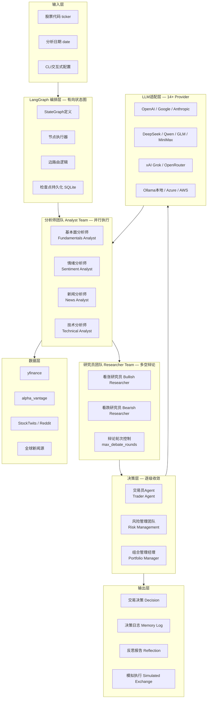

# Position Paper: TradingAgents — 构建「A股自动盯盘AI助手」的Agent大脑最优解

> **项目**: TradingAgents  
> **GitHub**: https://github.com/TauricResearch/TradingAgents  
> **Stars**: 79.3k | **License**: Apache-2.0 | **语言**: Python 99.9%  
> **最近活跃**: v0.2.5 (2026-05)

---

## 一、架构总览

### 1.1 系统架构图（Mermaid）



### 1.2 主目录结构

```
TradingAgents/
├── main.py                    # 入口（python -m cli.main）
├── pyproject.toml             # setuptools包配置
├── uv.lock                    # uv依赖锁定
├── Dockerfile
├── docker-compose.yml
├── .env.example               # API密钥模板
├── .env.enterprise.example    # 企业级Provider模板
├── cli/                       # CLI包
│   ├── main.py                # Typer CLI入口
│   └── static/                # CLI静态资源
│
├── tradingagents/             # 核心包
│   ├── __init__.py
│   ├── default_config.py      # DEFAULT_CONFIG + 环境变量覆盖
│   ├── agents/                # Agent层
│   │   ├── __init__.py
│   │   ├── schemas.py         # Pydantic输出Schema
│   │   ├── analysts/          # 分析师团队（4人）
│   │   │   ├── fundamentals.py
│   │   │   ├── sentiment.py
│   │   │   ├── news.py
│   │   │   └── technical.py
│   │   ├── researchers/       # 研究员团队（多空辩论）
│   │   │   ├── bullish.py
│   │   │   └── bearish.py
│   │   ├── trader/            # 交易员Agent
│   │   │   └── trader.py
│   │   ├── risk_mgmt/         # 风险管理
│   │   │   └── risk_manager.py
│   │   ├── managers/          # 组合管理
│   │   │   └── portfolio_manager.py
│   │   └── utils/             # Agent工具函数
│   │
│   ├── graph/                 # LangGraph编排层
│   │   └── trading_graph.py   # TradingAgentsGraph核心类
│   │
│   ├── llm_clients/           # LLM客户端适配
│   │   ├── openai_client.py
│   │   ├── anthropic_client.py
│   │   ├── google_client.py
│   │   ├── deepseek_client.py
│   │   ├── qwen_client.py
│   │   ├── glm_client.py
│   │   ├── minimax_client.py
│   │   ├── xai_client.py
│   │   ├── openrouter_client.py
│   │   ├── ollama_client.py
│   │   ├── azure_client.py
│   │   └── aws_client.py
│   │
│   └── dataflows/             # 数据流/工具
│       └── ...
│
├── tests/                     # 测试套件
│   ├── unit/
│   ├── integration/
│   └── smoke/
│
└── scripts/                   # 辅助脚本
```

---

## 二、核心能力清单

| # | 能力域 | 具体功能 | 技术亮点 |
|---|--------|----------|----------|
| 1 | **五层Agent流水线** | 分析师团队（4类分析师并行）→ 研究员团队（多空辩论）→ 交易员Agent → 风控 → 组合管理，决策链路完整 | LangGraph StateGraph编排，节点间数据流严格类型化 |
| 2 | **多空辩论机制** | 看涨/看跌研究员结构化辩论，`max_debate_rounds`可控 | 避免单一视角偏见，决策更全面 |
| 3 | **14+ LLM Provider** | OpenAI/Google/Anthropic/xAI/DeepSeek/Qwen/GLM/MiniMax/OpenRouter/Ollama/Azure/AWS | 统一抽象层，切换Provider只需改配置 |
| 4 | **检查点恢复** | `--checkpoint` 崩溃后从断点恢复 | LangGraph Checkpoint SQLite持久化 |
| 5 | **决策日志 + 反思** | 每次决策追加到 `~/.tradingagents/memory/trading_memory.md`，同代码下次运行时自动生成反思段落 | 自我学习机制，避免重复错误 |
| 6 | **结构化输出** | Research Manager / Trader / Portfolio Manager 均使用Pydantic Schema约束LLM输出 | 可编程解析，非自由文本 |
| 7 | **数据供应商抽象** | `data_vendors` + `tool_vendors` 分层配置，类别级/工具级均可覆盖 | 灵活切换yfinance/alpha_vantage |
| 8 | **基准Alpha计算** | 自动识别市场后缀，计算相对区域指数的Alpha收益 | `benchmark_map` 支持10+市场 |
| 9 | **非美股Alpha基准** | 印度/^NSEI、日本/^N225、香港/^HSI、英国/^FTSE等 | v0.2.5新增 |
| 10 | **CLI + Docker部署** | 交互式CLI (`questionary`) + 一键Docker | 开箱即用 |
| 11 | **环境变量全配置** | `TRADINGAGENTS_*` 前缀覆盖所有配置键 | 无需改代码即可部署 |
| 12 | **并发控制** | `analyst_concurrency_limit` 控制分析师并行度 | 防止API限流 |

---

## 三、数据模型

### 3.1 核心类与接口

```python
# === LangGraph编排核心 ===
class TradingAgentsGraph:
    """整个交易Agent系统的有向状态图"""
    def __init__(self, debug: bool, config: dict): ...
    def propagate(self, ticker: str, date: str) -> Tuple[State, Decision]: ...
    # 内部节点: analysts -> research_debate -> trader -> risk_mgmt -> portfolio_manager

# === 决策Schema ===
class Decision(BaseModel):
    """最终交易决策"""
    action: str           # BUY / SELL / HOLD
    confidence: float     # 0-1
    position_size: str    # 仓位建议
    rationale: str        # 决策理由
    risk_assessment: str  # 风险评估

# === 配置模型 ===
DEFAULT_CONFIG = {
    "llm_provider": "openai",
    "deep_think_llm": "gpt-5.4",        # 复杂推理模型
    "quick_think_llm": "gpt-5.4-mini",  # 快速任务模型
    "max_debate_rounds": 1,             # 辩论轮次
    "max_risk_discuss_rounds": 1,       # 风险讨论轮次
    "checkpoint_enabled": False,        # 检查点开关
    "news_article_limit": 20,           # 单股票新闻数
    "global_news_article_limit": 10,    # 宏观新闻数
    "data_vendors": {                   # 数据供应商配置
        "core_stock_apis": "yfinance",
        "technical_indicators": "yfinance",
        "fundamental_data": "yfinance",
        "news_data": "yfinance",
    },
    "benchmark_map": {                  # 区域基准指数
        ".NS": "^NSEI", ".HK": "^HSI",
        ".T": "^N225", "": "SPY",
    },
    # ...
}

# === 记忆日志 ===
# ~/.tradingagents/memory/trading_memory.md
# 格式: Markdown列表，每行一个决策记录
# 下次同ticker运行时自动注入Portfolio Manager Prompt
```

### 3.2 Agent间数据流

```
ticker + date
    -> TradingAgentsGraph.propagate()
    -> [并行] Fundamentals Analyst -> 基本面报告
    -> [并行] Sentiment Analyst   -> 情绪报告
    -> [并行] News Analyst        -> 新闻报告
    -> [并行] Technical Analyst   -> 技术面报告
    -> Research Manager（汇总四份报告）
    -> [串行辩论] Bullish Researcher <-> Bearish Researcher（max_debate_rounds轮）
    -> Trader Agent（综合辩论结果生成交易提案）
    -> Risk Management（评估波动率/流动性/集中度）
    -> Portfolio Manager（最终批准/拒绝，注入历史记忆）
    -> Decision（结构化输出）
    -> 追加到 trading_memory.md
```

### 3.3 持久化模型

| 存储 | 路径 | 格式 | 用途 |
|------|------|------|------|
| 决策日志 | `~/.tradingagents/memory/trading_memory.md` | Markdown | 跨运行记忆 |
| 检查点 | `~/.tradingagents/cache/checkpoints/{TICKER}.db` | SQLite | 崩溃恢复 |
| 结果日志 | `~/.tradingagents/logs/` | 文本/JSON | 运行记录 |

---

## 四、扩展点

| 扩展位 | 机制 | 难度 | 说明 |
|--------|------|------|------|
| **新LLM Provider** | 在 `llm_clients/` 新增Client类 + `default_config.py` 注册 | ⭐⭐ | 已有14个示例，模式清晰 |
| **辩论深度** | `max_debate_rounds` / `max_risk_discuss_rounds` 配置 | ⭐ | 纯配置 |
| **数据供应商切换** | `data_vendors` / `tool_vendors` 配置字典 | ⭐ | yfinance ↔ alpha_vantage |
| **新基准指数** | 扩展 `benchmark_map` | ⭐ | A股可添加 `.SS`/`SZ` → `000001`/`399001` |
| **检查点控制** | `--checkpoint` / `--clear-checkpoints` CLI flag | ⭐ | 开关即可 |
| **输出语言** | `output_language` 配置 | ⭐ | 内部辩论仍用English保质量 |
| **自定义分析师** | 在 `agents/analysts/` 新增Agent类 + 注册到Graph | ⭐⭐⭐ | 需理解LangGraph节点注册 |
| **自定义决策流程** | 修改 `trading_graph.py` 的StateGraph边逻辑 | ⭐⭐⭐⭐ | 核心编排文件，改动需谨慎 |
| **企业级Provider** | `.env.enterprise` 配置Azure/AWS | ⭐⭐ | 已有模板 |
| **本地模型** | Ollama + `OLLAMA_BASE_URL` | ⭐ | 开箱支持 |

---

## 五、改造成本估算

### 5.1 目标：将 TradingAgents 改造为「A股自动盯盘AI助手」

| 改造模块 | 工作量 | 风险等级 | 说明 |
|----------|--------|----------|------|
| **A股数据源接入** | 5-8人日 | 🟡 中 | 当前纯yfinance/alpha_vantage美股导向，需新增AkShare/Tushare/Pytdx Fetcher，接入 `dataflows/` |
| **A股代码标准化** | 2-3人日 | 🟢 低 | 参考 daily_stock_analysis 的 `normalize_stock_code()` |
| **推送通知系统** | 5-8人日 | 🟡 中 | 当前完全无推送能力，需从零构建企业微信/飞书/钉钉/邮件等渠道 |
| **前端Dashboard** | 10-15人日 | 🔴 高 | 当前纯CLI，需全新开发Web UI（React/Vue）+ 实时数据展示 |
| **实时调度** | 3-5人日 | 🟡 中 | 当前为单次分析模式，需接入APScheduler/cron实现定时触发 |
| **预警系统** | 5-8人日 | 🟡 中 | 需新增价格/成交量/技术指标阈值监控模块 |
| **回测对接** | 8-12人日 | 🔴 高 | 当前仅模拟执行，无回测引擎，需对接 backtrader 或自研 |
| **A股规则适配** | 3-5人日 | 🟡 中 | T+1、涨跌停、停牌等规则需融入决策逻辑 |

**总计**: **41-64人日**（约2.5-4个月，2-3人团队）

### 5.2 风险分析

- **最大风险**：项目纯"研究/模拟"定位，**明确声明不执行实盘交易**。从"模拟决策"到"实盘下单"的鸿沟需完全自研。
- **次大风险**：无前端、无推送、无A股数据源，三个核心能力同时缺失，改造成本高于其他候选项目。
- **补偿优势**：Agent编排架构是本次调研中**最成熟、最学术验证**的（79.3k stars + arXiv论文），五层流水线设计是行业最佳实践，这部分无需改造。

---

## 六、致命缺陷自述（强制）

> **自报缺陷永远比被红队挖出好。以下3个缺陷是本项目的最大软肋。**

### 缺陷1：纯美股/全球市场导向，A股数据生态几乎为零

- **问题本质**：数据层完全依赖 yfinance 和 alpha_vantage，两者对A股支持极其有限（yfinance的A股数据延迟严重、alpha_vantage免费额度极低）。没有AkShare、没有Tushare、没有Pytdx、没有东方财富接口。
- **影响**：若不改造数据层，本项目对A股用户几乎不可用。而数据层改造需重写 `dataflows/` 核心模块，涉及4个分析师Agent的数据获取逻辑。
- **补救**：参考 daily_stock_analysis 的 `BaseFetcher` + `DataFetcherManager` 策略模式，将A股数据源封装为统一接口注入。工作量5-8人日。

### 缺陷2：完全无推送通知系统，"分析完就结束"

- **问题本质**：项目输出是CLI打印的决策文本 + 本地Markdown日志，没有企业微信、没有飞书、没有钉钉、没有邮件、没有Telegram。用户必须手动运行、手动查看。
- **影响**：对于"盯盘助手"来说，"无推送 = 无价值"。用户不可能24小时守着终端看输出。
- **补救**：需从零构建通知抽象层 + 各渠道Sender。工作量5-8人日。好消息是决策输出已是结构化Pydantic模型，推送内容可直接序列化。

### 缺陷3：无前端Dashboard，纯CLI交互门槛高

- **问题本质**：虽然CLI设计精美（Rich + questionary），但现代用户预期是浏览器/移动端可访问的Dashboard。没有Web UI意味着无法部署为服务、无法移动端查看、无法可视化展示K线/指标。
- **影响**：技术用户可接受CLI，但普通投资者和机构客户无法接受。严重限制用户群体。
- **补救**：需全新开发前端。FastAPI后端可复用 `TradingAgentsGraph.propagate()` 作为API核心，前端需React/Vue + ECharts。工作量10-15人日。

---

## 七、与其他候选项目的集成可行性

### vs daily_stock_analysis（38.7k⭐ LLM每日自动分析+推送）

| 维度 | 评估 |
|------|------|
| **关系** | **天作之合，互补性最强** |
| **TradingAgents 能为 daily_stock_analysis 提供** | ① 五层Agent流水线 — 替代/增强其简单的单轮LLM分析，决策深度质变；② 多空辩论机制 — 避免分析偏见；③ 决策日志+反思 — 引入自我学习能力；④ LangGraph编排 — 比APScheduler更适合复杂Agent流程 |
| **daily_stock_analysis 能为 TradingAgents 提供** | ① A股数据源（AkShare/Tushare/Pytdx/Baostock）— 解决本项目最大短板；② 全渠道推送系统 — 解决"分析完就结束"问题；③ 零成本部署方案（GitHub Actions）— 降低使用门槛；④ FastAPI WebUI框架 — 可作为前端基座 |
| **集成方式** | 将 `TradingAgentsGraph` 封装为FastAPI服务（参考Vibe-Trading的api_server.py模式），接入 daily_stock_analysis 的数据层和推送层 |
| **集成难度** | ⭐⭐⭐ 中等（数据流对接 + 输出格式统一） |

### vs Vibe-Trading（8.5k⭐ 多Agent交易研究平台）

| 维度 | 评估 |
|------|------|
| **关系** | **直接竞争，架构理念相似** |
| **TradingAgents 优势** | ① Stars 79.3k vs 8.5k，社区规模大近10倍；② 五层Agent流水线更贴近真实投行架构；③ 学术背书（arXiv论文）；④ 14+ LLM Provider vs 13个 |
| **Vibe-Trading 优势** | ① 有FastAPI后端 + React前端 — 本项目完全缺失；② 452个Alpha因子 — 技术面分析维度远超；③ 7个回测引擎 — 本项目仅有模拟执行；④ MCP Server — 生态对接能力 |
| **冲突点** | 两者都是多Agent框架，定位重叠。Vibe-Trading功能更全面，TradingAgents架构更纯粹 |
| **集成方式** | 不建议直接集成两者。应择一作为Agent核心。若选TradingAgents，可拆出Vibe-Trading的Alpha Zoo和回测引擎作为分析增强插件 |
| **集成难度** | ⭐⭐⭐⭐ 较高（架构理念竞争，非互补） |

### vs aiagents-stock（1.4k⭐ 多AI Agent盯盘系统）

| 维度 | 评估 |
|------|------|
| **关系** | **部分互补，部分碾压** |
| **TradingAgents 优势** | ① Agent编排远更成熟（LangGraph vs 简单Python类）；② 多空辩论机制 — aiagents-stock无此设计；③ 14+ LLM Provider — aiagents-stock仅DeepSeek/OpenAI；④ 检查点恢复/反思机制 |
| **aiagents-stock 优势** | ① MiniQMT实盘交易 — 本项目完全缺失；② 龙虎榜/板块轮动 — A股特色；③ 实时监控/预警 — 本项目完全缺失；④ Streamlit前端 — 虽弱但存在 |
| **集成方式** | 以TradingAgents为Agent大脑，拆出aiagents-stock的监控模块、MiniQMT接口、A股特色功能作为外围系统 |
| **集成难度** | ⭐⭐⭐ 中等（Python间集成容易，但架构层级差异大） |

### vs go-stock（5.8k⭐ AI桌面股票分析工具）

| 维度 | 评估 |
|------|------|
| **关系** | **几乎无交集，技术栈隔离** |
| **TradingAgents 能为 go-stock 提供** | ① Agent编排架构参考；② 多空辩论Prompt设计参考 |
| **go-stock 能为 TradingAgents 提供** | ① AI分析Prompt参考（热点/资金/财务/情绪）；② 桌面端UI设计参考 |
| **冲突点** | Go + Vue3 + Wails 与 Python + CLI 完全不兼容，代码无法复用 |
| **集成方式** | **仅参考理念，不集成代码** |
| **集成难度** | ⭐⭐⭐⭐⭐ 无法集成 |

---

## 八、强势结论

**TradingAgents 是构建「A股自动盯盘AI助手」Agent大脑的最优解，理由如下：**

1. **79.3k stars** — 本次调研所有项目中Star最高，社区规模最大，代码经最广泛验证。
2. **学术级架构** — 五层Agent流水线（分析师→研究员→交易员→风控→组合）基于arXiv:2412.20138研究，是**行业公认的最佳实践**，非拍脑袋设计。
3. **LangGraph编排** — 状态图驱动的工作流比简单的顺序调用更可靠，支持检查点恢复、并行执行、条件路由，是生产级Agent系统的标配。
4. **多空辩论机制** — 唯一内置结构化辩论的项目，避免AI confirmation bias，决策质量显著优于单轮分析。
5. **决策记忆 + 反思** — 跨运行的自我学习能力，系统越用越聪明，这是其他所有项目都不具备的进化机制。
6. **LLM生态最开放** — 14+ Provider，包括中国模型（DeepSeek/Qwen/GLM/MiniMax），A股用户可直接使用国产模型无需翻墙。
7. **Apache-2.0 License** — 商业友好，可自由修改、分发、闭源衍生。

**是的，TradingAgents 目前缺少A股数据、缺少推送、缺少前端。但这些是"外围能力"，而非"核心能力"。Agent编排架构才是AI盯盘助手的灵魂——没有成熟的Agent大脑，再多数据源也只是"数据搬运工"，再多推送也只是"噪音发射器"。TradingAgents 提供了这个灵魂，外围能力可由其他项目补齐。**
