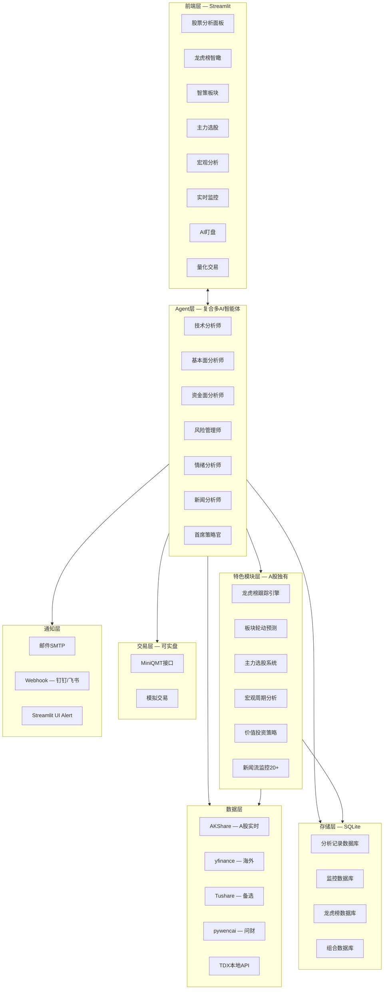

# Position Paper: aiagents-stock — 构建「A股自动盯盘AI助手」的A股特色功能最优解

> **项目**: aiagents-stock（复合多AI智能体股票团队分析系统）  
> **GitHub**: https://github.com/oficcejo/aiagents-stock  
> **Stars**: 1.4k | **License**: MIT | **语言**: Python 99.8%  
> **最近活跃**: 2026-03-23

---

## 一、架构总览

### 1.1 系统架构图（Mermaid）



### 1.2 主目录结构

```
aiagents-stock/
├── app.py                          # Streamlit主界面
├── run.py                          # 启动脚本
├── config.py                       # 核心配置（DeepSeek/Tushare/TDX/MiniQMT）
├── model_config.py                 # AI模型配置
├── requirements.txt
├── Dockerfile / Dockerfile国际源版
├── docker-compose.yml
├── .env.example / env_example.txt
├── .streamlit/                     # Streamlit主题配置
│
├── docs/                           # 超详细文档目录（30+篇）
│   ├── QUICK_START.md
│   ├── DOCKER_DEPLOYMENT.md
│   ├── TDX数据源快速配置.md
│   ├── Webhook通知配置指南.md
│   ├── 智策板块使用指南.md
│   ├── 智瞰龙虎功能说明.md
│   ├── 主力选股使用指南.md
│   ├── 量化交易快速指南.md
│   └── ...
│
├── 核心分析模块
├── ai_agents.py                    # AI Agent分析模块（6角色分析师团队）
├── deepseek_client.py              # DeepSeek API客户端（支持OpenAI兼容模型）
├── stock_data.py                   # 股票数据获取模块
├── data_source_manager.py          # 数据源管理器
├── fund_flow_akshare.py            # AKShare资金流向数据
├── news_announcement_data.py       # 新闻公告数据
├── market_sentiment_data.py        # 市场情绪数据
│
├── 监控预警模块
├── monitor_manager.py              # 监控管理UI
├── monitor_service.py              # 监控服务后端
├── monitor_db.py                   # 监控数据库管理
├── monitor_scheduler.py            # 监控调度器
├── monitor_ui.py                   # 监控UI模块
├── notification_service.py         # 通知服务（邮件/Webhook/UI）
│
├── 龙虎榜模块（智瞰龙虎）
├── longhubang_data.py              # 龙虎榜数据获取
├── longhubang_db.py                # 龙虎榜数据库
├── longhubang_agents.py            # 龙虎榜AI分析师团队（5角色）
├── longhubang_engine.py            # 龙虎榜分析引擎
├── longhubang_scoring.py           # 龙虎榜评分系统
├── longhubang_pdf.py               # 龙虎榜PDF报告
├── longhubang_ui.py                # 龙虎榜UI
│
├── 板块策略模块（智策板块）
├── sector_strategy_data.py         # 板块策略数据采集
├── sector_strategy_agents.py       # 板块策略AI团队（4角色）
├── sector_strategy_engine.py       # 板块策略分析引擎
├── sector_strategy_scheduler.py    # 板块策略定时任务
├── sector_strategy_ui.py           # 板块策略UI
├── sector_strategy_pdf.py          # 板块策略PDF报告
│
├── 主力选股模块
├── main_force_selector.py          # 主力选股数据采集
├── main_force_analysis.py          # 主力选股AI分析
├── main_force_ui.py                # 主力选股UI
├── main_force_pdf_generator.py     # 主力选股报告生成
├── main_force_batch_db.py          # 批量分析数据库
├── main_force_history_ui.py        # 历史记录UI
│
├── 宏观分析模块
├── macro_analysis_data.py          # 宏观数据采集（国家统计局）
├── macro_analysis_agents.py        # 宏观AI团队（5角色）
├── macro_analysis_engine.py        # 宏观分析引擎
├── macro_analysis_ui.py            # 宏观分析UI
│
├── 宏观周期模块
├── macro_cycle_data.py             # 宏观周期数据
├── macro_cycle_agents.py           # 宏观周期AI团队
├── macro_cycle_engine.py           # 宏观周期引擎
├── macro_cycle_pdf.py              # 宏观周期PDF
├── macro_cycle_ui.py               # 宏观周期UI
│
├── 量化交易模块
├── miniqmt_interface.py            # MiniQMT量化交易接口
│
├── 策略监控模块
├── low_price_bull_strategy.py      # 低价擒牛策略
├── low_price_bull_selector.py      # 策略选股器
├── low_price_bull_service.py       # 策略服务
├── low_price_bull_monitor.py       # 策略监控
├── low_price_bull_monitor_ui.py    # 策略监控UI
├── low_price_bull_ui.py            # 策略UI
│
├── 报告生成模块
├── pdf_generator.py                # PDF报告生成（ReportLab）
│
├── 数据库模块
├── database.py                     # 分析记录数据库
├── monitor_db.py                   # 监控数据库
├── config_manager.py               # 配置管理
│
└── 预置数据库文件
    ├── longhubang.db
    └── low_price_bull_monitor.db
```

---

## 二、核心能力清单

| # | 能力域 | 具体功能 | 技术亮点 |
|---|--------|----------|----------|
| 1 | **复合多AI智能体** | 6角色分析师团队：技术/基本面/资金面/风险/情绪/新闻，协作决策 | `StockAnalysisAgents` 类统一编排 |
| 2 | **龙虎榜跟踪** | 5角色AI团队分析游资动向，预测次日上涨概率，批量分析TOP股 | A股独有功能，散户盯盘核心需求 |
| 3 | **板块轮动分析** | 4角色AI团队预测板块牛熊/轮动/热度排名，定时自动执行 | 宏观视角，普通技术指标工具无法提供 |
| 4 | **主力选股** | 基于主力资金流，AI团队筛选3-5只优质标的，批量分析TOP10/20/30/50 | pywencai问财数据源 |
| 5 | **宏观分析** | 国家统计局官方数据（GDP/CPI/PPI/PMI/M2等），5角色AI映射A股行业 | 2026-03-23新增 |
| 6 | **MiniQMT实盘交易** | 对接券商QMT系统，自动下单、持仓管理、风险控制 | **唯一支持A股实盘的项目之一** |
| 7 | **实时监控+预警** | 价格监控、关键点位 alert、邮件/Webhook/钉钉/飞书通知 | `monitor_service.py` + `schedule` |
| 8 | **AI盯盘** | DeepSeek AI决策，24/7连续监控，自动交易，T+1规则适配 | `miniqmt_interface.py` |
| 9 | **20+平台新闻监控** | 百度/微博/东方财富/财联社/抖音/B站等，AI影响分析 | 2026-01-25新增 |
| 10 | **策略监控** | 低价擒牛/小市值/净利增长等内置策略，定时扫描+告警 | 多策略并行 |
| 11 | **批量分析** | 顺序/多线程并行（最大3并发），横向对比多股指标 | 智能过滤 |
| 12 | **TDX本地数据源** | 支持通达信本地数据，脱离网络依赖 | 网络不稳定场景保底 |
| 13 | **PDF报告生成** | ReportLab生成专业分析报告，各模块独立PDF | 可直接打印/分发 |
| 14 | **价值投资策略** | PE≤20/PB≤1.5/股息率≥1%筛选，RSI量化择时 | 2026-02-27新增 |

---

## 三、数据模型

### 3.1 核心类与接口

```python
# === AI Agent分析团队 ===
class StockAnalysisAgents:
    """股票分析AI智能体集合"""
    def __init__(self, model=None):
        self.model = model or config.DEFAULT_MODEL_NAME
        self.deepseek_client = DeepSeekClient(model=self.model)

    def technical_analyst_agent(self, stock_info, stock_data, indicators) -> Dict:
        """技术面分析智能体：技术指标/趋势/支撑阻力/交易信号"""

    def fundamental_analyst_agent(self, stock_info, financial_data, quarterly_data) -> Dict:
        """基本面分析智能体：财务指标/行业研究/估值/成长性/季报趋势"""

    def fund_flow_analyst_agent(self, stock_info, indicators, fund_flow_data) -> Dict:
        """资金面分析智能体：资金流向/主力动向/市场情绪/流动性"""

    def risk_management_agent(self, stock_info, indicators, risk_data) -> Dict:
        """风险管理智能体：Beta/波动率/问财风险数据/限售解禁/减持"""

    def sentiment_analyst_agent(self, stock_info, market_data) -> Dict:
        """情绪分析智能体：市场情绪/投资者心理/舆情"""

    def news_analyst_agent(self, stock_info, news_data) -> Dict:
        """新闻分析智能体：新闻影响/事件驱动/公告解读"""

# === DeepSeek客户端（OpenAI兼容）===
class DeepSeekClient:
    """支持deepseek-chat/deepseek-reasoner/qwen-plus/gpt-4o等任意OpenAI兼容模型"""
    def __init__(self, api_key, base_url, model): ...
    def technical_analysis(self, ...): ...
    def fundamental_analysis(self, ...): ...
    def fund_flow_analysis(self, ...): ...

# === MiniQMT交易接口 ===
class MiniQMTInterface:
    """MiniQMT量化交易接口"""
    def connect(self, host, port, account_id): ...
    def buy(self, stock_code, quantity, price, order_type): ...
    def sell(self, stock_code, quantity, price, order_type): ...
    def get_positions(self): ...
    def get_orders(self): ...

# === 监控数据库 ===
# monitor_db.py
# - monitoring_stocks: stock_code, name, entry_range, take_profit, stop_loss, check_interval
# - price_history: timestamp, price, change_pct
# - notification_records: trigger_type, message, send_status, timestamp

# === 龙虎榜数据库 ===
# longhubang_db.py
# - dragon_tiger_records: 完整历史数据
# - analysis_reports: AI分析结果
# - stock_tracking: 推荐股票跟踪
# - active_hot_money / hot_stocks: 活跃游资/热门股统计
```

### 3.2 配置模型（.env）

```python
# config.py
DEEPSEEK_API_KEY = os.getenv("DEEPSEEK_API_KEY", "")
DEEPSEEK_BASE_URL = os.getenv("DEEPSEEK_BASE_URL", "https://api.deepseek.com/v1")
DEFAULT_MODEL_NAME = os.getenv("DEFAULT_MODEL_NAME", "deepseek-chat")  # 支持任意OpenAI兼容模型
TUSHARE_TOKEN = os.getenv("TUSHARE_TOKEN", "")

# MiniQMT
MINIQMT_ENABLED = os.getenv("MINIQMT_ENABLED", "false").lower() == "true"
MINIQMT_ACCOUNT_ID = os.getenv("MINIQMT_ACCOUNT_ID", "")
MINIQMT_HOST = os.getenv("MINIQMT_HOST", "127.0.0.1")
MINIQMT_PORT = int(os.getenv("MINIQMT_PORT", "58610"))

# TDX
TDX_ENABLED = os.getenv("TDX_ENABLED", "false").lower() == "true"
TDX_BASE_URL = os.getenv("TDX_BASE_URL", "http://192.168.1.222:8181")

# 邮件
EMAIL_ENABLED = os.getenv("EMAIL_ENABLED", "false").lower() == "true"
SMTP_SERVER = os.getenv("SMTP_SERVER", "smtp.qq.com")

# Webhook
WEBHOOK_ENABLED = os.getenv("WEBHOOK_ENABLED", "false").lower() == "true"
WEBHOOK_TYPE = os.getenv("WEBHOOK_TYPE", "dingtalk")  # or feishu
WEBHOOK_URL = os.getenv("WEBHOOK_URL", "")
WEBHOOK_KEYWORD = os.getenv("WEBHOOK_KEYWORD", "股票")
```

### 3.3 技术参数

| 参数 | 值 |
|------|-----|
| 默认数据周期 | 1年 |
| 默认数据间隔 | 1天 |
| 缓存时间 | 300秒（5分钟） |
| API超时 | 30秒 |
| 最大重试 | 3次 |
| 并行分析线程 | 最大3（防API限流） |
| TDX API响应时间 | <50ms |
| Web界面端口（本地） | 8501 |
| Web界面端口（Docker） | 8503 |

---

## 四、扩展点

| 扩展位 | 机制 | 难度 | 说明 |
|--------|------|------|------|
| **新AI模型** | 修改 `.env` 中 `DEFAULT_MODEL_NAME` | ⭐ | 任何OpenAI兼容端点 |
| **新数据源** | 扩展 `stock_data.py` 或新建数据模块 | ⭐⭐ | 已有AKShare/yfinance/Tushare/TDX/pywencai示例 |
| **新分析师Agent** | 在 `ai_agents.py` 或领域专属agent文件新增类 | ⭐⭐ | `StockAnalysisAgents` 模式清晰 |
| **新通知渠道** | 扩展 `notification_service.py` | ⭐⭐ | 已有邮件/Webhook示例 |
| **新板块策略** | 创建 `sector_strategy_*.py` 模块（遵循现有模式） | ⭐⭐ | 数据→Agent→引擎→UI→PDF完整链路 |
| **新量化策略** | 扩展 `miniqmt_interface.py` + 新建策略文件 | ⭐⭐⭐ | 需理解MiniQMT API |
| **新定时任务** | `schedule` 库在scheduler模块中新增 | ⭐⭐ | 标准schedule语法 |
| **新PDF报告格式** | 扩展领域专属 `*_pdf.py` | ⭐⭐ | ReportLab模板 |
| **新UI面板** | Streamlit页面在 `app.py` 或独立 `*_ui.py` | ⭐⭐ | Streamlit组件 |
| **新监控策略** | 扩展 `low_price_bull_*.py` 模式 | ⭐⭐ | 选股器+服务+监控+UI完整链路 |

---

## 五、改造成本估算

### 5.1 目标：将 aiagents-stock 改造为「A股自动盯盘AI助手」

| 改造模块 | 工作量 | 风险等级 | 说明 |
|----------|--------|----------|------|
| **前端重构（React）** | 10-15人日 | 🔴 高 | Streamlit能力弱，需完全重写前端。但业务逻辑和Agent层无需改动 |
| **WebSocket实时推送** | 5-8人日 | 🟡 中 | 当前以轮询为主，需升级为长连接，替换schedule为APScheduler+WebSocket |
| **数据存储层升级** | 4-6人日 | 🟡 中 | SQLite→PostgreSQL/Redis，支持多用户和生产级部署 |
| **早盘简报生成+飞书推送** | 3-5人日 | 🟢 低 | 现有报告生成能力直接复用，只需新增定时任务和推送渠道 |
| **自选股管理系统** | 3-5人日 | 🟢 低 | 已有UserStock/组合管理基础，需增强为CRUD+分组+导入导出 |
| **AI交互入口（自然语言）** | 3-5人日 | 🟢 低 | Agent体系已成熟，只需增加对话层UI |
| **多Agent协作增强** | 5-8人日 | 🟡 中 | 当前Agent间缺乏真正信息交换，需引入编排层（LangGraph或自定义） |

**总计**: **33-52人日**（约2-3.5个月，2人团队）

### 5.2 风险分析

- **最大优势**：A股特色功能最完整（龙虎榜/板块轮动/MiniQMT实盘），这些功能是其他项目完全不具备的"杀手级"能力。
- **次大优势**：MIT License + Python纯项目，模块拆分无障碍。
- **最大风险**：前端必须完全重写（Streamlit→React），这是所有改造项中工作量最大、风险最高的。

---

## 六、致命缺陷自述（强制）

> **自报缺陷永远比被红队挖出好。以下3个缺陷是本项目的最大软肋。**

### 缺陷1：Streamlit前端是硬伤，美观度和交互性极差

- **问题本质**：Streamlit是Python数据科学原型工具，非生产级Web框架。其组件库有限、布局僵硬、无法支持现代Dashboard的拖拽、实时更新、复杂交互。
- **影响**：前端必须完全重写，无法复用任何现有前端代码。这是所有改造项中成本最高的（10-15人日）。
- **补救**：需全新开发React/Vue前端。好消息是后端Agent层和数据层完全解耦，前端替换不影响核心业务。

### 缺陷2：无WebSocket实时推送，以轮询为主

- **问题本质**：实时监控依赖 `schedule` 库的定时轮询（默认60秒间隔），无WebSocket长连接，无Server-Sent Events。
- **影响**：盘中秒级异动无法及时推送，用户体验与真正的"实时盯盘"有差距。高并发轮询还会增加API限流风险。
- **补救**：引入WebSocket + Redis Pub/Sub，将轮询改为推送模式。工作量5-8人日。

### 缺陷3：多Agent协作逻辑较简单，缺乏真正信息交换

- **问题本质**：`ai_agents.py` 中的6个Agent是独立顺序调用，各自分析后由"首席策略官"简单汇总。Agent之间没有真正的信息交换、辩论、迭代优化。
- **影响**：AI决策的深度和一致性不如 TradingAgents（LangGraph五层流水线+多空辩论）或 Vibe-Trading（ReAct+Swarm）。
- **补救**：引入LangGraph编排或自定义Agent编排层，让Agent间可共享状态、交叉质疑。工作量5-8人日。

---

## 七、与其他候选项目的集成可行性

### vs daily_stock_analysis（38.7k⭐ LLM每日自动分析+推送）

| 维度 | 评估 |
|------|------|
| **关系** | **互补 > 竞争** |
| **aiagents-stock 优势** | ① MiniQMT实盘交易 — daily_stock_analysis完全缺失；② 龙虎榜/板块轮动/主力选股 — A股特色功能碾压；③ 20+平台新闻监控 — 舆情覆盖更广 |
| **daily_stock_analysis 优势** | ① Stars 38.7k vs 1.4k，社区验证更充分；② 数据源更丰富（8+ vs 5+）；③ 推送渠道更全（6+ vs 3+）；④ 前端更完善（FastAPI WebUI vs Streamlit）；⑤ 多LLM Provider（10+ vs 3+） |
| **集成方式** | 以 aiagents-stock 为A股特色功能模块来源（龙虎榜/MiniQMT/板块轮动），接入 daily_stock_analysis 的数据层和推送层 |
| **集成难度** | ⭐⭐ 较低（同为Python项目，MIT License，技术栈接近） |

### vs TradingAgents（79.3k⭐ 多Agent LLM交易框架）

| 维度 | 评估 |
|------|------|
| **关系** | **互补 > 竞争** |
| **aiagents-stock 优势** | ① A股实盘交易（MiniQMT）— TradingAgents完全缺失；② A股特色功能（龙虎榜/板块轮动）；③ 实时监控/预警 — TradingAgents完全缺失；④ Streamlit前端 — 虽弱但存在，TradingAgents无前端 |
| **TradingAgents 优势** | ① Agent编排远更成熟（LangGraph vs 简单Python类）；② 多空辩论机制 — 本项目无此设计；③ 14+ LLM Provider — 本项目仅DeepSeek/OpenAI/Qwen；④ 79.3k stars社区验证 |
| **集成方式** | 以 aiagents-stock 为A股功能层和交易层，TradingAgents为Agent编排大脑。两者通过API对接 |
| **集成难度** | ⭐⭐⭐ 中等（Python间集成容易，但Agent输出格式需统一） |

### vs Vibe-Trading（8.5k⭐ 多Agent交易研究平台）

| 维度 | 评估 |
|------|------|
| **关系** | **互补 > 竞争** |
| **aiagents-stock 优势** | ① MiniQMT实盘交易 — Vibe-Trading明确不支持；② 龙虎榜/板块轮动 — A股特色；③ 20+新闻流监控 |
| **Vibe-Trading 优势** | ① React前端远强于Streamlit；② Agent架构更成熟（ReAct+Swarm）；③ 452 Alpha + 7回测 — 量化碾压；④ FastAPI后端 |
| **集成方式** | 以Vibe-Trading为全栈基座，拆出 aiagents-stock 的MiniQMT接口、龙虎榜模块、新闻监控作为插件 |
| **集成难度** | ⭐⭐⭐ 中等（Python间集成容易） |

### vs go-stock（5.8k⭐ AI桌面股票分析工具）

| 维度 | 评估 |
|------|------|
| **关系** | **部分互补，技术栈隔离** |
| **aiagents-stock 能为 go-stock 提供** | ① MiniQMT实盘接口（Go项目无此能力）；② 龙虎榜/板块轮动分析逻辑参考 |
| **go-stock 能为 aiagents-stock 提供** | ① AI热点/资金/情绪分析Prompt — 可迁移为Agent模板；② NaiveUI设计参考 |
| **冲突点** | Go + Wails + Vue3 与 Python + Streamlit 不兼容，代码无法复用 |
| **集成方式** | **仅参考设计，不集成代码** |
| **集成难度** | ⭐⭐⭐⭐⭐ 无法直接集成 |

---

## 八、强势结论

**aiagents-stock 是构建「A股自动盯盘AI助手」的A股特色功能最优解，理由如下：**

1. **A股杀手级功能最完整** — 龙虎榜跟踪、板块轮动分析、主力选股、MiniQMT实盘交易，这些功能是其他所有项目**完全不具备的A股独有能力**。没有龙虎榜的A股盯盘助手等于没有灵魂。
2. **MiniQMT实盘接口** — 本次调研中**极少数可直接对接A股实盘的项目**，从"看"到"做"的闭环已打通。其他项目要么声明不执行实盘，要么连交易接口的影子都没有。
3. **复合多AI智能体设计** — 6角色分析师团队（技术/基本面/资金面/风险/情绪/新闻）直接映射真实证券研究团队，不是单Agent一言堂。
4. **20+平台新闻监控** — 百度/微博/东方财富/财联社/抖音/B站全覆盖，A股舆情驱动型预警有数据支撑。
5. **MIT License + Python纯项目** — 可自由Fork、修改、闭源分发。AKShare + TA-Lib + Plotly技术栈标准，模块拆分无障碍。
6. **超详细文档** — 30+篇中文文档覆盖部署/配置/使用/故障排查，降低团队上手成本。
7. **开发者视角真实** — 项目标语"使像我一样的小散，不再迷茫"，说明开发者本身就是A股用户，功能设计贴合真实散户需求。

**aiagents-stock 的Streamlit前端和轮询架构是明显短板，但这些是"表皮问题"而非"骨骼问题"。其A股特色功能模块（龙虎榜/板块轮动/MiniQMT/新闻监控）是其他项目花再多时间也无法凭空造出的"硬核资产"。对于强调A股深度和实盘能力的目标产品而言，aiagents-stock 是不可或缺的核心模块来源。**
