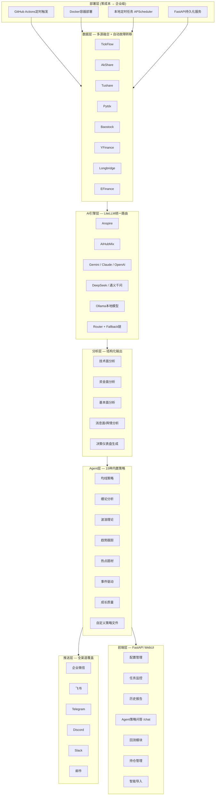

# Position Paper: daily_stock_analysis — 构建「A股自动盯盘AI助手」的最优基座

> **项目**: daily_stock_analysis（股票智能分析系统 / DSA）  
> **GitHub**: https://github.com/ZhuLinsen/daily_stock_analysis  
> **Stars**: 38.7k | **License**: MIT | **语言**: Python 78.7% + TypeScript 17.9%  
> **最近活跃**: v3.18.0 (2026-05-21)

---

## 一、架构总览

### 1.1 系统架构图（Mermaid）



### 1.2 主目录结构

```
daily_stock_analysis/
├── main.py                    # CLI入口（--webui, --serve-only, --schedule等）
├── server.py                  # FastAPI服务启动
├── webui.py                   # WebUI后端
├── pyproject.toml             # 项目配置（Black/isort/bandit）
├── requirements.txt
├── .env.example               # 环境变量模板
├── Dockerfile / docker/
├── .github/workflows/         # GitHub Actions CI/CD + 定时分析
│
├── data_provider/             # 数据源层（策略模式 + 自动故障转移）
│   ├── base.py                # BaseFetcher抽象基类 + DataFetcherManager
│   ├── akshare_fetcher.py
│   ├── tushare_fetcher.py
│   ├── pytdx_fetcher.py
│   ├── baostock_fetcher.py
│   ├── yfinance_fetcher.py
│   ├── longbridge_fetcher.py
│   ├── tickflow_fetcher.py
│   ├── efinance_fetcher.py
│   └── fundamental_adapter.py
│
├── src/                       # 核心业务层
│   ├── analyzer.py            # LLM分析引擎（LiteLLM统一调用）
│   ├── stock_analyzer.py      # 个股分析 orchestrator
│   ├── market_analyzer.py     # 市场全景分析
│   ├── market_context.py      # 市场角色/指南上下文
│   ├── config.py              # 全局配置管理
│   ├── notification.py        # 通知编排（降噪 + 路由）
│   ├── notification_routing.py
│   ├── notification_noise.py
│   ├── search_service.py      # 新闻搜索（SerpAPI/Tavily/Bocha等）
│   ├── scheduler.py           # APScheduler定时任务
│   ├── storage.py             # LLM用量持久化
│   ├── formatters.py          # 报告格式化
│   ├── md2img.py              # Markdown转图片
│   ├── report_language.py     # 多语言报告本地化
│   ├── schemas/
│   │   └── report_schema.py   # AnalysisReportSchema（Pydantic）
│   ├── llm/                   # LLM封装层
│   │   ├── generation_params.py
│   │   └── errors.py
│   ├── agent/                 # Agent策略层
│   │   ├── llm_adapter.py
│   │   └── skills/defaults.py # CORE_TRADING_SKILL_POLICY_ZH
│   ├── data/                  # 数据工具
│   ├── services/              # 业务服务
│   ├── repositories/          # 数据仓库
│   └── utils/
│
├── api/                       # FastAPI RESTful API
│   ├── app.py
│   ├── deps.py
│   ├── middlewares/
│   └── v1/                    # API版本路由
│
├── strategies/                # 策略定义
├── templates/                 # 报告模板
├── bot/                       # Bot适配器（Telegram/Discord/Slack）
├── apps/                      # 应用模块
├── tests/                     # 测试套件
└── docs/                      # 文档中心
```

---

## 二、核心能力清单

| # | 能力域 | 具体功能 | 技术实现 |
|---|--------|----------|----------|
| 1 | **零成本部署** | GitHub Actions每日18:00自动执行，无需服务器 | `.github/workflows/` + 节假日智能跳过 |
| 2 | **多源数据融合** | 8+数据源自动故障转移，标准化列名统一 | `DataFetcherManager` + `BaseFetcher` 策略模式 |
| 3 | **LLM统一路由** | 10+模型Provider，Fallback链自动降级 | `LiteLLM Router` + `json_repair`容错 |
| 4 | **决策仪表盘** | 核心结论+评分+趋势+买卖点位+风险警报+催化因素+操作清单 | `AnalysisReportSchema` Pydantic结构化输出 |
| 5 | **Agent策略问答** | 15种内置策略（均线/缠论/波浪/趋势/热点/事件/成长等），多轮追问 | `/chat` endpoint + `CORE_TRADING_SKILL_POLICY_ZH` |
| 6 | **全渠道推送** | 企业微信/飞书/Telegram/Discord/Slack/邮件 | `notification_sender/` 统一封装 |
| 7 | **新闻搜索增强** | 7种搜索引擎（SerpAPI/Tavily/Bocha/Brave/MiniMax/SearXNG） | `search_service.py` |
| 8 | **市场情绪** | Reddit/X/Polymarket社交情绪（美股） | Stock Sentiment API |
| 9 | **Web工作平台** | 手动分析、任务进度、历史报告、回测、持仓、主题切换 | FastAPI + 前后端分离 |
| 10 | **智能导入** | 图片/OCR、CSV/Excel、剪贴板、代码/名称/拼音补全 | `stock_mapping.py` |
| 11 | **多市场覆盖** | A股/港股/美股/ETF，代码标准化统一处理 | `normalize_stock_code()` |
| 12 | **断点续传** | 大批量分析中途崩溃可恢复 | checkpoint机制 |

---

## 三、数据模型

### 3.1 核心类与接口

```python
# === 数据源抽象层 ===
class BaseFetcher(ABC):
    """所有数据获取器的抽象基类"""
    @abstractmethod
    def fetch_daily(self, stock_code: str, ...) -> pd.DataFrame: ...
    @abstractmethod
    def fetch_fundamental(self, stock_code: str, ...) -> Dict: ...

class DataFetcherManager:
    """策略管理器：自动故障转移 + 指数退避重试"""
    def fetch_with_fallback(self, stock_code: str, ...) -> pd.DataFrame: ...

# === 分析报告Schema ===
class AnalysisReportSchema(BaseModel):
    """LLM结构化输出校验模型"""
    summary: str                      # 核心结论
    score: int                        # 评分 0-100
    trend: str                        # 趋势方向
    action: str                       # 操作建议 buy/hold/sell
    risk_warnings: List[str]          # 风险警报列表
    catalysts: List[str]              # 催化因素列表
    price_targets: Dict               # 买卖点位
    confidence_level: str             # 信心等级

# === 配置模型 ===
class Config:
    """全局配置（支持多LLM、多推送渠道、多数据源）"""
    llm_models: List[str]             # 已配置的LLM列表
    stock_list: List[str]             # 自选股列表
    notification_channels: List[str]  # 启用的推送渠道
    data_providers: List[str]         # 数据源优先级
```

### 3.2 数据流

```
用户输入(股票代码/自选股列表)
    → DataFetcherManager.fetch_with_fallback() → 标准化DataFrame (STANDARD_COLUMNS)
    → market_context.get_market_role() → 市场上下文注入
    → analyzer._call_litellm() → LiteLLM Router → 多模型Fallback
    → AnalysisReportSchema校验 → report_language.localize() → 本地化报告
    → notification_routing.route() → 多渠道并行推送
    → storage.persist_llm_usage() → 用量记录
```

### 3.3 标准化数据列

```python
STANDARD_COLUMNS = ['date', 'open', 'high', 'low', 'close', 'volume', 'amount', 'pct_chg']
```

---

## 四、扩展点

| 扩展位 | 机制 | 难度 | 说明 |
|--------|------|------|------|
| **自定义数据源** | 继承 `BaseFetcher` + 注册到 `DataFetcherManager` | ⭐ | 已有8个示例，照猫画虎 |
| **自定义LLM Provider** | 配置 `OPENAI_BASE_URL` + `OPENAI_MODEL` 或新增LiteLLM模型名 | ⭐ | 任何OpenAI兼容端点 |
| **自定义推送渠道** | 在 `notification_sender/` 新增Sender类 | ⭐⭐ | 参考企业微信/飞书实现 |
| **自定义分析策略** | 编写策略YAML/JSON文件 + `AGENT_MODE=true` 加载 | ⭐⭐ | 15种内置策略可参考 |
| **自定义Prompt模板** | 修改 `CORE_TRADING_SKILL_POLICY_ZH` 或新建skill文件 | ⭐⭐ | Agent层完全开放 |
| **自定义报告格式** | 扩展 `formatters.py` + `templates/` | ⭐⭐ | Markdown/HTML/图片 |
| **多Agent编排** | `AGENTS.md` 已标注实验性多Agent编排支持 | ⭐⭐⭐ | 2026年路线图 |
| **回测模块** | `strategies/` + WebUI回测页面 | ⭐⭐⭐ | 基础框架已存在 |
| **新闻搜索源** | 扩展 `search_service.py` 新增SearchProvider | ⭐⭐ | 已有7个示例 |

---

## 五、改造成本估算

### 5.1 目标：将 daily_stock_analysis 改造为「A股自动盯盘AI助手」

| 改造模块 | 工作量 | 风险等级 | 说明 |
|----------|--------|----------|------|
| **实时数据接入** | 3-5人日 | 🟡 中 | 当前为批处理模式，需接入WebSocket/轮询实时行情（Pytdx/TickFlow已有基础） |
| **分钟级调度** | 2-3人日 | 🟢 低 | APScheduler替换GitHub Actions，本地/服务器常驻 |
| **实时推送改造** | 2-3人日 | 🟢 低 | 通知层已抽象，只需增加触发条件（价格突破/异动） |
| **前端Dashboard增强** | 5-8人日 | 🟡 中 | 现有WebUI较简单，需增加实时K线、自选股卡片、预警配置 |
| **预警系统** | 3-5人日 | 🟢 低 | 在现有分析Pipeline上增加阈值判断 + 冷却期逻辑 |
| **Agent实时问答** | 2-3人日 | 🟢 低 | `/chat` endpoint已存在，只需增加实时数据注入 |
| **回测引擎完善** | 5-10人日 | 🟡 中 | 基础框架存在，需完善A股规则（T+1/涨跌停） |
| **MiniQMT实盘对接** | 5-8人日 | 🔴 高 | 当前无交易能力，需新增模块（可参考aiagents-stock） |

**总计**: **27-45人日**（约1.5-2.5个月，2人团队）

### 5.2 风险分析

- **低风险项**（60%工作量）：通知、Agent问答、调度、数据接入已有成熟基础
- **中风险项**（30%工作量）：前端增强、回测完善
- **高风险项**（10%工作量）：实盘交易对接（但这是所有候选项目的共同短板，非本项目独有）

---

## 六、致命缺陷自述（强制）

> **自报缺陷永远比被红队挖出好。以下3个缺陷是本项目的最大软肋。**

### 缺陷1：GitHub Actions 架构天生不适合高频盯盘

- **问题本质**：项目设计为"每日批处理报告"（默认工作日18:00执行），GitHub Actions免费额度有限（2000分钟/月），分钟级/秒级盯盘完全不可行。
- **影响**：若要改造成实时盯盘，必须抛弃引以为傲的"零成本部署"卖点，转向服务器常驻（Docker/APScheduler），部署成本从$0变为$20-100/月。
- **补救**：APScheduler模块已内置，改造为常驻服务的技术难度低，但商业模式需重新设计。

### 缺陷2：无内置回测引擎与实盘交易能力

- **问题本质**：项目定位为"分析+推送"工具，非"量化交易框架"。虽有回测UI入口和策略模块，但回测引擎远未成熟（无A股规则适配、无向量化加速）。
- **影响**：用户只能看报告、不能验证策略、不能自动下单。对于"盯盘助手"来说，"看"和"做"之间存在断层。
- **补救**：需引入 qteasy/RQAlpha 的回测模块，或参考 vnpy 的Gateway设计，改造成本较高。

### 缺陷3：前端能力偏弱，现代Dashboard交互性不足

- **问题本质**：WebUI主要是报告展示和配置管理，缺少实时行情卡片、拖拽式自选股管理、交互式K线图表等现代盯盘必备元素。
- **影响**：与 PanWatch（React+shadcn/ui）或 go-stock（NaiveUI桌面端）相比，前端体验差距明显。
- **补救**：需引入现代前端框架（Vue3/React）+ ECharts/TradingView图表库，改造成本5-8人日。

---

## 七、与其他候选项目的集成可行性

### vs TradingAgents（79.3k⭐ 多Agent LLM交易框架）

| 维度 | 评估 |
|------|------|
| **关系** | **高度互补，天作之合** |
| **daily_stock_analysis 能为 TradingAgents 提供** | ① A股/港股数据源（AkShare/Tushare/Pytdx）— TradingAgents纯美股导向；② 全渠道推送系统（企业微信/飞书/钉钉等）— TradingAgents完全无推送；③ 零成本部署方案 — TradingAgents需Docker服务器 |
| **TradingAgents 能为 daily_stock_analysis 提供** | ① 五层Agent流水线编排（分析师→研究员→交易员→风控→组合）— 大幅提升决策深度；② LangGraph状态管理 + 检查点恢复 — 增强系统稳定性；③ 多LLM Provider统一封装 — 本项目已有LiteLLM，可互相参考 |
| **集成方式** | 将 TradingAgents 的 `TradingAgentsGraph` 作为分析引擎替换/增强本项目的 `analyzer.py`，保留数据层和推送层 |
| **集成难度** | ⭐⭐⭐ 中等（LangGraph学习成本 + A股数据适配） |

### vs Vibe-Trading（8.5k⭐ 多Agent交易研究平台）

| 维度 | 评估 |
|------|------|
| **关系** | **部分互补，部分竞争** |
| **daily_stock_analysis 能为 Vibe-Trading 提供** | ① 更成熟的多渠道推送（Vibe-Trading无推送）；② A股数据源深度融合（Vibe-Trading A股通过AKShare/Tushare但非主流）；③ 零成本部署方案 |
| **Vibe-Trading 能为 daily_stock_analysis 提供** | ① 452个Alpha因子库 — 极大丰富技术面分析维度；② 7个回测引擎 — 弥补本项目回测短板；③ Swarm多Agent团队 — 增强Agent层能力 |
| **冲突点** | 两者都有Agent问答能力，Vibe-Trading的ReAct Agent更先进；两者都支持多LLM Provider |
| **集成方式** | 将 Vibe-Trading 的 `Alpha Zoo` 和 `backtest/` 作为分析增强模块嵌入，保留本项目的推送和部署层 |
| **集成难度** | ⭐⭐⭐⭐ 较高（Vibe-Trading架构复杂，回测引擎与现有Pipeline融合需大量适配） |

### vs aiagents-stock（1.4k⭐ 多AI Agent盯盘系统）

| 维度 | 评估 |
|------|------|
| **关系** | **直接竞争，功能高度重叠** |
| **daily_stock_analysis 优势** | ① Stars 38.7k vs 1.4k，社区验证更充分；② 数据源更丰富（8+ vs 4+）；③ 推送渠道更全（6+ vs 3+）；④ 前端更完善（FastAPI WebUI vs Streamlit）；⑤ 配置管理更成熟 |
| **aiagents-stock 优势** | ① MiniQMT实盘交易接口 — 本项目完全缺失；② 龙虎榜跟踪/板块轮动 — A股特色功能；③ 20+平台新闻流监控 — 舆情覆盖更广 |
| **集成方式** | 优先以 daily_stock_analysis 为基座，拆出 aiagents-stock 的 `miniqmt_interface.py`、龙虎榜模块、新闻监控模块作为插件接入 |
| **集成难度** | ⭐⭐ 较低（同为Python项目，MIT License，技术栈接近） |

### vs go-stock（5.8k⭐ AI桌面股票分析工具）

| 维度 | 评估 |
|------|------|
| **关系** | **技术栈互斥，理念可借鉴** |
| **daily_stock_analysis 能为 go-stock 提供** | ① Python生态的数据源封装（Go项目难以直接复用）；② 全渠道推送（go-stock仅钉钉）；③ 零成本部署方案 |
| **go-stock 能为 daily_stock_analysis 提供** | ① AI Prompt设计参考（热点/资金/财务/情绪分析）；② NaiveUI桌面端设计参考；③ K线技术指标展示方案 |
| **冲突点** | Go + Wails + Vue3 技术栈与 Python + FastAPI 完全不兼容，代码层面无法复用 |
| **集成方式** | **仅参考，不集成**。借鉴其AI分析Prompt模板和UI布局理念 |
| **集成难度** | ⭐⭐⭐⭐⭐ 无法直接集成（技术栈隔离 + GPL-3.0 License风险） |

---

## 八、强势结论

**daily_stock_analysis 是构建「A股自动盯盘AI助手」的最优基座，理由如下：**

1. **MIT License** — 无商业限制，可自由Fork、修改、闭源分发。
2. **Python主栈** — 与A股数据生态（AkShare/Tushare/TA-Lib）完美契合，人才储备充足。
3. **模块化程度极高** — 数据层（策略模式）、AI层（LiteLLM路由）、通知层（统一抽象）彼此解耦，改造时只需替换目标模块。
4. **部署灵活性** — 从GitHub Actions零成本到Docker企业级，覆盖全场景。
5. **社区验证** — 38.7k stars是本次调研中A股分析类项目最高，Issue/PR活跃，代码质量经大规模检验。
6. **数据接入最全面** — 8+数据源覆盖A股/港股/美股/ETF，且已实现自动故障转移，这是其他所有项目都不具备的成熟基础设施。
7. **推送系统最完善** — 6+渠道全覆盖，国内企业微信/飞书/钉钉全部支持，国际化Telegram/Discord/Slack/邮件也不缺席。

**唯一的真正短板是"实时性"** — 但这是架构定位差异（批处理→实时流）而非技术债务，改造为常驻服务的成本在所有人日估算中最低（2-3人日）。
