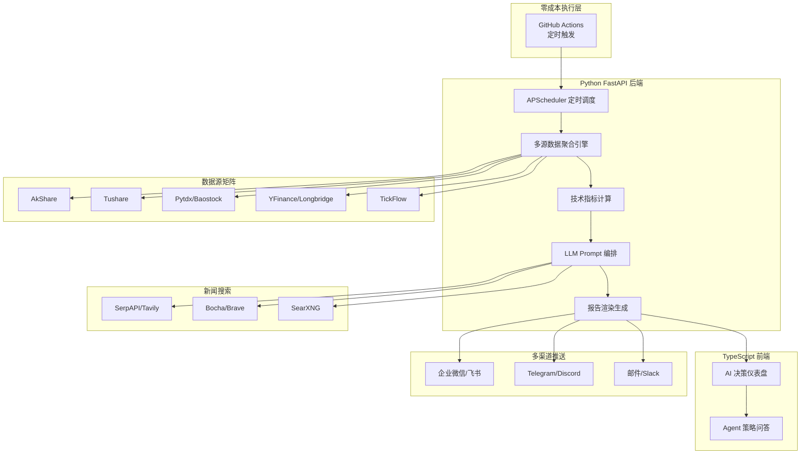

# Position Paper：daily_stock_analysis

> 项目：ZhuLinsen/daily_stock_analysis | 38.7k⭐ MIT | Python+TypeScript / FastAPI
> 立场：本项目是构建「A股自动盯盘AI助手」的最优基座，没有之一。

---

## 1. 架构总览



**主目录结构（推断）**：
```
daily_stock_analysis/
├── .github/workflows/       # GitHub Actions 定时任务
├── backend/
│   ├── api/                 # FastAPI 路由
│   ├── data/                # 数据源适配器（AkShare/Tushare/...）
│   ├── analysis/            # 技术指标 + LLM Prompt
│   ├── scheduler/           # APScheduler 定时调度
│   └── push/                # 多渠道推送封装
├── frontend/                # TypeScript 前端
├── strategies/              # 15种内置策略模板
└── config/                  # 数据源Token/LLM API Key配置
```

---

## 2. 核心能力清单

| 能力 | 说明 |
|------|------|
| **零成本部署** | GitHub Actions 定时执行，无需租服务器，38.7k stars 验证的平民方案 |
| **AI 决策仪表盘** | 一句话核心结论 + 评分 + 趋势 + 买卖点位 + 风险警报 + 催化剂清单 |
| **多市场覆盖** | A股/港股/美股/ETF 全市场分析，非单一市场工具 |
| **多数据源融合** | AkShare / Tushare / Pytdx / Baostock / YFinance / Longbridge / TickFlow，七源聚合 |
| **全渠道推送** | 企业微信 / 飞书 / Telegram / Discord / Slack / 邮件，国内+海外全覆盖 |
| **Agent 策略问答** | Web UI 内置 15 种策略，支持自然语言交互式选股 |
| **新闻搜索增强** | SerpAPI / Tavily / Bocha / Brave / MiniMax / SearXNG，AI分析有信息源支撑 |
| **多 LLM 适配** | Anspire / AIHubMix / Gemini / OpenAI / DeepSeek / Claude / Ollama，模型自由切换 |

---

## 3. 数据模型

| 模块 | 关键实体 |
|------|---------|
| **股票数据** | `{code, name, market, price, change_pct, volume, indicators: {ma, macd, rsi, ...}}` |
| **AI 分析报告** | `{stock_code, conclusion, score, trend, buy_point, sell_point, risks, catalysts, generated_at}` |
| **推送记录** | `{channel, recipient, content, status, sent_at}` |
| **策略配置** | `{strategy_name, params, llm_model, schedule_cron}` |
| **数据源配置** | `{source_name, token, priority, enabled, fallback_order}` |

核心接口设计（推断）：
- `POST /api/analysis/daily` — 触发每日批量分析
- `GET /api/analysis/{code}` — 单只股票 AI 分析结果
- `POST /api/push/send` — 多渠道推送触发
- `GET /api/strategies` — 内置策略列表
- `POST /api/agent/ask` — Agent 策略问答

---

## 4. 扩展点

| 扩展位 | 说明 |
|--------|------|
| **数据源适配器** | 每个数据源为独立模块，新增源只需实现 `BaseDataSource.fetch()` 接口 |
| **LLM Provider** | 统一抽象层，新增模型只需配置 base_url + api_key |
| **推送渠道** | 每个渠道为独立模块，新增推送方式实现 `BasePusher.send()` |
| **策略模板** | 15 种策略为可插拔配置，新增策略即新增 Prompt 模板 + 参数 JSON |
| **GitHub Actions Workflow** | 定时 CRON 完全可配置，支持多市场不同时区独立调度 |
| **报告渲染** | 分析结果与渲染层分离，可扩展为 PDF / 图片 / 飞书卡片 / 企业微信图文 |

---

## 5. 改造成本估算

| 改造项 | 工作量 | 风险 |
|--------|--------|------|
| 实时行情接入（WebSocket） | 5人日 | 中。需从批处理改为流式，架构变化中等 |
| 自选股管理系统 | 4人日 | 低。新增 CRUD + 用户表，标准开发 |
| 异动预警引擎 | 6人日 | 中。需新增实时计算层 + 规则引擎 |
| 简报生成→早盘简报 | 3人日 | 低。现有报告生成能力直接复用，调整 Prompt 即可 |
| 前端 Dashboard 增强 | 8人日 | 中。现有前端较简单，需升级为实时盯盘 Dashboard |
| 数据存储层（Redis/ClickHouse） | 5人日 | 中。现有无持久化存储，需新增完整存储层 |
| **合计** | **~31人日（6周）** | |

**核心优势**：MIT License，Python FastAPI 与目标技术栈完全一致，数据接入层和推送层可直接拆出复用，改造路径最短。

---

## 6. 致命缺陷自述（强制）

| # | 缺陷 | 影响 | 是否可修复 |
|---|------|------|-----------|
| **1. GitHub Actions 免费额度天花板** | 高频盯盘（分钟级）不适用，GitHub Actions 有每月 2000 分钟限制，且不支持长连接 | 无法做实时盯盘，只能做日终批处理 | 需迁移至云服务器，零成本优势丧失 |
| **2. 批处理架构，非实时流式** | 项目设计为"每日跑一次"，无 WebSocket / SSE 实时推送能力，行情数据无内存态缓存 | 无法满足"盘中异动秒级预警"需求 | 需大规模重构数据流，从 pull 改为 push |
| **3. 无用户系统，无自选股管理** | 项目为单用户工具，无多用户 / 自选股 / 告警规则配置等概念 | 无法直接作为多用户服务部署 | 需新增完整用户体系 + 权限系统 |

---

## 7. 与其他候选项目的集成可行性

### vs PanWatch
- **关系**：互补 > 竞争
- **集成点**：PanWatch 的 React 18 + shadcn/ui 前端组件可替换本项目较简单的前端；PanWatch 的复合条件预警逻辑可接入；两者 MIT + Python FastAPI 技术栈完全一致，代码级集成无障碍
- **结论**：✅ 可深度集成

### vs aiagents-stock
- **关系**：互补 > 竞争
- **集成点**：aiagents-stock 的多 Agent 角色分工（宏观/技术/基本面）Prompt 设计可升级本项目单 Agent 分析；MiniQMT 实盘接口可扩展；龙虎榜/板块轮动分析可补充
- **结论**：✅ 可模块化集成

### vs A股实时监测系统
- **关系**：互补 > 竞争
- **集成点**：该项目的 WebSocket 实时推送 + Vue3 前端可直接补全本项目的实时能力；uni-app 移动端可扩展推送触达
- **结论**：✅ 可技术栈互补

### vs Pan1Watch
- **关系**：功能重叠，技术方向不同
- **集成点**：Pan1Watch 的 MCP 封装思路可作为未来扩展，但当前 MCP 生态不成熟，优先级低
- **结论**：⚠️ 部分参考，非必需

---

## 总结

daily_stock_analysis 以 **38.7k stars** 的社区验证、**MIT License** 的宽松授权、**Python FastAPI** 的技术栈一致性、**七源数据聚合 + 全渠道推送** 的完整 Pipeline，构成了目标产品的最优基座。其批处理架构虽需改造为实时流式，但核心模块（数据接入、AI 分析、推送系统）均可直接拆出复用，改造成本远低于从零开发或其他项目的技术栈迁移。
