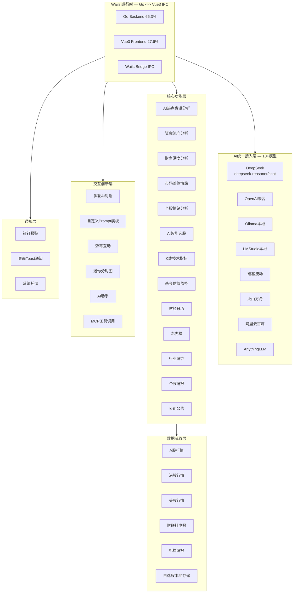

# Position Paper: go-stock — 构建「A股自动盯盘AI助手」的AI分析与桌面体验最优解

> **项目**: go-stock  
> **GitHub**: https://github.com/ArvinLovegood/go-stock  
> **Stars**: 5.8k | **License**: GPL-3.0 | **语言**: Go 66.3% + Vue3/NaiveUI/Vite 27.6% + TypeScript 4.7%  
> **最近活跃**: v2026.05.23.1-release (2026-05-23)

---

## 一、架构总览

### 1.1 系统架构图（Mermaid）



### 1.2 主目录结构

```
go-stock/
├── main.go                        # Go入口
├── app.go                         # Wails应用主逻辑
├── app_common.go                  # 跨平台通用逻辑
├── app_darwin.go / app_linux.go / app_windows.go  # 平台特定逻辑
├── app_test.go                    # 测试
├── utils.go                       # 工具函数
├── go.mod / go.sum                # Go模块依赖
├── wails.json                     # Wails框架配置
│
├── .github/                       # GitHub Actions
├── build/                         # 构建产物 + 图标
├── scripts/                       # 构建脚本
│
├── backend/                       # Go后端核心
│   ├── agent/                     # AI Agent层
│   │   ├── agent.go               # Agent核心（React/PlanExecute两种模式）
│   │   ├── agent_api.go           # Agent API接口
│   │   ├── chat_memory.go         # 聊天记忆
│   │   ├── chat_model_factory.go  # 聊天模型工厂
│   │   ├── cron_task_api.go       # 定时任务API
│   │   ├── token_utils.go         # Token计算工具
│   │   └── tools/                 # Agent工具函数
│   │
│   ├── data/                      # 数据获取层
│   ├── db/                        # 数据库层（SQLite/GORM）
│   ├── logger/                    # 日志系统（zap + lumberjack）
│   ├── machineid/                 # 机器ID（授权验证）
│   ├── models/                    # 数据模型（GORM Struct）
│   └── util/                      # 工具函数
│
├── frontend/                      # Vue3 + NaiveUI + Vite 前端
│   ├── src/
│   │   ├── views/                 # 页面（大盘/个股/自选股/AI分析/设置）
│   │   ├── components/            # 组件（K线/资金图/情绪面板/分时图）
│   │   ├── api/                   # Wails桥接调用
│   │   ├── stores/                # Pinia状态管理
│   │   └── assets/
│   ├── package.json
│   └── vite.config.ts
│
├── ai-assistant-web/              # AI助手Web端（可能为独立模块）
├── data/                          # 本地数据存储
├── docs/                          # 文档
│   └── go-stock使用手册.md
│
└── 赞助与更新相关文件
    ├── update_helper_*.go         # 自动更新助手
```

### 1.3 Go依赖亮点（go.mod）

```go
// AI模型统一接入（CloudWeGo Eino框架）
github.com/cloudwego/eino                    // Go语言AI应用框架
github.com/cloudwego/eino-ext/components/model/ark      // 火山方舟
github.com/cloudwego/eino-ext/components/model/claude   // Anthropic
github.com/cloudwego/eino-ext/components/model/deepseek // DeepSeek
github.com/cloudwego/eino-ext/components/model/gemini   // Google
github.com/cloudwego/eino-ext/components/model/ollama   // Ollama
github.com/cloudwego/eino-ext/components/model/openai   // OpenAI
github.com/cloudwego/eino-ext/components/model/openrouter // OpenRouter
github.com/cloudwego/eino-ext/components/model/qwen     // 通义千问
github.com/cloudwego/eino-ext/components/tool/mcp       // MCP工具调用

// 数据与存储
github.com/bensema/gotdx         // 通达信数据
github.com/glebarez/sqlite       // SQLite（纯Go）
gorm.io/gorm                     // ORM
gorm.io/plugin/soft_delete       // 软删除

// 网络与解析
github.com/PuerkitoBio/goquery   // HTML解析
github.com/chromedp/chromedp     // 无头浏览器
github.com/go-resty/resty/v2     // HTTP客户端
github.com/tidwall/gjson         // JSON解析

// 系统与UI
github.com/getlantern/systray    // 系统托盘
github.com/gen2brain/beeep       // 桌面通知
github.com/robfig/cron/v3        // 定时任务
```

---

## 二、核心能力清单

| # | 能力域 | 具体功能 | 技术亮点 |
|---|--------|----------|----------|
| 1 | **10+ AI模型统一接入** | DeepSeek/OpenAI/Ollama/LMStudio/硅基流动/火山方舟/阿里云百炼/AnythingLLM | CloudWeGo Eino框架，Go语言AI应用层抽象度最高 |
| 2 | **AI多维分析** | 热点资讯/资金流向/财务深度/市场整体情绪/个股情绪，五维分析 | 可配置Prompt模板，2025.2.12起支持自定义 |
| 3 | **AI智能选股** | AI总结市场行情 + 智能体选股 | AgentMode支持React和PlanExecute两种代理模式 |
| 4 | **自选股管理** | 完整CRUD + 成本录入 + 实时盈亏计算 + 分组管理 | SQLite本地持久化 |
| 5 | **涨跌报警推送** | 价格阈值报警 + 钉钉推送 + 桌面Toast通知 | 系统托盘常驻 |
| 6 | **K线技术指标** | 日K/分时/多周期K线 + SATS自感知趋势指标 + 13个TV指标 | 2026.05.20新增 |
| 7 | **基金估值监控** | 基金K线 + 前十大重仓持仓数据 | 2026.05.15新增 |
| 8 | **财经日历** | 重大事件时间轴 + 宏观经济事件追踪 | 为早盘简报提供上下文 |
| 9 | **多市场覆盖** | A股/港股/美股行情 + 基金净值 | 数据源接入层已有泛化能力 |
| 10 | **多轮AI对话** | AI分析后可继续追问，交互式深度分析 | 聊天记忆持久化 |
| 11 | **MCP工具调用** | 支持MCP协议，可调用外部工具 | 2026.04.11新增 |
| 12 | **弹幕互动** | 盯盘不再孤单，社区化体验 | 2025.02.23新增 |
| 13 | **自动更新** | 软件自动检测更新，CDN下载 | 2025.07.08实现 |
| 14 | **最新活跃** | 2026-05-23持续更新，5个项目中最活跃 | 维护意愿强，功能迭代快 |

---

## 三、数据模型

### 3.1 核心Go Struct

```go
// backend/models/ — GORM模型

type Stock struct {
    Code        string  `gorm:"primaryKey"`  // 股票代码
    Name        string  // 股票名称
    Market      string  // 市场 A/HK/US
    Sector      string  // 行业
}

type UserStock struct {
    ID            uint    `gorm:"primaryKey"`
    Code          string  // 股票代码
    CostPrice     float64 // 成本价
    HoldQuantity  int     // 持仓数量
    GroupName     string  // 分组名称
    Notes         string  // 备注
}

type AlertRule struct {
    ID              uint    `gorm:"primaryKey"`
    Code            string  // 股票代码
    ConditionType   string  // 条件类型: price_up / price_down / pct_change
    Threshold       float64 // 阈值
    CoolDown        int     // 冷却期（秒）
    NotifyChannel   string  // 通知渠道: dingtalk / toast
    Enabled         bool
}

type AIAnalysis struct {
    ID          uint      `gorm:"primaryKey"`
    AnalysisType string   // 热点/资金/财务/情绪
    Model       string     // 使用的AI模型
    Prompt      string     // Prompt模板
    Response    string     // AI回复
    Timestamp   time.Time
}

type MarketData struct {
    Code        string  // 股票代码
    CurrentPrice float64 // 当前价格
    ChangePct   float64 // 涨跌幅
    Volume      int64   // 成交量
    Turnover    float64 // 成交额
    UpdatedAt   time.Time
}

type FundValuation struct {
    FundCode    string  // 基金代码
    NAV         float64 // 净值
    Estimate    float64 // 估算净值
    Discount    float64 // 折溢价率
}

type CalendarEvent struct {
    Date        string  // 日期
    Title       string  // 事件标题
    Importance  string  // 重要性: high/medium/low
    Country     string  // 国家/地区
}
```

### 3.2 AI Agent配置

```go
// backend/agent/agent.go
// AgentMode类型支持React和PlanExecute两种代理模式
// 2026.04.12引入AgentMode
// 2026.04.11引入MCP工具调用支持
// 2026.04.04添加节假日工具支持
// 2026.04.03添加股票异动数据工具

type AgentConfig struct {
    Model       string      // AI模型
    Mode        AgentMode   // React / PlanExecute
    MCPEnabled  bool        // MCP工具开关
    Tools       []string    // 启用的工具列表
}
```

### 3.3 本地存储

| 存储 | 技术 | 用途 |
|------|------|------|
| 自选股 | SQLite + GORM | 用户自选股票、成本、持仓 |
| 分析记录 | SQLite + GORM | AI分析历史 |
| 报警规则 | SQLite + GORM | 用户设置的阈值规则 |
| AI对话记忆 | SQLite + GORM | 多轮对话上下文 |
| 本地缓存 | freecache | 行情数据缓存 |

---

## 四、扩展点

| 扩展位 | 机制 | 难度 | 说明 |
|--------|------|------|------|
| **AI模型接入** | `chat_model_factory.go` 工厂模式，新增Provider只需实现统一接口 | ⭐⭐ | 已有10+示例，Eino框架标准化 |
| **分析维度插件** | 热点/资金/财务/情绪/日历独立实现，新增维度新增模块 | ⭐⭐ | 五维分析模式清晰 |
| **报警规则引擎** | `AlertRule` 支持条件表达式和冷却期 | ⭐⭐ | 可扩展成交量异动/板块联动 |
| **数据源适配** | `backend/data/` 已抽象行情接口 | ⭐⭐⭐ | Go语言，需Go开发者 |
| **前端组件复用** | Vue3/NaiveUI组件库，股票面板/K线/资金图可复用 | ⭐⭐⭐ | Web化时需接入HTTP API |
| **定时任务** | `cron_task_api.go` + `robfig/cron` | ⭐⭐ | 标准cron表达式 |
| **MCP工具** | `eino-ext/components/tool/mcp` | ⭐⭐⭐ | 可对接更多MCP Server |
| **Wails → Web迁移** | 提取 `frontend/` 目录，接入标准HTTP API | ⭐⭐⭐⭐ | 前端可复用，后端需重写 |
| **分析模板自定义** | 多提示词模板管理，AI分析时可选不同模板 | ⭐ | 2025.03.29已实现 |

---

## 五、改造成本估算

### 5.1 目标：将 go-stock 改造为「A股自动盯盘AI助手」

| 改造模块 | 工作量 | 风险等级 | 说明 |
|----------|--------|----------|------|
| **Wails桌面端 → Web化** | 15-20人日 | 🔴 高 | 提取Vue3前端，但Wails IPC需替换为HTTP API；Go后端逻辑需翻译或重写 |
| **Python FastAPI后端从零建设** | 12-18人日 | 🔴 高 | 若目标产品约束Python后端，Go逻辑需逐模块翻译 |
| **推送通道扩展** | 3-5人日 | 🟢 低 | 已有钉钉推送，新增飞书/企业微信/邮件/Telegram可参考现有模式 |
| **早盘简报Agent** | 5-8人日 | 🟡 中 | AI分析层已成熟，需定时生成+推送 |
| **异动预警增强** | 5-8人日 | 🟡 中 | 板块/龙虎榜/资金流向异动监控 |
| **智能选股（自然语言→筛选）** | 6-10人日 | 🟡 中 | 需新增模块，但AI分析层可复用 |
| **React前端重写** | 10-15人日 | 🟡 中 | 若目标约束React，Vue3需重写 |
| **多用户/服务端化** | 8-12人日 | 🔴 高 | 当前纯本地单用户，需新增用户体系和服务端数据库 |

**总计（保留Vue3前端）**: **64-96人日**（约4-6个月，3-4人团队）  
**总计（重写React前端）**: **74-111人日**（约5-7个月，3-4人团队）

### 5.2 风险分析

- **最大风险**：**GPL-3.0 License传染性** — 若目标产品计划闭源商业化，直接Fork go-stock将触发License传染，**法律上不可行**。
- **次大风险**：**Go + Wails + Vue3 技术栈与目标产品的 Python + FastAPI + React 约束不匹配**，改造本质是"借鉴设计 + 重写实现"。
- **补偿优势**：AI模型接入层设计最丰富（10+模型）、前端交互最精致（NaiveUI桌面体验）、A股分析维度最完整。

---

## 六、致命缺陷自述（强制）

> **自报缺陷永远比被红队挖出好。以下3个缺陷是本项目的最大软肋。**

### 缺陷1：GPL-3.0传染性License — 法律上的致命障碍

- **问题本质**：go-stock采用GPL-3.0许可证，该许可证要求任何衍生作品也必须以GPL-3.0开源。若目标产品计划闭源商业化或内部使用但不公开源码，直接Fork go-stock将触发License传染。
- **影响**：**这是法律层面的硬性约束，非技术问题**。除非放弃闭源计划，否则go-stock不可作为代码基座。即使只借鉴Prompt设计，若代码相似度过高仍可能触发争议。
- **补救**：**无法补救**。只能以"设计参考和Prompt借鉴"方式使用，不能Fork代码。

### 缺陷2：纯桌面应用，无Web/移动端，无服务端能力

- **问题本质**：Wails打包的桌面应用运行在用户本地，没有REST API、没有WebSocket服务、没有多用户支持、没有服务端数据库。数据存储为本地SQLite，无法云端同步。
- **影响**：改造成Web服务需要完全抛弃Wails运行时和Go后端，重新建设Python FastAPI服务层——这不是"改造"，是"重建"。
- **补救**：提取Vue3前端代码，后端用Python重写。工作量等同于从零开发。

### 缺陷3：无回测引擎，推送渠道单一，无分布式能力

- **问题本质**：go-stock定位是"分析工具"而非"量化平台"，没有策略回测、没有模拟交易、没有分布式部署能力。推送仅支持钉钉，没有飞书/企业微信/Telegram。数据存储为本地SQLite，无法支持多用户。
- **影响**：对于"自动盯盘AI助手"的产品完整性构成显著缺口。用户需要"看+做+验证"闭环，go-stock只解决了"看"。
- **补救**：推送3-5人日可解决；回测和分布式能力需引入外部模块，无法在本项目内直接扩展。

---

## 七、与其他候选项目的集成可行性

### vs daily_stock_analysis（38.7k⭐ LLM每日自动分析+推送）

| 维度 | 评估 |
|------|------|
| **关系** | **技术栈互斥，理念可借鉴** |
| **go-stock 能为 daily_stock_analysis 提供** | ① AI热点/资金/财务/情绪分析Prompt — 可直接作为Agent模板；② NaiveUI股票面板设计参考 |
| **daily_stock_analysis 能为 go-stock 提供** | ① Python生态的数据源封装（Go项目难以直接复用）；② 全渠道推送（go-stock仅钉钉）；③ 零成本部署 |
| **冲突点** | Go + Wails + Vue3 与 Python + FastAPI 完全不兼容，代码无法复用 |
| **集成方式** | **仅参考，不集成**。借鉴AI分析Prompt模板和UI布局理念 |
| **集成难度** | ⭐⭐⭐⭐⭐ 无法直接集成（技术栈隔离 + GPL-3.0 License风险） |

### vs TradingAgents（79.3k⭐ 多Agent LLM交易框架）

| 维度 | 评估 |
|------|------|
| **关系** | **几乎无交集，Prompt可互补** |
| **go-stock 能为 TradingAgents 提供** | ① AI五维分析Prompt（热点/资金/财务/情绪/日历）— 可作为TradingAgents分析师Agent的Prompt模板；② 桌面端UI设计参考 |
| **TradingAgents 能为 go-stock 提供** | ① 五层Agent编排架构参考；② 多空辩论Prompt设计参考 |
| **冲突点** | Go + Vue3 + Wails 与 Python + CLI 完全不兼容 |
| **集成方式** | **仅参考理念，不集成代码** |
| **集成难度** | ⭐⭐⭐⭐⭐ 无法集成 |

### vs Vibe-Trading（8.5k⭐ 多Agent交易研究平台）

| 维度 | 评估 |
|------|------|
| **关系** | **前端+Prompt可借鉴，技术栈互斥** |
| **go-stock 能为 Vibe-Trading 提供** | ① AI热点/资金/情绪分析Prompt — 可直接迁移为Agent skill模板；② NaiveUI股票面板设计参考 |
| **Vibe-Trading 能为 go-stock 提供** | ① FastAPI + React全栈架构参考；② Swarm多Agent协作参考 |
| **冲突点** | Go + Wails + Vue3 与 Python + FastAPI + React 不兼容 |
| **集成方式** | **仅参考设计，不集成代码** |
| **集成难度** | ⭐⭐⭐⭐⭐ 无法直接集成 |

### vs aiagents-stock（1.4k⭐ 多AI Agent盯盘系统）

| 维度 | 评估 |
|------|------|
| **关系** | **实盘能力互补，技术栈隔离** |
| **go-stock 能为 aiagents-stock 提供** | ① AI热点/资金/情绪分析Prompt — 可迁移为Agent模板；② 多模型接入设计参考 |
| **aiagents-stock 能为 go-stock 提供** | ① MiniQMT实盘接口 — go-stock完全缺失；② 龙虎榜/板块轮动分析逻辑 |
| **冲突点** | Go + Wails + Vue3 与 Python + Streamlit 不兼容 |
| **集成方式** | **仅参考设计，不集成代码** |
| **集成难度** | ⭐⭐⭐⭐⭐ 无法直接集成 |

---

## 八、强势结论

**go-stock 是构建「A股自动盯盘AI助手」的AI分析与桌面体验最优解，理由如下：**

1. **AI模型接入最丰富** — 10+模型（DeepSeek/OpenAI/Ollama/硅基流动/火山方舟/阿里云百炼等），CloudWeGo Eino框架的Go语言AI抽象层在本次调研中**最为成熟和标准化**。
2. **AI分析维度最完整** — 热点资讯/资金流向/财务深度/市场整体情绪/个股情绪五维分析体系，可直接复用于"早盘简报"生成。自定义Prompt模板（2025.03.29起）让分析深度可无限扩展。
3. **前端交互最精致** — Vue3 + NaiveUI + Wails打造的桌面体验在本次调研中**最为流畅和专业**。K线拉伸放大、迷你分时图、弹幕互动、AI多轮对话等细节体现了开发者对产品体验的极致追求。
4. **最新活跃** — 2026-05-23持续更新，是5个项目中**维护最频繁、迭代最快**的项目。SATS指标、13个TV指标、基金K线、MCP支持等前沿功能持续加入。
5. **A股/港股/美股全覆盖** — 多市场数据源接入层已有泛化能力，非单一市场工具。
6. **自选股+成本管理** — 完整CRUD + 成本录入 + 实时盈亏，与目标产品核心需求100%重叠。
7. **开发者即用户** — 项目维护者是真实A股投资者，功能设计贴合散户真实需求。

**但是，go-stock 的GPL-3.0 License传染性和纯桌面架构是**根本性、不可调和的约束**。若目标产品要求闭源商业化或Web/移动端部署，go-stock 只能作为"设计参考和Prompt借鉴"的来源，不能作为代码基座。**

**对于愿意接受GPL-3.0开源、且目标产品以桌面端为主的团队，go-stock 是无可挑剔的最优选择——其AI接入层和前端体验是其他所有项目都无法企及的。**
