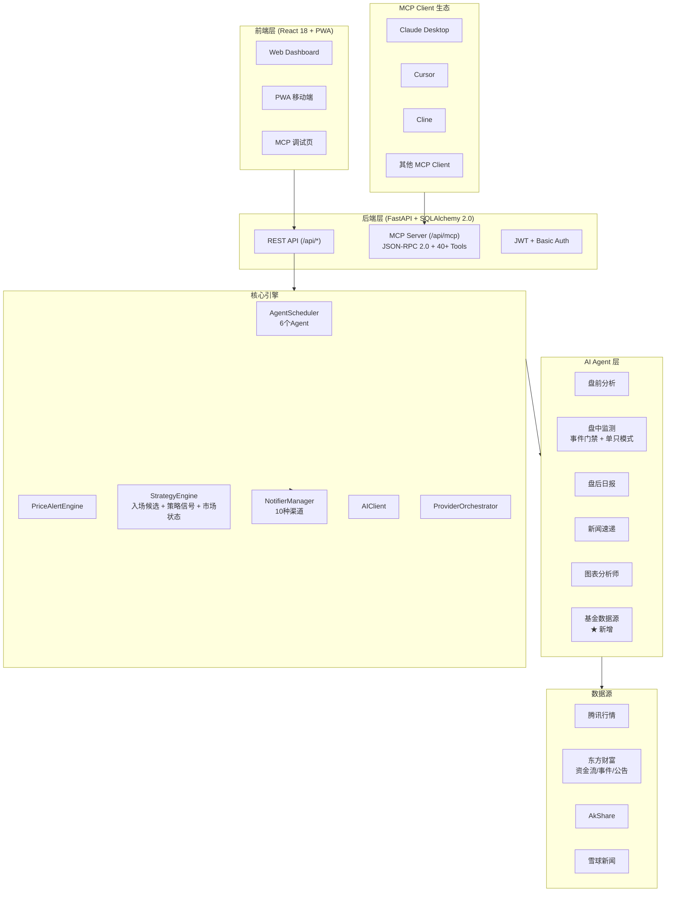

# Position Paper：Pan1Watch — 构建「A股自动盯盘AI助手」的最优方案

> 项目：Pan1Watch
> GitHub：https://github.com/windfgg/Pan1Watch
> Stars：30 | License：MIT | Commits：140（PanWatch 的 fork）
> 技术栈：Python 56% + TypeScript 43.5% | FastAPI + SQLAlchemy 2.0 + SQLite + APScheduler + OpenAI SDK / React 18 + Tailwind CSS + shadcn/ui

---

## 1. 架构总览

### 1.1 Mermaid 架构图



### 1.2 主目录结构（基于实际源码）

```
Pan1Watch/
├── server.py                       # 统一服务入口（~800行）
├── Dockerfile                      # 多阶段构建
├── requirements.txt                # Python 依赖（同 PanWatch）
├── README.md                       # 中文文档
├── AGENTS.md                       # 开发指南
├── CONTRIBUTING.md                 # 贡献规范
├── VERSION                         # 版本号
├── .env.example                    # 环境变量模板
│
├── prompts/                        # 6 个 Agent Prompt 模板（★ 新增 fund_holding_analyst.md）
│   ├── premarket_outlook.md
│   ├── intraday_monitor.md
│   ├── daily_report.md
│   ├── chart_analyst.md
│   ├── news_digest.md
│   └── fund_holding_analyst.md     # ★ 新增：基金重仓分析
│
├── src/
│   ├── agents/                     # 6 个 Agent（★ 新增 fund_holding_analyst）
│   │   ├── base.py                 # BaseAgent 抽象基类
│   │   ├── premarket_outlook.py
│   │   ├── intraday_monitor.py     # 最复杂：事件门禁 + 单只模式 + 通知节流
│   │   ├── daily_report.py
│   │   ├── chart_analyst.py
│   │   ├── news_digest.py
│   │   └── fund_holding_analyst.py # ★ 新增：基金重仓重叠度分析
│   │
│   ├── collectors/                 # 8 个采集器（★ 新增 fund_collector）
│   │   ├── akshare_collector.py
│   │   ├── kline_collector.py
│   │   ├── news_collector.py
│   │   ├── capital_flow_collector.py
│   │   ├── fund_collector.py       # ★ 新增：基金行情/重仓/净值
│   │   ├── events_collector.py
│   │   ├── discovery_collector.py
│   │   └── screenshot_collector.py
│   │
│   ├── core/                       # 核心引擎（~30个文件）
│   │   ├── scheduler.py
│   │   ├── price_alert_engine.py
│   │   ├── price_alert_scheduler.py
│   │   ├── strategy_engine.py      # ★ 新增：入场候选 + 策略信号 + 市场状态
│   │   ├── strategy_catalog.py     # ★ 新增：策略目录
│   │   ├── entry_candidates.py     # ★ 新增：入场候选池
│   │   ├── suggestion_pool.py      # ★ 新增：建议池聚合
│   │   ├── context_builder.py      # ★ 增强：跨天上下文快照
│   │   ├── context_store.py        # ★ 新增
│   │   ├── context_scheduler.py    # ★ 新增：上下文维护
│   │   ├── agent_catalog.py        # ★ 增强：6 个 Agent 种子配置
│   │   ├── agent_runs.py
│   │   ├── analysis_history.py
│   │   ├── news_ranker.py
│   │   ├── intraday_event_gate.py  # 事件门禁：涨跌幅/量比/技术状态
│   │   ├── prediction_outcome.py   # 预测结果后验
│   │   ├── notifier.py
│   │   ├── notify_policy.py
│   │   ├── notify_dedupe.py
│   │   ├── schedule_parser.py
│   │   ├── signals/                # 信号包 + 结构化输出
│   │   ├── ai_client.py
│   │   ├── json_safe.py
│   │   └── json_store.py
│   │
│   ├── models/
│   │   └── market.py               # MarketCode + 交易时段
│   │
│   ├── web/                        # FastAPI Web 层
│   │   ├── app.py                  # FastAPI 应用实例
│   │   ├── database.py             # SQLite + 迁移
│   │   ├── models.py               # 30+ ORM 模型（★ 新增 fund 相关表）
│   │   ├── log_handler.py          # DBLogHandler
│   │   ├── stock_list.py
│   │   ├── migrations.py
│   │   └── api/                    # 24 个路由模块
│   │       ├── mcp.py              # ★ 核心新增：MCP JSON-RPC 接口（3825行！）
│   │       ├── auth.py
│   │       ├── stocks.py
│   │       ├── accounts.py         # ★ 增强：多账户 + 交易流水 + 碎股
│   │       ├── agents.py
│   │       ├── dashboard.py
│   │       ├── insights.py         # ★ 新增：情报中心
│   │       ├── price_alerts.py
│   │       ├── klines.py
│   │       ├── quotes.py
│   │       ├── news.py
│   │       ├── channels.py
│   │       ├── settings.py
│   │       ├── suggestions.py      # ★ 新增：建议池
│   │       ├── paper_trading.py
│   │       ├── discovery.py
│   │       ├── history.py
│   │       ├── context.py
│   │       ├── logs.py
│   │       ├── feedback.py
│   │       ├── recommendations.py
│   │       ├── templates.py
│   │       ├── providers.py
│   │       ├── datasources.py
│   │       └── market.py
│   │
│   └── config.py                   # Pydantic-Settings 配置
│
├── frontend/                       # React 前端
│   ├── src/
│   │   ├── App.tsx
│   │   ├── pages/                  # 11 个页面（★ 新增 IntelCenter/MCP/Opportunities）
│   │   ├── components/
│   │   ├── hooks/
│   │   └── lib/
│   └── packages/
│       ├── api/
│       ├── base-ui/
│       └── biz-ui/
│
├── tests/                          # 10 个测试文件（★ 新增 test_mcp_tools.py 等）
└── docs/screenshots/               # 项目截图
```

---

## 2. 核心能力清单

| # | 能力域 | 具体实现 |
|---|--------|---------|
| 1 | **MCP 原生支持** | 标准 JSON-RPC over HTTP 接口 `/api/mcp`，支持 initialize/tools/list/tools/call，**40+ 个工具**，可被 Claude/Cursor/Cline 等 AI 工具直接调用 |
| 2 | **AI Agent 全生命周期** | 6 个内置 Agent：盘前分析→盘中监测→盘后日报→新闻速递→图表分析师→**基金重仓分析（新增）** |
| 3 | **复合条件价格预警** | 多条件组合（AND/OR）+ 冷却时间 + 日触发上限 + 交易时段限制 + 到期时间 |
| 4 | **多市场支持** | A股 + 港股 + 美股 + **基金（新增）** |
| 5 | **多账户持仓管理** | 多券商账户独立管理 + **交易流水（新增）** + 资产汇总 + 碎股支持 |
| 6 | **策略引擎** | **入场候选池 + 策略信号 + 市场状态识别 + 后验评估（全部新增）** |
| 7 | **全渠道通知** | 10 种渠道（Telegram/企业微信/钉钉/飞书/Bark/Server酱/PushPlus/Discord/Pushover/Webhook） |
| 8 | **PWA 移动端** | ServiceWorker + manifest.json + 安全区适配 + 触控优化 |
| 9 | **上下文记忆** | **跨天上下文快照 + 质量评分（新增）**，AI 分析有"记忆" |
| 10 | **情报中心** | **分析历史 + 新闻聚合（新增）** |
| 11 | **建议池聚合** | **多 Agent 建议聚合 + 去重稳定（新增）** |
| 12 | **Docker 一键部署** | `ghcr.io/windfgg/pan1watch:latest` |

---

## 3. 数据模型

### 3.1 核心 ORM 模型（新增/增强表，基于 models.py）

```python
# ★ 新增/增强表（相比 PanWatch）
fund_holdings               # 基金重仓股 (fund_code, stock_symbol, weight, report_date)
fund_performance            # 基金业绩 (fund_code, nav, total_return, sharpe, max_drawdown)
stock_context_snapshots     # 上下文快照 (symbol, snapshot_date, context_type, payload)
entry_candidates            # 入场候选池 (score, confidence, entry_low/high, stop_loss, target_price)
strategy_catalog            # 策略目录 (code, name, risk_level, default_weight)
strategy_signal_runs        # 策略信号 (strategy_code, score, rank_score, action)
strategy_outcomes           # 策略后验 (outcome_return_pct, hit_target, hit_stop)
market_regime_snapshots     # 市场状态 (regime, regime_score, breadth_up_pct)
position_trades             # 交易流水 (position_id, action, quantity, price, before/after)
# 以及 PanWatch 已有的全部表（stocks/positions/accounts/price_alert_rules/analysis_history 等）
```

### 3.2 MCP 工具模型（src/web/api/mcp.py，3825 行）

```python
# 40+ 个 MCP Tools，按类别组织：

# 持仓管理
positions.list / positions.create / positions.update / positions.delete / positions.trade

# 自选股
stocks.list / stocks.create / stocks.delete / stocks.search / stocks.resolve

# 账户
accounts.list / accounts.create / accounts.update / accounts.delete

# 行情
quotes.get / quotes.batch / stocks.quotes

# K线
klines.get / klines.summary

# 新闻
news.list

# 基金 ★
funds.overview / funds.holdings

# 分析历史
history.list / history.get

# 建议池
suggestions.latest / suggestions.stock

# Agent
agents.list / agents.health / agents.trigger

# 价格提醒
price_alerts.list / price_alerts.create / price_alerts.update / price_alerts.delete / price_alerts.scan

# 市场
market.indices / dashboard.overview

# 诊断
mcp.health / auth.status / version / logs.query

# 工具
exchange_rates.get
```

### 3.3 MCP 认证

- **Bearer Token** — 复用 Web 登录态
- **Basic Auth** — 用户名/密码直接认证
- **审计日志** — 所有写操作自动记录到数据库日志表，支持 `mcp.logs.query` 查询

---

## 4. 扩展点

| # | 扩展位 | 说明 |
|---|--------|------|
| 1 | **MCP Tools 注册** | 在 `src/web/api/mcp.py` 的 `TOOLS` 列表和 `_call_tool` 中添加新工具，Client 自动发现 |
| 2 | **MCP Resources 暴露** | 股票/K线/板块/新闻/基金均可作为 Resource 被 AI 工具按需获取 |
| 3 | **MCP Prompts 模板** | 盘前/盘中/盘后/突发/基金分析均为 Prompt 模板，可无限扩展 |
| 4 | **Agent 扩展** | 继承 `BaseAgent`，在 `AGENT_SEED_SPECS` 注册（同 PanWatch） |
| 5 | **数据源插件** | `src/core/providers/` 下新增 provider（同 PanWatch） |
| 6 | **策略扩展** | 在 `DEFAULT_STRATEGIES` 添加 `StrategySpec`（同 PanWatch） |
| 7 | **基金数据源** | `fund_collector.py` 支持新增基金数据提供商 |
| 8 | **通知渠道** | `CHANNEL_TYPES` 扩展（同 PanWatch） |

---

## 5. 改造成本估算

| 改造项 | 工作量 | 风险等级 | 备注 |
|--------|--------|---------|------|
| **自选股管理系统** | 3 人日 | 低 | 已有基础，增加分组/导入导出 |
| **智能选股（自然语言）** | 4 人日 | 低 | MCP 天然支持自然语言交互 |
| **早盘简报生成 + 飞书推送** | 3 人日 | 低 | 继承通知系统 |
| **数据存储升级（MySQL/PostgreSQL）** | 6 人日 | 中 | SQLAlchemy 2.0 已就绪 |
| **WebSocket 实时行情** | 5 人日 | 中 | 从轮询升级 |
| **AI 交互入口增强** | 3 人日 | 低 | MCP 已提供 AI 交互基础 |
| **修复 SHA256 密码哈希** | 1 人日 | 低 | 严重安全漏洞，必须修复 |
| **修复 SQLite 并发** | 2 人日 | 中 | 高并发场景可能死锁 |
| **修复 MCP Agent 触发架构** | 2 人日 | 中 | threading + asyncio.run 存在事件循环冲突 |
| **合计** | **~29 人日（6 周）** | | |

**核心优势**：MCP 协议是未来 AI 工具集成的行业标准。Pan1Watch 的原生 MCP 支持意味着它不需要独立开发前端，就能被 Claude Desktop、Cursor 等主流 AI 工具直接调用。

---

## 6. 致命缺陷自述（强制）

### 缺陷 1：密码哈希使用无盐 SHA256（严重安全漏洞）
- **表现**：`src/web/api/auth.py`：`hash_password(password) = hashlib.sha256(password.encode()).hexdigest()`
- **风险**：无盐 SHA256 极易被彩虹表攻击。数据库泄露时所有用户密码可在秒级破解。现代标准应使用 bcrypt/argon2/scrypt。
- **自报**：这是生产环境不可接受的安全缺陷，必须立即修复。

### 缺陷 2：单进程 SQLite + 并发写风险
- **表现**：使用 SQLite 作为生产数据库，无 WAL 模式配置。MCP 接口中写操作和 Web UI 写操作共用同一数据库文件。
- **风险**：高并发场景下（价格提醒扫描 + 用户操作 + MCP 调用）可能出现 `database is locked` 甚至数据损坏。
- **自报**：建议迁移到 PostgreSQL，或至少启用 WAL 模式。

### 缺陷 3：MCP Agent 触发使用 threading + asyncio.run（架构隐患）
- **表现**：`src/web/api/mcp.py` 第 1812-1826 行：在已有事件循环的 FastAPI 中创建新线程再调用 `asyncio.run()`。
- **风险**：可能导致事件循环冲突、资源泄漏，且调用方无法获取执行结果或追踪任务状态。
- **自报**：应使用 `asyncio.create_task()` 或后台任务队列（如 Celery/ARQ）。

### 缺陷 4：项目极早期，仅 30 stars
- **表现**：作为 PanWatch 的 fork，社区关注度极低，几乎无人独立验证。
- **风险**：MCP 实现合规性、代码质量、长期稳定性全部未知。
- **自报**：需自行验证 MCP 协议实现是否符合官方规范（~3 人日）。

### 缺陷 5：与 PanWatch 功能高度重叠
- **表现**：作为 fork，大部分代码与 PanWatch 重复，独立维护价值存疑。
- **风险**：不如直接用 PanWatch 主支，MCP 能力可自行添加。
- **自报**：140 commits 的增量主要集中在 MCP 层、基金支持、策略引擎，核心框架未变。

---

## 7. 与其他候选项目的集成可行性

### vs PanWatch（原项目）
- **关系**：父子 fork 关系，功能高度重叠。
- **集成**：Pan1Watch 的 MCP 层（3825 行）、基金支持、策略引擎可直接合并回 PanWatch 主支。
- **结论**：**互斥** —— 二者选其一即可，建议 PanWatch 主支 + 吸收 Pan1Watch 的 MCP/基金/策略能力

### vs A股实时监测系统
- **关系**：技术栈部分重叠（FastAPI + SQLAlchemy）。
- **集成**：A股监测的 WebSocket 实时行情 + uni-app 移动端可作为 MCP 之外的补充；Vue3 前端可扩展 MCP Client UI。
- **结论**：**可双轨并行** —— MCP 供 AI 工具调用，WebSocket/uni-app 供前端实时展示

### vs shares
- **关系**：无直接竞争。
- **集成**：shares 的通达信数据接口和 MyTT 技术指标库可通过 MCP Tool 暴露给 Pan1Watch。
- **结论**：**可配合**（数据源互补）

### vs QuantMuse
- **关系**：能力互补。QuantMuse 有回测/多因子概念，Pan1Watch 有 MCP/AI Agent/通知系统。
- **集成**：QuantMuse 的因子计算模块可通过 MCP Tool 暴露；但 QuantMuse 完成度极低，集成价值有限。
- **结论**：**部分参考**

---

## 强势结论

Pan1Watch 是 5 个候选项目中 **架构前瞻性最强** 的项目。它在 PanWatch 的基础上进行了 **140 commit 的深度迭代**，新增了：

1. **完整的 MCP Server 实现**（3825 行，40+ 工具）—— 可作为标准 AI 工具插件
2. **策略闭环**（入场候选 → 策略信号 → 后验评估 → 权重调优）
3. **上下文记忆**（跨天上下文快照 + 质量评分）
4. **基金专属 Agent**（重仓股重叠度分析）
5. **PWA + 情报中心 + 建议池聚合**

MCP（Model Context Protocol）正在快速成为 AI 工具集成的行业标准，Pan1Watch 的原生 MCP 支持意味着它**不需要独立开发前端**，就能被 Claude Desktop、Cursor 等主流 AI 工具直接调用。这是从"应用"到"基础设施"的跃迁。

然而：
- 30 stars 的社区验证度极低
- 存在 **SHA256 密码哈希、SQLite 并发、异步架构** 等安全/稳定性隐患
- 与 PanWatch 功能高度重叠，独立维护价值存疑

**推荐策略**：**最佳路径是将 Pan1Watch 的 MCP 封装、基金支持、策略引擎吸收到 PanWatch 主支中**，而非独立依赖 Pan1Watch。作为技术前瞻性参考，它的价值无可替代；作为独立基座，风险过高。
