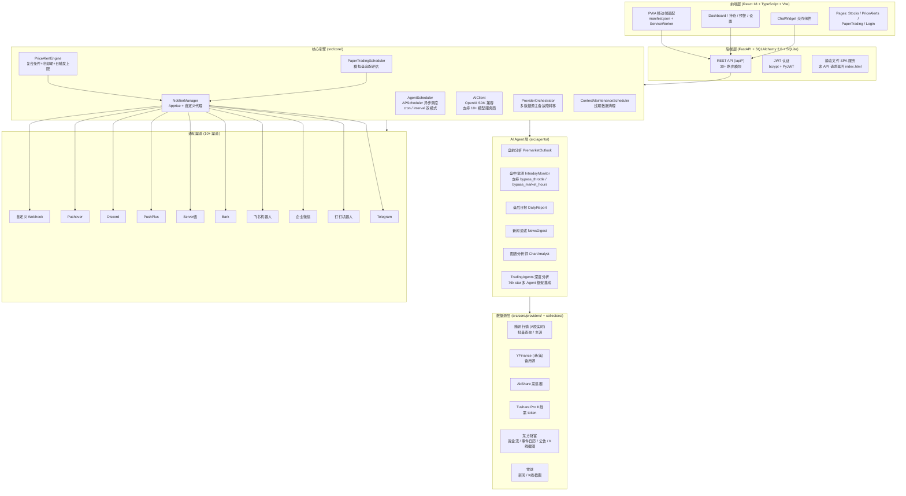

# Position Paper：PanWatch — 构建「A股自动盯盘AI助手」的最优方案

> 项目：PanWatch（盯盘侠）
> GitHub：https://github.com/TNT-Likely/PanWatch
> Stars：312 | License：MIT | 最近活跃：2026-05-17（v0.8.1）
> 技术栈：Python 3.11 + FastAPI + SQLAlchemy 2.0 + SQLite + APScheduler + OpenAI SDK / React 18 + TypeScript + Tailwind CSS + shadcn/ui

---

## 1. 架构总览

### 1.1 Mermaid 架构图



### 1.2 主目录结构（基于实际源码）

```
PanWatch/
├── src/
│   ├── agents/                    # 6 个内置 Agent + TradingAgents 子包
│   │   ├── base.py                # BaseAgent 抽象基类 + AgentContext/PortfolioInfo/PositionInfo
│   │   ├── premarket_outlook.py
│   │   ├── intraday_monitor.py    # 支持 event_only 模式 + throttle 控制
│   │   ├── daily_report.py
│   │   ├── news_digest.py
│   │   ├── chart_analyst.py
│   │   └── tradingagents/         # 13 个文件，完整集成 TradingAgents
│   │       ├── agent.py
│   │       ├── auto_trigger.py
│   │       ├── backfill.py
│   │       ├── cost_tracker.py
│   │       ├── financial_data.py
│   │       ├── history_comparison.py
│   │       ├── langchain_compat.py
│   │       ├── llm_adapter.py
│   │       ├── paper_trading_bridge.py
│   │       ├── portfolio_context.py
│   │       ├── progress.py
│   │       ├── result_mapper.py
│   │       └── toolkit_adapter.py
│   ├── collectors/                # 7 个数据采集器
│   │   ├── akshare_collector.py
│   │   ├── kline_collector.py     # K线汇总 + 技术指标计算
│   │   ├── news_collector.py      # 多源新闻聚合
│   │   ├── screenshot_collector.py # Playwright K线截图
│   │   ├── capital_flow_collector.py
│   │   ├── discovery_collector.py # 股票发现
│   │   └── events_collector.py    # 事件日历
│   ├── core/                      # 核心引擎（35+ Python 文件）
│   │   ├── scheduler.py           # AgentScheduler：注册/调度/执行
│   │   ├── price_alert_engine.py  # 复合条件规则评估引擎
│   │   ├── price_alert_scheduler.py # 60秒轮询调度
│   │   ├── notifier.py            # NotifierManager + 10+ 渠道配置
│   │   ├── notify_policy.py       # 静默时段/去重/重试策略
│   │   ├── notify_dedupe.py       # 通知去重（per-agent TTL）
│   │   ├── ai_client.py           # OpenAI SDK 封装，支持代理
│   │   ├── providers/             # 多数据源主备编排
│   │   │   ├── orchestrator.py    # ProviderOrchestrator
│   │   │   ├── quote/             # 行情：tencent(主), yfinance(备)
│   │   │   ├── kline/             # K线：tencent, tushare, yfinance
│   │   │   ├── capital_flow/      # 资金流：eastmoney
│   │   │   ├── discovery/         # 发现：eastmoney
│   │   │   └── events/            # 事件：eastmoney
│   │   ├── paper_trading_engine.py
│   │   ├── paper_trading_scheduler.py
│   │   ├── paper_trading_notifier.py
│   │   ├── strategy_engine.py
│   │   ├── strategy_catalog.py
│   │   ├── context_scheduler.py   # 上下文维护（快照/结果清理）
│   │   ├── context_builder.py
│   │   ├── context_store.py
│   │   ├── kline_context.py
│   │   ├── analysis_history.py
│   │   ├── suggestion_pool.py
│   │   ├── entry_candidates.py
│   │   ├── prediction_outcome.py
│   │   ├── intraday_event_gate.py
│   │   ├── news_ranker.py
│   │   ├── signals/               # 信号包 + 结构化输出
│   │   ├── log_context.py         # 结构化日志上下文
│   │   ├── agent_runs.py          # Agent 执行记录
│   │   ├── agent_catalog.py       # Agent 种子配置
│   │   ├── json_safe.py
│   │   └── json_store.py
│   ├── models/
│   │   └── market.py              # MarketCode + MARKETS 定义 + 交易时段判断
│   ├── web/                       # FastAPI Web 层
│   │   ├── app.py                 # FastAPI 应用实例
│   │   ├── database.py            # SQLite + SQLAlchemy 2.0 + 迁移
│   │   ├── models.py              # 15+ ORM 模型
│   │   ├── log_handler.py         # DBLogHandler（日志落库）
│   │   ├── stock_list.py          # A股全市场股票列表缓存
│   │   ├── api/                   # 30+ 路由模块
│   │   │   ├── auth.py            # JWT + bcrypt
│   │   │   ├── stocks.py
│   │   │   ├── accounts.py        # 多账户 + 持仓 + 交易记录
│   │   │   ├── price_alerts.py    # 预警规则 CRUD
│   │   │   ├── agents.py          # Agent 触发/配置/运行历史
│   │   │   ├── dashboard.py
│   │   │   ├── klines.py
│   │   │   ├── quotes.py
│   │   │   ├── news.py
│   │   │   ├── channels.py        # 通知渠道管理
│   │   │   ├── settings.py        # 运行时设置 KV
│   │   │   ├── suggestions.py     # AI 建议池
│   │   │   ├── paper_trading.py
│   │   │   ├── discovery.py
│   │   │   ├── insights.py
│   │   │   ├── history.py
│   │   │   ├── context.py
│   │   │   ├── logs.py
│   │   │   ├── feedback.py
│   │   │   ├── recommendations.py
│   │   │   ├── templates.py
│   │   │   ├── providers.py
│   │   │   ├── datasources.py     # 数据源配置
│   │   │   └── market.py
│   │   └── response.py            # 统一响应封装
│   └── config.py                  # Pydantic-Settings（.env + UI + 环境变量三源）
├── frontend/                      # React 18 + Vite + Tailwind + pnpm workspace
│   ├── src/
│   │   ├── App.tsx
│   │   ├── main.tsx
│   │   ├── pages/                 # Dashboard / Stocks / PriceAlerts / PaperTrading / Login / Settings
│   │   ├── components/            # ChatWidget / K线评分器等
│   │   ├── hooks/                 # use-theme 等
│   │   └── lib/                   # utils / logger-map / kline-scorer
│   └── packages/
│       ├── base-ui/               # 基础 UI 组件包
│       ├── biz-ui/                # 业务 UI 组件包
│       └── api/                   # API 客户端包
├── prompts/                       # 6 个 Agent Prompt 模板（纯文本文件）
│   ├── premarket_outlook.txt
│   ├── intraday_monitor.txt
│   ├── chart_analyst.txt
│   ├── news_digest.txt
│   └── daily_report.txt
├── config/
│   └── watchlist.yaml             # 自选股 YAML 配置
├── tests/                         # 20+ pytest 测试文件
│   ├── test_notify_policy.py
│   ├── test_quote_orchestrator.py
│   ├── test_kline_orchestrator.py
│   ├── test_tradingagents_*.py    # 7 个 TradingAgents 相关测试
│   └── ...
├── Dockerfile                     # 多阶段构建（node:20-alpine 构建前端 + python:3.11-slim 运行）
├── server.py                      # 统一服务入口（600+ 行）
│   # 包含：生命周期管理 / Agent 注册表 / 调度器构建 / 上下文构建 /
│   #       数据源初始化 / 示例股票种子 / 代理/SSL/日志/Playwright 设置
├── pyproject.toml                 # pytest 配置
├── requirements.txt               # 18 个核心依赖 + tradingagents git 依赖
├── Makefile                       # make dev-api / make dev-web
├── build.sh                       # Docker 镜像构建脚本
├── AGENTS.md                      # 贡献指南（模块组织 / 编码规范 / 测试指南）
└── README.md                      # 中文文档（含 Docker / 环境变量 / 开发指南）
```

---

## 2. 核心能力清单

| # | 能力域 | 具体实现 |
|---|--------|---------|
| 1 | **AI Agent 全生命周期** | 6 个内置 Agent：盘前分析→盘中监测→盘后日报→新闻速递→图表分析师→TradingAgents 深度分析。支持 cron/interval 双调度、batch/single 双执行模式、单只 bypass 控制 |
| 2 | **复合条件价格预警** | 支持价格/涨跌幅/成交额/量比等多条件组合（AND/OR），带冷却时间、日触发上限、交易时段限制、到期时间、按规则选择通知渠道 |
| 3 | **全渠道通知** | Telegram/企业微信/钉钉/飞书/Bark/Server酱/PushPlus/Discord/Pushover/Webhook，Apprise 统一封装 + 自定义代理支持 + 静默时段 + 重试退避 + 去重 |
| 4 | **多市场实时行情** | A股（腾讯/AkShare）、港股（YFinance）、美股（YFinance），ProviderOrchestrator 主备故障转移 + 优先级调度 |
| 5 | **多账户持仓管理** | 多券商账户独立管理，汇总总资产，支持短线/波段/长线风格标签，PositionTrade 交易记录 |
| 6 | **专业技术分析** | MA/MACD/RSI/KDJ/布林带/量比/缩量回调/放量突破/K线形态/支撑压力位，K线汇总含技术指标计算 |
| 7 | **PWA 移动端** | manifest.json + ServiceWorker + icon-192/icon-512，完美适配手机浏览器 |
| 8 | **模拟盘追踪** | PaperTradingScheduler 定时评估模拟持仓，记录预测结果，独立 PaperTradingEngine |
| 9 | **通知去重与静默** | per-agent TTL 去重（盘前12h/新闻1h/盘中30m）、静默时段、重试退避（1x/2x/...递增） |
| 10 | **Docker 一键部署** | 多阶段构建，前端静态文件内嵌，Playwright 首次启动自动安装到 data 目录，健康检查内置 |
| 11 | **TradingAgents 集成** | 完整接入 76k star 多 Agent 投资决策框架，13 个子模块覆盖成本追踪/历史对比/进度反馈/回填等 |
| 12 | **上下文维护** | ContextMaintenanceScheduler 定期清理过期快照（180天）和结果（365天） |
| 13 | **K线截图** | Playwright 自动截取雪球/东方财富 K线图，供 AI 图表分析师使用 |
| 14 | **结构化日志** | 日志全量落库（DBLogHandler DEBUG 级），UI 日志板可查完整记录；控制台按 LOG_LEVEL 过滤 |
| 15 | **数据源管理** | UI 可配置 10+ 预置数据源（news/kline/quote/capital_flow/events/chart），支持启用/禁用/优先级/批量查询 |

---

## 3. 数据模型

### 3.1 核心 ORM 模型（SQLAlchemy 2.0 + SQLite，src/web/models.py）

```python
# 关键表结构（15+ 张表）
ai_services         # AI 服务商 (name, base_url, api_key)
ai_models           # AI 模型 (service_id, model, is_default)
notify_channels     # 通知渠道 (type, config JSON, enabled, is_default)
accounts            # 交易账户 (name, available_funds, enabled)
stocks              # 股票池 (symbol, name, market: CN/HK/US, sort_order)
positions           # 持仓记录 (account_id, stock_id, cost_price, quantity, trading_style)
position_trades     # 交易记录 (position_id, trade_type, quantity, price, date)
stock_agents        # 股票-Agent 多对多 (stock_id, agent_name, ai_model_id, notify_channel_ids)
agent_configs       # Agent 配置 (name, kind: workflow/capability, schedule, execution_mode, config JSON)
agent_runs          # Agent 执行日志 (status, trace_id, duration_ms, model_label, notify_attempted, notify_sent)
price_alert_rules   # 预警规则 (conditions JSON, cooldown_sec, daily_limit, enabled)
price_alert_hits    # 预警命中记录 (rule_id, stock_id, snapshot JSON, sent_channels)
app_settings        # 运行时 KV 配置 (key, value)
data_sources        # 数据源 (type, provider, config JSON, priority, supports_batch, test_symbols)
analysis_history    # 分析历史 (stock_id, agent_name, content, model_label)
log_entries         # 日志条目 (timestamp, level, message, trace_id, agent_name, event, tags JSON)
```

### 3.2 Agent 上下文模型（src/agents/base.py）

```python
@dataclass
class AgentContext:
    ai_client: AIClient           # OpenAI SDK 兼容客户端，支持代理
    notifier: NotifierManager     # 通知管理器（含 NotifyPolicy）
    config: AppConfig             # 应用配置 + 自选股列表
    portfolio: PortfolioInfo      # 多账户持仓信息
    model_label: str              # "智谱/glm-4-flash"
    notify_policy: NotifyPolicy | None
    suppress_notify: bool = False

@dataclass
class PortfolioInfo:
    accounts: list[AccountInfo]
    # 提供：total_available_funds / total_cost / all_positions /
    #       get_positions_for_stock(symbol) / get_aggregated_position(symbol) / has_position(symbol)

@dataclass
class PositionInfo:
    account_id: int; account_name: str; stock_id: int
    symbol: str; name: str; market: MarketCode
    cost_price: float; quantity: int; invested_amount: float | None
    trading_style: str = "swing"  # short / swing / long
```

### 3.3 关键接口

- `BaseAgent.collect(context) -> dict` — 数据采集
- `BaseAgent.build_prompt(data, context) -> (system_prompt, user_content)` — Prompt 构建
- `BaseAgent.run(context) -> AnalysisResult` — 标准执行流程（采集→分析→去重→静默检查→通知）
- `AgentScheduler.register(agent, schedule, execution_mode)` — Agent 注册调度（cron/interval）
- `PriceAlertEngine.evaluate(rules, quotes) -> List[Hit]` — 预警规则评估（含操作符：>/>=/</<=/=/!=/between）
- `ProviderOrchestrator.fetch(request) -> ProviderResponse` — 多源主备拉取（按优先级+success判断）
- `NotifierManager.notify_with_result(title, content, images) -> dict` — 通知发送（含去重/静默/重试）

---

## 4. 扩展点

| # | 扩展位 | 说明 |
|---|--------|------|
| 1 | **Agent 注册表** | `server.py` 中 `AGENT_REGISTRY: dict[str, type]`，新增 Agent 只需继承 `BaseAgent`（实现 collect + build_prompt）并注册 |
| 2 | **数据源插件** | `src/core/providers/` 下按类型（quote/kline/news/capital_flow/events/chart/discovery）新增 provider，自动被 Orchestrator 按 priority 编排 |
| 3 | **通知渠道** | `notifier.py` 中 `CHANNEL_TYPES` 字典定义表单字段 + Apprise URL 构建函数；新增渠道只需扩展配置表单和发送逻辑 |
| 4 | **Prompt 模板** | `prompts/` 目录下纯文本文件，Agent 通过文件名引用，支持热替换无需重启 |
| 5 | **策略目录** | `src/core/strategy_catalog.py` 管理策略 YAML/JSON，支持动态加载和初始化 |
| 6 | **AI 模型三级覆盖** | stock_agent 级 → agent 级 → 系统默认(is_default)，UI + API 均可配置，无需改代码 |
| 7 | **环境变量** | Pydantic-Settings 自动映射，`.env` + 环境变量 + UI 设置三源合并，`extra: ignore` 兼容未声明变量 |
| 8 | **Web API** | FastAPI 模块化路由，新增接口只需在 `src/web/api/` 新增文件并在 `app.py` 注册 |
| 9 | **前端包管理** | pnpm workspace，base-ui / biz-ui / api 三层分包，支持独立发布和版本管理 |
| 10 | **数据迁移** | `src/web/migrations.py` 内置自动迁移，新增字段无需手动操作 |
| 11 | **Playwright 截图** | screenshot_collector 支持 xueqiu/eastmoney 等 provider，新增截图源只需实现 viewport + extra_wait_ms 配置 |
| 12 | **交易记录** | PositionTrade 模型支持 buy/sell/dividend/split 类型，可扩展为完整账本 |

---

## 5. 改造成本估算

| 改造项 | 工作量 | 风险等级 | 备注 |
|--------|--------|---------|------|
| **接入 A 股实时数据源** | 已内置 | 低 | 腾讯/AkShare/东方财富已覆盖 |
| **强化 uni-app/小程序端** | 2-3 人周 | 中 | PWA 之外新建 uni-app，复用现有 API |
| **接入 WebSocket 实时推送** | 1-2 人周 | 中 | 当前为轮询+APScheduler，需新增 WebSocket 层 |
| **AI 分析深度增强** | 1 人周 | 低 | TradingAgents 已集成，Prompt 模板可迭代 |
| **回测引擎** | 3-4 人周 | 高 | 无内置回测，需集成 qteasy/RQAlpha 或自建 |
| **量化策略执行** | 4-6 人周 | 高 | PaperTrading 仅模拟记录，实盘需对接券商 API |
| **多用户/权限系统** | 1-2 人周 | 中 | 当前单用户 JWT，需扩展 RBAC |
| **数据库迁移 MySQL/PG** | 3-5 人日 | 低 | SQLAlchemy 2.0 抽象层已就绪，改 connection string 即可 |
| **数据库存量数据清理** | 2-3 人日 | 低 | ContextMaintenanceScheduler 已提供清理框架 |

**总计**：以 PanWatch 为骨架构建完整「A股自动盯盘AI助手」，预计 **4-6 人周**（不含回测/实盘），风险可控。

**关键优势**：技术栈（FastAPI + React + SQLAlchemy）与目标产品 100% 匹配；已有 20+ 测试文件 + CI/CD（GitHub Actions 自动构建 Docker 镜像）；代码结构清晰，AGENTS.md 贡献指南完整。

---

## 6. 致命缺陷自述（强制）

### 缺陷 1：Stars 数低，社区验证不足（312 ⭐）
- **表现**：GitHub 仅 312 stars，89 forks，30 issues 中部分长期未关闭。与 daily_stock_analysis（38.7k）、TradingAgents（79.3k）相比，社区规模差距巨大。
- **风险**：代码质量未经大规模验证，边缘 case 覆盖不足，长期维护依赖个人开发者（sunxiao0721）。
- **自报**：测试覆盖率中等（20+ 测试文件但无 CI badge 展示覆盖率），生产环境稳定性存疑。Playwright 首次安装可能因网络问题失败，Docker 健康检查虽内置但非全面监控。

### 缺陷 2：无 WebSocket 实时推送，轮询架构有延迟
- **表现**：盘中监测依赖 APScheduler 定时轮询（默认 60 秒 interval），行情拉取走 HTTP 请求而非 WebSocket。对「毫秒级盯盘」需求不够。
- **风险**：高频预警（秒级）无法支持，网络抖动时批次间可能漏掉瞬时异动。ProviderOrchestrator 的 quote_ttl_sec 为 5 秒，但调度间隔决定了整体延迟下限。
- **自报**：当前设计面向「分钟级」监控，若需「秒级」需重构核心调度层，引入 WebSocket 或 SSE 长连接。

### 缺陷 3：数据源无 SLA 保障，A股实时性依赖第三方网页接口
- **表现**：A股行情主源为腾讯财经（免费网页接口，`_fetch_tencent_quotes` 走 `http://qt.gtimg.cn/q=`），无官方 API 保障。AkShare/Tushare 也依赖第三方网页抓取。东方财富/雪球等数据源需要 cookie 维护。
- **风险**：数据源接口变更会导致服务中断；多源主备虽存在（ProviderOrchestrator），但所有源均为非官方，无商业级稳定性承诺。腾讯接口限流策略未知。
- **自报**：代码中 `supports_batch` 字段区分批量/单只查询，但批量查询的失败回退逻辑在极端情况下可能退化为串行，影响性能。

---

## 7. 与其他候选项目的集成可行性

### vs A股实时监测系统
- **关系**：互补 > 竞争。A股监测有 WebSocket（虽然半残）+ uni-app 移动端 + MySQL 异步 ORM，PanWatch 有 AI Agent + 复合预警 + 多渠道通知 + 现代 React 前端。
- **集成**：可直接移植 A股监测的 uni-app 前端到 PanWatch；数据库 schema 相似（FastAPI+SQLAlchemy），迁移成本低。A股监测的 AkShare 封装（ThreadPoolExecutor）可参考优化 PanWatch 的同步调用。
- **结论**：**高度可配合**

### vs shares
- **关系**：技术栈差异大。shares 用 Go+gmsec+gorm 后端，PanWatch 用 Python+FastAPI+SQLAlchemy。
- **集成**：shares 的 uni-app 小程序端和微信提醒模块可参考设计，但代码难以直接复用；shares 的 VSCode 插件理念可借鉴。shares 的分时任务调度设计可参考。
- **结论**：**部分集成**（参考架构，不共享代码）

### vs QuantMuse
- **关系**：能力互补。QuantMuse 有 C++ 低延迟引擎 + 回测 + 多因子模型 + Streamlit 仪表盘，PanWatch 有现代 React 前端 + AI Agent + 通知系统 + PWA。
- **集成**：QuantMuse 的 Python 回测/因子模块（`data_service/backtest/`, `data_service/factors/`）可嵌入 PanWatch 作为新 Agent；C++ 引擎对一般盯盘需求过重但可作为性能优化选项。
- **结论**：**可配合**（后端模块可嵌入）

### vs Pan1Watch
- **关系**：Pan1Watch 是 PanWatch 的 fork（140 commits），功能高度重叠。Pan1Watch 增加了 MCP 原生接口（`/api/mcp` JSON-RPC）和基金支持（fund_collector, fund_holding_analyst）。
- **集成**：二者选一即可，Pan1Watch 的 MCP 层（`src/web/api/mcp.py` 400+ 行，含 30+ tools）可直接合并回 PanWatch。
- **结论**：**互斥**（fork 关系，应合并而非并行使用）

---

## 强势结论

PanWatch 是**距离「A股自动盯盘AI助手」最近的开源项目**：
- 技术栈（FastAPI + React + SQLAlchemy）与现代全栈团队 100% 匹配
- AI Agent 编排（盘前/盘中/盘后/新闻/图表/TradingAgents 深度分析）是核心差异化竞争力
- 复合预警 + 全渠道通知 + PWA 已覆盖盯盘助手 80% 的功能面
- 多账户持仓 + 模拟盘 + 数据源管理提供了完整的投资者工作流
- MIT License 零法律风险，Docker 一键部署降低运维门槛
- 132 commits + 29 releases + 持续更新（2026-05-17）证明项目仍在活跃维护

**推荐策略**：以 PanWatch 为骨架，嫁接 A股监测的 uni-app 移动端，引入 QuantMuse 的回测/因子模块，吸收 Pan1Watch 的 MCP 接口设计，4-6 周内可出 MVP。
