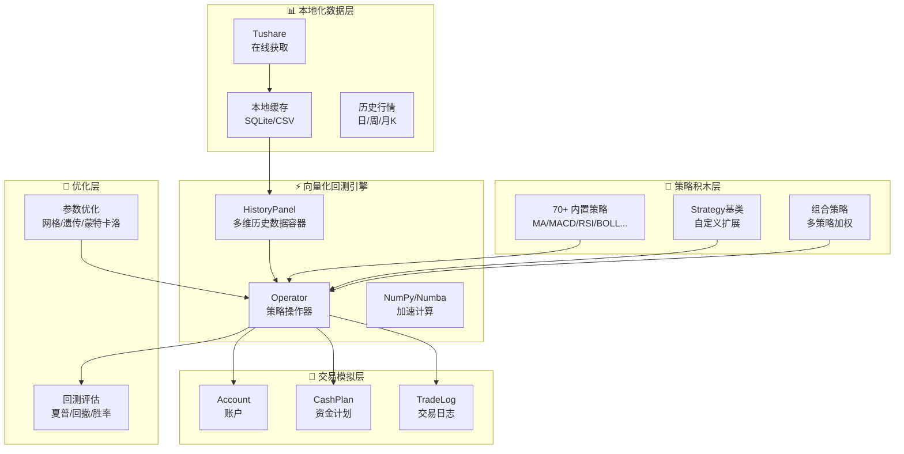

# Position Paper：qteasy —— 最懂A股交易规则的本地化量化工具包

## 1. 架构总览

qteasy 采用「向量化回测 + 本地化闭环」架构，所有数据获取、策略回测、参数优化、模拟交易均在本地完成，无需外部服务器，保护用户隐私的同时实现毫秒级批量计算。



**主目录结构：**
```
qteasy/
├── qteasy/
│   ├── core.py             # 核心回测引擎（run(), backtest()）
│   ├── history.py          # HistoryPanel 数据容器
│   ├── operator.py         # 策略操作器（策略组合、信号生成）
│   ├── trading.py          # 交易模拟（Account, CashPlan, TradeLog）
│   ├── strategy.py         # Strategy 基类 + 70+ 内置策略
│   ├── blitz.py            # NumPy/Numba 向量化加速
│   ├── optimization.py     # 参数优化（网格/遗传/蒙特卡洛）
│   ├── data_channels/      # 数据源适配（Tushare 为主）
│   ├── database.py         # 本地 SQLite 缓存管理
│   ├── evaluate.py         # 回测绩效评估
│   └── visual.py           # 简单图表（Matplotlib）
├── tutorials/              # Jupyter Notebook 教程
├── tests/                  # 单元测试
└── setup.py
```

## 2. 核心能力清单

qteasy 是面向 A股投资者的「小而精」量化工具包，以「本地化」和「A股真实感」为核心竞争力：

- **全流程本地化**：数据下载、回测验证、参数优化、模拟交易全部在本地运行，无需联网即可复盘，保护策略隐私。
- **回测与实盘一致**：同一套策略逻辑既可用于历史回测，也可直接对接实盘交易，消除「回测圣杯→实盘亏损」的鸿沟。
- **向量化加速**：基于 NumPy/Numba 的批量计算，全市场 5000+ 只股票多年回测可在秒级完成，远快于事件驱动逐笔回测。
- **A股精细交易建模**：T+1 交收、涨跌停限制、最小下单量（MOQ）、佣金/印花税/过户费、交割队列（先进先出），回测结果贴近真实券商行为。
- **70+ 内置策略 + 积木式组合**：均线交叉、MACD、RSI、布林带、KDJ 等经典策略可直接调用；支持多策略加权组合，形成复合信号。
- **多维参数优化**：网格搜索、遗传算法、蒙特卡洛模拟，帮助用户快速找到策略最优参数区间。
- **Jupyter 原生集成**：所有功能以 Python API 形式暴露，Research-based 工作流，适合数据分析人群。

## 3. 数据模型

qteasy 的数据模型围绕「多维历史数据容器」HistoryPanel 和「策略信号」展开：

| 类/接口 | 职责 | 关键字段/方法 |
|:---|:---|:---|
| `HistoryPanel` | 多维数据容器 | `htypes`（数据类型：close/open/high/low/volume）, `shares`（股票列表）, `hdata`（三维 NumPy 数组） |
| `Operator` | 策略信号生成器 | `strategies`（策略列表）, `signal_type`（PT/PS/VS 信号模式）, `run()` |
| `Strategy` | 策略基类 | `name`, `pars`（参数）, `generate()`（生成交易信号） |
| `Account` | 模拟账户 | `cash`, `positions`, `available_cash`, `history_values` |
| `CashPlan` | 资金计划 | `plan`（资金投入时间表）, `initial_cash` |
| `TradeLog` | 交易记录 | `orders`, `fills`, `commission`, `tax` |
| `QTVConfig` | 全局配置 | `data_source`, `trade_batch_size`, `cost_rate` |

## 4. 扩展点

qteasy 虽体量小，但为 A股量化场景预留了清晰的扩展路径：

- **Strategy 基类**：继承 `Strategy` 并实现 `generate()` 方法即可添加自定义策略，信号类型支持 `PT`（持仓目标）、`PS`（持仓比例）、`VS`（成交量比例）。
- **数据通道扩展**：`data_channels/` 下新增模块即可接入 AkShare、BaoStock 等新数据源，目前以 Tushare 为主。
- **Operator 策略组合**：多策略通过权重矩阵叠加，可扩展为「AI 模型输出 + 传统技术指标」的混合信号系统。
- **交易费用模型**：`cost_rate` 和 `trade_batch_size` 可自定义，已覆盖 A股全部费用类型。
- **回测钩子**：`pre_backtest`, `post_backtest` 可扩展为盘前简报生成和盘后 AI 分析入口。

## 5. 改造成本估算

将 qteasy 改造为「A股自动盯盘AI助手」的成本：

| 改造模块 | 人日 | 说明 |
|:---|---:|:---|
| 新增 AkShare 数据通道 | 3 | qteasy 目前以 Tushare 为主，需新增 AkShare 实时行情适配 |
| 剥离回测引擎，构建实时扫描服务 | 8 | 将 HistoryPanel 批处理模式改造为流式增量更新 |
| 新增 Web API 层（FastAPI） | 10 | qteasy 纯本地化无网络层，需全新构建 REST + WebSocket |
| 新增自选股/异动预警业务 | 5 | 基于现有 Account/TradeLog 模型扩展用户体系和告警规则 |
| 新增 AI 分析层（LLM Pipeline） | 8 | 自然语言选股、简报生成，需外部接入 |
| 新增推送通知模块 | 3 | 飞书/Telegram Webhook 接入 |
| 前端 Dashboard（React） | 15 | 从零建设现代 Web UI |
| 部署与测试 | 5 | Docker 化、定时任务、7×24 稳定性 |
| **合计** | **~57 人日** | **约 2.5-3 个月（1人全职）** |

**风险评估**：中高。qteasy 的向量化引擎优秀，但完全是本地化批处理设计，实时化改造需要重构数据流。

## 6. 致命缺陷自述

qteasy 的「小而精」定位同时意味着显著的局限性：

1. **社区极小，维护风险高**：仅 146 Stars，社区贡献者有限。相比 vnpy（40.9k）、RQAlpha（6.4k）的庞大生态，qteasy 的 Bug 修复、新功能迭代速度存在不确定性，长期维护风险不容忽视。
2. **Jupyter Notebook 前端，无 Web/移动端**：qteasy 的使用场景是「个人电脑打开 Jupyter 跑策略」，没有任何 Web Dashboard、没有响应式 UI、没有移动端适配。面向普通投资者的「自选股管理 + 实时推送」需求，qteasy 完全无法直接满足。
3. **无实时行情，无推送通知**：qteasy 的数据获取依赖 Tushare 等离线拉取，回测基于历史数据批量处理。对于「分钟级异动预警」「实时盯盘」这类流式场景，qteasy 的架构需要大幅度重构。

## 7. 与其他候选项目的集成可行性

| 对比项目 | 关系 | 说明 |
|:---|:---|:---|
| **vnpy** | 可配合 | vnpy 的 XTP Gateway 和事件引擎可为 qteasy 提供实时行情流和实盘交易能力；qteasy 的向量化回测引擎可作为 vnpy 策略的「离线验证层」。两者技术栈均为 Python，集成成本低。 |
| **RQAlpha** | 部分互斥 | RQAlpha 与 qteasy 同为 A股回测引擎，功能重叠度极高。qteasy 的向量化加速更快，RQAlpha 的 Mod 机制更灵活；若已选其一，另一家的回测模块不建议重复引入。 |
| **ZVT** | 可配合 | ZVT 的统一数据 Schema 和增量更新可补强 qteasy 的数据层；qteasy 的精细 A股交易建模（T+1/费率/MOQ）可反哺 ZVT 的回测模块。两者 License 均为宽松型（BSD-3 / MIT）。 |
| **QUANTAXIS** | 可配合 | QUANTAXIS 的 Rust 加速核心和 QIFI 协议与 qteasy 的纯 Python 向量化路径互补：qteasy 适合策略快速迭代，QUANTAXIS 适合高频大规模计算。但两者数据模型差异大，需适配层。 |
