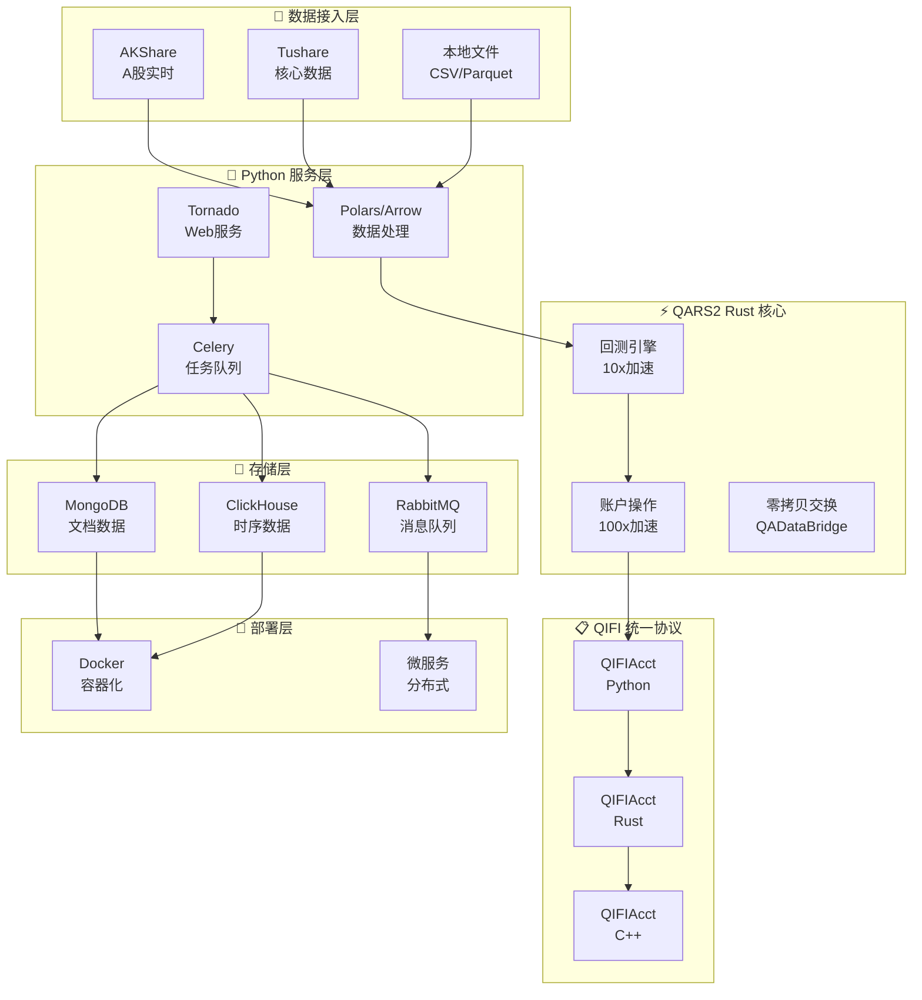

# Position Paper：QUANTAXIS —— 全栈量化解决方案的性能天花板

## 1. 架构总览

QUANTAXIS 采用「多语言混合 + 微服务化」架构，以 Rust 核心引擎（QARS2）处理计算密集型任务，Python 负责业务编排，通过 QIFI 统一账户协议实现跨语言兼容，支持从单机到分布式的弹性部署。



**主目录结构：**
```
QUANTAXIS/
├── QUANTAXIS/
│   ├── QAFetch/            # 数据获取（AKShare/Tushare/BaoStock适配）
│   ├── QASU/               # 数据存储与更新（Save/Update）
│   ├── QAData/             # 数据模型与处理（NumPy/Polars/Arrow）
│   ├── QABacktest/         # 回测引擎（Python + Rust 双实现）
│   ├── QAARP/              # 账户/风险/绩效（Account/Risk/Performance）
│   ├── QAEngine/           # 事件引擎（RabbitMQ 分布式）
│   ├── QAMarket/           # 市场模拟与交易网关
│   ├── QIFI/               # 统一账户协议（跨语言兼容层）
│   ├── QAWeb/              # Tornado Web 服务
│   └── QAUtil/             # 工具函数
├── qars2/                  # Rust 核心加速引擎
│   ├── src/
│   │   ├── account.rs      # 账户操作 Rust 实现
│   │   ├── backtest.rs     # 回测引擎 Rust 实现
│   │   └── bridge.rs       # Python-Rust 桥接（PyO3）
│   └── Cargo.toml
├── docker/                 # Docker Compose 部署配置
└── setup.py
```

## 2. 核心能力清单

QUANTAXIS 是国内少有的「全栈 + 高性能」量化平台，覆盖量化投资的完整生命周期：

- **全链路覆盖**：数据获取 → 因子研究 → 策略开发 → 回测验证 → 模拟交易 → 实盘执行 → 微服务部署，无一缺环。
- **QARS2 Rust 核心**：账户操作 100x 加速，回测 10x 加速，通过 PyO3 与 Python 无缝桥接。计算密集型场景（全市场多因子回测）性能碾压纯 Python 方案。
- **QIFI 统一账户协议**：跨 Python/Rust/C++ 兼容的账户抽象层，同一套账户逻辑可在研究环境、回测引擎、实盘系统中无缝迁移。
- **多市场支持**：股票、期货、期权、加密货币的行情和交易统一覆盖。
- **零拷贝数据交换（QADataBridge）**：基于 Apache Arrow 的内存格式，Python/Polars/Rust 之间数据传输零序列化开销。
- **分布式任务调度**：基于 RabbitMQ + Celery 的任务队列，支持多机并行回测、定时数据采集。
- **多存储后端**：MongoDB（文档型数据）、ClickHouse（时序数据）、Redis（缓存），冷热数据自动分层。
- **可视化分析**：内置绩效归因、风险分析、收益曲线的可视化输出。

## 3. 数据模型

QUANTAXIS 的数据模型以「DataStruct」为核心，统一封装金融时序数据：

| 类/接口 | 职责 | 关键字段/方法 |
|:---|:---|:---|
| `QA_DataStruct` | 数据容器基类 | `data`（DataFrame/Polars）, `type`（stock_min/stock_day/index_day） |
| `QA_DataStruct_Stock_day` | 股票日线 | `open`, `high`, `low`, `close`, `volume`, `code`, `date` |
| `QA_DataStruct_Stock_min` | 股票分钟线 | `open`, `high`, `low`, `close`, `volume`, `code`, `datetime`, `type`（1min/5min/15min） |
| `QA_Account` | 账户（Python） | `init_cash`, `history`, `cash`, `hold`, `daily_hold` |
| `QIFI_Account` | 统一账户协议 | `account_cookie`, `portfolio`, `positions`, `trades`, `orders` |
| `QA_Risk` | 风险评估 | `alpha`, `beta`, `sharpe`, `max_drawdown`, `volatility` |
| `QA_Backtest` | 回测引擎 | `start`, `end`, `benchmark`, `strategy`, `commission` |
| `QA_Market` | 市场模拟 | `broker`, `session`, `run` |

## 4. 扩展点

QUANTAXIS 的架构为高并发、大规模盯盘场景预留了企业级扩展位：

- **QIFI 协议扩展**：任何新交易接口（MiniQMT、XTP、CTP）只需实现 QIFI 接口即可接入统一账户体系。
- **Rust 核心扩展**：QARS2 的 `account.rs` / `backtest.rs` 可通过 Rust 生态（ Rayon 并行、Tokio 异步）进一步压榨性能。
- **QADataBridge**：新增数据处理语言（Julia、Go）只需支持 Arrow 格式即可零成本接入数据流水线。
- **任务队列扩展**：RabbitMQ + Celery 架构天然支持「数据采集→清洗→因子计算→AI分析→推送」的分布式 Pipeline。
- **Web 服务扩展**：现有 Tornado 服务可平滑迁移至 FastAPI，保留 QAWeb 的路由设计。
- **存储扩展**：ClickHouse 的列式存储已就位，追加 Redis Pub/Sub 即可实现实时行情广播。

## 5. 改造成本估算

将 QUANTAXIS 改造为「A股自动盯盘AI助手」的成本：

| 改造模块 | 人日 | 说明 |
|:---|---:|:---|
| Web 框架迁移（Tornado→FastAPI） | 6 | Tornado 较老旧，迁移至 FastAPI 以获得异步原生和 WebSocket 支持 |
| 新增 AI 分析模块（LLM Pipeline） | 8 | 自然语言选股、简报生成、异动解读 |
| 新增推送通知服务 | 4 | 飞书/Telegram Webhook，基于 Celery 定时任务触发 |
| 新增自选股/异动预警业务 | 6 | 基于 QA_Account/QIFI 扩展用户体系和告警规则 |
| 实时行情层增强（Redis Pub/Sub） | 5 | 在现有数据获取层叠加实时缓存和推送 |
| 前端 Dashboard（React） | 15 | QUANTAXIS 无现代前端，需从零建设 |
| Rust 核心稳定性调优 | 5 | PyO3 桥接、跨语言内存管理、部署兼容性 |
| 部署与测试 | 5 | Docker Compose 微服务编排、多服务健康检查 |
| **合计** | **~54 人日** | **约 2.5 个月（1人全职）** |

**风险评估**：中高。QUANTAXIS 技术栈复杂（Rust/Python/C++/MongoDB/ClickHouse/RabbitMQ），团队需具备多语言能力和分布式系统经验。

## 6. 致命缺陷自述

QUANTAXIS 的性能和全链路覆盖令人印象深刻，但以下缺陷不可忽视：

1. **项目活跃度存疑**：最近更新日期为 2025-10-25，GitHub 仓库页面出现加载错误，社区 issue 响应速度明显放缓。相比 vnpy（2026-05 活跃）和 RQAlpha（2026-05 活跃），QUANTAXIS 的长期维护风险最高。若核心 Rust 模块出现 Bug，修复周期难以保证。
2. **技术栈过于复杂，部署成本极高**：Rust（QARS2）+ Python + Cython + MongoDB + ClickHouse + RabbitMQ + Tornado + PyO3 + Polars + Arrow，技术栈横跨编译型和解释型语言、文档型和列式数据库、消息队列和内存交换。对于「个人/小团队盯盘助手」场景，这种复杂度是过度设计，运维人力成本高企。
3. **无 AI/LLM 能力，无现代前端**：与 RQAlpha、qteasy、ZVT 类似，QUANTAXIS 诞生于 LLM 时代之前，没有内置的自然语言分析、AI 简报生成、智能选股等能力。Tornado 提供的 Web 服务仅为数据 API，没有现代化 React/Vue Dashboard。AI 和前端均需从零建设。

## 7. 与其他候选项目的集成可行性

| 对比项目 | 关系 | 说明 |
|:---|:---|:---|
| **vnpy** | 部分可配合 | vnpy 的 Gateway 抽象和事件引擎可为 QUANTAXIS 提供交易接口接入参考；但 QUANTAXIS 的 QIFI 协议与 vnpy 的 AccountData 模型不兼容，账户层需二选一。建议 QUANTAXIS 负责数据和回测，vnpy 负责实盘 Gateway。 |
| **RQAlpha** | 互斥 | 两者均为全链路量化平台，功能高度重叠。QUANTAXIS 的 Rust 核心更强，RQAlpha 的 A股规则更细；若已选 QUANTAXIS，不建议再引入 RQAlpha 的回测模块。 |
| **qteasy** | 可配合 | qteasy 的向量化回测和 A股精细交易建模可为 QUANTAXIS 提供策略层补充；QUANTAXIS 的分布式调度和 Rust 加速可为 qteasy 提供基础设施。两者 License 均宽松。 |
| **ZVT** | 可配合 | ZVT 的统一数据 Schema 和增量更新机制可为 QUANTAXIS 的数据层提供更优雅的设计；QUANTAXIS 的 ClickHouse + Polars 高性能流水线可补强 ZVT 的计算能力。建议 ZVT 做数据契约，QUANTAXIS 做高性能计算。 |
