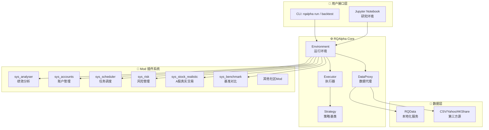

# Position Paper：RQAlpha —— A股规则最完备的回测引擎底座

## 1. 架构总览

RQAlpha 采用高度模块化的 Mod 架构，以「可替换、可插拔」为设计哲学，将回测系统拆分为 7 个核心子系统，通过 `Mod` 接口实现热插拔扩展。



**主目录结构：**
```
rqalpha/
├── rqalpha/
│   ├── core/               # 核心引擎（Environment, Executor）
│   ├── interface/          # 抽象接口（AbstractAccount, AbstractBroker...）
│   ├── mod/                # 内置 Mod 实现
│   │   ├── sys_analyser/   # 回测绩效分析
│   │   ├── sys_accounts/   # 多账户体系
│   │   ├── sys_scheduler/  # 定时任务调度
│   │   ├── sys_risk/       # 风控规则
│   │   ├── sys_stock_realistic/  # A股真实交易（T+1/涨跌停/停牌）
│   │   └── sys_benchmark/  # 基准收益对比
│   ├── model/              # 数据模型（Instrument, Tick, Bar...）
│   ├── portfolio/          # 账户/持仓/收益计算
│   ├── data/               # 数据代理与适配
│   ├── execution_style/    # 订单执行风格（Market/Limit/Close...）
│   ├── utils/              # 工具函数
│   └── api/                # 策略开发 API（handle_bar, handle_tick...）
├── tests/                  # 完整测试套件
└── setup.py
```

## 2. 核心能力清单

RQAlpha 由米筐科技（RiceQuant）出品，是国内 A股回测框架的工业级标杆：

- **A股规则深度适配**：`sys_stock_realistic` Mod 完整实现 T+1 交收、涨跌停限制、停牌处理、最小下单量（MOQ）、费率模型、除权除息，回测结果与实盘行为高度一致。
- **Mod 热插拔架构**：7 个内置 Mod + 社区扩展，可像搭积木一样替换账户系统、数据源、风控规则、绩效分析器。
- **统一策略 API**：`handle_bar`, `handle_tick`, `before_trading`, `after_trading` 等生命周期钩子，策略代码简洁直观。
- **多账户体系**：支持股票、期货、期权多账户并行回测，跨品种策略一次验证。
- **内置 CSI 数据**：A股日线、分钟线、基本面数据直接可用（需 RQData 本地化服务）。
- **事件驱动策略支持**：财报发布、分红送转、股权激励等事件触发策略逻辑。
- **完整绩效分析**：收益曲线、最大回撤、夏普比率、信息比率、Brinson 归因等 30+ 指标。

## 3. 数据模型

RQAlpha 的数据模型以「Instrument（标的）」为核心，所有计算围绕标的展开：

| 类/接口 | 职责 | 关键字段/方法 |
|:---|:---|:---|
| `Instrument` | 标的定义 | `order_book_id`, `symbol`, `exchange`, `type` (CS/ETC/Future), `board_type` (主板/创业板/科创板) |
| `Bar` | K线数据 | `open`, `high`, `low`, `close`, `volume`, `datetime`, `instrument` |
| `Tick` | 逐笔快照 | `last`, `open`, `high`, `low`, `prev_close`, `volume`, `bid`, `ask` |
| `Order` | 委托单 | `order_book_id`, `quantity`, `direction`, `style`, `status` |
| `Trade` | 成交记录 | `order_id`, `price`, `quantity`, `commission`, `tax` |
| `Position` | 持仓 | `order_book_id`, `quantity`, `avg_price`, `market_value`, `pnl` |
| `Portfolio` | 组合账户 | `cash`, `total_value`, `positions`, `daily_returns`, `annualized_returns` |
| `AbstractAccount` | 账户抽象 | `place_order()`, `cancel_order()`, `fast_forward()` |
| `AbstractBroker` | 经纪商抽象 | `get_open_orders()`, `get_portfolio()`, `get_accoun()` |

## 4. 扩展点

RQAlpha 的 Mod 机制是其最大架构亮点，为改造预留了极其干净的扩展位：

- **Mod 接口**：实现 `load_mod()` 即可注册新模块，不改动框架核心代码即可替换任何子系统。
- **DataProxy 抽象**：自定义数据源只需实现 `get_bar()`, `get_tick()`, `get_split()`, `get_dividend()` 等方法，AkShare/Tushare/BaoStock 可无缝接入。
- **Execution Style**：`MarketOrder`, `LimitOrder`, `CloseOrder` 可扩展为更复杂的算法执行（TWAP/VWAP）。
- **Account/Broker 抽象**：可接入实盘交易接口（MiniQMT、XTP），实现「回测→模拟→实盘」无缝切换。
- **事件系统**：`before_trading`, `handle_bar`, `after_trading` 可扩展为盘中异动检测钩子，天然适配盯盘场景。

## 5. 改造成本估算

将 RQAlpha 改造为「A股自动盯盘AI助手」的改造成本：

| 改造模块 | 人日 | 说明 |
|:---|---:|:---|
| 新增实时 DataProxy（AkShare WebSocket） | 6 | 将离线回测数据源替换为实时行情流 |
| 剥离回测引擎，新增盘中监控 Mod | 8 | 利用 handle_bar / handle_tick 做异动检测 |
| 新增自选股管理 Mod | 4 | 扩展 Portfolio 模型，支持用户分组与预警规则 |
| 新增 AI 分析 Mod（LLM Pipeline） | 8 | 盘前/盘中/盘后简报生成，自然语言选股 |
| 新增推送通知 Mod（飞书/ Telegram） | 3 | 基于 after_trading / 异动事件触发推送 |
| 新增 Web API 层（FastAPI 包装） | 10 | RQAlpha 无 Web 层，需全新构建 REST + WebSocket 服务 |
| 前端 Dashboard（React） | 15 | 策略/持仓/回测结果可视化，现代 UI 从零搭建 |
| 部署与测试 | 5 | Docker 化、定时任务、稳定性验证 |
| **合计** | **~59 人日** | **约 2.5-3 个月（1人全职）** |

**风险评估**：中高。RQAlpha 回测引擎非常成熟，但完全没有 Web / 实时推送 / AI 能力，需要大量外围建设。

## 6. 致命缺陷自述

RQAlpha 是优秀的回测框架，但作为「盯盘AI助手」底座存在致命短板：

1. **License 限制商业化**：RQAlpha 采用非商业使用 License，商业用途需联系 public@ricequant.com 授权。这意味着若目标产品未来涉及商业变现，存在法律风险；相比之下 vnpy/qteasy/ZVT 的 MIT/BSD-3 更为宽松。
2. **零实时能力，零通知系统**：RQAlpha 是纯离线回测框架，无实时行情接入、无 WebSocket、无推送通知。从「批处理回测」到「分钟级盯盘」的架构跳跃极大，不是渐进式改造能轻松完成的。
3. **无 AI / LLM 能力，无现代前端**：RQAlpha 诞生于 2016 年，设计目标中完全没有 AI 分析、自然语言交互、现代 Web Dashboard 等概念。所有 AI 能力和前端 UI 必须从零建设，无法借鉴框架内任何现有模块。

## 7. 与其他候选项目的集成可行性

| 对比项目 | 关系 | 说明 |
|:---|:---|:---|
| **vnpy** | 可配合 | vnpy 的 XTP Gateway 和 RQAlpha 的回测引擎可形成「回测验证→实盘交易」链路。vnpy 的事件引擎可驱动 RQAlpha 策略做实时化改造，但两者数据模型不同需适配层。 |
| **qteasy** | 部分互斥 | qteasy 与 RQAlpha 同为 A股回测引擎，功能重叠度高。建议择一：RQAlpha 的 Mod 机制更成熟，qteasy 的向量化加速更快，可根据团队熟悉度选择。 |
| **ZVT** | 可配合 | ZVT 的统一数据 Schema 可作为 RQAlpha DataProxy 的数据源之一；ZVT 的增量更新机制可弥补 RQAlpha 数据本地化延迟问题。 |
| **QUANTAXIS** | 互斥 | QUANTAXIS 自带回测引擎和 Rust 加速核心，与 RQAlpha 功能高度重叠；且 QUANTAXIS 的 QIFI 协议栈与 RQAlpha 的 Account 抽象不兼容，建议二选一。 |
