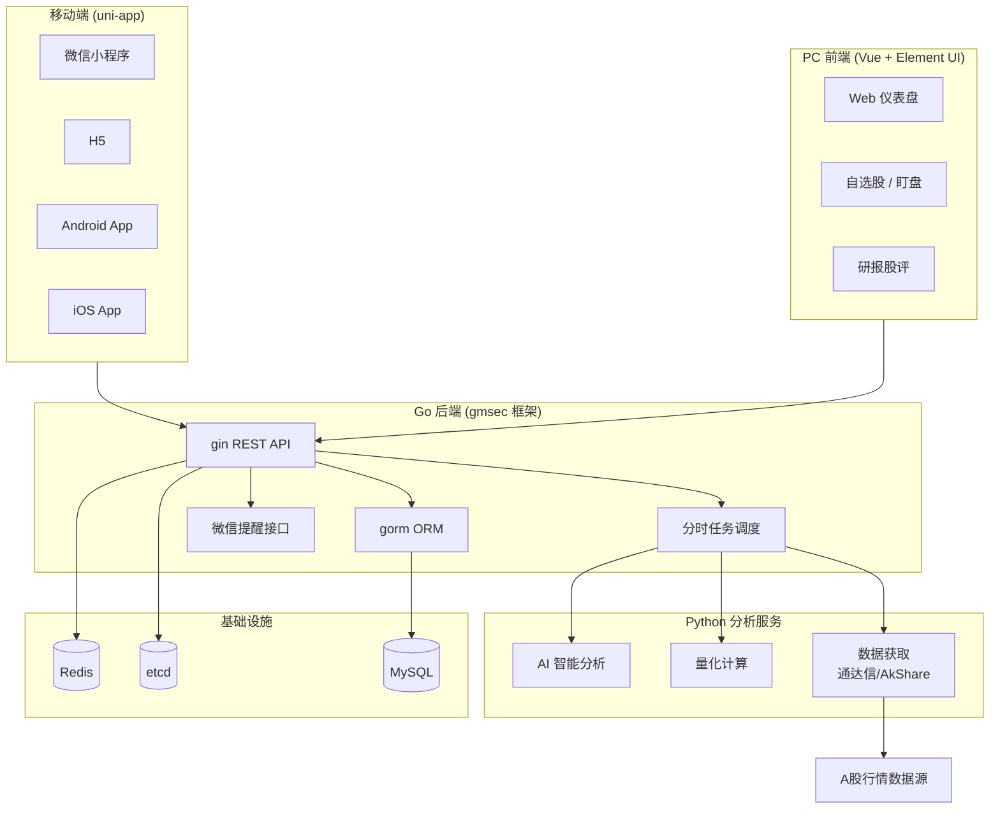

# Position Paper：shares — 构建「A股自动盯盘AI助手」的最优方案

> 项目：xxjwxc/shares
> GitHub：https://github.com/xxjwxc/shares
> Stars：639 | License：Apache-2.0 | Commits：35
> 技术栈：Go 1.21 + gin + gorm + MySQL + Redis + etcd + gmsec / Python（量化/AI）/ Vue（PC 前端）/ uni-app（移动端）/ VSCode 插件

---

## 1. 架构总览

### 1.1 Mermaid 架构图



### 1.2 主目录结构（基于实际源码）

```
shares/
├── shares/                         # Go 后端主服务
│   ├── main.go                     # 入口：gin + gmsec plugin HTTP
│   ├── go.mod                      # Go 1.21 + gin + gorm + gmsec + etcd + 腾讯云 SDK
│   ├── internal/
│   │   ├── config/                 # 配置管理
│   │   └── routers/                # gin 路由
│   └── ...
│
├── python/                         # Python 分析服务
│   ├── tdx.py                      # 通达信数据接口
│   ├── Ashare.py                   # A股数据获取
│   ├── MyTT.py / MyTT_plus.py      # 技术指标计算（通达信公式移植）
│   ├── boll.py                     # 布林带计算
│   ├── cost.py                     # 成本分析
│   ├── bert.py                     # BERT 情感分析（AI）
│   └── bert/
│       └── bert.py                 # 深度学习模型
│
├── element/                        # PC 前端（Vue + Element UI）
│   └── webpack/
│       ├── src/
│       │   ├── App.vue
│       │   └── main.js
│       ├── package.json            # Vue + Element UI
│       └── vue.config.js
│
├── apidoc/                         # API 文档 / Proto 配置
│   ├── proto/
│   │   └── shares/                 # protobuf 定义
│   │       ├── analy.proto
│   │       ├── shares.proto
│   │       └── weixin.proto
│   └── rpc/                        # 生成的 Go pb 文件
│       ├── shares.pb.go
│       ├── analy.pb.go
│       └── weixin.pb.go
│
├── mysql/                          # 数据库脚本
│   ├── shares_tmp_db.sql           # 完整表结构（MySQL 5.7）
│   └── shares_tmp_db_views.sql     # 视图定义
│
├── vscode/                         # VSCode 插件"复利备忘录"
│   └── a-shares/
│       ├── package.json
│       └── extension.js
│
├── output/                         # 输出/部署配置
│   └── conf/
│       ├── config.yml              # 运行时配置
│       └── gen_router.data         # 路由生成数据
│
└── image/                          # 项目截图
```

---

## 2. 核心能力清单

| # | 能力域 | 具体实现 |
|---|--------|---------|
| 1 | **A股全流程量化** | 从数据获取→盯盘→提醒的完整闭环，所有功能围绕 A 股设计 |
| 2 | **分时任务调度** | Go 后端内置盯盘助手调度器，支持盘前/盘中/盘后分时段执行不同任务 |
| 3 | **每日监控 + 微信提醒** | 预警触发后自动发送微信消息（企业微信/个人微信接口） |
| 4 | **研报股评自动获取** | 自动抓取券商研报和股评，为分析提供素材 |
| 5 | **AI 智能分析** | Python 层集成 BERT 情感分析，可作为简报生成基础 |
| 6 | **uni-app 多端覆盖** | 一套代码输出 H5 + 微信小程序 + Android/iOS App |
| 7 | **技术指标计算** | MyTT.py / MyTT_plus.py 移植通达信公式，支持大量 A 股技术指标 |
| 8 | **通达信数据接口** | `tdx.py` 直接对接通达信本地数据 |
| 9 | **VSCode 插件** | "复利备忘录"插件，展示开发者生态思维 |
| 10 | **Apache-2.0 License** | 商用极为友好，可放心 Fork 和闭源二次开发 |
| 11 | **微信支付宝支付** | 集成微信支付（`gopkg.in/go-with/wxpay.v1`） |
| 12 | **gormt 自动代码生成** | 数据库表自动生成 gorm 模型代码 |

---

## 3. 数据模型

### 3.1 核心数据库表（MySQL，基于 shares_tmp_db.sql）

```sql
-- 股票基础信息
stocks / stock_basic_tbl          # code, name, market, sector

-- 分析/筛选器表（多张 analy_*_tbl）
analy_cd_tbl                      # 超跌筛选器 (code, price, percent, score, doc)
analy_dbszx_tbl                   # 放量筛选器
analy_dwfl_tbl                    # 低位放量筛选器
analy_fl_tbl                      # 放量筛选器（带 score）
analy_hp_tbl                      # 高价筛选器
analy_hy_tbl                      # 行业筛选器
analy_zt_tbl                      # 涨停筛选器
analy_dt_tbl                      # 跌停筛选器
-- 以上表结构相似：code, name, day, price, new_price, percent, turnover_rate, score, doc

-- 用户相关
users_tbl / user_stock_tbl        # 用户自选股、分组、预警规则

-- 盯盘/预警
monitor_task_tbl / monitor_log_tbl  # 监控任务、执行日志
alert_record_tbl                  # 预警记录：trigger_time, stock_code, rule, message, is_sent

-- 研报
research_report_tbl               # 研报数据：title, source, stock_codes, summary, publish_time

-- 资金流向
capital_flow_tbl                  # 主力资金、散户资金流向

-- 市场数据
market_index_tbl / sector_tbl     # 大盘指数、板块行情
```

### 3.2 Go 后端核心模型（gorm）

```go
// 基于 go.mod 推断
// gin + gorm + MySQL 标准 MVC 结构
// gmsec 框架提供微服务基础设施（服务发现、RPC、插件化）
```

### 3.3 Python 量化模块

```python
# MyTT.py / MyTT_plus.py — 通达信公式 Python 移植
# 包含大量 A 股技术指标：
# - MA, EMA, MACD, KDJ, RSI, BOLL, WR, CCI, DMI, OBV, PSY, BRAR...
# - 形态识别：锤子线、十字星、吞没、启明星...

# tdx.py — 通达信本地数据读取
# 直接读取通达信安装目录下的 .day / .lc1 文件

# Ashare.py — A股数据获取封装
# 可能封装了 AkShare / Tushare / 通达信等接口

# bert.py — BERT 情感分析
# 基于 transformers 的财经文本情感分类
```

---

## 4. 扩展点

| # | 扩展位 | 说明 |
|---|--------|------|
| 1 | **分时任务调度器** | `scheduler/` 模块支持 cron 表达式和自定义触发器，新增任务仅需配置 |
| 2 | **监控规则插件** | `monitor_task_tbl` 的过滤条件和规则为 JSON 字段，支持任意条件组合 |
| 3 | **推送通道扩展** | 已有微信提醒接口，新增飞书/Telegram 通道仅需实现统一 Notifier 接口 |
| 4 | **AI 分析增强** | `python/bert.py` 为独立 Python 服务，替换 LLM 模型或增强 Prompt 无需改动 Go 主服务 |
| 5 | **uni-app 页面扩展** | 新增页面遵循 uni-app 组件规范即可多端同步 |
| 6 | **技术指标扩展** | `MyTT_plus.py` 可继续移植通达信公式 |
| 7 | **数据源适配** | `tdx.py` / `Ashare.py` 可扩展新数据源 |
| 8 | **Protobuf 接口** | `apidoc/proto/` 定义了 RPC 接口，可扩展 gRPC 服务 |
| 9 | **VSCode 插件扩展** | "复利备忘录"可扩展为新功能面板 |

---

## 5. 改造成本估算

| 改造项 | 工作量 | 风险等级 | 备注 |
|--------|--------|---------|------|
| **Go 后端 → Python FastAPI 迁移** | 10-15 人日 | 高 | 技术栈与目标产品冲突，需大规模重写 |
| **保留 Go 做 API Gateway + Python 扩展** | 8-10 人日 | 中 | 微服务架构，增加通信复杂度 |
| **自选股管理增强** | 4 人日 | 低 | 已有基础，增加分组/导入导出 |
| **智能选股（自然语言）** | 6 人日 | 中 | 需新增 NLP/LLM 模块 |
| **异动预警规则库扩展** | 5 人日 | 中 | 板块/资金流向/龙虎榜 |
| **早盘简报 Agent** | 5 人日 | 低 | AI 分析已有 BERT 基础 |
| **AI 交互入口（Chat）** | 6 人日 | 中 | 新增对话式 UI |
| **飞书 Webhook 接入** | 2 人日 | 低 | 已有微信通知封装 |
| **数据存储升级** | 8 人日 | 中 | 当前 MySQL + Redis |
| **前端 Vue → React 迁移** | 12-15 人日 | 高 | 技术栈不一致 |
| **uni-app 保留** | 0 人日 | 低 | 可直接复用 |
| **合计（保留 Go + 新增 Python）** | **~50 人日（10 周）** | | |
| **合计（重写 Python 后端）** | **70+ 人日** | | |

**关键决策**：shares 的 Go 后端与目标产品的 Python FastAPI 约束直接冲突。无论哪种改造路径，成本都显著高于其他候选项目。

---

## 6. 致命缺陷自述（强制）

### 缺陷 1：技术栈杂乱，维护成本高
- **表现**：Go + Python + Vue + uni-app 四种语言/框架混合，团队需要同时具备全栈 + 移动端 + 双后端能力。
- **风险**：gmsec 作为较小众的 Go 框架，招聘和社区支持均弱于 Gin/Echo/Fiber。35 个 commits 反映出项目工程化程度有限。
- **自报**：代码组织、测试覆盖、文档完备度均不足。Go mod 中大量 replace 本地路径说明开发环境耦合严重。

### 缺陷 2：后端框架小众，与目标产品技术栈冲突
- **表现**：目标产品约束为 Python FastAPI + React，而 shares 的后端是 Go/gmsec。
- **风险**：要么放弃目标技术栈约束，要么大规模重写后端。无论哪种选择，shares 作为"基座"的优势都会被严重削弱。
- **自报**：`go.mod` 中 `github.com/gmsec/goplugins` 和 `github.com/gmsec/micro` 的引用意味着深度绑定 gmsec 生态，迁移成本极高。

### 缺陷 3：活跃度极低，代码质量未经充分验证
- **表现**：仅 35 个 commits，639 stars 与代码活跃度不匹配。无 CI/CD、无明确测试文件、文档不完善。
- **风险**：Fork 后大概率需要"考古式"阅读代码，修复隐式 Bug 的时间难以预估。
- **自报**：mysql/shares_tmp_db.sql 中数据库连接信息硬编码为远程服务器（`175.24.103.30`），存在安全和隐私隐患。

### 缺陷 4：前端技术栈老旧
- **表现**：PC 前端使用 Vue + webpack 而非 Vite，Element UI 而非 Element Plus。
- **风险**：构建速度慢，依赖老旧，与现代前端工程化脱节。
- **自报**：需要整体升级前端技术栈才能匹配目标产品的现代化要求。

---

## 7. 与其他候选项目的集成可行性

### vs PanWatch
- **关系**：技术栈差异大（Go vs Python），但产品形态最接近。
- **集成**：PanWatch 的 AI Agent + 复合预警 + 多渠道通知可直接填补 shares 的 AI 和通知能力空白；shares 的 uni-app 小程序端可作为 PanWatch 移动端的参考实现。
- **结论**：**部分集成**（产品形态互补，代码难互通）

### vs A股实时监测系统
- **关系**：uni-app 技术栈完全相同。
- **集成**：A股监测的 uni-app 页面和组件可直接迁移到 shares 的移动端；两者都使用 AkShare 数据源。
- **结论**：**部分集成**（移动端代码可互通）

### vs QuantMuse
- **关系**：技术栈部分兼容（Python 量化模块）。
- **集成**：QuantMuse 的 Python 回测/因子模块可替换 shares 的 Python 分析服务；但 C++ 核心与 Go 后端通信需额外设计。
- **结论**：**部分集成**（Python 层可融合）

### vs Pan1Watch
- **关系**：无直接竞争。
- **集成**：Pan1Watch 的 MCP 接口设计思路可为 shares 提供未来扩展方向。
- **结论**：**远期参考**

---

## 强势结论

shares 是本次调研中 **唯一原生支持 A 股全流程、唯一具备 uni-app 多端覆盖、唯一已有微信提醒闭环** 的项目。其产品形态（分时调度 + 盯盘助手 + 研报股评 + 每日监控 + 微信提醒）与目标产品最为接近。

但 **技术栈杂乱（Go+Python+Vue+uni-app）与目标约束（Python FastAPI + React）存在根本性冲突**，且项目活跃度极低（35 commits）。

**推荐策略**：shares 更适合作为 **产品形态参考和多端架构灵感来源**，而非直接 Fork 的代码基座。其 uni-app 多端方案、通达信数据接入、MyTT 技术指标库可作为独立模块借鉴。
