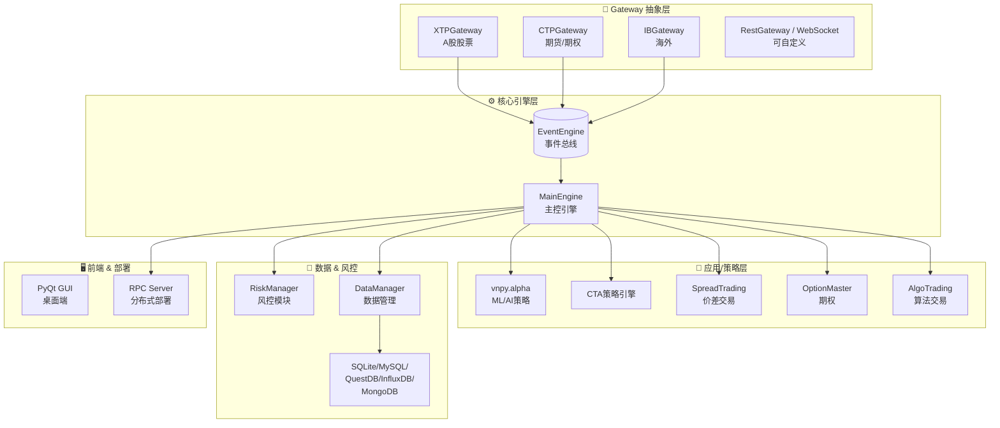

# Position Paper：vnpy —— 构建A股自动盯盘AI助手的最佳基石

## 1. 架构总览

vnpy 采用经典的事件驱动架构（Event-Driven Architecture），以高效的事件引擎（EventEngine）为核心，所有行情、交易、定时任务均通过事件总线解耦传递。



**主目录结构（关键模块）：**
```
vnpy/
├── vnpy/event/           # 事件引擎核心（EventEngine, Event）
├── vnpy/trader/
│   ├── engine.py         # MainEngine
│   ├── gateway.py        # BaseGateway 抽象接口
│   ├── app.py            # BaseApp 策略应用基类
│   ├── object.py         # 统一数据对象（TickData/BarData/OrderData等）
│   ├── setting.py        # 全局配置
│   └── ui/               # PyQt 内置界面
├── vnpy/alpha/           # ML/AI 模块（Lasso/LightGBM/MLP）
├── vnpy/xtp/             # A股 XTP 交易接口
├── vnpy/ctp/             # 期货 CTP 接口
├── vnpy/rpc/             # 分布式 RPC 部署
├── vnpy/datamanager/     # 数据管理工具
├── vnpy/riskmanager/     # 事前/事中风控
└── vnpy/datafeed/        # 行情数据接入抽象
```

## 2. 核心能力清单

vnpy 是国内量化社区事实标准，覆盖「数据接入→策略研发→回测验证→实盘交易→风险管理」全链路：

- **多市场交易网关**：CTP（期货/期权）、XTP（A股股票）、Interactive Brokers（美股/全球）、RestGateway / WebSocketGateway（可自定义扩展）。
- **统一行情/交易对象**：`TickData`、`BarData`、`TradeData`、`OrderData`、`PositionData` 等标准化数据结构，跨网关语义一致。
- **多策略引擎**：CTA策略、价差交易（SpreadTrading）、期权组合（OptionMaster）、算法交易（AlgoTrading）、组合投资（PortfolioManager）。
- **数据管理层**：支持 SQLite / MySQL / PostgreSQL / QuestDB / InfluxDB / MongoDB / Arctic，冷热数据分层策略成熟。
- **风控模块**：事前委托检查（资金/持仓/涨跌停）、事中异常监控、事后交易分析。
- **vnpy.alpha**：新增机器学习模块，内置 Lasso、LightGBM、MLP 等模型训练与因子研究流程。
- **RPC 分布式部署**：可将策略引擎与 GUI 分离，支持云端 7×24 运行。

## 3. 数据模型

vnpy 的核心数据模型设计非常精练，所有业务对象均继承自 `BaseData`：

| 类/接口 | 职责 | 关键字段 |
|:---|:---|:---|
| `BaseData` | 数据基类 | `gateway_name`, `extra` |
| `TickData` | 实时快照 | `symbol`, `exchange`, `datetime`, `last_price`, `volume`, `bid_price_1`, `ask_price_1` ... |
| `BarData` | K线数据 | `symbol`, `exchange`, `interval`, `open_price`, `high_price`, `low_price`, `close_price`, `volume` |
| `OrderData` | 委托记录 | `orderid`, `direction`, `type`, `volume`, `traded`, `status`, `datetime` |
| `TradeData` | 成交记录 | `tradeid`, `orderid`, `direction`, `price`, `volume`, `datetime` |
| `PositionData` | 持仓 | `symbol`, `direction`, `volume`, `price`, `pnl` |
| `AccountData` | 账户资金 | `accountid`, `balance`, `frozen`, `available` |
| `BaseGateway` | 网关抽象 | `connect()`, `close()`, `subscribe()`, `send_order()`, `cancel_order()` |
| `BaseApp` | 应用抽象 | `main_engine`, `event_engine`, `setting_filename` |

## 4. 扩展点

vnpy 的架构从设计之初就预留了丰富的扩展位，堪称「量化领域的 Spring Boot」：

- **Gateway 抽象**：继承 `BaseGateway` 即可接入任何新行情/交易源（如 AkShare 实时行情、飞书通知 Gateway）。
- **App 插件机制**：继承 `BaseApp` 注册新模块，策略引擎、数据管理、风控均为独立 App。
- **事件总线钩子**：可在 `EventEngine` 任意位置挂载监听，实现日志、推送、风控拦截。
- **数据库适配层**：`BaseDatabase` 接口允许接入 ClickHouse、Redis 等新存储。
- **vnpy.alpha 流水线**：数据采集 → 特征工程 → 模型训练 → 信号生成，可替换为 LLM-based 决策层。
- **RPC 分离**：策略运行层与展示层完全解耦，天然支持「后端盯盘 + 前端 Dashboard」的微服务改造。

## 5. 改造成本估算

若 fork vnpy 改造为「A股自动盯盘AI助手」，核心工作量如下：

| 改造模块 | 人日 | 说明 |
|:---|---:|:---|
| 新增 AkShare DataFeed Gateway | 5 | 继承 BaseGateway 实现实时行情接入 |
| 替换 PyQt 为 Web Dashboard | 15 | 剥离 GUI，新增 FastAPI + WebSocket + React 前端 |
| 新增 AI 分析层（LLM Pipeline） | 8 | 在 vnpy.alpha 基础上扩展自然语言选股、简报生成 |
| 新增推送通知模块（飞书/Telegram） | 4 | 基于 EventEngine 挂载告警事件监听 |
| 自选股/异动预警业务逻辑 | 6 | 利用现有 PositionData / TickData 模型扩展 |
| 存储层迁移（QuestDB→ClickHouse） | 4 | BaseDatabase 接口已预留，适配成本低 |
| 部署与测试 | 5 | Docker 化、CI/CD、7×24 稳定性验证 |
| **合计** | **~47 人日** | **约 2 个月（1人全职）** |

**风险评估**：中等。vnpy 代码质量高、文档完善，但 PyQt 与 Web 技术栈差异大，GUI 剥离是最大工作量。

## 6. 致命缺陷自述

vnpy 远非完美，以下三个缺陷必须自报：

1. **PyQt GUI 与现代化 Web Dashboard 脱节**：vnpy 的交互界面基于 PyQt5/6，面向专业交易员的桌面端设计，与现代 React/Vue 响应式前端技术栈差距极大。剥离 GUI 改造成本占整体改造的 30%+。
2. **定位是「交易框架」而非「盯盘助手」**：vnpy 面向有实盘交易需求的专业用户，上手门槛高（需要券商/期货公司开户）。对于普通投资者「自选股管理 + 异动预警 + AI 简报」的轻量需求，vnpy 显得过于重型。
3. **A股股票支持弱于期货**：vnpy 的深厚积累在 CTP 期货生态，A股股票仅通过 XTP 等少数接口支持，且 XTP 需要特定券商接入，AkShare 等免费数据源并非第一方支持。

## 7. 与其他候选项目的集成可行性

| 对比项目 | 关系 | 说明 |
|:---|:---|:---|
| **RQAlpha** | 部分集成 | RQAlpha 的 A股回测规则（涨跌停/T+1）可复用，但非商业 License 限制了代码级集成；建议参考设计而非引入代码。vnpy 的实盘能力与 RQAlpha 的回测能力可互补。 |
| **qteasy** | 可配合 | qteasy 的向量化回测和 A股精细交易建模（费率/MOQ）可拆出作为 vnpy 的策略补充；BSD-3 License 兼容。 |
| **ZVT** | 可配合 | ZVT 的统一数据 Schema 和增量更新机制可作为 vnpy DataManager 的增强；两者均为 MIT License，数据层可互操作。 |
| **QUANTAXIS** | 互斥 | QUANTAXIS 技术栈（Rust/C++/MongoDB/ClickHouse/RabbitMQ）与 vnpy 的纯 Python 哲学差异过大，难以在同一进程/服务中共存；建议二选一。 |
