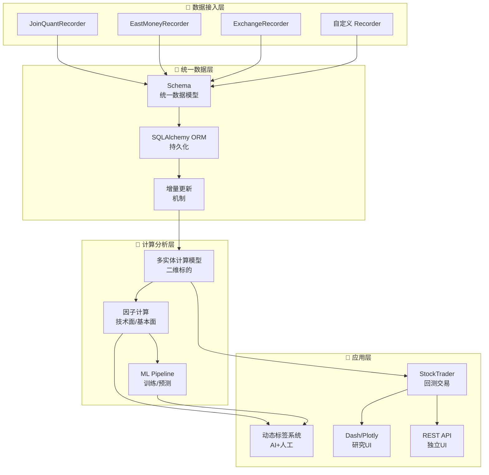

# Position Paper：ZVT —— 模块化量化框架中的数据治理专家

## 1. 架构总览

ZVT 以「数据即核心」为设计哲学，采用模块化插件架构，将行情、财务、交易、因子、ML 等能力拆分为独立模块，通过统一的数据记录（DataRecorder）和查询（DataReader）机制实现跨模块协作。



**主目录结构：**
```
zvt/
├── zvt/
│   ├── contract/           # 数据契约（Schema 定义）
│   ├── domain/             # 领域模型（Entity / Mixin）
│   │   ├── meta.py         # 标的元数据（Stock / Index / ETF）
│   │   ├── quote.py        # 行情数据（K线 / Tick）
│   │   ├── fundamental.py  # 财务数据
│   │   ├── trader_info.py  # 交易记录
│   │   └── tag.py          # 标签系统
│   ├── recorder.py         # 数据记录器基类
│   ├── readers/            # 数据读取器
│   ├── factors/            # 因子计算
│   ├── ml/                 # 机器学习流水线
│   ├── traders/            # 回测与交易（StockTrader）
│   ├── tags/               # 动态标签系统
│   ├── api.py              # REST API
│   ├── ui/                 # Dash / Plotly 界面
│   └── utils/              # 工具函数
├── tests/
└── setup.py
```

## 2. 核心能力清单

ZVT 的定位是「模块化量化框架」，其最大优势在于数据治理和多市场覆盖：

- **统一数据记录/查询**：`Recorder` + `Reader` 机制统一处理中/美/港股全市场数据，增量更新自动化，避免重复下载。
- **二维标的多实体计算模型**：以「标的（Entity）+ 时间（Time）」为二维索引，支持跨标批量计算，方便全市场扫描。
- **多市场全覆盖**：A股、港股、美股、ETF、期货、期权的行情和财务数据均支持。
- **因子计算体系**：技术面因子（均线/MACD/RSI）和基本面因子（PE/PB/ROE）统一计算框架。
- **机器学习集成**：数据采集 → 持久化 → 增量更新 → 特征工程 → ML 模型训练 → 预测信号，完整流水线内置。
- **回测交易引擎**：`StockTrader` 支持 `solo`（单策略验证）和 `formal`（正式模式）两种回测模式。
- **动态标签系统**：AI 自动分类 + 人工干预修正，可为股票打上「价值投资」「成长型」「高风险」等动态标签。
- **插件化架构**：所有数据源、计算模块、交易策略均以插件形式注册，热插拔替换。

## 3. 数据模型

ZVT 的数据模型以 SQLAlchemy ORM 为基础，强调「契约先行」：

| 类/接口 | 职责 | 关键字段 |
|:---|:---|:---|
| `EntityMixin` | 标的基类 | `id`, `entity_type`, `exchange`, `code`, `name` |
| `Stock` | A股标的 | `industries`, `listing_date`, `delist_date` |
| `KdataCommon` | K线基类 | `timestamp`, `open`, `high`, `low`, `close`, `volume`, `turnover` |
| `StockKdata` | A股K线 | 继承 KdataCommon，关联 Stock |
| `TickCommon` | Tick 快照基类 | `timestamp`, `price`, `volume`, `bid`, `ask` |
| `FinanceFactor` | 财务因子 | `code`, `timestamp`, `roe`, `pe`, `pb`, `eps` |
| `Tag` | 动态标签 | `code`, `tag`, `confidence`, `is_manual` |
| `StockTrader` | 交易记录 | `trader_name`, `entity_ids`, `start_timestamp`, `real_payoff` |
| `DataRecorder` | 数据记录器 | `data_schema`, `provider`, `force_update` |

## 4. 扩展点

ZVT 的模块化设计为盯盘助手改造提供了大量可复用扩展位：

- **Recorder 基类**：继承 `DataRecorder` 即可接入 AkShare、Tushare、东方财富等新数据源，增量更新机制自动复用。
- **因子扩展**：在 `factors/` 下新增模块即可定义新因子，天然支持「异动因子」（涨速/量比/资金流入）的批量计算。
- **Tag 系统扩展**：动态标签可扩展为「AI 选股标签」，LLM 分析结果直接写入 `Tag` 表，供前端筛选展示。
- **ML Pipeline 替换**：当前 ML 模块以传统模型为主，可将预测端替换为 LLM API 调用，特征工程层保留。
- **REST API 增强**：已有 `api.py` 提供基础 REST 接口，可扩展为 FastAPI 全功能服务，叠加 WebSocket 实时推送。
- **Trader 改造**：`StockTrader` 的 `solo/formal` 模式可扩展为「模拟盯盘模式」，不做交易只做监控和告警。

## 5. 改造成本估算

将 ZVT 改造为「A股自动盯盘AI助手」的成本：

| 改造模块 | 人日 | 说明 |
|:---|---:|:---|
| 新增 AkShare Recorder | 4 | ZVT 已有 JoinQuant/EastMoney Recorder，新增 AkShare 适配 |
| 存储层迁移（SQLAlchemy→PostgreSQL+ClickHouse） | 5 | 当前以 SQLite/MySQL 为主，需引入列式存储做历史行情 |
| 新增异动检测因子 | 4 | 在现有因子框架上扩展涨速/量比/资金异动因子 |
| 新增 AI 分析模块（LLM Pipeline） | 8 | 替换/增强现有 ML Pipeline，支持自然语言选股和简报 |
| 新增推送通知模块 | 3 | 飞书/Telegram Webhook |
| REST API 升级（FastAPI + WebSocket） | 8 | 现有 API 较简单，需升级实时推送能力 |
| 前端重建（React + TradingView Charts） | 15 | Dash/Plotly 研究 UI 无法直接复用，需全新现代前端 |
| 部署与测试 | 4 | Docker 化、定时增量更新、稳定性验证 |
| **合计** | **~51 人日** | **约 2-2.5 个月（1人全职）** |

**风险评估**：中等。ZVT 的数据层和因子层可大量复用，前端是最大成本。

## 6. 致命缺陷自述

ZVT 的模块化数据能力出色，但作为盯盘助手底座存在以下硬伤：

1. **前端极弱（Dash/Plotly）**：ZVT 的 UI 基于 Dash 和 Plotly，这是数据分析型 UI 而非现代交互式 Dashboard。没有实时 WebSocket 推送、没有响应式布局、没有移动端适配。要做「自动盯盘AI助手」的现代前端，ZVT 的 UI 层必须完全推倒重来。
2. **无 AI/LLM 能力，无推送通知**：ZVT 的 ML 模块停留在传统机器学习（随机森林/XGBoost），没有 LLM 自然语言交互、没有 AI 生成简报、没有飞书/钉钉/ Telegram 推送。AI 能力和通知系统需要从零建设。
3. **文档对新手不友好**：相比 vnpy 详尽的文档和社区支持，ZVT 的文档较为简略，「二维标的多实体计算模型」等核心概念的理解门槛较高。社区活跃度中等（4.1k stars 但 issue/PR 响应不如 vnpy 活跃），团队接入时需要较高的自主探索成本。

## 7. 与其他候选项目的集成可行性

| 对比项目 | 关系 | 说明 |
|:---|:---|:---|
| **vnpy** | 可配合 | vnpy 的 EventEngine 和 Gateway 可为 ZVT 提供实时行情流；ZVT 的统一数据 Schema 和因子计算可补强 vnpy 的数据层。两者 MIT License，可深度互操作。 |
| **RQAlpha** | 可配合 | ZVT 的 StockTrader 回测与 RQAlpha 的回测引擎功能重叠，但 ZVT 的数据 Schema 更优；建议以 ZVT 做数据治理，RQAlpha 做回测验证（需注意 RQAlpha License 限制）。 |
| **qteasy** | 可配合 | qteasy 的向量化回测和 A股精细交易建模可为 ZVT 的 StockTrader 提供计算加速；ZVT 的多市场数据覆盖可补强 qteasy 的数据源。两者 License 均宽松。 |
| **QUANTAXIS** | 部分互斥 | QUANTAXIS 和 ZVT 均强调「全链路量化平台」，功能重叠度较高。QUANTAXIS 的 Rust 核心性能更强，ZVT 的数据 Schema 设计更优雅；建议根据团队技术栈二选一。 |
